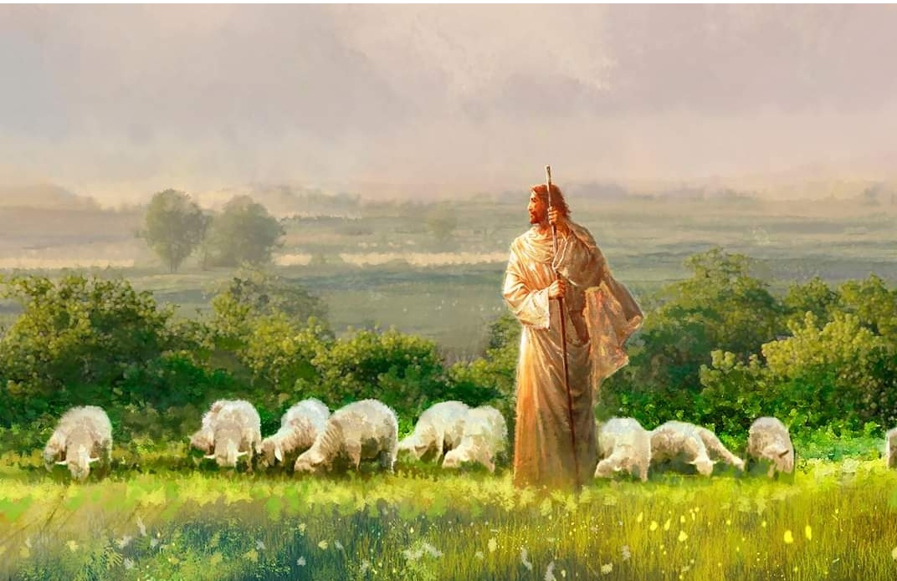

  

     
    

      <b>1Cor. 고전 10:1 그뿐만 아니라 형제 들아 나는 너희가 무지하기를 원하지 않노니 우리의 모든 조상이 구름 아래 있다가 모두 바다를 통과한 것과 
      </b>
    

     
    
Moreover, brethren, I would not that ye should be ignorant, how that all our fathers were under the cloud, and all passed through the sea; 
    

     
    

      <b>1Cor. 고전 10:2 모두가 구름과 바다 에서 모세에게 침례 받은 것과 
      </b>
    

     
    
And were all baptized unto Moses in the cloud and in the sea; 
    
         
  

  

    
  

---

  

     
    

      <b>1Cor. 고전 10:3 모두가 똑같은 영적 인 양식을 먹으며 
      </b>
    

     
    
And did all eat the same spiritual meat; 
    

     
    

      <b>1Cor. 고전 10:4 모두가 똑같은 영적 인 음료를 마신 것이니 그들은 그들을 따르던 영적인 반석에서 마셨으며 그 반석은 그리스도였 느니라 
      </b>
    

     
    
And did all drink the same spiritual drink; for they drank of that spiritual Rock that followed them; and that Rock was Christ. 
    
         
  

  

    
  

---

  

     
    

      <b>1Cor. 고전 10:5 그러나 하나님은 그 들 가운데 많은 자를 크게 기뻐하지 않 았나니 이는 그들이 광야에서 넘어졌 음 이라 
      </b>
    

     
    
But with many of them God was not well pleased; for they were over thrown in the wilderness. 
    

     
    

      <b>1Cor. 고전10:6 이제 이런 일은 그들 이 탐욕을 부렸던 것처럼 우리도 악한 것을 좇아 탐욕을 품지 않게 하려는 의 도로 우리에게 본보기가 되었나니 
      </b>
    

     
    
Now these things were our examples, to the intent we should not lust after evil things, as they also lusted. 
    
         
  

  

    
  

---

  

     
    

      <b>1Cor. 고전10:7 그들 가운데 어떤 자 들처럼 너희도 우상 숭배하는 자가 되 지 말라 기록된 바 그 백성이 앉아서 먹고 마시며 일어나 뛰놀았다 함과 같 으니라 
      </b>
    

     
    
Neither be ye idolaters, as were some of them; as it is written, The people sat down to eat and drink, and rose up to play. 
    

     
    

      <b>
      </b>
    

     
    

    
         
  

  

    
  

---

  

     
    

      <b>1Cor. 고전10:8 그들 가운데 어떤 자 들이 간음을 범하다가 하루에 이만 삼 천 명이 쓰러진 것처럼 간음하지 말고 
      </b>
    

     
    
Neither let us commit fornication, as some of them committed, and fell in one day three and twenty thousand. 
    

     
    

      <b>1Cor. 고전10:9 그들 가운데 어떤 자 들이 시험하 다가 뱀에게 멸망한 것처럼 그리스도를 시험하지 말고 
      </b>
    

     
    
Neither let us tempt Christ, as some of them also tempted, and were destroyed of serpents. 
    
         
  

  

    
  

---

  

     
    

      <b>1Cor. 고전 10:10 그들 가운데 어떤 자들이 불평하다 가 멸망하게 하는 자에 의해 멸망한 것처럼 불평하지 말라 
      </b>
    

     
    
Neither murmur ye, as some of them also murmured, and were destroyed of the destroyer. 
    

     
    

      <b>
      </b>
    

     
    

    
         
  

  

    
  

---

  

     
    

      <b>1Cor. 고전 10:11 , JST10:11 이제 이 모든 일은 본보기로 그들에게 일어났으며 우리의 교훈을 위할 뿐만 아니라 세 상의 종말이 저들 위에 임할 자들의 교 훈을 위해 기록되었느 니라 
      </b>
    

     
    
Now, all these things happened unto them for ensamples; and they were written for our admonition also, and for an admonition for those upon whom the end of the world shall come. 
    

     
    

      <b>
      </b>
    

     
    

    
         
  

  

    
  

---

  

     
    

      <b>1Cor. 고전 10:12 그러므로 서 있는 것으로 생각하는 자는 넘어지지 않도록 조심하라 
      </b>
    

     
    
Wherefore let him that thinketh he standeth take heed lest he fall. 
    

     
    

      <b>
      </b>
    

     
    

    
         
  

  

    
  

---

  

     
    

      <b>1Cor. 고전 10:13 사람에게 일반적인 시험 밖에는 너희가 당한 것이 없나니 하나님은 신실하 므로 너희가 감당할 수 있는 이상으로 시험받는 것을 허락하지 않고 시험과 함께 피할 길도 마련하여 너희로 하여금 그것을 감당할 수 있게 하느니라 
      </b>
    

     
    
There hath no temptation taken you but such as is common to man; but God is faithful, who will not suffer you to be tempted above that ye are able; but will with the temptation also make a way to escape, that ye may be able to bear it. 
    

     
    

      <b>
      </b>
    

     
    

    
         
  

  

    
  

---

  

     
    

      <b>1Cor. 고전10:14 그러므로 지극히 사 랑하는 자들아 우상 숭배를 피하라 
      </b>
    

     
    
Wherefore, my dearly beloved, flee from idolatry. 
    

     
    

      <b>1Cor. 고전10:15 나는 지혜로운 자들 에게 하는 것처럼 말하노니 너희는 내 가 말하는 바를 판단하라 
      </b>
    

     
    
I speak as to wise men; judge ye what I say. 
    
         
  

  

    
  

---

  

     
    

      <b>1Cor. 고전10:16 우리가 축복하는 축 복의 잔은 그리스도의 피와 연합하는 것이 아니냐 우리가 떼는 떡은 그리스 도의 몸과 연합하는 것이 아니냐 
      </b>
    

     
    
The cup of blessing which we bless, is it not the communion of the blood of Christ? The bread which we break, is it not the communion of the body of Christ? 
    

     
    

      <b>
      </b>
    

     
    

    
         
  

  

    
  

---

  

     
    

      <b>1Cor. 고전 10:17 우리가 많을지라도 한 떡이요 한 몸이니 우리는 모두 하나 의 떡에 참여하는 자니라 
      </b>
    

     
    
For we being many are one bread, and one body; for we are all partakers of that one bread. 
    

     
    

      <b>1Cor. 고전 10:18 육신을 좇아 된 이 스라엘을 보라 희생물을 먹는 자들은 제단에 참여하는 자가 아니냐 
      </b>
    

     
    
Behold Israel after the flesh; are not they which eat of the sacrifices partakers of the altar? 
    
         
  

  

    
  

---

  

     
    

      <b>1Cor. 고전 10:19, JST10:19 그러면 내가 무엇을 말하느냐 우상은 무엇이며 우상에게 바쳐졌던 희생물 은 무엇이냐 
      </b>
    

     
    
What say I then? that the idol is anything , or that which is offered in sacrifice to idols is anything ? 
    

     
    

      <b>
      </b>
    

     
    

    
         
  

  

    
  

---

  

     
    

      <b>1Cor. 고전10:20 내가 이르노니 이방 인이 희생물을 드리는 것은 악마에게 바치는 것이요 하나님 께 하는 것이 아 니니 나는 너희가 악마와 교제하 기를 원하지 않노라 
      </b>
    

     
    
But I say, that the things which the Gentiles sacrifice, they sacrifice to devils, and not to God; and I would not that ye should have fellowship with devils. 
    

     
    

      <b>
      </b>
    

     
    

    
         
  

  

    
  

---

  

     
    

      <b>1Cor. 고전 10:21 너희는 주의 잔과 악마의 잔을 함께 마실 수 없으며 주의 상과 악마의 상에 함께 참여하는 자가 될 수 없느니라 
      </b>
    

     
    
Ye cannot drink the cup of the Lord, and the cup of devils; ye cannot be partakers of the Lord's table, and of the table of devils. 
    

     
    

      <b>1Cor. 고전10:22 우리가 주를 질투하 게 하겠느냐 우리가 그보다 강하냐 
      </b>
    

     
    
Do we provoke the Lord to jealousy? are we stronger than he? 
    
         
  

  

    
  

---

  

     
    

      <b>1Cor. 고전 10:23, JST10:23 모든 것 이 나에게 적법한 것은 아니니 이는 모 든 것이 합당한 것은 아니기 때문이 요 모든 것이 적법하지 않는 것은 모든 것 이 교화하는 것은 아니기 때문이라 
      </b>
    

     
    
All things are not lawful for me, for all things are not expedient; all things are not lawful, for all things edify not. 
    

     
    

      <b>1Cor. 고전10:24, JST10:24 그러므로 아무도 자기 유익을 구하지 말고 각 사 람은 다른 사람의 유익을 구하라 
      </b>
    

     
    
Let no man seek therefore his own, but every man another's good. 
    
         
  

  

    
  

---

  

     
    

      <b>1Cor. 고전10:25 , JST10:25 무엇이든 고기시장 에서 파는 것은 양심을 위해 아무것도 묻지 말고 먹으라 
      </b>
    

     
    
Whatsoever is sold in the shambles, that eat, asking no questions for conscience' sake; 
    

     
    

      <b>1Cor. 고전 10:26 이는 땅과 그 충만 함이 주의 것임이라 
      </b>
    

     
    
For the earth is the Lord's, and the fullness thereof. 
    
         
  

  

    
  

---

  

     
    

      <b>1Cor. 고전 10:27, JST10:27 믿지 않 는 자 가운데 누가 너희를 잔치에 초대 하여 너희가 먹으려고 앉았거든 무엇이 든 너희 앞에 차려진 것은 양심을 위해 아무것도 묻지 말고 먹으라 
      </b>
    

     
    
If any of them that believe not bid you to a feast, and ye be disposed to eat; whatsoever is set before you, eat, asking no questions for conscience' sake. 
    

     
    

      <b>
      </b>
    

     
    

    
         
  

  

    
  

---

  

     
    

      <b>1Cor. 고전 10:28, JST10:28 그러나 누구든지 너희에게 이르되 이것은 우상 에게 희생물로 바쳐진 것이라 하거든 그것을 알려준 자를 위해서 또 양심을 위해서 먹지 말라 이는 땅과 그 충만함 이 주의 것임이라 
      </b>
    

     
    
But if any man say unto you, This is offered in sacrifice unto idols, eat not for his sake that showed it, and for conscience' sake; for the earth is the Lord's, and the fullness thereof; 
    

     
    

      <b>
      </b>
    

     
    

    
         
  

  

    
  

---

  

     
    

      <b>1Cor. 고전10:29 내가 말하는 양심은 너 자신의 것이 아닌 다른 사람의 양심 을 뜻하느니 라 어찌하여 나의 자유가 다른 사람의 양심에 의해 판단 받느냐 
      </b>
    

     
    
Conscience, I say, not thine own, but of the other; for why is my liberty judged of another man's conscience? 
    

     
    

      <b>1Cor. 고전 10:30 내가 은혜를 통해 참여하는 자가 되었다 면 어찌하여 내가 감사하 는 것에 대해 비난 받느냐 
      </b>
    

     
    
For if I by grace be a partaker, why am I evil spoken of for that for which I give thanks? 
    
         
  

  

    
  

---

  

     
    

      <b>1Cor. 고전10:31 그러므로 너희가 먹 든지 마시든지 무엇을 하든지 모든 것 을 하나님 의 영광을 위해서 하라 
      </b>
    

     
    
Whether therefore ye eat, or drink, or whatsoever ye do, do all to the glory of God. 
    

     
    

      <b>1Cor. 고전 10:32 유대인에게나 이방 인에게나 하나님의 교회에 나 아무런 실 족거리를 주지 말지니 
      </b>
    

     
    
Give none offense, neither to the Jews, nor to the Gentiles, nor to the church of God; 
    
         
  

  

    
  

---

  

     
    

      <b>1Cor. 고전 10:33, JST10:33 나도 모 든 일에서 나 자신의 유익을 구하지 않 고 많은 사람의 유익을 구하며 모든 사 람을 기쁘게 한 것은 그들로 하여금 구 원받게 하려 함이니라 
      </b>
    

     
    
Even as I please all men in all things, not seeking mine own profit, but of the many, that they may be saved.
    

     
    

      <b>
      </b>
    

     
    

    
         
  

  

    
  

