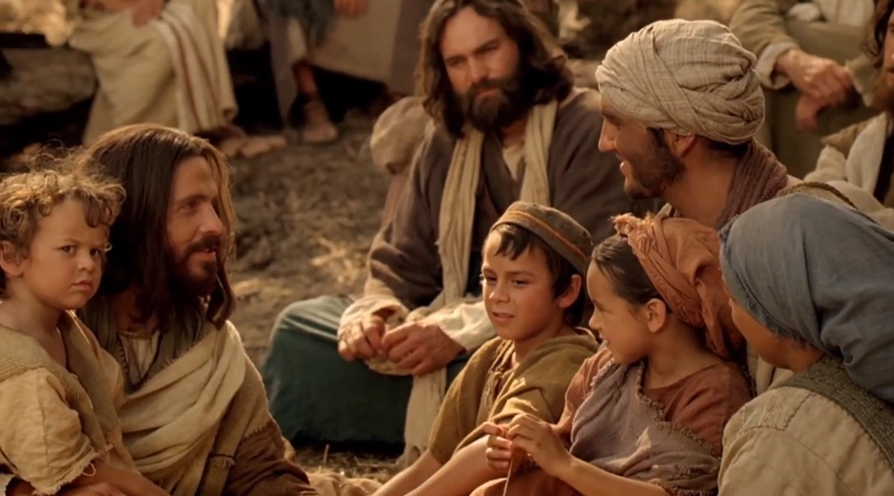

  

     
    

      <b>1Cor. 고전 15:1 그뿐만 아니라 형제 들아 내가 너희에게 전파한 복음을 선 포하노니 그것은 너희도 받은 것이요 그 안에 너희가 서 있느니라 
      </b>
    

     
    
Moreover, brethren, I declare unto you the gospel which I preached unto you, which also ye have received, and wherein ye stand; 
    

     
    

      <b>
      </b>
    

     
    

    
         
  

  

    
  

---

  

     
    

      <b>1Cor. 고전 15:2 너희가 헛되이 믿지 않고 내가 너희에게 전파한 것을 기억 하면 너희도 그것을 통해 구원받 으리라 
      </b>
    

     
    
By which also ye are saved, if ye keep in memory what I preached unto you, unless ye have believed in vain. 
    

     
    

      <b>
      </b>
    

     
    

    
         
  

  

    
  

---

  

     
    

      <b>1Cor. 고전15:3 나는 내가 받은 것을 무엇보다 먼저 너희에게 전했나니 그것 은 경전의 기록대로 그리스도가 우리 죄를 위해 죽은 것과 
      </b>
    

     
    
For I delivered unto you first of all that which I also received, how that Christ died for our sins according to the scriptures; 
    

     
    

      <b>1Cor. 고전 15:4 경전의 기록대로 매 장되어 제삼 일에 다시 살아난 것과 
      </b>
    

     
    
And that he was buried, and that he rose again the third day according to the scriptures; 
    
         
  

  

    
  

---

  

     
    

      <b>1Cor. 고전 15:5 게바에게 보이고 나 서 열둘에게 보인 것이라 
      </b>
    

     
    
And that he was seen of Cephas, then of the twelve; 
    

     
    

      <b>1Cor. 고전15:6, JST15:6 그 후에 오 백여 형제에게 한 번에 보였나니 그 가 운데 대다수는 현재까지 남아있 으나 얼 마는 잠들었 으며 
      </b>
    

     
    
After that, he was seen of about five hundred brethren at once; of whom the greater part remain unto this present, but some are fallen asleep. 
    
         
  

  

    
  

---

  

     
    

      <b>1Cor. 고전 15:7 그 후에 야고보에게 보이고 나서 모든 사도에게 보였으며 
      </b>
    

     
    
After that, he was seen of James, then of all the apostles. 
    

     
    

      <b>1Cor. 고전 15:8 마지막으로 기한 전 에 태어난 자 같은 나에게 도 보였느니 라 
      </b>
    

     
    
And last of all he was seen of me also, as of one born out of due time. 
    
         
  

  

    
  

---

  

     
    

      <b>1Cor. 고전15:9 나는 사도 가운데 가 장 작은 자요 사도라 불리기에 적합하 지 않나니 이는 내가 하나님의 교회를 박해했 음이라 
      </b>
    

     
    
For I am the least of the apostles, that am not meet to be called an apostle, because I persecuted the church of God. 
    

     
    

      <b>
      </b>
    

     
    

    
         
  

  

    
  

---

  

     
    

      <b>1Cor. 고전 15:10, JST15:10 그러나 나는 하나님의 은혜로 지금의 내가 되 었으며 나에게 베풀어진 그의 은혜가 헛되지 않았나니 이는 내가 그들 모두 보다 수고를 많이 했음이라 그러나 그 것은 내가 아니요 나와 함께한 하나님 의 은혜니 라 
      </b>
    

     
    
But by the grace of God I am what I am; and his grace which was besto wed upon me was not in vain; for I labored more abundantly than they all; yet not I, but the grace of God which was with me. 
    

     
    

      <b>
      </b>
    

     
    

    
         
  

  

    
  

---

  

     
    

      <b>1Cor. 고전15:11 그러므로 나나 그들 이나 그렇게 전파했으며 너희도 그렇게 믿었느니라 
      </b>
    

     
    
Therefore whether it were I or they, so we preach, and so ye believed. 
    

     
    

      <b>1Cor. 고전15:12 이제 그리스도가 죽 음으로부터 살아난 것이 전파되었거늘 너희 가운데 어떤 자들은 어찌하여 죽 은 자의 부활이 없다 하느냐 
      </b>
    

     
    
Now if Christ be preached that he rose from the dead, how say some among you that there is no resurrection of the dead? 
    
         
  

  

    
  

---

  

     
    

      <b>1Cor. 고전 15:13 죽은 자의 부활이 없다면 그리스도가 살아나지 않았으리 라 
      </b>
    

     
    
But if there be no resurrection of the dead, then is Christ not risen; 
    

     
    

      <b>1Cor. 고전 15:14 그리스도가 살아나 지 않았다면 우리가 전파하는 것은 헛 되고 너희 신앙도 헛되며 
      </b>
    

     
    
And if Christ be not risen, then is our preaching vain, and your faith is also vain. 
    
         
  

  

    
  

---

  

     
    

      <b>1Cor. 고전15:15 참으로 우리는 하나 님의 거짓 증인으로 드러나리니 이는 우리가 하나님에 관해 증언하기를 그가 그리스도를 살렸다 했음이라 죽은 자가 살아나지 않는다면 하나님이 그를 살리 지 않았으리라 
      </b>
    

     
    
Yea, and we are found false witnesses of God; because we have testified of God that he raised up Christ; whom he raised not up, if so be that the dead rise not. 
    

     
    

      <b>1Cor. 고전15:16 죽은 자가 살아나지 않으면 그리스도가 살아나지 않았을 것 이요 
      </b>
    

     
    
For if the dead rise not, then is not Christ raised; 
    
         
  

  

    
  

---

  

     
    

      <b>1Cor. 고전 15:17 그리스도가 살아나 지 않았다면 너희 신앙은 헛되고 너희 가 여전히 죄 가운데 있을 것이요 
      </b>
    

     
    
And if Christ be not raised, your faith is vain; ye are yet in your sins. 
    

     
    

      <b>1Cor. 고전15:18 그러면 그리스도 안 에서 잠자는 자들 또한 망했으리라 
      </b>
    

     
    
Then they also which are fallen asleep in Christ are perished. 
    
         
  

  

    
  

---

  

     
    

      <b>1Cor. 고전15:19 그리스도 안에서 우 리가 가진 소망이 오직 이생뿐이면 우 리는 모든 사람 가운데 가장 비참한 자 니라 
      </b>
    

     
    
If in this life only we have hope in Christ, we are of all men most mise rable. 
    

     
    

      <b>1Cor. 고전15:20 그러나 이제 그리스 도가 죽음으로부터 살아나 잠자는 자들 의 첫 열매가 되었느니라 
      </b>
    

     
    
But now is Christ risen from the dead, and become the firstfruits of them that slept. 
    
         
  

  

    
  

---

  

     
    

      <b>1Cor. 고전15:21 죽음이 사람을 통해 왔으므로 죽은 자의 부활도 사람을 통 해 오나니 
      </b>
    

     
    
For since by man came death, by man came also the resurrection of the dead. 
    

     
    

      <b>1Cor. 고전 15:22 이는 아담 안에서 모든 사람이 죽은 것처럼 그리스도 안 에서 모든 사람이 살아날 것임이라 
      </b>
    

     
    
For as in Adam all die, even so in Christ shall all be made alive. 
    
         
  

  

    
  

---

  

     
    

      <b>1Cor. 고전 15:23 그러나 각 사람은 자기 차례가 있나니 그리스도가 첫 열 매요 그다음은 그가 올 때 그리스도 에 게 속한 자들이요 
      </b>
    

     
    
But every man in his own order; Christ the firstfruits; afterward they that are Christ's at his coming. 
    

     
    

      <b>
      </b>
    

     
    

    
         
  

  

    
  

---

  

     
    

      <b>1Cor. 고전15:24, JST15:24 그다음에 종말이 오리니 그때 그가 왕국을 아버 지 하나님 께 넘겨 드릴 것이요 그때 그 가 모든 다스림과 모든 권세와 권능을 끌어내리 리라 
      </b>
    

     
    
Afterward cometh the end, when he shall have delivered up the kingdom to God, even the Father; when he shall have put down all rule, and all authority and power. 
    

     
    

      <b>1Cor. 고전 15:25 그는 모든 원수를 자기 발아래 둘 때까지 통치해야 하리 니 
      </b>
    

     
    
For he must reign, till he hath put all enemies under his feet. 
    
         
  

  

    
  

---

  

     
    

      <b>1Cor. 고전 15:26, JST15:26 마지막 원수인 죽음은 멸망하리 라 
      </b>
    

     
    
The last enemy, death, shall be destroyed. 
    

     
    

      <b>1Cor. 고전 15:27, JST15:27 그가 이 르되 그가 모든 것을 그의 발아래 두어 모든 것이 예속된 것이 밝혀지 면 모든 것을 그에게 예속하게 하신 아버지 가 그에게 요구하리라 했으며 
      </b>
    

     
    
For he saith, When it is manifest that he hath put all things under his feet, and that all things are put under, he is expected of the Father who did put all things under him. 
    
         
  

  

    
  

---

  

     
    

      <b>1Cor. 고전 15:28 모든 것이 그에게 예속되 는 그때는 아들도 모든 것을 자 기에게 두신 이에게 친히 복종하리니 그리하여 하나님 은 모든 것 안에서 모 든 것이 되느니라 
      </b>
    

     
    
And when all things shall be subdued unto him, then shall the Son also himself be subject unto him that put all things under him, that God may be all in all. 
    

     
    

      <b>
      </b>
    

     
    

    
         
  

  

    
  

---

  

     
    

      <b>1Cor. 고전 15:29 그렇지 않고 죽은 자들이 결코 살아나지 않는다면 죽은 자를 위해 침례 받는 자들이 무엇을 하 겠느냐 그러면 그들은 어찌하여 죽은 자를 위해 침례 받느냐 
      </b>
    

     
    
Else what shall they do which are baptized for the dead, if the dead rise not at all? Why are they then baptized for the dead? 
    

     
    

      <b>1Cor. 고전15:30 어찌하여 우리가 매 시간 위험을 무릅쓰 느냐 
      </b>
    

     
    
And why stand we in jeopardy every hour? 
    
         
  

  

    
  

---

  

     
    

      <b>1Cor. 고전 15:31, JST15:31 나는 너 희에게 죽은 자의 부활을 단언하노니 이것은 내가 죽을지라도 우리 주 예수 그리스도 안에서 매일 갖는 기쁨이니라 
      </b>
    

     
    
I protest unto you the resurrection of the dead; and this is my rejoicing which I have in Christ Jesus our Lord daily, though I die. 
    

     
    

      <b>
      </b>
    

     
    

    
         
  

  

    
  

---

  

     
    

      <b>1Cor. 고전 15:32, JST15:32 내가 에 베소에서 사람의 방식을 좇아 짐승 같 은 자들과 싸웠거니와 죽은 자가 살아 나지 않으면 그것이 나에게 무슨 유익 이 되겠느냐 우리는 내일 죽으니 먹고 마시자 하리라 
      </b>
    

     
    
If after the manner of men I have fought with beasts at Ephesus, what advantageth it me, if the dead rise not? let us eat and drink; for tomorrow we die. 
    

     
    

      <b>
      </b>
    

     
    

    
         
  

  

    
  

---

  

     
    

      <b>1Cor. 고전 15:33 속지 말라 악한 대 화는 선한 행실을 부패하게 하느니라 
      </b>
    

     
    
Be not deceived; evil communications corrupt good manners. 
    

     
    

      <b>1Cor. 고전15:34 의로움을 위해 깨어 있고 죄짓지 말라 어떤 사람은 하나님 에 관한 지식이 없으니 내가 너희를 부 끄럽게 하려고 이 말을 하노라 
      </b>
    

     
    
Awake to righteousness, and sin not; for some have not the knowledge of God; I speak this to your shame. 
    
         
  

  

    
  

---

  

     
    

      <b>1Cor. 고전15:35 그러나 어떤 사람이 이르기를 죽은 자가 어떻게 살아나느냐 그들은 어떤 몸으로 오느냐 하리니 
      </b>
    

     
    
But some man will say, How are the dead raised up? and with what body do they come? 
    

     
    

      <b>1Cor. 고전15:36 어리석은 자여 너가 뿌리는 것이 죽지 않으면 살아나 지 못 하느니라 
      </b>
    

     
    
Thou fool, that which thou sowest is not quickened, except it die; 
    
         
  

  

    
  

---

  

     
    

      <b>1Cor. 고전 15:37, JST15:37 너가 뿌 리는 것은 장차 될 몸을 뿌리는 것이 아니요 밀이나 다른 어떤 것의 알갱이 뿐이나 
      </b>
    

     
    
And that which thou sowest, thou sowest not that body which shall be, but grain, it may be of wheat, or some other; 
    

     
    

      <b>1Cor. 고전15:38 하나님은 그가 기뻐 하는 대로 그것에 몸을 주되 모든 씨에 게 그 자신의 몸을 주느니라 
      </b>
    

     
    
But God giveth it a body as it hath pleased him, and to every seed his own body. 
    
         
  

  

    
  

---

  

     
    

      <b>1Cor. 고전15:39 모든 육신은 똑같은 육신이 아니니 사람의 육신이 한 종류 요 짐승의 육신이 다르고 물고기의 육 신이 다르고 새의 육신이 다르니라 
      </b>
    

     
    
All flesh is not the same flesh; but there is one kind of flesh of men, another flesh of beasts, another of fishes, and another of birds. 
    

     
    

      <b>
      </b>
    

     
    

    
         
  

  

    
  

---

  

     
    

      <b>1Cor. 고전 15:40 , JST15:40 또한 해 의 영광의 몸과 달의 영광의 몸과 별의 영광의 몸이 있는데 해의 영광이 하나 요 달의 영광이 다르고 별의 영광이 다 르니 
      </b>
    

     
    
Also celestial bodies, and bodies terrestrial, and bodies telestial; but the glory of the celestial, one; and the terrestrial, another; and the telestial, another. 
    

     
    

      <b>
      </b>
    

     
    

    
         
  

  

    
  

---

  

     
    

      <b>1Cor. 고전 15:41 해의 영광이 하나 있고 또 다른 달의 영광과 별들의 영광 이 있는 것은 하나의 별은 다른 별과 영광이 서로 다르기 때문이라 
      </b>
    

     
    
There is one glory of the sun, and another glory of the moon, and another glory of the stars; for one star differeth from another star in glory. 
    

     
    

      <b>
      </b>
    

     
    

    
         
  

  

    
  

---

  

     
    

      <b>1Cor. 고전 15:42 죽은 자의 부활도 그와 같으니 그것은 부패하는 것으로 뿌려지되 부패하 지 않는 것으로 살아나 며 
      </b>
    

     
    
So also is the resurrection of the dead. It is sown in corruption, it is raised in incorruption; 
    

     
    

      <b>1Cor. 고전 15:43, JST15:43 수치 가 운데 뿌려지되 영광 가운데 살아나며 연약함 가운데 뿌려지되 능력 가운데 살아나며 
      </b>
    

     
    
It is sown in dishonor , it is raised in glory; it is sown in weakness, it is raised in power; 
    
         
  

  

    
  

---

  

     
    

      <b>1Cor. 고전 15:44 육에 속한 몸으로 뿌려지되 영적인 몸으로 살아나나니 육 에 속한 몸이 있고 영적인 몸이 있으므 로 
      </b>
    

     
    
It is sown a natural body, it is raised a spiritual body. There is a natural body, and there is a spiritual body. 
    

     
    

      <b>1Cor. 고전 15:45 기록된 바 첫 사람 아담은 살아있는 영혼이 되었고 마지막 아담은 살리는 영이 되었다 했느니라 
      </b>
    

     
    
And so it is written, The first man Adam was made a living soul; the last Adam was made a quickening spirit. 
    
         
  

  

    
  

---

  

     
    

      <b>1Cor. 고전 15:46, JST15:46 그러나 영적인 것이 먼저가 아니라 육에 속한 것이 먼저요 그 후에 영적인 것이라 
      </b>
    

     
    
Howbeit, that which is natural first, and not that which is spiritual; but afterwards, that which is spiritual; 
    

     
    

      <b>1Cor. 고전 15:47 첫 번째 사람은 땅 에서 난 땅에 속한 사람이거니와 두 번 째 사람은 하늘로부터 나신 주니라 
      </b>
    

     
    
The first man is of the earth, earthy; the second man is the Lord from heaven. 
    
         
  

  

    
  

---

  

     
    

      <b>1Cor. 고전 15:48 땅에 속한 것이 어 떠한 것처럼 땅에 속한 자들도 그러하 고 하늘에 속한 것이 어떠한 것처럼 하 늘에 속한 자들도 그러하니 
      </b>
    

     
    
As is the earthy, such are they also that are earthy; and as is the heavenly, such are they also that are heavenly. 
    

     
    

      <b>1Cor. 고전 15:49 우리가 땅에 속한 자의 형상을 입은 것처럼 또한 하늘에 속한 자의 형상을 입으리라 
      </b>
    

     
    
And as we have borne the image of the earthy, we shall also bear the image of the heavenly. 
    
         
  

  

    
  

---

  

     
    

      <b>1Cor. 고전15:50 형제들아 이제 내가 이것을 말하노니 살과 피는 하나님의 왕국을 유업으로 받을 수 없고 부패하 는 것은 부패하 지 않는 것을 유업으로 받지 못하느니라 
      </b>
    

     
    
Now this I say, brethren, that flesh and blood cannot inherit the kingdom of God; neither doth corruption inherit incorruption. 
    

     
    

      <b>
      </b>
    

     
    

    
         
  

  

    
  

---

  

     
    

      <b>1Cor. 고전 15:51, JST15:51 보라 내 가 너희에게 한 가지 비밀을 보이노니 우리는 모두 잠자지 않고 모두 변화되 리라 
      </b>
    

     
    
Behold, I show you a mystery; We shall not all sleep, but we shall all be changed, 
    

     
    

      <b>
      </b>
    

     
    

    
         
  

  

    
  

---

  

     
    

      <b>1Cor. 고전 15:52 , JST15:52 마지막 나팔 소리가 들리면 눈 깜짝하는 순간 에 그러하리니 나팔 소리가 나면 죽은 자들이 부패하 지 않는 것으로 살아나고 우리가 변화되리라 
      </b>
    

     
    
In a moment, in the twinkling of an eye, at the sound of the last trump; for the trumpet shall sound, and the dead shall be raised incorruptible, and we shall be changed. 
    

     
    

      <b>
      </b>
    

     
    

    
         
  

  

    
  

---

  

     
    

      <b>1Cor. 고전 15:53 이 부패하는 것은 반드시 부패하 지 않는 것을 입어야 하 고 이 필멸의 몸은 반드시 불멸을 입어 야 하리니 
      </b>
    

     
    
For this corruptible must put on incorruption, and this mortal must put on immortality. 
    

     
    

      <b>
      </b>
    

     
    

    
         
  

  

    
  

---

  

     
    

      <b>1Cor. 고전15:54 그리하여 이 부패하 는 것이 부패하 지 않는 것을 입고 이 필멸의 몸이 불멸을 입는 그때에 기록 된 바 죽음이 승리 안에 삼켜졌다 한 말이 이루어지리라 
      </b>
    

     
    
So when this corruptible shall have put on incorruption, and this mortal shall have put on immortality, then shall be brought to pass the saying that is written, Death is swallowed up in victory. 
    

     
    

      <b>
      </b>
    

     
    

    
         
  

  

    
  

---

  

     
    

      <b>1Cor. 고전 15:55 오 죽음아 너의 찌 르는 것은 어디 있느냐 오 무덤아 너의 승리는 어디 있느냐 
      </b>
    

     
    
O death, where is thy sting? O grave, where is thy victory? 
    

     
    

      <b>1Cor. 고전15:56 죽음의 찌르는 것은 죄요 죄의 힘은 율법이 라 
      </b>
    

     
    
The sting of death is sin; and the strength of sin is the law. 
    
         
  

  

    
  

---

  

     
    

      <b>1Cor. 고전 15:57 그러나 우리 주 예 수 그리스도를 통해 우리에게 승리를 주시는 하나님께 감사하노라 
      </b>
    

     
    
But thanks be to God, which giveth us the victory through our Lord Jesus Christ. 
    

     
    

      <b>
      </b>
    

     
    

    
         
  

  

    
  

---

  

     
    

      <b>1Cor. 고전15:58, JST15:58 그러므로 나의 사랑하는 형제들아 너희는 항상 주의 일을 풍성하 게 하는 가운데 굳게 서서 흔들리지 말라 너희 수고가 주 안 에서 헛되지 않음을 너희가 아느니라 
      </b>
    

     
    
Therefore, my beloved brethren, be ye steadfast, unmovable, always abo unding in the work of the Lord, forasmuch as ye know that your labor is not in vain in the Lord.
    

     
    

      <b>
      </b>
    

     
    

    
         
  

  

    
  

