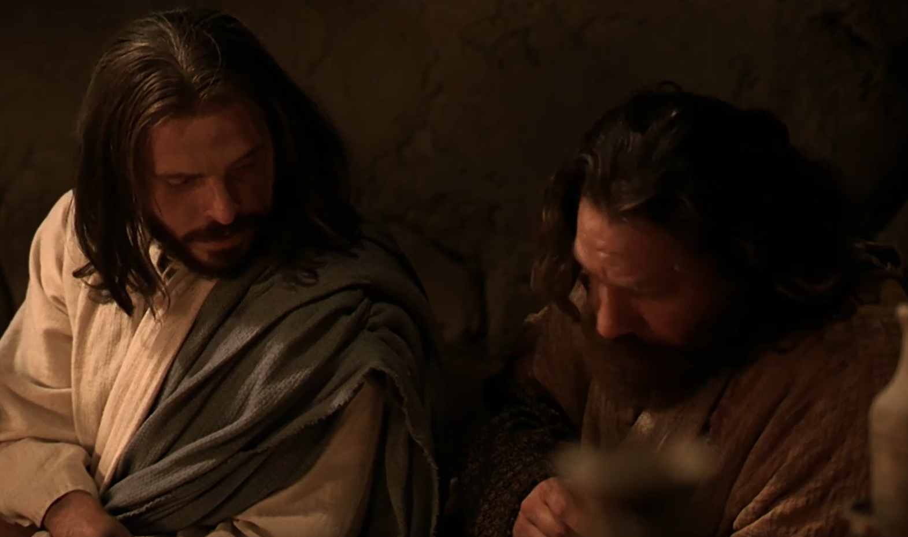

  

     
    

      <b>Acts 행16:1 그리하여 그가 더베와 루스드라에 이르렀더니 보라 그곳에 디 모데라는 하는 어떤 제자가 있는데 그 는 어떤 믿는 유대인 여자의 아들이었 으나 그의 아버지는 그리스 인이요 
      </b>
    

     
    
Then came he to Derbe and Lystra; and, behold, a certain disciple was there, named Timotheus, the son of a certain woman, which was a Jewess, and believed; but his father was a Greek; 
    

     
    

      <b>
      </b>
    

     
    

    
         
  

  

    
  

---

  

     
    

      <b>Acts 행16:2 루스드라와 이고니움에 있는 형제들 에게서 선한 평판을 받더라 
      </b>
    

     
    
Which was well reported of by the brethren that were at Lystra and Iconium. 
    

     
    

      <b>
      </b>
    

     
    

    
         
  

  

    
  

---

  

     
    

      <b>Acts 행16:3 바울이 그와 함께 가려 하되 그 지역에 있던 유대인 으로 인해 그를 데려다 할례 했나니 이는 그의 아 버지가 그리스 인인 것을 그들이 모두 알았음이라 
      </b>
    

     
    
Him would Paul have to go forth with him; and took and circumcised him because of the Jews which were in those quarters; for they knew all that his father was a Greek. 
    

     
    

      <b>
      </b>
    

     
    

    
         
  

  

    
  

---

  

     
    

      <b>Acts행16:4 저들이 성읍을 돌아다니 며 예루살렘에 있던 사도들과 장로들이 결정한 지침을 그들에게 전하여 지키게 하매 
      </b>
    

     
    
And as they went through the cities, they delivered them the decrees for to keep, that were ordained of the apostles and elders which were at Jerusalem. 
    

     
    

      <b>Acts 행16:5 교회가 신앙 안에 굳게 세워지고 날마다 그 수효가 늘더라 
      </b>
    

     
    
And so were the churches established in the faith, and increased in number daily. 
    
         
  

  

    
  

---

  

     
    

      <b>Acts행16:6 이제 저들이 브루기아 와 갈라디아 지역을 돌아다닐 때 성령이 아시아에서 말씀 전파하는 것을 금하는 지라 
      </b>
    

     
    
Now when they had gone throughout Phrygia and the region of Galatia, and were forbidden of the Holy Ghost to preach the word in Asia, 
    

     
    

      <b>Acts 행16:7 저들이 무시아에 이른 뒤에 비두니아로 들어가려고 했으나 성 령이 저들을 허락하지 않으므로 
      </b>
    

     
    
After they were come to Mysia, they assayed to go into Bithynia; but the Spirit suffered them not. 
    
         
  

  

    
  

---

  

     
    

      <b>Acts행16:8 무시아를 지나쳐 드로아 로 내려갔더라 
      </b>
    

     
    
And they passing by Mysia came down to Troas. 
    

     
    

      <b>Acts 행16:9 밤에 바울에게 시현이 나타나더니 마케도니아 사람 하나가 서 서 그에게 간청하여 이르되 마케도니아 로 건너와 우리를 도우소서 하더라 
      </b>
    

     
    
And a vision appeared to Paul in the night; There stood a man of Mace donia and prayed him, saying, Come over into Macedonia, and help us. 
    
         
  

  

    
  

---

  

     
    

      <b>Acts행16:10 그가 시현을 보고 나서 우리는 주가 우리를 불러 그들에게 복 음을 전파하 게 한 것을 확신하 고 즉시 마케도니아 로 가기를 힘썼느니라 
      </b>
    

     
    
And after he had seen the vision, immediately we endeavored to go into Macedonia, assuredly gathering that the Lord had called us for to preach the gospel unto them. 
    

     
    

      <b>
      </b>
    

     
    

    
         
  

  

    
  

---

  

     
    

      <b>Acts 행16:11 그러므로 우리가 드로 아에서 배로 떠나 사모드라게로 직행하 여 이튿날 네아볼리로 가고 
      </b>
    

     
    
Therefore loosing from Troas, we came with a straight course to Samo thracia, and the next day to Neapolis; 
    

     
    

      <b>
      </b>
    

     
    

    
         
  

  

    
  

---

  

     
    

      <b>Acts 행16:12 그곳에서 빌립보로 갔 나니 그곳은 마케도니아 의 그쪽 지방에 서 으뜸가는 성읍이요 식민지라 우리는 그 성읍에 여러 날 머물렀 으며 
      </b>
    

     
    
And from thence to Philippi, which is the chief city of that part of Mace donia, and a colony; and we were in that city abiding certain days. 
    

     
    

      <b>
      </b>
    

     
    

    
         
  

  

    
  

---

  

     
    

      <b>Acts 행16:13, JST16:13 안식일에 우리는 그 성읍에서 나가 백성이 기도 하러 모이는 강가에 앉아서 그곳에 모 인 여자들에게 말했느니라 
      </b>
    

     
    
And on the Sabbath we went out of the city by a riverside , where the people resorted for prayer to be made; and we sat down, and spake unto the women which resorted thither. 
    

     
    

      <b>
      </b>
    

     
    

    
         
  

  

    
  

---

  

     
    

      <b>Acts 행16:14 , JST16:14 두아디라 성읍 출신의 자주색 옷감 장수로서 하 나님을 예배하던 루디아라는 여자가 우 리 말을 듣는데 주가 그녀의 마음을 여 니 그녀가 바울이 말하는 것에 주의를 기울이더라 
      </b>
    

     
    
And a certain woman named Lydia, a seller of purple, of the city of Thyatira, which worshiped God, heard us; whose heart the Lord opened, that she attended unto the things which were spoken of Paul. 
    

     
    

      <b>
      </b>
    

     
    

    
         
  

  

    
  

---

  

     
    

      <b>Acts 행16:15 그녀와 그녀의 권속이 침례 받고 나서 그녀가 우리에게 간청 하여 이르되 당신들이 나를 주께 신실 한 자로 생각한다면 나의 집에 들어와 머무소서 하고 우리를 강권했느니라 
      </b>
    

     
    
And when she was baptized, and her household, she besought us, saying, If ye have judged me to be faithful to the Lord, come into my house, and abide there. And she constrained us. 
    

     
    

      <b>
      </b>
    

     
    

    
         
  

  

    
  

---

  

     
    

      <b>Acts 행16:16 그리고 이렇게 되었나 니 우리가 기도하러 가다가 점치는 영 에게 사로잡힌 어떤 소녀를 만났나니 그녀는 점치는 일로 자기 주인들에게 많은 이익을 가져다 주더라 
      </b>
    

     
    
And it came to pass, as we went to prayer, a certain damsel possessed with a spirit of divination met us, which brought her masters much gain by soothsaying; 
    

     
    

      <b>
      </b>
    

     
    

    
         
  

  

    
  

---

  

     
    

      <b>Acts 행16:17, JST16:17 그 소녀가 바울과 우리를 따라다니며 소리 질러 이르되 이 사람들은 지극히 높으신 하 나님의 종이요 우리에게 구원의 길을 보여주 는 자들이 라 하고 
      </b>
    

     
    
The same followed Paul and us, and cried, saying, These men are the servants of the most high God, which show unto us the way of salvation. 
    

     
    

      <b>
      </b>
    

     
    

    
         
  

  

    
  

---

  

     
    

      <b>Acts행16:18 여러 날을 이렇게 하는 지라 바울이 근심하며 몸을 돌려 그 영 에게 이르되 예수 그리스도의 이름으로 명하노니 그녀에게서 나오라 하매 그가 즉시 나오더라 
      </b>
    

     
    
And this did she many days. But Paul, being grieved, turned and said to the spirit, I command thee in the name of Jesus Christ to come out of her. And he came out the same hour. 
    

     
    

      <b>
      </b>
    

     
    

    
         
  

  

    
  

---

  

     
    

      <b>Acts 행16:19 그녀의 주인들은 자기 들의 이익의 소망이 없어진 것을 보고 바울과 실라를 붙잡아 장터에 있던 관 리들에게 끌고 갔다가 
      </b>
    

     
    
And when her masters saw that the hope of their gains was gone, they caught Paul and Silas, and drew them into the marketplace unto the rulers, 
    

     
    

      <b>
      </b>
    

     
    

    
         
  

  

    
  

---

  

     
    

      <b>Acts 행16:20 행정관들에게 데리고 가서 이르되 이 사람들은 유대인 으로서 우리 성읍을 심히 요란하게 하며 
      </b>
    

     
    
And brought them to the magistrates, saying, These men, being Jews, do exceedingly trouble our city, 
    

     
    

      <b>Acts 행16:21 우리 로마인 이 받아들 이거나 준행하기에 합당하지 않은 풍습 을 가르치 나이다 하니 
      </b>
    

     
    
And teach customs, which are not lawful for us to receive, neither to observe, being Romans. 
    
         
  

  

    
  

---

  

     
    

      <b>Acts행16:22 무리가 다 같이 저들을 대적하여 일어나 매 행정관들이 저들의 옷을 찢어 벗기고 저들을 때리라고 명 하여 
      </b>
    

     
    
And the multitude rose up together against them; and the magistrates rent off their clothes, and commanded to beat them. 
    

     
    

      <b>Acts 행16:23 저들을 많이 채찍질한 후에 옥에 가두고 간수에게 지시하여 든든하게 지키라 하더라 
      </b>
    

     
    
And when they had laid many stripes upon them, they cast them into prison, charging the jailer to keep them safely; 
    
         
  

  

    
  

---

  

     
    

      <b>Acts행16:24 이런 지시를 받은 간수 는 저들을 안쪽에 있는 옥에 밀어 넣고 저들의 발을 족쇄에 단단히 채웠더라 
      </b>
    

     
    
Who, having received such a charge, thrust them into the inner prison, and made their feet fast in the stocks. 
    

     
    

      <b>Acts 행16:25 한밤중에 바울과 실라 가 기도하고 하나님을 찬송하매 죄수들 이 듣더니 
      </b>
    

     
    
And at midnight Paul and Silas prayed, and sang praises unto God; and the prisoners heard them. 
    
         
  

  

    
  

---

  

     
    

      <b>Acts행16:26 갑자기 큰 지진이 나서 옥의 기초가 흔들리고 모든 문이 즉시 열리며 각 사람의 결박이 풀리더라 
      </b>
    

     
    
And suddenly there was a great earthquake, so that the foundations of the prison were shaken; and imme diately all the doors were opened, and everyone's bands were loosed. 
    

     
    

      <b>
      </b>
    

     
    

    
         
  

  

    
  

---

  

     
    

      <b>Acts행16:27 옥의 간수가 잠에서 깨 어 옥문이 열린 것을 보고 죄수들이 도 망한 것으로 생각하여 칼을 빼어 자결 하려 했으나 
      </b>
    

     
    
And the keeper of the prison awaking out of his sleep, and seeing the prison doors open, he drew out his sword, and would have killed himself, supp osing that the prisoners had been fled. 
    

     
    

      <b>
      </b>
    

     
    

    
         
  

  

    
  

---

  

     
    

      <b>Acts 행16:28 바울이 큰소리 로 외쳐 이르되 너 자신을 해하지 말라 우리는 모두 여기 있노라 하매 
      </b>
    

     
    
But Paul cried with a loud voice, saying, Do thyself no harm; for we are all here. 
    

     
    

      <b>Acts 행16:29 그가 빛을 달라 하며 뛰어들어가 바울과 실라 앞에 떨며 엎 드리더니 
      </b>
    

     
    
Then he called for a light, and sprang in, and came trembling, and fell down before Paul and Silas, 
    
         
  

  

    
  

---

  

     
    

      <b>Acts행16:30 저들을 데리고 나와 이 르되 선생들이여 내가 구원받으려면 어 떻게 해야 하나이까 하는지라 
      </b>
    

     
    
And brought them out, and said, Sirs, what must I do to be saved? 
    

     
    

      <b>Acts행16:31 이에 저들이 이르되 주 예수 그리스도를 믿으라 그리하면 너와 너의 집이 구원받으리라 하고 
      </b>
    

     
    
And they said, Believe on the Lord Jesus Christ, and thou shalt be saved and thy house. 
    
         
  

  

    
  

---

  

     
    

      <b>Acts행16:32 주의 말씀을 그와 그의 집에 있던 모든 사람에게 말하니 
      </b>
    

     
    
And they spake unto him the word of the Lord, and to all that were in his house. 
    

     
    

      <b>Acts 행16:33 그 밤 그 시각에 그가 저들을 데려다 채찍 맞은 자리를 씻어 주고 그와 그의 온 가족이 곧바로 침례 받았으며 
      </b>
    

     
    
And he took them the same hour of the night, and washed their stripes; and was baptized, he and all his, straightway. 
    
         
  

  

    
  

---

  

     
    

      <b>Acts행16:34 그가 저들을 자기 집으 로 데리고 들어가 저들 앞에 음식을 차 려주고 자기 모든 집이 하나님 을 믿게 된 것을 기뻐하더라 
      </b>
    

     
    
And when he had brought them into his house, he set meat before them, and rejoiced, believing in God with all his house. 
    

     
    

      <b>Acts 행16:35 날이 밝으매 행정관들 이 부하들을 보내어 그 사람들을 놓아 주라 하니 
      </b>
    

     
    
And when it was day, the magistrates sent the serjeants, saying, Let those men go. 
    
         
  

  

    
  

---

  

     
    

      <b>Acts행16:36 간수가 이 말을 바울에 게 전하여 행정관들이 사람을 보내어 당신들을 놓아주라 했나이다 그러므로 이제 평안히 가소서 했으나 
      </b>
    

     
    
And the keeper of the prison told this saying to Paul, The magistrates have sent to let you go; now therefore depart, and go in peace. 
    

     
    

      <b>
      </b>
    

     
    

    
         
  

  

    
  

---

  

     
    

      <b>Acts 행16:37 바울이 그들에게 이르 되 그들은 로마인 인 우리를 죄도 정하 지 않고 공개적으로 때리고 옥에 가두 었다가 이제는 은밀히 보내려 하느냐 참으로 그럴 수 없으니 그들이 직접 와 서 우리를 데리고 나가게 하라 하매 
      </b>
    

     
    
But Paul said unto them, They have beaten us openly uncondemned, being Romans, and have cast us into prison; and now do they thrust us out privily? nay verily; but let them come them selves and fetch us out. 
    

     
    

      <b>
      </b>
    

     
    

    
         
  

  

    
  

---

  

     
    

      <b>Acts 행16:38 그 부하들이 이 말을 행정관들에게 전하니 저들이 로마인 이 었다는 말을 듣고 두려워 하더라 
      </b>
    

     
    
And the serjeants told these words unto the magistrates; and they feared, when they heard that they were Romans. 
    

     
    

      <b>Acts행16:39 이에 그들이 와서 간청 하여 저들을 데리고 나와 그 성읍에서 떠나달라고 부탁하 매 
      </b>
    

     
    
And they came and besought them, and brought them out, and desired them to depart out of the city. 
    
         
  

  

    
  

---

  

     
    

      <b>Acts행16:40 저들이 옥에서 나와 루 디아의 집에 들어가 형제들을 만나고 그들을 위로한 후에 떠나니라 
      </b>
    

     
    
And they went out of the prison, and entered into the house of Lydia; and when they had seen the brethren, they comforted them, and departed.
    

     
    

      <b>
      </b>
    

     
    

    
         
  

  

    
  

