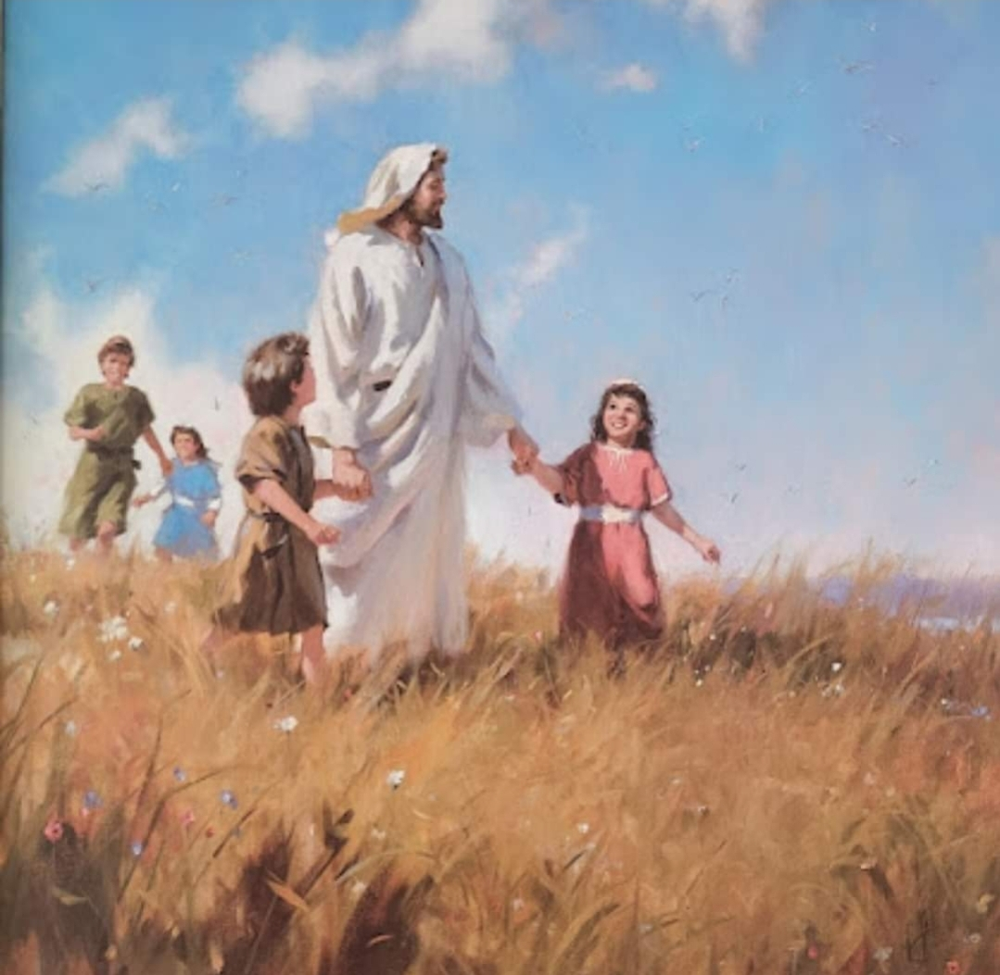

  

     
    

      <b>Acts행22:1 사람들아 형제들아 그리고 아버지들아 이제 내가 너희에게 말하는 변론을 들으라 
      </b>
    

     
    
Men, brethren, and fathers, hear ye my defense which I make now unto you. 
    

     
    

      <b>Acts행22:2 (그들은 그가 히브리어로 자기들에게 말하는 것을 듣고 더욱 잠잠하더라 그가 이르되 ) 
      </b>
    

     
    
And when they heard that he spake in the Hebrew tongue to them, they kept the more silence; and he saith,) 
    
         
  

  

    
  

---

  

     
    

      <b>Acts 행22:3 나는 진실로 길리기아 다소 성읍에서 태어난 유대인이라 이 성읍의 가말리엘 문하에서 자라며 조상의 율법에 관해 완전한 방식에 따라 가르침 받았고 오늘 너희 모든 사람처럼 하나님을 향해 열심이었느니라 
      </b>
    

     
    
I am verily a man which am a Jew, born in Tarsus, a city in Cilicia, yet brought up in this city at the feet of Gamaliel, and taught according to the perfect manner of the law of the fathers, and was zealous toward God, as ye all are this day. 
    

     
    

      <b>
      </b>
    

     
    

    
         
  

  

    
  

---

  

     
    

      <b>Acts 행22:4 나는 이 종교를 죽음에 이르기까지 박해하여 남자와 여자를 모두 결박하여 옥에 넘겼나니 
      </b>
    

     
    
And I persecuted this way unto the death, binding and delivering into prisons both men and women. 
    

     
    

      <b>
      </b>
    

     
    

    
         
  

  

    
  

---

  

     
    

      <b>Acts행22:5 대제사장과 장로 신분의 모든 자도 나에 관해 증언하는 바와 같이 나는 그들로부터 형제들에게 보내는 공문을 받아 다메섹으로 가서 그곳에 있는 자들을 결박하여 예루살렘으로 끌어다 처벌하려 했느니라 
      </b>
    

     
    
As also the high priest doth bear me witness, and all the estate of the elders; from whom also I received letters unto the brethren, and went to Damascus, to bring them which were there bound unto Jerusalem, for to be punished. 
    

     
    

      <b>
      </b>
    

     
    

    
         
  

  

    
  

---

  

     
    

      <b>Acts행22:6 그리고 이렇게 되었나니 내가 여행하다가 다메섹에 가까이 갔을 때 정오쯤에 갑자기 하늘로부터 큰 빛이 나를 둘러 비추매 
      </b>
    

     
    
And it came to pass, that, as I made my journey, and was come nigh unto Damascus about noon, suddenly there shone from heaven a great light round about me. 
    

     
    

      <b>
      </b>
    

     
    

    
         
  

  

    
  

---

  

     
    

      <b>Acts행22:7 내가 땅에 엎드러졌으며 한 음성이 나에게 이르되 사울아 사울아 어찌하여 나를 박해하느냐 하는 것을 들었느니라 
      </b>
    

     
    
And I fell unto the ground, and heard a voice saying unto me, Saul, Saul, why persecutest thou me? 
    

     
    

      <b>Acts 행22:8 이에 내가 대답하되 주여 당신은 누구니이까 하니 그가 나에게 이르되 나는 너가 박해하는 나사렛 예수니라 했는데 
      </b>
    

     
    
And I answered, Who art thou, Lord? And he said unto me, I am Jesus of Nazareth, whom thou persecutest. 
    
         
  

  

    
  

---

  

     
    

      <b>Acts 행22:9 나와 함께 있던 사람들은 참으로 그 빛을 보고 두려워 했으나 나에게 말씀하시는 이의 음성은 듣지 못했느니라 
      </b>
    

     
    
And they that were with me saw indeed the light, and were afraid; but they heard not the voice of him that spake to me. 
    

     
    

      <b>
      </b>
    

     
    

    
         
  

  

    
  

---

  

     
    

      <b>Acts 행22:10, JST22:10 내가 이르되 주여 내가 어떻게 해야 하나이까 하니 주가 나에게 이르되 일어나 다메섹으로 들어가라 너가 행하도록 지정된 모든 일을 그곳에서 듣게 되리라 했으며 
      </b>
    

     
    
And I said, What shall I do, Lord? And the Lord said unto me, Arise, and go into Damascus; and there it shall be told thee of all things which are appointed of thee to do. 
    

     
    

      <b>
      </b>
    

     
    

    
         
  

  

    
  

---

  

     
    

      <b>Acts 행22:11 나는 그 빛의 광채로 인해 볼 수 없으므로 나와 함께 있던 자들의 손에 이끌려 다메섹에 들어갔느니라 
      </b>
    

     
    
And when I could not see for the glory of that light, being led by the hand of them that were with me, I came into Damascus. 
    

     
    

      <b>Acts행22:12 그곳에 거하는 모든 유대인에게 선한 평판을 받고 율법에 따라 독실한 아나니아라 하는 사람이 
      </b>
    

     
    
And one Ananias, a devout man according to the law, having a good report of all the Jews which dwelt there, 
    
         
  

  

    
  

---

  

     
    

      <b>Acts행22:13 나에게 오더니 서서 이르되 사울 형제여 너의 시력을 받을지어다 하매 그 즉시 내가 그를 바라보았느니라 
      </b>
    

     
    
Came unto me, and stood, and said unto me, Brother Saul, receive thy sight. And the same hour I looked up upon him. 
    

     
    

      <b>
      </b>
    

     
    

    
         
  

  

    
  

---

  

     
    

      <b>Acts행22:14 그가 이르되 우리 조상의 하나님이 너를 택하여 너로 하여금 그의 뜻을 알게 하고 그 의로우신 이를 보게 하고 그의 입의 음성을 듣게 했으니 
      </b>
    

     
    
And he said, The God of our fathers hath chosen thee, that thou shouldest know his will, and see that Just One, and shouldest hear the voice of his mouth. 
    

     
    

      <b>Acts 행22:15 너는 보고 들은 것에 관해 모든 사람을 향한 그의 증인이 되어야 하리라 
      </b>
    

     
    
For thou shalt be his witness unto all men of what thou hast seen and heard. 
    
         
  

  

    
  

---

  

     
    

      <b>Acts행22:16 이제 너는 어찌하여 주저하느냐 일어나 주의 이름을 불러 침례 받고 너의 죄를 씻으라 했느니라 
      </b>
    

     
    
And now why tarriest thou? arise, and be baptized, and wash away thy sins, calling on the name of the Lord. 
    

     
    

      <b>Acts 행22:17 그리고 이렇게 되었나니 그 후에 내가 다시 예루살렘으로 와서 성전에서 기도할 때 비몽사몽 중에 
      </b>
    

     
    
And it came to pass, that, when I was come again to Jerusalem, even while I prayed in the temple, I was in a trance; 
    
         
  

  

    
  

---

  

     
    

      <b>Acts행22:18 보니 그가 나에게 이르되 서둘러 예루살렘을 속히 떠나라 이는 그들이 나에 관한 너의 증언을 받아 들이지 않을 것임이라 했느니라 
      </b>
    

     
    
And saw him saying unto me, Make haste, and get thee quickly out of Jerusalem; for they will not receive thy testimony concerning me. 
    

     
    

      <b>
      </b>
    

     
    

    
         
  

  

    
  

---

  

     
    

      <b>Acts행22:19 이에 내가 이르되 주여 그들은 내가 모든 회당에서 당신을 믿는 사람들을 옥에 가두고 때린 것과 
      </b>
    

     
    
And I said, Lord, they know that I imprisoned and beat in every synagogue them that believed on thee; 
    

     
    

      <b>
      </b>
    

     
    

    
         
  

  

    
  

---

  

     
    

      <b>Acts 행22:20 당신의 순교자 스데반 이 피를 흘릴 때 나도 곁에 서서 그의 죽음에 동의하고 그를 죽인 자들의 옷을 지킨 것을 아나이다 하니 
      </b>
    

     
    
And when the blood of thy martyr Stephen was shed, I also was standing by, and consenting unto his death, and kept the raiment of them that slew him. 
    

     
    

      <b>Acts행22:21 그가 나에게 이르되 떠나라 내가 너를 여기서 멀리 이방인 에게 보내리라 했느니라 하매 
      </b>
    

     
    
And he said unto me, Depart; for I will send thee far hence unto the Gentiles. 
    
         
  

  

    
  

---

  

     
    

      <b>Acts행22:22 그의 말을 듣던 자들이 소리높여 이르되 이런 자는 땅으로부터 없애라 그를 살려두는 것은 합당하지 않으니라 하고 
      </b>
    

     
    
And they gave him audience unto this word, and then lifted up their voices, and said, Away with such a fellow from the earth; for it is not fit that he should live. 
    

     
    

      <b>Acts행22:23 소리 지르며 옷을 벗어 던지고 티끌을 공중에 날리는지라 
      </b>
    

     
    
And as they cried out, and cast off their clothes, and threw dust into the air, 
    
         
  

  

    
  

---

  

     
    

      <b>Acts 행22:24 천부장이 바울을 영내로 데려가라 명하고 채찍질하여 심문하게 했나니 이는 저들이 무슨 일로 그를 대적하여 그렇게 소리치는지 알고자 함이더라 
      </b>
    

     
    
The chief captain commanded him to be brought into the castle, and bade that he should be examined by scou rging; that he might know wherefore they cried so against him. 
    

     
    

      <b>
      </b>
    

     
    

    
         
  

  

    
  

---

  

     
    

      <b>Acts 행22:25 그들이 가죽끈으로 그를 묶을 때 바울이 곁에 서있던 백부장에게 이르되 너희가 로마인을 죄도 정하지 않고 채찍질하는 것이 적법하냐 하니 
      </b>
    

     
    
And as they bound him with thongs, Paul said unto the centurion that stood by, Is it lawful for you to scourge a man that is a Roman, and uncon demned? 
    

     
    

      <b>
      </b>
    

     
    

    
         
  

  

    
  

---

  

     
    

      <b>Acts행22:26 백부장이 그 말을 듣고 천부장에게 가서 전하여 이르되 당신이 하는 일을 조심하소서 이 사람은 로마인이니이다 하더라 
      </b>
    

     
    
When the centurion heard that, he went and told the chief captain, saying, Take heed what thou doest; for this man is a Roman. 
    

     
    

      <b>Acts행22:27 이에 천부장이 와서 이르되 나에게 말하라 너가 로마인이냐 하니 그가 이르되 그러하니라 하매 
      </b>
    

     
    
Then the chief captain came, and said unto him, Tell me, art thou a Roman? He said, Yea. 
    
         
  

  

    
  

---

  

     
    

      <b>Acts 행22:28 천부장이 대답하되 나는 돈을 많이 들여서 이 자유를 얻었노라 하니 바울이 이르되 나는 자유로운 자로 태어났느니라 하므로 
      </b>
    

     
    
And the chief captain answered, With a great sum obtained I this freedom. And Paul said, But I was freeborn. 
    

     
    

      <b>
      </b>
    

     
    

    
         
  

  

    
  

---

  

     
    

      <b>Acts 행22:29, JST22:29 그를 심문하려던 자들이 곧바로 그로부터 물러갔으며 천부장도 그가 로마인 인 것을 알고 자기가 그를 결박한 것으로 인해 두려워하여 그를 결박으로부터 풀어주더라 
      </b>
    

     
    
Then straightway they departed from him which should have examined him, and the chief captain also was afraid after he knew that he was a Roman, because he had bound him, and he loosed him from his bands. 
    

     
    

      <b>
      </b>
    

     
    

    
         
  

  

    
  

---

  

     
    

      <b>Acts 행22:30 , JST22:30 이튿날 그는 유대인들이 어찌하여 그를 고소하는지 이유를 확실히 알기 위해 제사장들과 모든 공회는 모이라 명하고 바울을 데리고 내려가 그들 앞에 세우니라 
      </b>
    

     
    
On the morrow, because he would have known the certainty wherefore he was accused of the Jews, he commanded the chief priests and all their council to appear, and brought Paul down, and set him before them.
    

     
    

      <b>
      </b>
    

     
    

    
         
  

  

    
  

