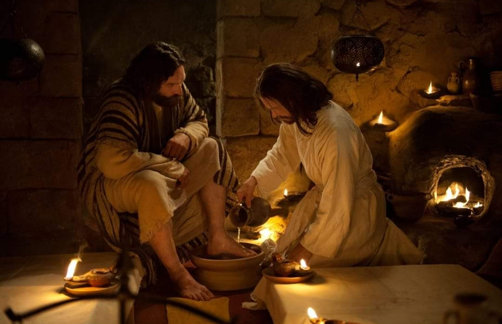
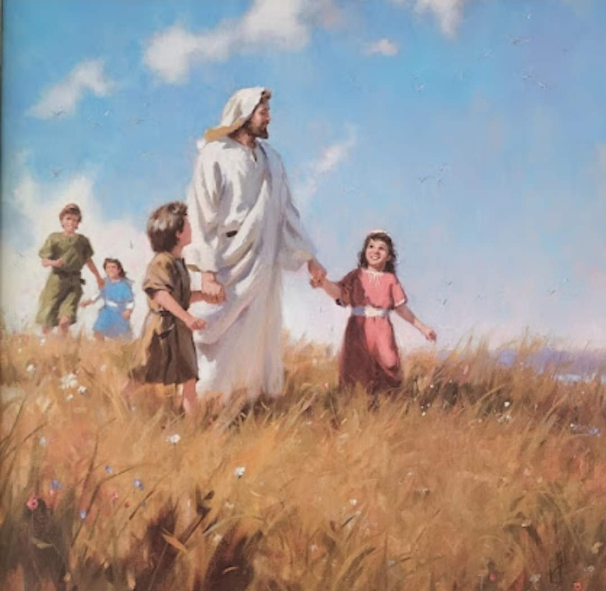

  

     
    

      <b>Acts 행3:1, JST3:1 제구 시에 베드 로와 요한이 기도하 러 성전으로 함께 올라가는데 
      </b>
    

     
    
Now Peter and John went up together into the temple at the ninth hour, for prayer. 
    

     
    

      <b>
      </b>
    

     
    

    
         
  

  

    
  

---

  

     
    

      <b>Acts행3:2 모태로부터 다리 저는 어 떤 사람이 메어져 오더니 사람들이 날 마다 그를 아름다운 문이라 하는 성전 문에 두어 성전으로 들어가는 사람에게 구걸하게 하매 
      </b>
    

     
    
And a certain man lame from his mother's womb was carried, whom they laid daily at the gate of the temple which is called Beautiful, to ask alms of them that entered into the temple; 
    

     
    

      <b>
      </b>
    

     
    

    
         
  

  

    
  

---

  

     
    

      <b>Acts행3:3 그가 베드로와 요한이 성 전에 들어가려는 것을 보고 구걸하는지 라 
      </b>
    

     
    
Who, seeing Peter and John about to go into the temple, asked an alms. 
    

     
    

      <b>Acts행3:4, JST3:4 베드로와 요한이 그에게 시선을 고정하고 이르되 우리를 바라보라 하니 
      </b>
    

     
    
And Peter and John , fastening their eyes upon him, said, Look on us. 
    
         
  

  

    
  

---

  

     
    

      <b>Acts행3:5 그가 그들에게서 뭔가 받 을 것을 기대하 고 주목하더라 
      </b>
    

     
    
And he gave heed unto them, expec ting to receive something of them. 
    

     
    

      <b>Acts행3:6 이에 베드로가 이르되 은 과 금은 나에게 없으나 내가 가진 것을 너에게 주노니 나사렛 예수 그리스도의 이름으로 일어나 걸으라 하며 
      </b>
    

     
    
Then Peter said, Silver and gold have I none; but such as I have give I thee; In the name of Jesus Christ of Naza reth rise up and walk. 
    
         
  

  

    
  

---

  

     
    

      <b>Acts행3:7 오른손으로 그를 잡아 일 으켜 세우니 즉시 그의 발과 발목이 힘 을 얻어 
      </b>
    

     
    
And he took him by the right hand, and lifted him up; and immediately his feet and ankle bones received strength. 
    

     
    

      <b>Acts행3:8 벌떡 일어서서 그들과 함 께 성전 안으로 걸어 들어가면서 걷고 뛰며 하나님을 찬양하더라 
      </b>
    

     
    
And he leaping up stood, and walked, and entered with them into the temple, walking, and leaping, and praising God. 
    
         
  

  

    
  

---

  

     
    

      <b>Acts행3:9 모든 백성이 그가 걸으며 하나님을 찬양하는 것을 보더니 
      </b>
    

     
    
And all the people saw him walking and praising God; 
    

     
    

      <b>Acts 행3:10 그가 성전의 아름다운 문에 앉아 구걸하던 자임을 알고 그에 게 일어난 일에 대해 심히 기이히 여기 며 놀라더 라 
      </b>
    

     
    
And they knew that it was he which sat for alms at the Beautiful gate of the temple; and they were filled with wonder and amazement at that which had happened unto him. 
    
         
  

  

    
  

---

  

     
    

      <b>Acts 행3:11 다리 절다가 나은 사람 이 베드로와 요한을 붙잡으니 모든 백 성이 매우 놀라 솔로몬의 행각이라 하 는 행각으로 그들에게 달려가더 라 
      </b>
    

     
    
And as the lame man which was healed held Peter and John, all the people ran together unto them in the porch that is called Solomon's, greatly wondering. 
    

     
    

      <b>
      </b>
    

     
    

    
         
  

  

    
  

---

  

     
    

      <b>Acts행3:12, JST3:12 베드로가 이것 을 보고 백성에게 대답하여 이르되 이 스라엘 사람들아 어찌하여 이 일에 놀 라느냐 너희는 어찌하여 우리가 우리 자신의 능력이나 거룩함으로 이 사람을 걷게 한 것처럼 그토록 진지하게 우리 를 바라보느냐 
      </b>
    

     
    
And when Peter saw this, he answered and said unto the people, Ye men of Israel, why marvel ye at this? or why look ye so earnestly on us, as though by our own power or holiness we had made this man to walk? 
    

     
    

      <b>
      </b>
    

     
    

    
         
  

  

    
  

---

  

     
    

      <b>Acts행3:13 아브라함과 이삭과 야곱 의 하나님 곧 우리 조상의 하나님이 그 의 아들 예수를 영화롭게 했나니 너희 는 그를 넘겨주어 빌라도 앞에서 부인 했으되 빌라도가 그를 놓아 보내려 고 결심했으나 
      </b>
    

     
    
The God of Abraham, and of Isaac, and of Jacob, the God of our fathers, hath glorified his Son Jesus; whom ye delivered up, and denied him in the presence of Pilate, when he was determined to let him go. 
    

     
    

      <b>
      </b>
    

     
    

    
         
  

  

    
  

---

  

     
    

      <b>Acts 행3:14 너희는 거룩하 신 이요 의로우 신 이를 부인하고 살인자를 놓아 주기 원하여 
      </b>
    

     
    
But ye denied the Holy One and the Just, and desired a murderer to be granted unto you; 
    

     
    

      <b>Acts 행3:15 생명의 왕을 죽였으 되 하나님이 그를 죽음으로부터 살렸나니 우리가 그 일에 관한 증인들이라 
      </b>
    

     
    
And killed the Prince of life, whom God hath raised from the dead; whereof we are witnesses. 
    
         
  

  

    
  

---

  

     
    

      <b>Acts 행3:16, JST3:16 너희가 보고 아는 이 사람은 그의 이름에 대한 신앙 을 통해 강하게 되었나니 참으로 그에 대한 신앙이 너희 모든 사람 앞에서 이렇게 완전한 건강을 그에게 가져다주었 느니라 
      </b>
    

     
    
And this man , through faith in his name, hath been made strong, whom ye see and know; yea, the faith which is in him hath given him this perfect soundness in the presence of you all. 
    

     
    

      <b>
      </b>
    

     
    

    
         
  

  

    
  

---

  

     
    

      <b>Acts행3:17, JST3:17 이제 형제들아 나는 너희가 너희 관리들 처럼 무지한 가운데 이 일을 한 것을 알거니와 
      </b>
    

     
    
And now, brethren, I know that through ignorance ye have done this, as also your rulers. 
    

     
    

      <b>Acts행3:18, JST3:18 하나님은 그의 모든 선지자의 입을 통해 미리 보여준 그런 일 곧 그리스도가 고난받으리라는 것을 그렇게 성취했 느니라 
      </b>
    

     
    
But those things, which God before had showed by the mouth of all his prophets, that Christ should suffer, he hath so fulfilled. 
    
         
  

  

    
  

---

  

     
    

      <b>Acts행3:19 그러므로 너희는 회개하 고 개심하라 그리하여 주의 면전으로부 터 새롭게 되는 시기가 올 때 너희 죄 가 지워지게 하라 
      </b>
    

     
    
Repent ye therefore, and be converted, that your sins may be blotted out, when the times of refreshing shall come from the presence of the Lord; 
    

     
    

      <b>
      </b>
    

     
    

    
         
  

  

    
  

---

  

     
    

      <b>Acts행3:20, JST3:20 그리하면 너희 에게 미리 전파되었고 너희가 십자가에 못 박은 예수 그리스도를 그가 보내리 니 
      </b>
    

     
    
And he shall send Jesus Christ, which before was preached unto you, whom ye have crucified ; 
    

     
    

      <b>
      </b>
    

     
    

    
         
  

  

    
  

---

  

     
    

      <b>Acts 행3:21 세상이 시작된 이래로 하나님이 그의 모든 선지자의 입을 통 해 말한 모든 것이 회복될 때까지 하늘 이 반드시 그를 받아두어야 하리라 
      </b>
    

     
    
Whom the heaven must receive until the times of restitution of all things which God hath spoken by the mouth of all his holy prophets since the world began. 
    

     
    

      <b>
      </b>
    

     
    

    
         
  

  

    
  

---

  

     
    

      <b>Acts행3:22 모세는 참으로 조상에게 이르되 주 너희 하나님이 너희 형제들 가운데 나와 같은 선지자 하나를 너희 에게 일으키 리니 너희는 모든 일에서 무엇이든 그가 너희에게 하는 말을 들 으라 
      </b>
    

     
    
For Moses truly said unto the fathers, A Prophet shall the Lord your God raise up unto you of your brethren, like unto me; him shall ye hear in all things whatsoever he shall say unto you. 
    

     
    

      <b>
      </b>
    

     
    

    
         
  

  

    
  

---

  

     
    

      <b>Acts 행3:23 그리고 이렇게 되리니 그 선지자의 말을 듣지 않는 모든 영혼 은 백성으로부터 멸망하리라 했으며 
      </b>
    

     
    
And it shall come to pass, that every soul, which will not hear that prophet, shall be destroyed from among the people. 
    

     
    

      <b>Acts행3:24 참으로 사무엘부터 모든 선지자와 그 뒤를 이어 말했던 자들도 이 시대에 관해 미리 말했느니라 
      </b>
    

     
    
Yea, and all the prophets from Samuel and those that follow after, as many as have spoken, have likewise foretold of these days. 
    
         
  

  

    
  

---

  

     
    

      <b>Acts행3:25 너희는 선지자 들의 자손 이요 하나님이 우리 조상과 맺은 성약 의 자손이라 아브라함에게 이르되 너의 씨 안에서 땅의 모든 족속이 축복받으 리라 했으니 
      </b>
    

     
    
Ye are the children of the prophets, and of the covenant which God made with our fathers, saying unto Abraham, And in thy seed shall all the kindreds of the earth be blessed. 
    

     
    

      <b>
      </b>
    

     
    

    
         
  

  

    
  

---

  

     
    

      <b>Acts 행3:26 자기 아들 예수를 일으 키신 하나님은 너희를 축복하여 너희 각 사람이 자기 간악함 으로부터 돌이키 게 하려고 너희에게 먼저 그를 보냈느 니라 하더라 
      </b>
    

     
    
Unto you first God, having raised up his Son Jesus, sent him to bless you, in turning away every one of you from his iniquities.
    

     
    

      <b>
      </b>
    

     
    

    
         
  

  

    
  

