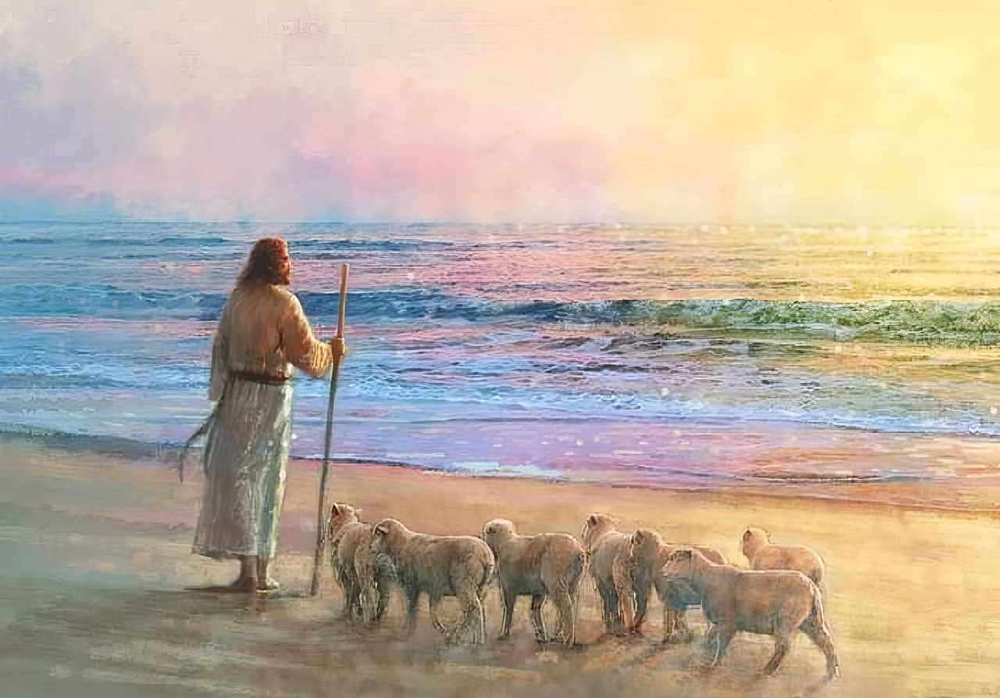

  

     
    

      <b>Acts행9:1 사울은 여전히 주의 제자 들을 대적하여 위협과 살기를 내뿜으며 대제사장에게 가서 
      </b>
    

     
    
And Saul, yet breathing out threat enings and slaughter against the disciples of the Lord, went unto the high priest, 
    

     
    

      <b>
      </b>
    

     
    

    
         
  

  

    
  

---

  

     
    

      <b>Acts행9:2 다메섹 여러 회당에 보내 는 편지를 요구하여 누구든지 이 종교 를 따르는 사람을 만나면 남녀를 막론 하고 결박하여 예루살렘으로 끌어오려 하더라 
      </b>
    

     
    
And desired of him letters to Damas cus to the synagogues, that if he found any of this way, whether they were men or women, he might bring them bound unto Jerusalem. 
    

     
    

      <b>
      </b>
    

     
    

    
         
  

  

    
  

---

  

     
    

      <b>Acts 행9:3 그가 여행하여 다메섹에 가까이 이르렀을 때 갑자기 하늘로부터 빛이 그의 주위를 비추매 
      </b>
    

     
    
And as he journeyed, he came near Damascus, and suddenly there shined round about him a light from heaven; 
    

     
    

      <b>Acts행9:4 그가 땅에 엎드러 져 그에 게 말하는 한 음성을 들었나니 사울아 사울아 어찌하여 나를 박해하느냐 하는 지라 
      </b>
    

     
    
And he fell to the earth, and heard a voice saying unto him, Saul, Saul, why persecutest thou me? 
    
         
  

  

    
  

---

  

     
    

      <b>Acts행9:5 그가 이르되 주여 당신은 누구니이까 하니 주가 이르되 나는 너 가 박해하는 예수라 가시채 에 발길질 하기가 너에게 힘든 일이로다 하더라 
      </b>
    

     
    
And he said, Who art thou, Lord? And the Lord said, I am Jesus whom thou persecutest; it is hard for thee to kick against the pricks. 
    

     
    

      <b>
      </b>
    

     
    

    
         
  

  

    
  

---

  

     
    

      <b>Acts 행9:6 그가 떨며 놀라 이르되 주여 당신은 내가 어떻게 하기를 원하 나이까 하니 주가 그에게 이르되 일어 나 성읍으로 들어가 라 그리하면 너가 어떻게 해야 할지 알리라 하더라 
      </b>
    

     
    
And he trembling and astonished said, Lord, what wilt thou have me to do? And the Lord said unto him, Arise, and go into the city, and it shall be told thee what thou must do. 
    

     
    

      <b>
      </b>
    

     
    

    
         
  

  

    
  

---

  

     
    

      <b>Acts 행9:7, JST9:7 그와 함께 여행 하던 사람들은 참으로 그 빛을 보고 두 려워했으나 그에게 말하는 이의 음성은 듣지 못했더라 
      </b>
    

     
    
And they who were journeying with him saw indeed the light, and were afraid; but they heard not the voice of him who spake to him. 
    

     
    

      <b>
      </b>
    

     
    

    
         
  

  

    
  

---

  

     
    

      <b>Acts 행9:8 그가 땅으로부터 일어나 눈을 떴으되 아무 사람도 보지 못하므 로 그들이 그의 손을 잡고 이끌어 다메 섹으로 데려가니 
      </b>
    

     
    
And Saul arose from the earth; and when his eyes were opened, he saw no man; but they led him by the hand, and brought him into Damascus. 
    

     
    

      <b>Acts 행9:9 그가 삼 일간 보지 못하 고 먹거나 마시지도 못하더라 
      </b>
    

     
    
And he was three days without sight, and neither did eat nor drink. 
    
         
  

  

    
  

---

  

     
    

      <b>Acts행9:10 다메섹에 아나니아라 하 는 어떤 제자가 있는데 주가 시현으로 그에게 이르되 아나니아야 하니 그가 이르되 보소서 주여 내가 여기 있나이 다 하매 
      </b>
    

     
    
And there was a certain disciple at Damascus, named Ananias; and to him said the Lord in a vision, Ananias. And he said, Behold, I am here, Lord. 
    

     
    

      <b>
      </b>
    

     
    

    
         
  

  

    
  

---

  

     
    

      <b>Acts 행9:11 주가 그에게 이르되 일 어나 곧은 길이라 하는 거리로 가서 유 다의 집에서 다소 사람 사울을 찾으라 보라 그가 기도하다 가 
      </b>
    

     
    
And the Lord said unto him, Arise, and go into the street which is called Straight, and inquire in the house of Judas for one called Saul, of Tarsus; for, behold, he prayeth, 
    

     
    

      <b>
      </b>
    

     
    

    
         
  

  

    
  

---

  

     
    

      <b>Acts행9:12 아나니아 라 하는 사람이 들어와 자기에게 안수하 매 자기 시력을 받게 되는 것을 시현으로 보았느 니라 하는지라 
      </b>
    

     
    
And hath seen in a vision a man named Ananias coming in, and putting his hand on him, that he might receive his sight. 
    

     
    

      <b>
      </b>
    

     
    

    
         
  

  

    
  

---

  

     
    

      <b>Acts행9:13 아나니아 가 대답하되 주 여 내가 이 사람에 관해 그가 예루살렘 에서 당신의 성도들에게 얼마나 많은 악을 행했는지를 많은 사람을 통해 들 었으며 
      </b>
    

     
    
Then Ananias answered, Lord, I have heard by many of this man, how much evil he hath done to thy saints at Jerusalem; 
    

     
    

      <b>Acts 행9:14 그는 여기서도 당신의 이름을 부르는 모든 사람을 결박할 권 세를 제사장들 로부터 받았나이다 했으 나 
      </b>
    

     
    
And here he hath authority from the chief priests to bind all that call on thy name. 
    
         
  

  

    
  

---

  

     
    

      <b>Acts 행9:15 주가 그에게 이르되 너 의 길을 가라 그는 이방인과 왕들과 이 스라엘 자손 앞에서 나의 이름을 증언 하기 위해 내가 택한 그릇이니 
      </b>
    

     
    
But the Lord said unto him, Go thy way; for he is a chosen vessel unto me, to bear my name before the Gentiles, and kings, and the children of Israel; 
    

     
    

      <b>Acts 행9:16, JST9:16 그가 나의 이 름을 위해 얼마나 큰 일을 겪어야 하는 지를 내가 그에게 보여주리라 하매 
      </b>
    

     
    
For I will show him how great things he must suffer for my name's sake. 
    
         
  

  

    
  

---

  

     
    

      <b>Acts 행9:17 아나니아 가 자기 길을 가서 그 집에 들어가 그에게 안수하여 이르되 사울 형제여 주 곧 너가 올 때 길에서 너에게 나타나신 예수가 나를 보내어 너로 하여금 시력을 받게 하고 성령으로 충만하게 했느니라 하니 
      </b>
    

     
    
And Ananias went his way, and entered into the house; and putting his hands on him said, Brother Saul, the Lord, even Jesus, that appeared unto thee in the way as thou camest, hath sent me, that thou mightest receive thy sight, and be filled with the Holy Ghost. 
    

     
    

      <b>
      </b>
    

     
    

    
         
  

  

    
  

---

  

     
    

      <b>Acts 행9:18 즉시 그의 눈으로부터 비늘 같은 것이 떨어지고 곧 시력을 받 게 되어 일어나 침례 받았으며 
      </b>
    

     
    
And immediately there fell from his eyes as it had been scales; and he received sight forthwith, and arose, and was baptized. 
    

     
    

      <b>Acts행9:19 음식을 먹고 강건해지더 라 사울이 다메섹에 있는 제자들과 함 께 여러 날을 지낸 후에 
      </b>
    

     
    
And when he had received meat, he was strengthened. Then was Saul certain days with the disciples which were at Damascus. 
    
         
  

  

    
  

---

  

     
    

      <b>Acts 행9:20 곧바로 여러 회당에서 그리스도를 전파하여 그는 하나님의 아 들이라 했으나 
      </b>
    

     
    
And straightway he preached Christ in the synagogues, that he is the Son of God. 
    

     
    

      <b>
      </b>
    

     
    

    
         
  

  

    
  

---

  

     
    

      <b>Acts행9:21 그의 말을 들은 모든 사 람이 놀라 이르되 이 사람은 예루살렘 에서 이 이름을 부르던 사람들을 멸하 던 자가 아니냐 여기에 온 것도 그들을 결박하여 제사장들에게 끌어가려는 의 도가 아니었느냐 하더라 
      </b>
    

     
    
But all that heard him were amazed, and said; Is not this he that destroyed them which called on this name in Jerusalem, and came hither for that intent, that he might bring them bound unto the chief priests? 
    

     
    

      <b>
      </b>
    

     
    

    
         
  

  

    
  

---

  

     
    

      <b>Acts 행9:22 그러나 사울은 더욱 강 하게 이 사람이 참 그리스도임을 입증 하여 다메섹에 거하는 유대인 들을 당황 하게 하며 
      </b>
    

     
    
But Saul increased the more in strength, and confounded the Jews which dwelt at Damascus, proving that this is very Christ. 
    

     
    

      <b>Acts 행9:23 여러 날이 지나매 유대 인들이 그를 죽이려고 의논했으나 
      </b>
    

     
    
And after that many days were fulfilled, the Jews took counsel to kill him; 
    
         
  

  

    
  

---

  

     
    

      <b>Acts 행9:24, JST9:24 그들이 숨어 기다리 는 것이 사울에게 알려지니라 그 들이 그를 죽이려고 밤낮으로 성문을 지키므로 
      </b>
    

     
    
But their lying in wait was known of Saul. And they watched the gates day and night to kill him. 
    

     
    

      <b>Acts 행9:25 제자들이 밤에 그를 광 주리에 담아 성벽 옆으로 달아내리니라 
      </b>
    

     
    
Then the disciples took him by night, and let him down by the wall in a basket. 
    
         
  

  

    
  

---

  

     
    

      <b>Acts행9:26 사울이 예루살렘에 가서 제자들과 합류하려고 시도했으나 그들 이 모두 그를 두려워하며 그가 제자인 것을 믿지 않더라 
      </b>
    

     
    
And when Saul was come to Jerusalem, he assayed to join himself to the disciples; but they were all afraid of him, and believed not that he was a disciple. 
    

     
    

      <b>
      </b>
    

     
    

    
         
  

  

    
  

---

  

     
    

      <b>Acts 행9:27 이에 바나바가 그를 데 리고 사도들에게 가서 그가 길에서 주 를 본 것과 주가 그에게 말한 것과 다 메섹에서 그가 예수의 이름으로 담대히 전파한 것을 그들에게 밝히 말하니 
      </b>
    

     
    
But Barnabas took him, and brought him to the apostles, and declared unto them how he had seen the Lord in the way, and that he had spoken to him, and how he had preached boldly at Damascus in the name of Jesus. 
    

     
    

      <b>
      </b>
    

     
    

    
         
  

  

    
  

---

  

     
    

      <b>Acts 행9:28 그가 그들과 함께하 며 예루살렘 에서 출입하 더라 
      </b>
    

     
    
And he was with them coming in and going out at Jerusalem. 
    

     
    

      <b>Acts 행9:29 그가 주 예수의 이름으 로 담대히 말하고 그리스 파 유대인 들과 논쟁하니 그들이 그를 죽이려 하매 
      </b>
    

     
    
And he spake boldly in the name of the Lord Jesus, and disputed against the Grecians; but they went about to slay him. 
    
         
  

  

    
  

---

  

     
    

      <b>Acts행9:30, JST9:30 형제들이 이것 을 알고 그를 가이사랴로 데리고 내려 가서 다소로 보내니 라 
      </b>
    

     
    
When the brethren knew this, they brought him down to Caesarea, and sent him forth to Tarsus. 
    

     
    

      <b>
      </b>
    

     
    

    
         
  

  

    
  

---

  

     
    

      <b>Acts 행9:31 그때에 교회가 온 유대 와 갈릴리와 사마리아 지역에서 든든히 자리 잡고 교화되었으며 주를 두려워 함 과 성령의 위로 가운데 행하며 번성하 더라 
      </b>
    

     
    
Then had the churches rest throug hout all Judea and Galilee and Samaria, and were edified; and walking in the fear of the Lord, and in the comfort of the Holy Ghost, were multiplied. 
    

     
    

      <b>
      </b>
    

     
    

    
         
  

  

    
  

---

  

     
    

      <b>Acts행9:32, JST9:32 그리고 이렇게 되었나니 베드로가 이 모든 지역을 통 과하여 룻다에 거하는 성도들에게 내려 가니라 
      </b>
    

     
    
And it came to pass, as Peter passed throughout all these regions , he came down also to the saints which dwelt at Lydda. 
    

     
    

      <b>Acts행9:33 그가 그곳에서 애니아라 하는 어떤 사람을 만났는데 중풍병으로 침상에 누운 지 팔 년이라 
      </b>
    

     
    
And there he found a certain man named Aeneas, which had kept his bed eight years, and was sick of the palsy. 
    
         
  

  

    
  

---

  

     
    

      <b>Acts행9:34 베드로가 그에게 이르되 애니아야 예수 그리스도가 너를 온전하 게 했으니 일어나 너의 침상을 정리하 라 하매 그가 곧 일어나는지라 
      </b>
    

     
    
And Peter said unto him, Aeneas, Jesus Christ maketh thee whole; arise, and make thy bed. And he arose immediately. 
    

     
    

      <b>Acts 행9:35 룻다와 사론에 거하던 자들이 모두 그를 보고 주께 돌아오 더 라 
      </b>
    

     
    
And all that dwelt at Lydda and Saron saw him, and turned to the Lord. 
    
         
  

  

    
  

---

  

     
    

      <b>Acts 행9:36 이제 욥바에 다비다라 하는 어떤 제자가 있는데 그 이름을 번 역하면 도르가라 이 여자의 선한 일과 구제하는 일이 심히 많더라 
      </b>
    

     
    
Now there was at Joppa a certain disciple named Tabitha, which by interpretation is called Dorcas; this woman was full of good works and almsdeeds which she did. 
    

     
    

      <b>
      </b>
    

     
    

    
         
  

  

    
  

---

  

     
    

      <b>Acts행9:37 그리고 이렇게 되었나니 그때 그녀가 병들어 죽으매 그녀를 씻 어 다락방에 누이니라 
      </b>
    

     
    
And it came to pass in those days, that she was sick, and died; whom when they had washed, they laid her in an upper chamber. 
    

     
    

      <b>
      </b>
    

     
    

    
         
  

  

    
  

---

  

     
    

      <b>Acts행9:38 룻다가 욥바에서 가까우 므로 베드로가 그곳에 있다는 것을 들 은 제자들이 두 사람을 그에게 보내어 지체하지 말고 자기들에게 와 줄 것을 청하매 
      </b>
    

     
    
And forasmuch as Lydda was nigh to Joppa, and the disciples had heard that Peter was there, they sent unto him two men, desiring that he would not delay to come to them. 
    

     
    

      <b>
      </b>
    

     
    

    
         
  

  

    
  

---

  

     
    

      <b>Acts행9:39, JST9:39 베드로가 일어 나 그들과 함께 가니라 그가 왔을 때 그들이 그를 데리고 다락방으로 들어가 니 모든 과부가 곁에 서서 울며 도르가 가 그들과 함께 있을 때 만들어준 옷들 과 겉옷들을 보여주더라 
      </b>
    

     
    
Then Peter arose and went with them. When he was come, they brought him into the upper chamber; and all the widows stood by him weeping, and showing the coats and garments which Dorcas made, while she was with them. 
    

     
    

      <b>
      </b>
    

     
    

    
         
  

  

    
  

---

  

     
    

      <b>Acts행9:40, JST9:40 베드로가 그들 을 모두 내보낸 후에 무릎을 꿇어 기도 하고 그 몸을 향해 돌아서서 이르되 다비다야 일어나라 하니 그녀가 눈을 떠 베드로를 보고 일어나 앉더라 
      </b>
    

     
    
But Peter put them all forth, and kneeled down, and prayed; and turning to the body said, Tabitha, arise. And she opened her eyes; and when she saw Peter, she sat up. 
    

     
    

      <b>
      </b>
    

     
    

    
         
  

  

    
  

---

  

     
    

      <b>Acts행9:41, JST9:41 그가 그녀에게 손을 내밀어 그녀를 일으켜 세우고 성 도들과 과부들을 불러 그녀가 살아난 것을 보이니 라 
      </b>
    

     
    
And he gave her his hand, and lifted her up; and when he had called the saints and widows; he presented her alive. 
    

     
    

      <b>Acts행9:42 그 일이 욥바 전 지역에 알려지매 많은 사람이 주를 믿더라 
      </b>
    

     
    
And it was known throughout all Joppa; and many believed in the Lord. 
    
         
  

  

    
  

---

  

     
    

      <b>Acts행9:43 그리고 이렇게 되었나니 그가 욥바에서 무두장이 시몬과 함께 여러 날을 머물더라 
      </b>
    

     
    
And it came to pass, that he tarried many days in Joppa with one Simon a tanner.
    

     
    

      <b>
      </b>
    

     
    

    
         
  

  

    
  

