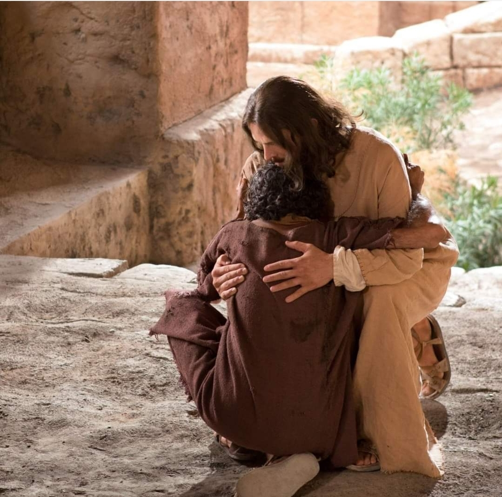
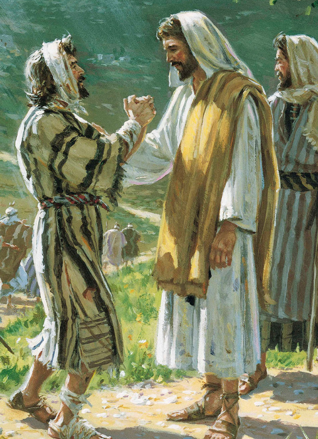
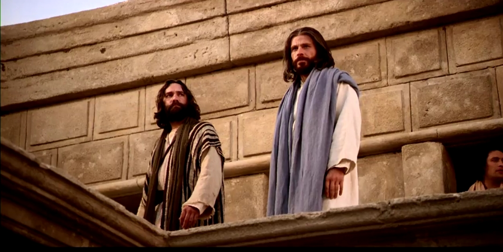
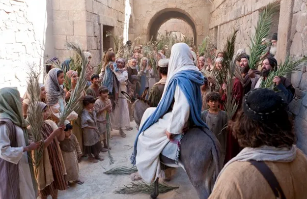
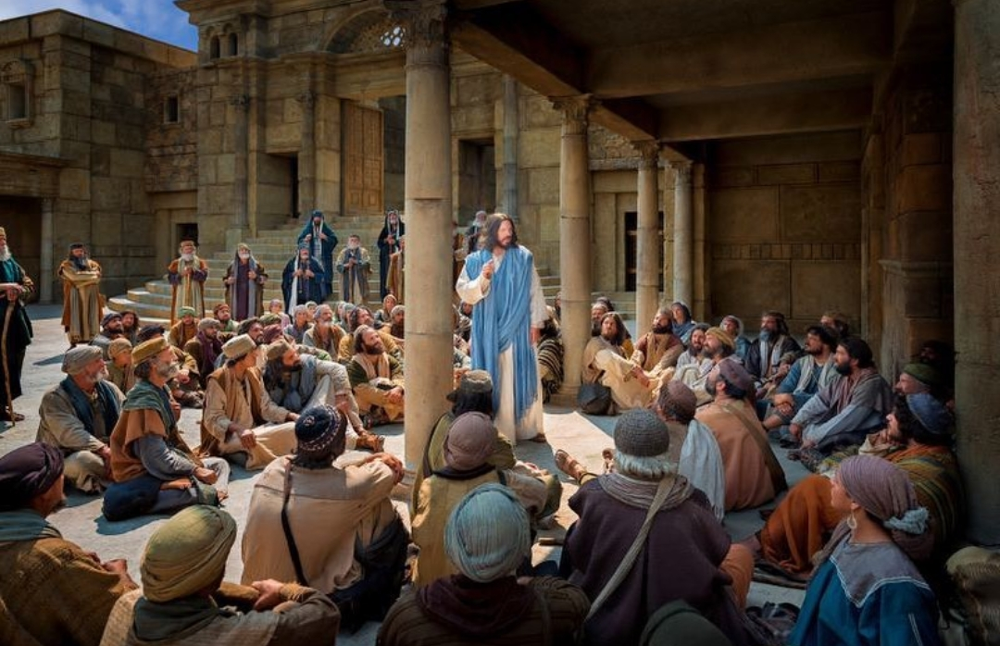

  

     
    

      <b>John 요2:1, JST2:1 그 주간의 셋째날에 갈릴리 가나에 결혼식이 있어 예수의 어머니가 그곳에 있었고 
      </b>
    

     
    
And on the third day of the week, there was a marriage in Cana of Galilee; and the mother of Jesus was there. 
    

     
    

      <b>John 요2:2, JST2:2 예수와 그의 제자들이 결혼식에 초청 받았더라 
      </b>
    

     
    
And Jesus was called, and his disciples, to the marriage. 
    
         
  

  

    
  

---

  

     
    

      <b>John요2:3, JST2:3 포도주가 떨어지매 그의 어머니가 그에게 이르되 포도주가 없다하므로 
      </b>
    

     
    
And when they wanted wine, his mother said unto him, They have no wine. 
    

     
    

      <b>John 요2:4, JST2:4 예수가 이르되 여자여 내가 당신을 위해 어떻게 하기를 원하나이까 그것을 행하리니 아직 나의 때가 이르지 않았나이다 하매 
      </b>
    

     
    
Jesus said unto her, Woman, what wilt thou have me to do for thee? that will I do; for mine hour is not yet come. 
    
         
  

  

    
  

---

  

     
    

      <b>John 요2:5, JST2:5 그의 어머니가 종들에게 이르되 그가 너희에게 이르는 것은 무엇이든 그대로 행하라 하더라 
      </b>
    

     
    
His mother said unto the servants, Whatsoever he saith unto you, see that ye do it. 
    

     
    

      <b>John요2:6, JST2:6 그곳에 유대인의 정결하게 하는 방식에 따라 제각기 두 세 통 들어가는 돌 항아리 여섯 개가 세워져 있는지라 
      </b>
    

     
    
There were set there six waterpots of stone, after the manner of the purifying of the Jews, containing two or three firkins apiece. 
    
         
  

  

    
  

---

  

     
    

      <b>John요2:7, JST2:7 예수가 그들에게 이르되 항아리를 물로 채우라 하니 그들이 그것을 가장자리까지 채우매 
      </b>
    

     
    
Jesus said unto them, Fill the waterpots with water. And they filled them up to the brim. 
    

     
    

      <b>John 요2:8, JST2:8 그가 이르되 이제는 떠서 잔치 감독자에게 가져가라 하니 그들이 그에게 가져가더라 
      </b>
    

     
    
And he said, Draw out now, and bear unto the governor of the feast. And they bare unto him. 
    
         
  

  

    
  

---

  

     
    

      <b>John 요2:9, JST2:9 잔치 감독자가 포도주가 된 물을 맛보더니 (그는 그것이 어디서 났는지 몰랐으되 물을 떠간 종들은 알았더라 ) 그 감독자가 신랑을 불러 
      </b>
    

     
    
When the governor of the feast had tasted the water which was made wine , (he knew not whence it was, but the servants who drew the water knew,) the governor of the feast called the bridegroom, 
    

     
    

      <b>
      </b>
    

     
    

    
         
  

  

    
  

---

  

     
    

      <b>John요2:10, JST2:10 이르되 사람마다 시작할 때는 좋은 포도주를 내오고 실컷 마신 후에는 그보다 나쁜 것을 내오는데 너는 지금까지 좋은 포도주를 보관하고 있도다 하더라 
      </b>
    

     
    
And said unto him, Every man at the beginning doth set forth good wine; and when men have well drunk; then that which is worse; but thou hast kept the good wine until now. 
    

     
    

      <b>
      </b>
    

     
    

    
         
  

  

    
  

---

  

     
    

      <b>John 요2:11, JST2:11 예수가 이 처음 기적을 갈릴리 가나에서 행하여 그의 영광을 나타내니 그를 믿는 제자들의 신앙이 더욱 강해지더라 
      </b>
    

     
    
This beginning of miracles did Jesus in Cana of Galilee, and manifested forth his glory; and the faith of his disciples was strengthened in him. 
    

     
    

      <b>
      </b>
    

     
    

    
         
  

  

    
  

---

  

     
    

      <b>John요2:12 이후에 그가 자기 어머니와 형제들과 제자들과 함께 가버나움으로 내려가되 계속해서 그곳에 여러날 머물지는 않더라 
      </b>
    

     
    
After this he went down to Capernaum, he, and his mother, and his brethren, and his disciples; and they continued there not many days. 
    

     
    

      <b>John요2:13 유대인의 유월절이 가까워 예수가 예루살렘으로 올라가더니 
      </b>
    

     
    
And the Jews' passover was at hand, and Jesus went up to Jerusalem, 
    
         
  

  

    
  

---

  

     
    

      <b>John 요2:14, JST2:14 성전안에서 소와 양과 비둘기 파는 자들과 돈 바꾸는 자들이 앉아있는 것을 보고 
      </b>
    

     
    
And found in the temple those who sold oxen, and sheep, and doves, and the changers of money sitting. 
    

     
    

      <b>
      </b>
    

     
    

    
         
  

  

    
  

---

  

     
    

      <b>John요2:15 노끈으로 채찍을 만들어 양과 소와 함께 그들을 모두 성전 밖으로 쫓아내고 돈 바꾸는 자의 돈을 쏟아 버리고 상을 둘러 엎으며 
      </b>
    

     
    
And when he had made a scourge of small cords, he drove them all out of the temple, and the sheep, and the oxen; and poured out the changers' money, and overthrew the tables; 
    

     
    

      <b>
      </b>
    

     
    

    
         
  

  

    
  

---

  

     
    
John 요2:16, JST2:16 비둘기 파는 자들에게 이르되 이것을 여기서 가져가고 나의 아버지의 집을 장사하는 집으로 만들지 말라하매 
      </b>
    

     
    
And said unto them who sold doves, Take these things hence; make not my Father's house a house of merchan dise. 
    

     
    

      <b>John 요2:17 기록된바 당신의 집에 관한 열의가 나를 삼켰나이다 한것을 그의 제자들이 기억하더라 
      </b>
    

     
    
And his disciples remembered that it was written, The zeal of thy house hath eaten me up. 
    
         
  

  

    
  

---

  

     
    

      <b>John요2:18, JST2:18 그때 유대인들이 그에게 말하여 이르되 너가 이런일을 하는 것에 관해 우리에게 무슨 표적을 보여주겠느냐 하는지라 
      </b>
    

     
    
Then spake the Jews and said unto him, What sign showest thou unto us, seeing thou doest these things? 
    

     
    

      <b>John요2:19 예수가 그들에게 대답하여 이르되 이성전을 허물라 내가 삼일 만에 그것을 일으키리라 하니 
      </b>
    

     
    
Jesus answered and said unto them, Destroy this temple, and in three days I will raise it up. 
    
         
  

  

    
  

---

  

     
    

      <b>John 요2:20 유대인들이 이르되 이 성전은 사십육년 동안 지었거늘 너가 삼일 만에 일으키겠느냐 하더라 
      </b>
    

     
    
Then said the Jews, Forty and six years was this temple in building, and wilt thou rear it up, in three days? 
    

     
    

      <b>John 요2:21 그러나 그는 자기 몸의 성전에 관해 말한 것이라 
      </b>
    

     
    
But he spake of the temple of his body. 
    
         
  

  

    
  

---

  

     
    

      <b>John요2:22, JST2:22 그러므로 그가 죽음으로부터 살아났을때 그의 제자들은 그가 이렇게 말한 것을 기억했으며 경전의 말씀과 예수가 그들에게 한 말을 기억하더라 
      </b>
    

     
    
When therefore he was risen from the dead, his disciples remembered that he had said this unto them, and they remembered the scripture, and the word which Jesus had said unto them . 
    

     
    

      <b>
      </b>
    

     
    

    
         
  

  

    
  

---

  

     
    

      <b>John 요2:23, JST2:23 이제 유월절 명절에 그가 예루살렘에 있을 때 많은 사람이 그가 행한 기적을 보고 그의 이름을 믿었으나 
      </b>
    

     
    
Now when he was in Jerusalem, at the passover, on the feast day, many believed on his name, when they saw the miracles which he did. 
    

     
    

      <b>John요2:24, JST2:24 예수는 그들에게 자신을 의탁하지 않았나니 이는 그가 모든 것을 알았기 때문이요 
      </b>
    

     
    
But Jesus did not commit himself unto them, because he knew all things, 
    
         
  

  

    
  

---

  

     
    

      <b>John요2:25 사람에 관해서는 누구의 증언도 필요없었나니 이는 그가 사람속에 있는 것을 알았음이라 
      </b>
    

     
    
And needed not that any should testify of man; for he knew what was in man.
    

     
    

      <b>
      </b>
    

     
    

    
         
  

  

    
  

