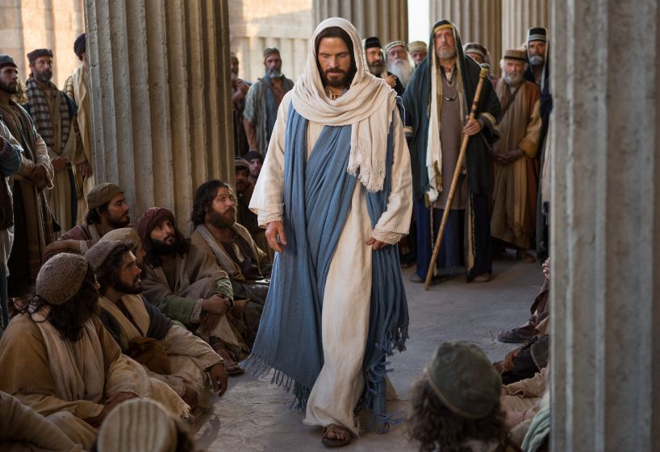

  

     
    

      <b>Luke 눅14:1 그리고 이렇게 되었나 니 그가 안식일에 어떤 바리새인 지도 자의 집에 음식을 먹으러 들어가매 사 람들이 그를 주목하 는데 
      </b>
    

     
    
And it came to pass, as he went into the house of one of the chief Phari -sees to eat bread on the Sabbath day, that they watched him. 
    

     
    

      <b>Luke 눅14:2, JST14:2 보라 수종병 에 걸린 어떤 사람이 그 앞에 있는지라 
      </b>
    

     
    
And, behold, there was a certain man before him, who had the dropsy. 
    
         
  

  

    
  

---

  

     
    

      <b>Luke 눅14:3, JST14:3 예수가 율법 사들과 바리새인 들에게 말하여 이르되 안식일에 병을 고치는 것이 적법하냐 하니 
      </b>
    

     
    
And Jesus spake unto the lawyers, and Pharisees, saying, Is it lawful to heal on the Sabbath day? 
    

     
    

      <b>Luke 눅14:4, JST14:4 그들이 잠잠 하더라 이에 그 사람을 데려다 고쳐 보 내고 
      </b>
    

     
    
And they held their peace. And he took the man , and healed him, and let him go; 
    
         
  

  

    
  

---

  

     
    

      <b>Luke 눅14:5, JST14:5 그들에게 다 시 말하여 이르되 너희 가운데 누가 나 귀나 소를 가졌는데 구덩이에 빠졌으면 안식일에도 곧바로 끌어내지 않겠느냐 하니 
      </b>
    

     
    
And spake unto them again , saying, Which of you shall have an ass or an ox fallen into a pit and will not straightway pull him out on the Sabbath day? 
    

     
    

      <b>Luke눅14:6, JST14:6 그들이 이것 에 대해 대답하지 못하더라 
      </b>
    

     
    
And they could not answer him to these things. 
    
         
  

  

    
  

---

  

     
    

      <b>Luke 눅14:7, JST14:7 또 그가 그들 에게 결혼식에 초대받은 사람들에 관한 비유를 말했나니 이는 그들이 어떻게 높은 자리를 선택하여 스스로 다른 사 람 위에 높이는지 를 그가 알았음 이라 그러므로 그가 그들에게 말하여 이르되 
      </b>
    

     
    
And he put forth a parable unto them concerning those who were bidden to a wedding; for he knew how they chose out the chief rooms, and ex alted themselves one above another; wherefore he spake unto them, saying, 
    

     
    

      <b>
      </b>
    

     
    

    
         
  

  

    
  

---

  

     
    

      <b>Luke 눅14:8, JST14:8 너희가 어떤 사람에게서 결혼 잔치에 초대받을 때에 는 높은 자리에 앉지 말라 그렇지 않으 면 너보다 존귀한 사람이 그에게서 초 대받을 것이요 
      </b>
    

     
    
When thou art bidden of any man to a wedding, sit not down in the highest room, lest a more honorable man than thou be bidden of him; 
    

     
    

      <b>
      </b>
    

     
    

    
         
  

  

    
  

---

  

     
    

      <b>Luke 눅14:9, JST14:9 너희를 초대 한 그가 더욱 존귀한 사람과 함께 와서 너희에게 이르되 이 사람에게 자리를 내어 주라 하면 너희는 부끄러워하며 가장 낮은 자리로 내려가리라 
      </b>
    

     
    
And he who bade thee, with him who is more honorable, come, and say to thee, Give this man place; and thou begin with shame to take the lowest room. 
    

     
    

      <b>
      </b>
    

     
    

    
         
  

  

    
  

---

  

     
    

      <b>Luke 눅14:10, JST14:10 그러나 너 희가 초대받 을 때 가장 낮은 자리로 가 서 앉으라 그리하면 너희를 초대한 그 가 와서 너희에게 이르되 친구여 더 높 이 올라가라 하리니 그때 너희는 함께 식사 자리에 앉은 사람들 앞에서 하나 님의 영광을 얻으리라 
      </b>
    

     
    
But when thou art bidden, go and sit down in the lowest room; that when he who bade thee, cometh, he may say unto thee, Friend, go up higher; then shalt thou have honor of God , in the presence of them who sit at mea t with thee. 
    

     
    

      <b>
      </b>
    

     
    

    
         
  

  

    
  

---

  

     
    

      <b>Luke 눅14:11, JST14:11 이는 누구 든지 자신을 높이는 자는 낮아질 것이 요 자신을 낮추는 자는 높아질 것임이 라 하더라 
      </b>
    

     
    
For whosoever exalteth himself shall be abased; and he who humbleth himself shall be exalted. 
    

     
    

      <b>
      </b>
    

     
    

    
         
  

  

    
  

---

  

     
    

      <b>Luke 눅14:12 , JST14:12 그러고 나 서 결혼 잔치에 초대하는 사람에 관해 서도 그가 이르되 너가 점심이나 저녁 을 베풀 때에는 그들이 다시 너를 초대 하여 갚음이 되지 않도록 너의 친구나 형제나 친척이나 부유한 이웃을 초대하 지 말라 
      </b>
    

     
    
Then said he also concerning him who bade to the wedding, When thou mak -est a dinner, or a supper, call not thy friends, nor thy brethren, neither thy kinsmen, nor rich neighbors; lest they also bid thee again, and a recompence be made thee. 
    

     
    

      <b>
      </b>
    

     
    

    
         
  

  

    
  

---

  

     
    

      <b>Luke 눅14:13 그러나 너가 잔치를 베풀 때에는 가난한 자와 불구자와 다 리 저는 자와 눈먼 자를 초대하라 
      </b>
    

     
    
But when thou makest a feast, call the poor, the maimed, the lame, the blind, 
    

     
    

      <b>Luke 눅14:14 그리하면 너가 축복받 으리니 이는 그들이 너에게 보답할 수 없으므로 의인의 부활 때 너가 보상받 을 것임이 라 하더라 
      </b>
    

     
    
And thou shalt be blessed; for they cannot recompense thee; for thou shalt be recompensed at the resur rection of the just. 
    
         
  

  

    
  

---

  

     
    

      <b>Luke 눅14:15, JST14:15 그와 함께 식사 자리에 앉은 자 하나가 이 말을 듣고 그에게 이르되 하나님의 왕국에서 음식을 먹을 자에게 복이 있나이다 하 매 
      </b>
    

     
    
And when one of them who sat at meat with him, heard these things, he said unto him, Blessed is he who shall eat bread in the kingdom of God. 
    

     
    

      <b>Luke 눅14:16 그가 이르되 어떤 사 람이 큰 만찬을 베풀고 많은 사람을 초 대했는데 
      </b>
    

     
    
Then said he unto him, A certain man made a great supper and bade many; 
    
         
  

  

    
  

---

  

     
    

      <b>Luke 눅14:17 , JST14:17 만찬 시간 에 종들을 보내어 초대받은 사람들에게 이제 모든 것이 준비되었으니 오라고 전하게 했으나 
      </b>
    

     
    
And sent his servants at supper time, to say to them who were bidden, Come, for all things are now ready. 
    

     
    

      <b>
      </b>
    

     
    

    
         
  

  

    
  

---

  

     
    

      <b>Luke 눅14:18 그들이 모두 한가지로 변명하기 시작하여 첫 번째 사람이 그 에게 이르되 내가 땅을 조금 사서 그것 을 보러 가야 하니 나를 양해하라 하고 
      </b>
    

     
    
And they all, with one consent, began to make excuse. The first said unto him, I have bought a piece of ground, and I must needs go and see it; I pray thee have me excused. 
    

     
    

      <b>
      </b>
    

     
    

    
         
  

  

    
  

---

  

     
    

      <b>Luke 눅14:19 다른 사람은 이르되 내가 소 다섯 겨리를 샀으매 그것들을 확인하러 가니 나를 양해하라 하고 
      </b>
    

     
    
And another said, I have bought five yoke of oxen, and I go to prove them; I pray thee have me excused. 
    

     
    

      <b>Luke 눅14:20, JST14:20 또 다른 사 람은 이르되 나는 결혼했으므로 갈 수 없노라 했느니 라 
      </b>
    

     
    
And another said, I have married a wife, therefore I cannot come. 
    
         
  

  

    
  

---

  

     
    

      <b>Luke 눅14:21, JST14:21 이에 그 종 이 돌아와 자기 주인에게 이 일을 알리 니 그 집의 주인이 분노하여 종들에게 이르되 성읍 거리와 골목으로 속히 나 가서 가난한 자와 불구자와 다리 저는 자와 눈먼 자를 이리로 데려오라 하매 
      </b>
    

     
    
So that servant came and showed his lord these things. Then the master of the house, being angry, said to his servants, Go out quickly into the streets and lanes of the city, and bring hither the poor, and the maimed, the halt and the blind. 
    

     
    

      <b>
      </b>
    

     
    

    
         
  

  

    
  

---

  

     
    

      <b>Luke 눅14:22 종이 이르되 주여 당 신이 명한 대로 했으되 아직도 자리가 있나이다 하는지라 
      </b>
    

     
    
And the servant said, Lord, it is done as thou hast commanded, and yet there is room. 
    

     
    

      <b>Luke 눅14:23, JST14:23 그 주인이 자기 종에게 이르되 큰길과 산울타리로 나가서 사람들을 강제로 들어오게 하여 나의 집을 채우라 
      </b>
    

     
    
The lord said unto his servant, Go out into the highways, and hedges, and compel them to come in, that my house may be filled; 
    
         
  

  

    
  

---

  

     
    

      <b>Luke 눅14:24, JST14:24 내가 너희 에게 이르노니 초대받았던 사람들 가운 데는 아무도 나의 만찬을 맛보지 못하 리라 했느니라 하더라 
      </b>
    

     
    
For I say unto you, That none of those men who were bidden, shall taste of my supper. 
    

     
    

      <b>Luke 눅14:25, JST14:25 그가 이 말 을 마치고 그곳을 떠나니 큰 무리가 함 께 가는지라 그가 돌이켜 그들에게 이 르기를 
      </b>
    

     
    
And when he had finished these sayings, he departed thence, and there went great multitudes with him, and he turned and said unto them, 
    
         
  

  

    
  

---

  

     
    

      <b>Luke 눅14:26 , JST14:26 누구든지 나에게 오려고 하되 자기 아버지와 어 머니와 아내와 자녀와 형제와 자매와 남편과 참으로 자기 생명까지도 미워하 지 않으면 또는 다른 말로 해서 나를 위해 자기 생명 버리기를 두려워하면 그는 나의 제자가 될 수 없고 
      </b>
    

     
    
If any man come to me, and hate not his father, and mother, and wi fe, and children, and brethren, and sisters, or husband , yea and his own life also; or in other words, is afraid to lay down his life for my sake, he cannot be my disciple. 
    

     
    

      <b>
      </b>
    

     
    

    
         
  

  

    
  

---

  

     
    

      <b>Luke 눅14:27 누구든지 자기 십자가 를 지지 않고 와서 나를 따르는 자도 나의 제자가 될 수 없느니라 
      </b>
    

     
    
And whosoever doth not bear his cross, and come after me, cann ot be my disciple. 
    

     
    

      <b>JST14:28 그러므로 너희는 이것을 너 의 마음속에 간직하여 내가 너희에게 가르치고 명하는 것을 행하기로 결심하 라 
      </b>
    

     
    
Wherefore, settle this in your hearts, that ye will do the things which I shall teach, and command you. 
    
         
  

  

    
  

---

  

     
    

      <b>Luke 눅14:28 , JST14:29 너희 가운 데 누가 망대를 지으려 하면 먼저 앉아 서 그의 일을 마치기에 충분한 돈이 있 는지 그 비용을 계산하지 않겠느냐 
      </b>
    

     
    
For which of you intending to build a tower, sitteth not down first, and counteth the cost, whether he have money to finish his work ? 
    

     
    

      <b>
      </b>
    

     
    

    
         
  

  

    
  

---

  

     
    

      <b>Luke 눅14:29 , JST14:30 그렇지 않 으면 불행하게도 그가 기초를 놓은 후 에 그의 일을 마치지 못하므로 지켜보 는 모든 사람이 그를 조롱하여 
      </b>
    

     
    
Lest, unhappily , after he has laid the foundation and is not able to finish his work, all who behold, begin to mock him, 
    

     
    

      <b>
      </b>
    

     
    

    
         
  

  

    
  

---

  

     
    

      <b>Luke 눅14:30 , JST14:31 이르되 이 사람이 짓기 시작했으나 마칠 수 없었 도다 하리라 했나니 그가 이렇게 이른 것은 누구든지 계속할 수 없다면 그를 따를 수 없음을 뜻함이라 또 이르되 
      </b>
    

     
    
Saying, This man began to build, and was not able to finish. And this he said, signifying there should not any man follow him, unless he was able to continue; saying, 
    

     
    

      <b>
      </b>
    

     
    

    
         
  

  

    
  

---

  

     
    

      <b>Luke 눅14:31 , JST14:32 어떤 왕이 다른 왕을 대적하여 싸우러 갈 때 먼저 앉아서 이만 명을 거느리고 자기를 대 적하여 오는 자를 만 명으로 상대할 수 있는지 논의하지 않겠느냐 
      </b>
    

     
    
Or what king, going to make war against another king, sit teth not down first, and consulteth whethe r he be able with ten thousand, to meet him who cometh against him with twenty thousand. 
    

     
    

      <b>
      </b>
    

     
    

    
         
  

  

    
  

---

  

     
    

      <b>Luke 눅14:32 그럴 수 없다면 상대 방이 아직 멀리 떨어져 있을 때 사신을 보내어 평화의 조건을 요청하리라 
      </b>
    

     
    
Or else, while the other is yet a great way off, he s endeth an embassage, and desireth conditions of peace. 
    

     
    

      <b>Luke 눅14:33 , JST14:34 이와 마찬 가지로 너희 가운데 누구든지 자기가 가진 모든 것을 버리지 않으면 그는 나 의 제자가 될 수 없느니라 하더라 
      </b>
    

     
    
So likewise, whosoever of you forsaketh not all that he hath he cannot be my disciple. 
    
         
  

  

    
  

---

  

     
    

      <b>JST14:35 그때 그들 가운데 어떤 사람 이 그에게 와서 이르되 선한 선생님 이 여 우리에게는 모세와 선지자 들이 있는 데 그들을 의지하여 살아가 는 자는 누 구든지 생명을 얻지 못하나이까 하매 
      </b>
    

     
    
Then certain of them came to him, saying, Good Master, we have Moses and the prophets, and whosoever shall live by them, shall he not have life? 
    

     
    

      <b>
      </b>
    

     
    

    
         
  

  

    
  

---

  

     
    

      <b>JST14:36 예수가 대답하여 이르되 너 희는 모세의 글도 모르고 선지자 들의 글도 모르는도다 너희가 그것들을 알았 다면 나를 믿었으리니 이는 이런 목적 으로 그것들이 기록되었음이라 내가 보 내진 것은 너희로 하여금 생명을 얻게 하려 함이니 그러므로 나는 그것을 좋 은 소금에 비유하리라 
      </b>
    

     
    
And Jesus answered, saying, Ye know not Moses, neither the prophets; for if ye had known them, ye would have believed o n me; for to this intent they were written. For I am sent that ye might have life. Therefore I will liken it unto salt which is good; 
    

     
    

      <b>
      </b>
    

     
    

    
         
  

  

    
  

---

  

     
    

      <b>Luke 눅14:34 , JST14:37 그러나 소 금이 그 맛을 잃으면 무엇으로 맛을 내 겠느냐 
      </b>
    

     
    
But if the salt has lost its savor, wherewith shall it be seasoned? 
    

     
    

      <b>
      </b>
    

     
    

    
         
  

  

    
  

---

  

     
    

      <b>Luke 눅14:35, JST14:38 그것은 땅 이나 거름에도 적합하지 않아서 사람들 이 그것을 밖에 던져버리느니라 들을 귀 있는 자는 들으라 했나니 그가 이것 들을 말한 것은 기록된 것들이 반드시 모두 성취될 것을 가리킴이라 
      </b>
    

     
    
It is neither fit for the land, nor yet for the dunghill; men cast it out. He who hath ears to hear, let him hear. These things he said, signifying that which was written, verily must all be fulfilled.
    

     
    

      <b>
      </b>
    

     
    

    
         
  

  

    
  

