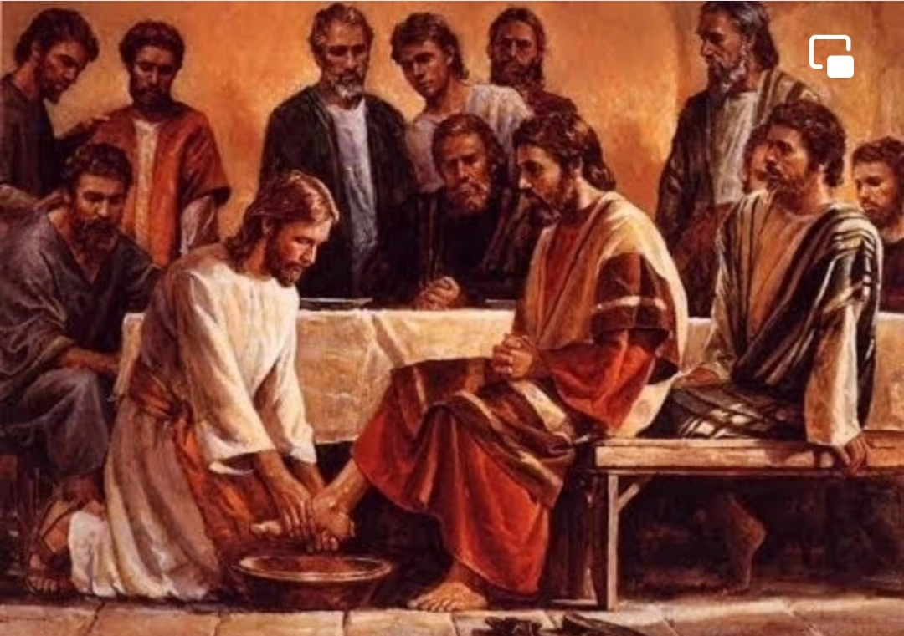

  

     
    

      <b>Luke 눅16:1, JST16:1 그가 또 제자 들에게 이르되 어떤 부자에게 청지기가 있는데 그 종이 그의 재산을 허비했다 는 고발이 들어오 므로 
      </b>
    

     
    
And he said also unto his disciples, There was a certain rich man who had a steward; and the same was accused unto him, that he had wasted his goods. 
    

     
    

      <b>
      </b>
    

     
    

    
         
  

  

    
  

---

  

     
    

      <b>Luke 눅16:2 그를 불러 이르되 내가 너에 관해 듣는 이것이 어찌 된 일이냐 너의 청지기 직무에 관해 보고하라 너 는 더 이상 청지기가 되지 못하리라 했 느니라 
      </b>
    

     
    
And he called him, and said unto him, How is it that I hear this of thee? Give an account of thy stewardship; for thou mayest be no longer steward. 
    

     
    

      <b>
      </b>
    

     
    

    
         
  

  

    
  

---

  

     
    

      <b>Luke 눅16:3 이에 그 청지기가 속으 로 이르되 나의 주인이 나로부터 청지 기 직분을 빼앗았으니 내가 무엇을 할 까 나는 땅을 팔 수도 없고 구걸하자니 부끄럽도다 
      </b>
    

     
    
Then the steward said within himself, What shall I do? For my lord taketh away from me the stewardship. I cannot dig; to beg I am ashamed. 
    

     
    

      <b>
      </b>
    

     
    

    
         
  

  

    
  

---

  

     
    

      <b>Luke 눅16:4 내가 청지기 직분에서 쫓겨날 때 사람들이 나를 자기 집으로 받아들이 도록 내가 무엇을 할지 결심했 노라 하고 
      </b>
    

     
    
I am resolved what to do, that, when I am put out of the stewardship, they may receive me into their houses. 
    

     
    

      <b>Luke 눅16:5, JST16:5 자기 주인에 게 빚진 자들을 모두 불러 첫 번째 사 람에게 이르되 너는 나의 주인에게 얼 마나 빚졌느냐 하니 
      </b>
    

     
    
So he called every one of his lord's debtors, and said unto the first, How much owest thou unto my lord? 
    
         
  

  

    
  

---

  

     
    

      <b>Luke 눅16:6 그가 이르되 기름 백말 이니이다 하매 그에게 이르되 너의 증 서를 가지고 빨리 앉아서 오십이라 쓰 라 하고 
      </b>
    

     
    
And he said, A hundred measures of oil. And he said unto him, Take thy bill, and sit down quickly, and write fifty. 
    

     
    

      <b>
      </b>
    

     
    

    
         
  

  

    
  

---

  

     
    

      <b>Luke 눅16:7 다른 사람에게 이르되 너는 얼마나 빚졌느냐 하니 그가 이르 되 밀 백석이니이다 하매 그에게 이르 되 너의 증서를 가지고 팔십이라 쓰라 했느니 라 
      </b>
    

     
    
Then said he to another, And how much owest thou? And he said, A hundred measures of wheat. And he said unto him, Take thy bill, and write fourscore. 
    

     
    

      <b>
      </b>
    

     
    

    
         
  

  

    
  

---

  

     
    

      <b>Luke 눅16:8, JST16:8 이에 주인은 그 불의한 청지기 가 지혜롭게 행했으므 로 그를 칭찬했나니 이는 이 세상의 자 녀가 자기 세대에는 빛의 자녀보다 지 혜로움이라 
      </b>
    

     
    
And the lord commended the unjust steward, because he had done wisely; for the children of this world are wiser in their generation , than the children of light. 
    

     
    

      <b>
      </b>
    

     
    

    
         
  

  

    
  

---

  

     
    

      <b>Luke 눅16:9 내가 너희에게 이르노 니 불의의 재물로 너희 자신을 위한 친 구를 만들어 너희가 죽을 때 그들이 너 희를 영원한 처소로 받아들이 게 하라 
      </b>
    

     
    
And I say unto you, Make to yourselves friends, of the mammon of unrighteousness; that when ye fail, they may receive you into everlasting habitations. 
    

     
    

      <b>
      </b>
    

     
    

    
         
  

  

    
  

---

  

     
    

      <b>Luke 눅16:10, JST16:10 지극히 작 은 일에 신실한 자는 큰 일에도 신실하 고 지극히 작은 일에 불의한 자는 큰 일에도 불의하느니라 
      </b>
    

     
    
He who is faithful in that which is least, is faithful also in much; and he who is unjust in the least, is also unjust in much. 
    

     
    

      <b>
      </b>
    

     
    

    
         
  

  

    
  

---

  

     
    

      <b>Luke 눅16:11 그러므로 너희가 불의 의 재물에 신실하지 않으면 누가 너희 를 신뢰하여 참된 재물을 맡기겠느냐 
      </b>
    

     
    
If therefore ye have not been faithful in the unrighteous mammon, who will commit to your trust the true riches? 
    

     
    

      <b>Luke 눅16:12, JST16:12 또 너희가 다른 사람의 것에 신실하지 않으면 누 가 너희에게 너희 것을 주겠느냐 
      </b>
    

     
    
And if ye have not been faithful in that which is another man's, who shall give unto you that which is your own? 
    
         
  

  

    
  

---

  

     
    

      <b>Luke 눅16:13 아무 종도 두 주인을 섬길 수 없나니 이는 그가 한쪽을 미워 하고 다른 쪽을 사랑하거나 그렇지 않 으면 한쪽을 중시하고 다른 쪽을 멸시 할 것임이라 너희는 하나님과 재물을 겸하여 섬길 수 없느니라 하매 
      </b>
    

     
    
No servant can serve two masters; for either he will hate the one, and love the other; or else he will hold to the one, and despise the other. Ye cannot serve God and mammon. 
    

     
    

      <b>
      </b>
    

     
    

    
         
  

  

    
  

---

  

     
    

      <b>Luke 눅16:14 바리새인 들은 탐욕스 러운 자들이라 이 모든 것을 듣고 그를 비웃더라 
      </b>
    

     
    
And the Pharisees also who were covetous, heard all these things; and they derided him. 
    

     
    

      <b>
      </b>
    

     
    

    
         
  

  

    
  

---

  

     
    

      <b>Luke 눅16:15 , JST16:15 이에 그가 그들에게 이르되 너희는 사람들 앞에 스스로 의롭다 하는 자들이 지만 하나님 은 너희 마음을 아나니 사람들 가운데 높임 받는 것은 하나님 이 보기에 가증 함이니라 하매 
      </b>
    

     
    
And he said unto them, Ye are they who justify yourselves before men; but God knoweth your hearts; for that which is highly esteemed among men, is an abomination in the sight of God. 
    

     
    

      <b>
      </b>
    

     
    

    
         
  

  

    
  

---

  

     
    

      <b>JST16:16 그들이 이르되 우리에게는 율법과 선지자 들이 있느니라 그러나 이 사람에 관해서 는 우리가 그를 우리의 통치자로 받아들이지 않으리니 이는 그 가 스스로 우리를 다스리는 재판관이 되려 함이라 하는지라 
      </b>
    

     
    
And they said unto him, We have the law, and the prophets; but as for this man we will not receive him to be our ruler; for he maketh himself to be a judge over us. 
    

     
    

      <b>
      </b>
    

     
    

    
         
  

  

    
  

---

  

     
    

      <b>Luke 눅16:16 , JST16:17 예수가 그 들에게 이르되 율법과 선지자 들은 나를 증언하나니 참으로 요한의 때까지 기록 했던 모든 선지자는 이 시대를 예언했 느니라 
      </b>
    

     
    
Then said Jesus unto them, The law and the prophets testify of me; yea, and all the prophets who have written, even until John, have foretold of these days. 
    

     
    

      <b>
      </b>
    

     
    

    
         
  

  

    
  

---

  

     
    

      <b>JST16:18 그때 이래로 하나님의 왕국 이 전파되어 진리를 찾는 사람마다 그 리로 밀려들어 가나니 
      </b>
    

     
    
Since that time, the kingdom of God is preached, and every man who seeketh truth presseth into it. 
    

     
    

      <b>Luke 눅16:17 율법의 한 획이 없어 지는 것보다 하늘과 땅이 없어지는 것 이 더 쉬우니라 
      </b>
    

     
    
And it is easier for heaven and earth to pass, than for one tittle of the law to fail. 
    
         
  

  

    
  

---

  

     
    

      <b>JST16:20 너희는 어찌하여 율법을 가 르치면서 기록된 것을 부인하며 너희 모두가 대속 받게 하려고 율법을 성취 하기 위해 아버지가 보낸 자를 정죄하 느냐 
      </b>
    

     
    
And why teach ye the law, and deny that which is written; and condemn him whom the Father hath s ent to fulfill the law, that ye might all be redeemed? 
    

     
    

      <b>
      </b>
    

     
    

    
         
  

  

    
  

---

  

     
    

      <b>JST16:21 오 어리석은 자들아 너희는 마음속으로 이르기를 하나님은 없다 하 며 바른길을 굽게 하니 하늘 왕국이 너 희에게 폭력을 당하는도다 너희는 온유 한 자를 박해하 고 폭력으로 왕국을 무 너뜨리 기를 구하며 왕국의 자녀를 강제 로 빼앗는도다 너희에게 화 있도다 간 음한 자들아 하매 
      </b>
    

     
    
O fools! for you have said in your hearts, There is no God. And you per vert the right way; and the kingdom of heaven suffereth violence of you; and you persecute the meek; and in your violence you seek to destroy the kingdom; and ye take the children of the kingdom by force. Woe unto you, ye adulterers! 
    

     
    

      <b>
      </b>
    

     
    

    
         
  

  

    
  

---

  

     
    

      <b>JST16:22 자기들을 간음한 자라 한 말 로 인해 분노한 그들이 다시 그를 욕하 더라 
      </b>
    

     
    
And they reviled him again, being angry for the sayi ng, that they were adulterers. 
    

     
    

      <b>
      </b>
    

     
    

    
         
  

  

    
  

---

  

     
    

      <b>Luke 눅16:18 , JST16:23 그러나 그 가 계속하여 이르되 누구든지 아내를 버리고 다른 이와 결혼하 는 자는 간음 을 범하는 것이요 누구든지 남편으로부 터 버림받은 여자와 결혼하 는 자도 간 음을 범하는 것이라 진실로 내가 너희 에게 이르노니 나는 너희를 부자에 비 유하리라 
      </b>
    

     
    
But he continued, saying, Whosoever putteth away his wife, and marrieth another, committeth adultery; and whosoever marrieth her who is put away from her husband, committeth adultery. Verily I say unto you, I will liken you unto the rich man. 
    

     
    

      <b>
      </b>
    

     
    

    
         
  

  

    
  

---

  

     
    

      <b>Luke 눅16:19 , JST16:24 어떤 부자 가 있더니 그는 자색 옷과 세마포 옷을 입고 매일 호사스럽 게 즐겼으며 
      </b>
    

     
    
For there was a certain rich man, who was clothed in purple, and fi ne linen, and fared sumptuously every day. 
    

     
    

      <b>Luke 눅16:20, JST 16:25 또 나사로 라 하는 어떤 거지가 있더니 그는 온몸 이 헌데로 가득하여 그의 문 앞에 누워 서 
      </b>
    

     
    
And there was a certain beggar named Lazarus, who was laid at his gate, full of sores, 
    
         
  

  

    
  

---

  

     
    

      <b>Luke 눅16:21 그 부자의 상에서 떨 어지는 부스러기로 배를 채우려 했으며 개들도 와서 그의 헌데를 핥았느니 라 
      </b>
    

     
    
And desiring to be fed with the crumbs which fell fr om the rich man's table; moreover the dogs came and licked his sores. 
    

     
    

      <b>
      </b>
    

     
    

    
         
  

  

    
  

---

  

     
    

      <b>Luke 눅16:22, JST16:27 그리고 이 렇게 되었나니 거지가 죽어 천사들에게 이끌려 아브라함의 품 안에 안겼고 부 자도 죽어 묻혔는데 
      </b>
    

     
    
And it came to pass, that the beggar died, and was carried of the angels into Abraham's bos om. The rich man also died, and was buried. 
    

     
    

      <b>
      </b>
    

     
    

    
         
  

  

    
  

---

  

     
    

      <b>Luke 눅16:23, JST16:28 그는 지옥 에서 고통 가운데 눈을 들어 멀리 아브 라함과 그의 품 안에 있는 나사로를 보 고 
      </b>
    

     
    
And in hell he lifted up his eyes, being in torments, and saw Abraham afar off, and Lazarus in his bosom. 
    

     
    

      <b>
      </b>
    

     
    

    
         
  

  

    
  

---

  

     
    

      <b>Luke 눅16:24 부르짖어 이르되 아버 지 아브라함이여 나에게 자비를 베푸소 서 나사로를 보내어 그의 손가락 끝에 물을 찍어 나의 혀를 서늘하 게 하소서 내가 이 불꽃 속에서 고통받 나이다 했 느니라 
      </b>
    

     
    
And he cried, and said, Father Abra ham, have mercy on me, and send Lazarus that he may dip the tip of his finger in water, and cool my tongue; for I am tormented in this flame. 
    

     
    

      <b>
      </b>
    

     
    

    
         
  

  

    
  

---

  

     
    

      <b>Luke 눅16:25 그러나 아브라함이 이 르되 아들아 너는 너의 생애 동안 좋은 것을 받았고 나사로는 나쁜 것을 받은 것을 기억하라 그러나 이제 그는 위로 받고 너는 고통받느니라 
      </b>
    

     
    
But Abraham said, Son, remember that thou in thy lifetime receivedst thy good things, and likewise Lazarus, evil things; but now he is comforted, and thou art tormented. 
    

     
    

      <b>
      </b>
    

     
    

    
         
  

  

    
  

---

  

     
    

      <b>Luke 눅16:26, JST16:31 이 모든 것 외에도 우리와 너 사이에는 큰 심연이 놓여 있어 이곳으 로부터 너에게 건너가 려 해도 할 수 없고 그곳으 로부터 우리 에게 오려 해도 건널 수 없느니라 하매 
      </b>
    

     
    
And besides all this, between us and you, there is a great gulf fixed; so that they who would pass from hence to you, cannot; neither can they pass to us that would come from thence. 
    

     
    

      <b>
      </b>
    

     
    

    
         
  

  

    
  

---

  

     
    

      <b>Luke 눅16:27 그가 이르되 그러면 아버지여 내가 당신께 간구하오 니 그를 나의 아버지 의 집에 보내소서 
      </b>
    

     
    
Then he said, I pray thee therefore, father, that thou wouldest send him to my father's house, 
    

     
    

      <b>Luke 눅16:28 나에게 다섯 형제가 있으니 그가 그들에게 증언하여 그들 또한 이 고통의 장소에 들어오지 않게 하소서 했느니라 
      </b>
    

     
    
For I have five brethren, that he may testify unto them, lest they also come into this place of torment. 
    
         
  

  

    
  

---

  

     
    

      <b>Luke 눅16:29 이에 아브라함이 그에 게 이르되 그들에게 는 모세와 선지자 들 이 있으니 그들로 하여금 저들의 말을 듣게 하라 하매 
      </b>
    

     
    
Abraham said unto him, They have Moses and the prophets; let them hear them. 
    

     
    

      <b>Luke 눅16:30 그가 이르되 아버지 아브라함이여 그렇지 않나이다 한 사람 이 죽음으로부터 살아나 그들에게 가면 그들이 회개하리이다 하는지라 
      </b>
    

     
    
And he said, Nay, father Abraham; but if one went unto them from the dead, they will repent. 
    
         
  

  

    
  

---

  

     
    

      <b>Luke 눅16:31, JST16:36 그가 이르 되 그들이 모세와 선지자 들의 말을 듣 지 않으면 한 사람이 죽음으로부터 살 아난다 해도 그들은 설득되지 않으리라 했느니라 하더라 
      </b>
    

     
    
And he said unto him, If they hear not Moses and the prophets, neither will they be persuaded, though one should rise from the dead.
    

     
    

      <b>
      </b>
    

     
    

    
         
  

  

    
  

