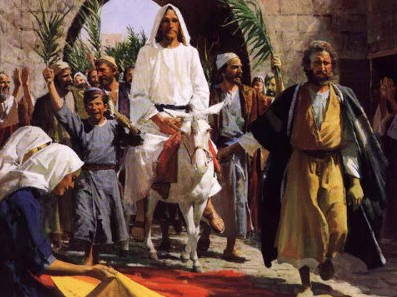

  

     
    

      <b>Luke 눅17:1, JST17:1 그때 그가 제 자들에게 이르되 실족하는 것들이 올 수밖에 없으나 그를 통해 그것들이 오 는 그 사람에게 화 있나니 
      </b>
    

     
    
Then said he unto the disciples, It is impossible but that offenses will come; but woe to him through whom they come. 
    

     
    

      <b>
      </b>
    

     
    

    
         
  

  

    
  

---

  

     
    

      <b>Luke 눅17:2 그가 이 어린아이 들 가 운데 하나를 실족하 게 하는 것보다는 차라리 연자 맷돌이 그의 목에 달린 채 바다에 던져지는 것이 그에게 더 나았 으리라 
      </b>
    

     
    
It were better for him that a millstone were hanged about his neck, and he cast into the sea, than that he should offend one of these little ones. 
    

     
    

      <b>
      </b>
    

     
    

    
         
  

  

    
  

---

  

     
    

      <b>Luke 눅17:3, JST17:3 너는 스스로 조심하라 너의 형제가 너에게 잘못하면 그를 꾸짖고 그가 회개하 면 용서하라 
      </b>
    

     
    
Take heed to yourselves. If your brother trespass against you, rebuke him; and if he repent, forgive him. 
    

     
    

      <b>
      </b>
    

     
    

    
         
  

  

    
  

---

  

     
    

      <b>Luke 눅17:4, JST17:4 그가 너에게 하루에 일곱 번 잘못하 고 하루에 일곱 번 너에게 다시 돌아와 이르기를 회개 하노라 하면 너는 그를 용서하라 하니 
      </b>
    

     
    
And if he trespass against you seven times in a day, and seven times in a day turn to you again , saying, I repent; you shall forgive him. 
    

     
    

      <b>Luke 눅17:5, JST17:5 사도들이 그 에게 이르되 주여 우리의 신앙을 크게 하소서 하더라 
      </b>
    

     
    
And the apostles said unto him, Lord, increase our faith. 
    
         
  

  

    
  

---

  

     
    

      <b>Luke 눅17:6, JST17:6 이에 주가 이 르되 너희에게 겨자씨 한 알 만큼의 신 앙이 있다면 이 뽕나무에게 이르되 뿌 리째 뽑혀서 바다에 심기우라 해도 그 것이 너희에게 순종하리라 
      </b>
    

     
    
And the Lord said, If you had faith as a grain of mustard seed, you might say unto this sycamore tree, Be thou plucked up by the roots, and be thou planted in the sea; and it should obey you. 
    

     
    

      <b>
      </b>
    

     
    

    
         
  

  

    
  

---

  

     
    

      <b>Luke 눅17:7, JST17:7 그러나 너희 가운데 누구에게 밭을 갈거나 양을 치 는 종이 있는데 그가 밭으로부터 돌아 오면 가서 앉아 먹으라 하겠느냐 
      </b>
    

     
    
But who of you, having a servant plowing, or feeding cattle, will say unto him when he is come from the field, Go and sit down to meat? 
    

     
    

      <b>
      </b>
    

     
    

    
         
  

  

    
  

---

  

     
    

      <b>Luke 눅17:8, JST17:8 오히려 그에 게 이르되 나의 저녁 식사를 준비하고 띠를 띠고 내가 먹고 마실 때까지 시중 하라 그러고 나서 너는 나중에 먹고 마 시라 하지 않겠느냐 
      </b>
    

     
    
Will he not rather say unto him, Make ready wherewith I may sup, and gird yourself and serve me till I have eaten and drunken; and afterward, by and by, you shalt eat and drink? 
    

     
    

      <b>
      </b>
    

     
    

    
         
  

  

    
  

---

  

     
    

      <b>Luke 눅17:9, JST17:9 그가 명받은 일을 했다고 그 종에게 감사하느냐 내 가 너희에게 이르노니 아니니라 
      </b>
    

     
    
Doth he thank that servant because he doeth the things which were comm anded him? I say unto you, Nay. 
    

     
    

      <b>
      </b>
    

     
    

    
         
  

  

    
  

---

  

     
    

      <b>Luke 눅17:10, JST17:10 이와 마찬 가지로 너희도 명받은 모든 일을 하고 이르기를 우리는 무익한 종이라 우리가 해야 할 의무를 한 것에 지나지 않는다 하라 하더라 
      </b>
    

     
    
So likewise ye, when ye shall have done all those things which are com manded you, say, We are unprofitable servants. We have done that which was no more than our duty to do. 
    

     
    

      <b>
      </b>
    

     
    

    
         
  

  

    
  

---

  

     
    

      <b>Luke 눅17:11, JST17:11 그것이 이 렇게 되었나니 그가 예루살렘으로 갈 때 갈릴리와 사마리아 를 통과하여 지나 가다가 
      </b>
    

     
    
It came to pass, as he went to Jerusalem, that he passed through the midst of Galilee and Samaria. 
    

     
    

      <b>Luke 눅17:12, JST17:12 어느 마을 에 들어가니 멀리 서 있는 문둥병자 열 명을 만났는데 
      </b>
    

     
    
And as he entered into a certain village, there met him ten men who were lepers, who stood afar off; 
    
         
  

  

    
  

---

  

     
    

      <b>Luke 눅17:13 그들이 음성을 높여 이르되 예수 선생님 이여 우리에게 자비 를 베푸소 서 하는지라 
      </b>
    

     
    
And they lifted up their voices, and said, Jesus, Master, have mercy on us. 
    

     
    

      <b>Luke 눅17:14, JST17:14 그가 이르 되 제사장들에게 가서 너희를 보이라 하더라 그리고 이렇게 되었나니 그들이 가다가 정결하게 되매 
      </b>
    

     
    
And he said unto them, Go show yourselves unto the priests. And it came to pass, as they went, they were cleansed. 
    
         
  

  

    
  

---

  

     
    

      <b>Luke 눅17:15 그들 가운데 하나가 자기가 나은 것을 보고 큰소리 로 하나 님께 영광을 돌리며 돌아와 
      </b>
    

     
    
One of them, when he saw he was healed, turned back, and with a loud voice glorified God, 
    

     
    

      <b>Luke 눅17:16, JST17:16 예수의 발 앞에 엎드려 감사드렸나니 그는 사마리 아인이더라 
      </b>
    

     
    
And fell down on his face at Jesus' feet, giving him thanks; and he was a Samaritan. 
    
         
  

  

    
  

---

  

     
    

      <b>Luke 눅17:17 이에 예수가 대답하여 이르되 정결함 을 받은 자가 열 명이 아 니더냐 그런데 아홉은 어디 있느냐 
      </b>
    

     
    
And Jesus answering, said, Were there not ten cleansed? But where are the nine? 
    

     
    

      <b>Luke 눅17:18 이 타국인 외에는 하 나님께 영광을 돌리러 돌아온 사람이 없도다 하고 
      </b>
    

     
    
There are not found that returned to give glory to God, save this stranger. 
    
         
  

  

    
  

---

  

     
    

      <b>Luke 눅17:19 그에게 이르되 일어나 너의 길을 가라 너의 신앙이 너를 온전 하게 했느니라 하더라 
      </b>
    

     
    
And he said unto him, Arise, go thy way; thy faith hath made thee whole. 
    

     
    

      <b>Luke 눅17:20 바리새인 들이 그에게 묻기를 하나님의 왕국이 언제 임하느냐 하매 그가 대답하여 이르되 하나님의 왕국은 눈에 띄게 임하는 것이 아니요 
      </b>
    

     
    
And when he was demanded of the Pharisees, when the kingdom of God should come, he answered them, and said, The kingdom of God cometh not with observation; 
    
         
  

  

    
  

---

  

     
    

      <b>Luke 눅17:21 , JST17:21 사람들이 이르기를 여기를 보라 저기를 보라 하 지도 못하리니 보라 하나님의 왕국은 이미 너희에게 임했느니라 하고 
      </b>
    

     
    
Neither shall they say, Lo, here! or, Lo, there! For, behold, the kingdom of God has already come unto you. 
    

     
    

      <b>
      </b>
    

     
    

    
         
  

  

    
  

---

  

     
    

      <b>Luke 눅17:22, JST17:22 제자들에게 이르되 사람들이 인자의 날 가운데 하 루를 보기 원하나 그들이 그것을 보지 못하는 날이 오리라 
      </b>
    

     
    
And he said unto the disciples, The days will come, when they will desire to see one of the days of the Son of man, and they shall not see it. 
    

     
    

      <b>
      </b>
    

     
    

    
         
  

  

    
  

---

  

     
    

      <b>Luke 눅17:23, JST17:23 그들이 너 희에게 이르되 여기를 보라 저기를 보 라 해도 그들을 쫓아가 지 말고 그들을 따르지도 말라 
      </b>
    

     
    
And if they shall say to you, See here! or, See there! Go not after them, nor follow them. 
    

     
    

      <b>
      </b>
    

     
    

    
         
  

  

    
  

---

  

     
    

      <b>Luke 눅17:24, JST17:24 이는 아침 빛이 하늘 아래 한쪽에서 비추어 하늘 아래 다른 쪽까지 밝히는 것처럼 인자 도 그의 날에 그러할 것임이 라 
      </b>
    

     
    
For as the light of the morning , that shineth out of the one part under heaven, and lighteneth to the other part under heaven; so shall also the Son of man be in his day. 
    

     
    

      <b>
      </b>
    

     
    

    
         
  

  

    
  

---

  

     
    

      <b>Luke 눅17:25, JST17:25 그러나 먼 저 그가 반드시 많은 고난을 겪고 이 세대에 게서 배척당해 야 하리라 
      </b>
    

     
    
But first he must suffer many things, and be rejected of this generation. 
    

     
    

      <b>Luke 눅17:26 노아의 시대에 그랬던 것처럼 인자의 날에도 그러하리니 
      </b>
    

     
    
And as it was in the days of Noe; so shall it be also in the days of the Son of man. 
    
         
  

  

    
  

---

  

     
    

      <b>Luke 눅17:27 노아가 방주에 들어가 는 그날까지 그들이 먹고 마시고 장가 들고 시집가되 홍수가 나서 그들을 모 두 멸했느니라 
      </b>
    

     
    
They did eat, they drank, they married wives, they were given in marriage, until the day that Noe entered into the ark, and the flood came, and dest royed them all. 
    

     
    

      <b>
      </b>
    

     
    

    
         
  

  

    
  

---

  

     
    

      <b>Luke 눅17:28 또 롯의 날과도 같으 니 그들이 먹고 마시고 사고 팔고 심고 지었으되 
      </b>
    

     
    
Likewise also as it was in the days of Lot; they did eat, they drank, they bought, they sold, they planted, they builded; 
    

     
    

      <b>Luke 눅17:29 롯이 소돔에서 나가던 날에 하늘로부터 불과 유황이 비 오듯 하여 그들을 모두 멸했느니라 
      </b>
    

     
    
But the same day that Lot went out of Sodom, it rained fire and brimstone from heaven, and destroyed them all. 
    
         
  

  

    
  

---

  

     
    

      <b>Luke 눅17:30 인자가 나타나는 그날 에도 그렇게 되리니 
      </b>
    

     
    
Even thus shall it be in the day when the Son of man is revealed. 
    

     
    

      <b>Luke 눅17:31 , JST17:31 그날에 지 붕 위에 있는 제자는 집안에 물건이 있 어도 그것을 가지러 내려오 지 말고 밭 에 있는 자도 돌아가 지 말라 
      </b>
    

     
    
In that day , the disciple who shall be on the housetop, and his stuff in the house, let him not come down to take it away; and he who is in the field, let him likewise not return back. 
    
         
  

  

    
  

---

  

     
    

      <b>Luke 눅17:32 롯의 아내를 기억하라 Rememb
      </b>
    

     
    
er Lot's wife. 
    

     
    

      <b>Luke 눅17:33 누구든지 자기 생명을 구하려 하는 자는 그것을 잃을 것이요 누구든지 자기 생명을 버리는 자는 그 것을 보존하리라 
      </b>
    

     
    
Whosoever shall seek to save his life, shall lose it; and whosoever shall lose his life, shall preserve it. 
    
         
  

  

    
  

---

  

     
    

      <b>Luke 눅17:34, JST17:34 내가 너희 에게 말하노니 그 밤에 둘이 한 침상에 있다가 하나는 데려가고 다른 이는 버 려질 것이요 
      </b>
    

     
    
I tell you, in that night there shall be two in one bed; the one shall be taken, and the other shall be left. 
    

     
    

      <b>Luke 눅17:35 , JST17:34 둘이 함께 맷돌을 갈다가 하나는 데려가고 다른 이는 버려지며 
      </b>
    

     
    
Two shall be grinding together; the one shall be taken, the other left. 
    
         
  

  

    
  

---

  

     
    

      <b>Luke 눅17:36 , JST17:35 둘이 밭에 있다가 하나는 데려가고 다른 이는 버 려지리라 하더라 
      </b>
    

     
    
Two shall be in the field; the one shall be taken, and the other left. 
    

     
    

      <b>Luke 눅17:37 , JST17:36 이에 그들 이 대답하여 이르되 주여 저들을 어디 로 데려가나이까 하매 
      </b>
    

     
    
And they answered and said unto him, Where, Lord, shall they be taken? 
    
         
  

  

    
  

---

  

     
    

      <b>JST17:37 그가 이르되 어디든지 몸이 모이는 곳 다른 말로 해서 어디로든지 성도들이 모이는 곳에는 독수리들이 그 곳으로 모이리니 남은 자들이 그곳으로 모이리라 하더라 
      </b>
    

     
    
And he said unto them, Wheresoever the body is gathered; or, in other words, whithersoever the saints are gathered; thither will the eagles be gathered together; or, thither will the remainder be gathered together. 
    

     
    

      <b>
      </b>
    

     
    

    
         
  

  

    
  

---

  

     
    

      <b>JST17:38 그가 이렇게 말한 것은 성도 들의 집합과 천사들이 내려와 남은 자 들을 그들에게 모으는 것을 뜻함이라 하나는 침상으로부터 다른 이는 맷돌 가는 데로부터 다른 이는 밭으로부터 어디로 든지 그가 원하는 곳으로 모으리 니 
      </b>
    

     
    
This he spake, signifying the gathering of his saints; and of angels descending and gathering the remainder unto them; the one from the bed, the other from the grinding, and the other from the field, whithersoever he listeth. 
    

     
    

      <b>
      </b>
    

     
    

    
         
  

  

    
  

---

  

     
    

      <b>JST17:39 진실로 의로움이 거하는 새 하늘과 새 땅이 있으리라 
      </b>
    

     
    
For verily there shall be new heavens, and a new earth, wherein dwelleth righteousness. 
    

     
    

      <b>
      </b>
    

     
    

    
         
  

  

    
  

---

  

     
    

      <b>JST17:40 그곳에는 부정한 것이 없으 리니 땅은 오래되고 낡아져서 부패한 옷처럼 되어 없어지 려니와 그 발등상은 모든 죄로부터 정결하게 되어 성결하게 남으리 라 
      </b>
    

     
    
And there shall be no unclean thing; for the earth becoming old, even as a garment, having waxed in corruption, wherefore it vanisheth away, and the footstool remaineth sanctified, clean sed from all sin.
    

     
    

      <b>
      </b>
    

     
    

    
         
  

  

    
  

