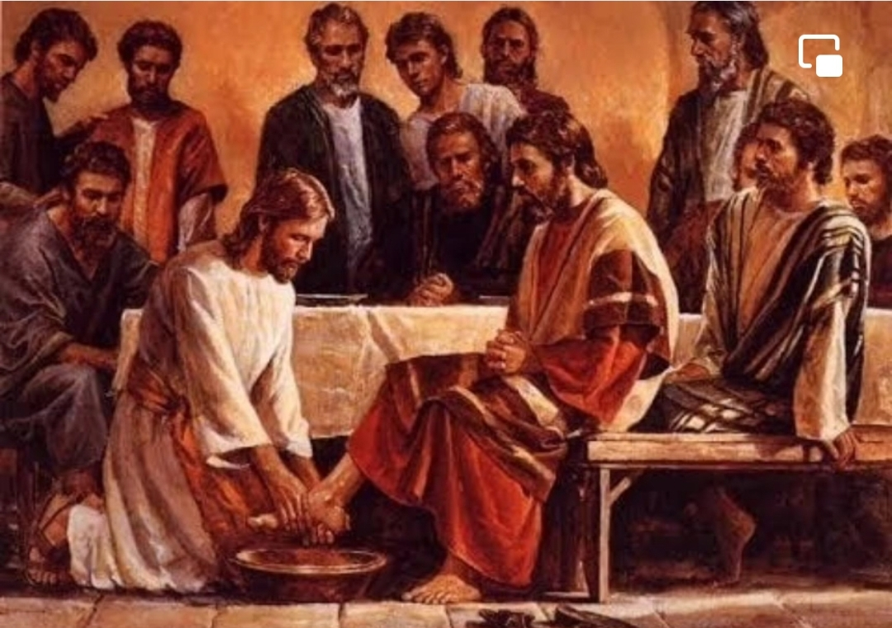

  

     
    

      <b>Luke 눅20:1 그리고 이렇게 되었나 니 어느 날 하루는 그가 성전에서 백성 을 가르치 며 복음을 전파할 때 제사장 들과 서기관 들이 장로들과 함께 와서 
      </b>
    

     
    
And it came to pass, that on one of those days, as he taught the people in the temple, and preached the gospel, the chief priests, and the scribes, came upon him with the elders, 
    

     
    

      <b>
      </b>
    

     
    

    
         
  

  

    
  

---

  

     
    

      <b>Luke 눅20:2, JST20:2 그에게 말하 여 이르되 너는 무슨 권세로 이런 일을 하느냐 우리에게 말하라 너에게 이 권 세를 준 자가 누구냐 하매 
      </b>
    

     
    
And spake unto him, saying, Tell us, by what authority doest thou these things? Or, who is he who gave thee this authority? 
    

     
    

      <b>Luke 눅20:3, JST20:3 그가 대답하 여 이르되 나도 너희에게 한 가지 물으 리니 나에게 대답하라 
      </b>
    

     
    
And he answered, and said unto them, I will also ask you one thing; answer me. 
    
         
  

  

    
  

---

  

     
    

      <b>Luke 눅20:4 요한의 침례가 하늘로 부터 왔느냐 사람에게서 왔느냐 하니 
      </b>
    

     
    
The baptism of John; was it from heaven, or of men? 
    

     
    

      <b>Luke 눅20:5 그들이 서로 논의하여 이르되 우리가 하늘로부터 라 하면 그가 이르기를 그러면 너희는 어찌하여 그를 믿지 않았느냐 할 것이요 
      </b>
    

     
    
And they reasoned with themselves, saying, If we shall say, From heaven; he will say, Why then believed ye him not? 
    
         
  

  

    
  

---

  

     
    

      <b>Luke 눅20:6, JST20:6 사람에게서 라 하면 모든 백성이 우리를 돌로 치리니 그들은 요한이 선지자였다고 확신하 고 있느니라 하여 
      </b>
    

     
    
And if we say, Of men, all the people will stone us; for they are persuaded that John was a prophet. 
    

     
    

      <b>Luke 눅20:7 그들이 대답하되 그것 이 어디서 왔는지 말할 수 없노라 하는 지라 
      </b>
    

     
    
And they answered that they could not tell whence it was. 
    
         
  

  

    
  

---

  

     
    

      <b>Luke 눅20:8, JST20:8 이에 예수가 그들에게 이르되 나도 내가 무슨 권세 로 이 일을 하는지 너희에게 말하지 않 으리라 하고 
      </b>
    

     
    
Jesus said unto them, Neither tell I you, by what authority I do these things. 
    

     
    

      <b>
      </b>
    

     
    

    
         
  

  

    
  

---

  

     
    

      <b>Luke 눅20:9, JST20:9 백성에게 이 비유를 말하기 시작하니라 어떤 사람이 포도원을 조성하여 농부들에게 세를 주 고 오랫동안 먼 나라로 갔는데 
      </b>
    

     
    
Then began he to speak to the people, this parable. A certain man planted a vineyard, and let it out to husbandmen, and went into a far country for a long time. 
    

     
    

      <b>
      </b>
    

     
    

    
         
  

  

    
  

---

  

     
    

      <b>Luke 눅20:10, JST20:10 추수하는 절기가 되매 자기 종을 농부들에게 보 내어 포도원 의 열매를 바치도록 했으나 농부들은 그를 때리고 빈손으로 보냈느 니라 
      </b>
    

     
    
And at the season of the harvest , he sent his servant to the husbandmen, that they should give him of the fruit of the vineyard; but the husbandmen beat him, and sent him away empty. 
    

     
    

      <b>
      </b>
    

     
    

    
         
  

  

    
  

---

  

     
    

      <b>Luke 눅20:11 그가 다시 다른 종을 보내니 그들이 또한 그를 때리고 능욕 하여 빈손으로 보냈으며 
      </b>
    

     
    
And again he sent another servant; and they beat him also, and entreated him shamefully, and sent him away empty. 
    

     
    

      <b>Luke 눅20:12 세 번째로 다시 보내 니 그들이 그도 상하게 하여 내쫓았느 니라 
      </b>
    

     
    
And again he sent a third, and they wounded him also, and cast him out. 
    
         
  

  

    
  

---

  

     
    

      <b>Luke 눅20:13 이에 포도원 주인이 이르되 내가 어떻게 할까 나의 사랑하 는 아들을 보내리 라 그들이 그를 보면 아마도 그는 공경하리라 했느니라 
      </b>
    

     
    
Then said the lord of the vineyard, What shall I do? I will send my beloved son; it may be, they will reverence him, when they see him. 
    

     
    

      <b>
      </b>
    

     
    

    
         
  

  

    
  

---

  

     
    

      <b>Luke 눅20:14 그러나 농부들이 그를 보고 서로 논의하여 이르되 이는 상속 자니 우리가 그를 죽여 그 유업이 우리 것이 되게 하자 하고 
      </b>
    

     
    
But when the husbandmen saw him, they reasoned among themselves, saying, This is the heir; come, let us kill him, that the inheritance may be ours. 
    

     
    

      <b>
      </b>
    

     
    

    
         
  

  

    
  

---

  

     
    

      <b>Luke 눅20:15 그를 포도원 밖으로 던져 죽였느니라 그러므로 포도원 주인 이 그들에게 어떻게 하겠느냐 
      </b>
    

     
    
So they cast him out of the vineyard, and killed him. What therefore shall the lord of the vineyard do unto them? 
    

     
    

      <b>
      </b>
    

     
    

    
         
  

  

    
  

---

  

     
    

      <b>Luke 눅20:16, JST20:16 그가 와서 이 농부들을 멸하고 그 포도원을 다른 사람에게 주리라 하니 그들이 이 말을 듣고 이르되 결코 그런 일은 없으리이 다 하더라 
      </b>
    

     
    
He shall come and destroy these husbandmen, and shall give the vineyard to others. And when they heard this, they said, God forbid! 
    

     
    

      <b>
      </b>
    

     
    

    
         
  

  

    
  

---

  

     
    

      <b>Luke 눅20:17, JST20:17 그가 그들 을 바라보 며 이르되 그러면 기록된 바 건축자 가 버린 돌이 모퉁이 의 머릿돌이 되었다 한 이것은 무엇이냐 
      </b>
    

     
    
And he beheld them, and said, What is this then which is written, The stone which the builders rejected, the same is become the head of the corner? 
    

     
    

      <b>
      </b>
    

     
    

    
         
  

  

    
  

---

  

     
    

      <b>Luke 눅20:18, JST20:18 누구든지 그 돌 위에 떨어지는 자는 부서지겠고 누구 위에든지 그 돌이 떨어지면 그를 가루로 만들리라 하니 
      </b>
    

     
    
Whosoever shall fall upon that stone, shall be broken; but on whomsoever it shall fall, it shall grind him to powder. 
    

     
    

      <b>
      </b>
    

     
    

    
         
  

  

    
  

---

  

     
    

      <b>Luke 눅20:19 그때 제사장들과 서기 관들은 그가 말한 이 비유가 자기들 에 게 하는 것임을 알고 그에게 손을 대려 했으나 백성을 두려워 하더라 
      </b>
    

     
    
And the chief priests, and the scribes, the same hour, sought to lay hands on him; but they feared the people; for they perceived that he had spoken this parable against them. 
    

     
    

      <b>
      </b>
    

     
    

    
         
  

  

    
  

---

  

     
    

      <b>Luke 눅20:20, JST20:20 이에 그들 이 그를 주목하여 보고 의인으로 가장 한 정탐들을 보내어 그의 말을 트집 잡 으려 했나니 그들이 그렇게 한 것은 그 를 총독의 권능과 권세에 넘기려 함이 더라 
      </b>
    

     
    
And they watched him, and sent forth spies, who should feign themselves just men, that they might take hold of his words, that so doing, they might deliver him unto the power and auth ority of the governor. 
    

     
    

      <b>
      </b>
    

     
    

    
         
  

  

    
  

---

  

     
    

      <b>Luke 눅20:21, JST20:21 그들이 물 어 이르되 선생님이여 우리는 당신이 올바르게 말하고 가르치 며 누구도 차별 하여 대하지 않고 하나님의 길을 참되 게 가르침을 아나이다 
      </b>
    

     
    
And they asked him, saying, Master, we know that thou sayest and tea chest rightly; neither regardest thou the person of any, but teachest the way of God truly. 
    

     
    

      <b>Luke 눅20:22 가이사에게 공세를 바 치는 것이 우리에게 적법하나 이까 그렇 지 않나이까 했으나 
      </b>
    

     
    
Is it lawful for us to give tribute unto Caesar, or no? 
    
         
  

  

    
  

---

  

     
    

      <b>Luke 눅20:23 그는 그들의 간교함을 알고 그들에게 이르되 어찌하여 너희가 나를 시험하느냐 
      </b>
    

     
    
But he perceived their craftiness, and said unto them, Why tempt ye me? 
    

     
    

      <b>Luke 눅20:24 데나리온 하나를 나에 게 보이라 그 형상과 새겨진 글자가 누 구의 것이냐 하니 그들이 대답하여 이 르되 가이사의 것이니이다 하는지라 
      </b>
    

     
    
Show me a penny. Whose image and superscription hath it? They answ ered, and said, Caesar's. 
    
         
  

  

    
  

---

  

     
    

      <b>Luke 눅20:25 그가 이르되 그러므로 가이사의 것은 가이사에게 하나님의 것 은 하나님께 바치라 하니 
      </b>
    

     
    
And he said unto them, Render there fore unto Caesar, the things which be Caesar's; and unto God, the things which be God's. 
    

     
    

      <b>Luke 눅20:26 그들이 백성 앞에서 그의 말을 트집 잡지 못하고 그의 대답 에 놀라 잠잠하 더라 
      </b>
    

     
    
And they could not take hold of his words before the people, and they marveled at his answer, and held their peace. 
    
         
  

  

    
  

---

  

     
    

      <b>Luke 눅20:27, JST20:27 그때 어떤 사두개인 들이 왔는데 그들은 부활이 있 음을 부인하는 자들이라 그들이 물어 
      </b>
    

     
    
Then came to him certain of the Sadducees, who deny there is any resurrection; and they asked him, 
    

     
    

      <b>
      </b>
    

     
    

    
         
  

  

    
  

---

  

     
    

      <b>Luke 눅20:28, JST20:28 이르되 선 생님이여 모세가 우리에게 써서 이르기 를 누구든지 그 형제가 자녀 없이 아내 를 남겨두고 죽으면 그의 형제가 그 아 내를 취하여 자기 형제에게 씨를 일으 키라 했나이다 
      </b>
    

     
    
Saying, Master, Moses wrote unto us, saying , If any man's brother die, having a wife, and he die without children, that his brother should take his wife, and raise up seed unto his brother. 
    

     
    

      <b>
      </b>
    

     
    

    
         
  

  

    
  

---

  

     
    

      <b>Luke 눅20:29 그러므로 일곱 형제가 있더니 첫째가 아내를 취하되 자녀 없 이 죽고 
      </b>
    

     
    
There were therefore seven brethren; the first took a wife, and died without children. 
    

     
    

      <b>Luke 눅20:30 둘째가 그녀를 아내로 취하되 자녀 없이 죽고 
      </b>
    

     
    
And the second took her to wife, and he died childless. 
    
         
  

  

    
  

---

  

     
    

      <b>Luke 눅20:31, JST20:31 셋째도 같 은 방식으로 그녀를 취하고 일곱째도 그렇게 하되 자녀를 남기지 않고 죽었 으며 
      </b>
    

     
    
And the third took her in like manner; and the seven also; and they left no children, and died. 
    

     
    

      <b>Luke 눅20:32 결국에는 그 여자도 죽었나이다 A
      </b>
    

     
    
nd last of all, the woman died also. 
    
         
  

  

    
  

---

  

     
    

      <b>Luke 눅20:33 그러므로 일곱이 그녀 를 아내로 취했으니 부활하면 그녀는 그들 가운데 누구의 아내가 되나이까 하매 
      </b>
    

     
    
Therefore in the resurrection whose wife of them is she; for seven had her to wife? 
    

     
    

      <b>Luke 눅20:34 예수가 그들에게 대답 하여 이르되 이 세상의 자녀는 장가들 고 시집가거니와 
      </b>
    

     
    
And Jesus answering, said unto them, The children of this world marry and are given in marriage; 
    
         
  

  

    
  

---

  

     
    

      <b>Luke 눅20:35 , JST20:35 죽음으로부 터 부활을 통해 저 세상을 얻기에 합당 하다 인정받는 자들은 장가들거나 시집 가지 않고 
      </b>
    

     
    
But they who shall be accounted worthy to obtain that world, through resurrection from the dead, neither marry nor are given in marriage. 
    

     
    

      <b>
      </b>
    

     
    

    
         
  

  

    
  

---

  

     
    

      <b>Luke 눅20:36 다시는 죽을 수도 없 나니 이는 그들이 부활의 자녀로서 천 사와 동등한 하나님의 자녀가 됨이라 
      </b>
    

     
    
Neither can they die anymore; for they are equal unto the angels; and are the children of God, being the children of the resurrection. 
    

     
    

      <b>
      </b>
    

     
    

    
         
  

  

    
  

---

  

     
    

      <b>Luke 눅20:37, JST20:37 이제 죽은 자가 살아나는 것은 모세가 떨기나무에 서 주를 불러 아브라함의 하나님 이삭 의 하나님 야곱의 하나님이라 할 때에 도 보여주었나니 
      </b>
    

     
    
Now that the dead are raised, even Moses showed at the bush, when he calleth the Lord, the God of Abraham, and the God of Isaac, and the God of Jacob. 
    

     
    

      <b>
      </b>
    

     
    

    
         
  

  

    
  

---

  

     
    

      <b>Luke 눅20:38 그는 죽은 자의 하나 님이 아니라 산 자의 하나님이 요 그에 게는 모든 사람이 살아있느니라 하니 
      </b>
    

     
    
For he is not a God of the dead, but of the living; for all live unto him. 
    

     
    

      <b>Luke 눅20:39 그때 서기관 가운데 어떤 이가 대답하여 이르되 선생님 이여 당신이 잘 말했나이다 하고 
      </b>
    

     
    
Then certain of the scribes answering, said, Master, thou hast well said. 
    
         
  

  

    
  

---

  

     
    

      <b>Luke 눅20:40 그 후로는 그들이 감 히 그에게 어떤 질문도 전혀 묻지 않더 라 
      </b>
    

     
    
And after that they durst not ask him any question at all. 
    

     
    

      <b>Luke 눅20:41 또 그가 이르되 사람 들은 어찌하여 그리스도가 다윗의 자손 이라 하느냐 
      </b>
    

     
    
And he said unto them, How say they that Christ is David's son? 
    
         
  

  

    
  

---

  

     
    

      <b>Luke 눅20:42, JST20:42 다윗은 시 편에 이르기를 주가 나의 주께 이르되 너는 나의 오른편 에 앉아 있어 
      </b>
    

     
    
And David himself said in the book of Psalms, The Lord said unto my Lord, Sit thou on my right hand, 
    

     
    

      <b>Luke 눅20:43 내가 너의 원수를 너 의 발등상 으로 삼을 때까지 그리하라 했도다 했느니라 
      </b>
    

     
    
Till I make thine enemies thy footstool. 
    
         
  

  

    
  

---

  

     
    

      <b>Luke 눅20:44 그러므로 다윗이 그를 불러 주라 했으니 어떻게 그가 다윗의 자손이 되느냐 하고 
      </b>
    

     
    
David therefore calleth him Lord; how is he then his son? 
    

     
    

      <b>Luke 눅20:45 모든 백성의 청중 가 운데서 그의 제자들에게 이르되 
      </b>
    

     
    
Then in the audience of all the people, he said unto his disciples, 
    
         
  

  

    
  

---

  

     
    

      <b>Luke 눅20:46, JST20:46 긴 예복을 입고 다니기를 좋아하고 시장에서 인사 받는 것과 회당의 상석과 잔칫집 에서 높은 자리를 좋아하는 서기관 들을 조심 하라 
      </b>
    

     
    
Beware of the scribes, who desire to walk in long robes, and love greetings in the markets, and the highest seats in the synagogues, and the chief rooms at feasts; 
    

     
    

      <b>
      </b>
    

     
    

    
         
  

  

    
  

---

  

     
    

      <b>Luke 눅20:47, JST20:47 그들은 과 부의 집을 삼키며 보여주기 위해 길게 기도하니 그들은 더 큰 정죄를 받으리 라 하더라 
      </b>
    

     
    
Who devour widows' houses, and for a show, make long prayers; the same shall receive greater damnation.
    

     
    

      <b>
      </b>
    

     
    

    
         
  

  

    
  

