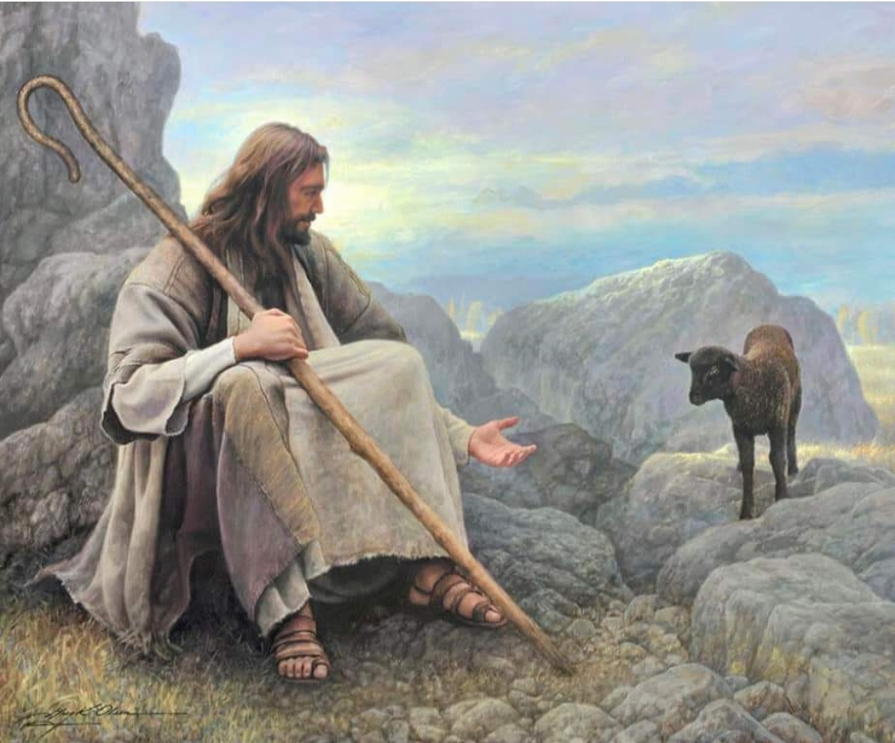
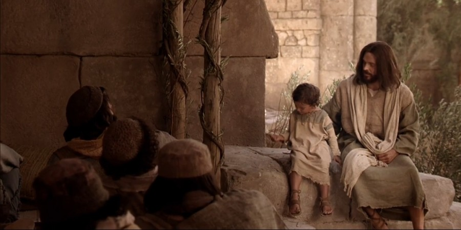
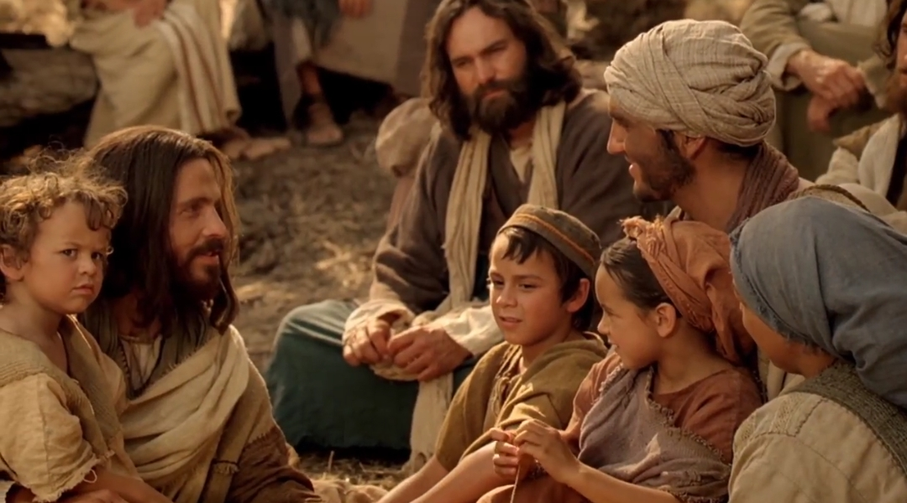

  

     
    

      <b>Luke 눅3:1 가이사 디베료의 치세 십 오 년에 본디오 빌라도가 유대의 총독 이요 헤롯은 갈릴리의 분봉 왕이요 그 의 형제 빌립은 이두래와 드라고닛 지 방의 분봉 왕이요 루사니아 는 아빌레네 의 분봉 왕이요 
      </b>
    

     
    
Now in the fifteenth year of the reign of Tiberius Caesar, Pontius Pilate being governor of Judea, and Herod being tetrarch of Galilee, and his brother Philip tetrarch of Iturea and of the region of Trachonitis, and Lysanias the tetrarch of Abilene; 
    

     
    

      <b>
      </b>
    

     
    

    
         
  

  

    
  

---

  

     
    

      <b>Luke 눅3:2 안나스와 가야바는 대제 사장이 더라 
      </b>
    

     
    
Annas and Caiaphas being the high priests. 
    

     
    

      <b>JST3:2 이 해에 광야에 있던 사가랴의 아들 요한에게 하나님의 말씀이 임하니 
      </b>
    

     
    
Now in this same year, the word of God came unto John, the son of Zacharias, in the wilderness. 
    
         
  

  

    
  

---

  

     
    

      <b>Luke 눅3:3 그가 요단 강 근처 모든 지방에 들어가 죄 사함을 위한 회개의 침례를 전파하 더라 
      </b>
    

     
    
And he came into all the country about Jordan, preaching the baptism of repentance for the remission of sins. 
    

     
    

      <b>
      </b>
    

     
    

    
         
  

  

    
  

---

  

     
    

      <b>Luke 눅3:4, JST3:4 선지자 이사야의 책에 기록된 바 그 말씀은 이러하니 광 야에서 외치는 자의 음성이 있어 너희 는 주의 길을 예비하 라 그의 진로를 곧 게 하라 
      </b>
    

     
    
As it is written in the book of the prophet Esaias; and these are the words, saying, The voice of one crying in the wilderness, Prepare ye the way of the Lord, and make his paths straight. 
    

     
    

      <b>
      </b>
    

     
    

    
         
  

  

    
  

---

  

     
    

      <b>JST3:5 보라 또 보라 선지자 들의 책에 기록된 대로 그가 와서 세상의 죄를 지 고 가며 이방 민족에게 구원을 가져오 며 이스라엘 양 무리에 속한 잃어버린 자들을 모으리니 
      </b>
    

     
    
For behold, and lo, he shall come, as it is written in the book of the prophets, to take away the sins of the world, and to bring salvation unto the heathen nations, to gather together those who are lost, who are of the sheepfold of Israel; 
    

     
    

      <b>
      </b>
    

     
    

    
         
  

  

    
  

---

  

     
    

      <b>JST3:6 참으로 흩어지고 고난받는 자 도 모으며 길을 예비하여 이방인 에게 복음을 전하는 것이 가능하게 하며 
      </b>
    

     
    
Yea, even the dispersed and afflicted; and also to prepare the way, and make possible the preaching of the gospel unto the Gentiles; 
    

     
    

      <b>
      </b>
    

     
    

    
         
  

  

    
  

---

  

     
    

      <b>JST3:7 땅끝까지 어둠 속에 앉아 있는 모든 자에게 빛이 되며 죽음으로부터 부활을 가져오 며 높이 올라 아버지 의 오른편 에 거하기를 
      </b>
    

     
    
And to be a light unto all who sit in darkness, unto the uttermost parts of the earth; to bring to pass the resurrection from the dead, and to ascend up on high, to dwell on the right hand of the Father, JST3:8 때가 차서 율법과 증거가 인봉 되고 왕국의 열쇠를 아버지 께 다시 넘 겨 드릴 때까지 할 것이요 Until the fullness of time, and the law and the testimony shall be sealed, and the keys of the kingdom shall be delivered up again unto the Father; 
    

     
    

      <b>
      </b>
    

     
    

    
         
  

  

    
  

---

  

     
    

      <b>JST3:9 모든 사람에게 공의를 집행하 고 모든 사람을 심판하러 내려와 경건 하지 않은 모든 자에게 그들이 범한 경 건하지 않은 행위를 깨닫게 하리니 이 모든 일이 그가 오는 날에 이루어지리 라 
      </b>
    

     
    
To administer justice unto all; to come down in judgment upon all, and to convince all the ungodly of their ungodly deeds, which they have committed; and all this in the day that he shall come; 
    

     
    

      <b>
      </b>
    

     
    

    
         
  

  

    
  

---

  

     
    

      <b>Luke 눅3:5, JST3:10 그날은 권능의 날이라 참으로 모든 골짜기가 메워지고 모든 산과 작은 산이 낮아질 것이요 굽 은 것이 곧아지고 험한 길이 평탄해 지 리니 
      </b>
    

     
    
For it is a day of power; yea, every valley shall be filled, and every mountain and hill shall be brought low; the crooked shall be made straight, and the rough ways made smooth; 
    

     
    

      <b>Luke 눅3:6 모든 육신이 하나님의 구 원을 보리라 했느니라 
      </b>
    

     
    
And all flesh shall see the salvation of God. 
    
         
  

  

    
  

---

  

     
    

      <b>Luke 눅3:7, JST3:12 그때 요한이 그 에게 침례 받으러 나아오는 무리에게 큰 음성으로 외쳐 이르되 오 독사의 세 대여 누가 너희를 경고하여 다가올 진 노로부터 도망하라 하더냐 
      </b>
    

     
    
Then said John to the multitude that came forth to be baptized of him, crying against them with a loud voice, saying, O generation of vipers, who hath warned you to flee from the wrath to come? 
    

     
    

      <b>
      </b>
    

     
    

    
         
  

  

    
  

---

  

     
    

      <b>Luke 눅3:8, JST3:13 그러므로 회개 에 합당한 열매를 맺고 속으로 말하기 를 아브라함 은 우리 조상이요 우리는 하나님의 계명을 지켜왔으며 아브라함 의 자손 외에는 아무도 약속을 유업으 로 받을 수 없다 하지 말라 내가 너희 에게 이르노니 하나님은 이 돌들로도 아브라함에게 자손을 일으킬 수 있느니 라 
      </b>
    

     
    
Bring forth therefore fruits worthy of repentance, and begin not to say within yourselves, Abraham is our father; we have kept the command ments of God, and none can inherit the promises but the children of Abraham; for I say unto you, That God is able of these stones to raise up children unto Abraham. 
    

     
    

      <b>
      </b>
    

     
    

    
         
  

  

    
  

---

  

     
    

      <b>Luke 눅3:9, JST3:14 이제 도끼가 나 무뿌리에 놓였으니 선한 열매를 맺지 않는 나무마다 베어져 불 속에 던져지 리라 하매 
      </b>
    

     
    
And now also, the axe is laid unto the root of the trees; every tree therefore which bringeth not forth good fruit, shall be hewn down, and cast into the fire. 
    

     
    

      <b>Luke 눅3:10 백성이 그에게 물어 이 르되 그러면 우리가 어떻게 해야 하나 이까 하는지라 
      </b>
    

     
    
And the people asked him, saying, What shall we do then? 
    
         
  

  

    
  

---

  

     
    

      <b>Luke 눅3:11, JST3:16 그가 대답하 여 이르되 두벌 옷을 가진 자는 없는 자에게 나누어 주고 양식을 가진 자도 그렇게 하라 하더라 
      </b>
    

     
    
He answered and said unto them, He that hath two coats, let him impart to him that hath none; and he that hath meat, let him do likewise. 
    

     
    

      <b>Luke 눅3:12 그때 세리들도 침례 받 으러 와서 그에게 이르되 선생님 이여 우리는 어떻게 해야 하나이까 하매 
      </b>
    

     
    
Then came also publicans to be baptized, and said unto him, Master, what shall we do? 
    
         
  

  

    
  

---

  

     
    

      <b>Luke 눅3:13 그가 이르되 너희에게 지정된 것보다 더 거두지 말라 했나니 
      </b>
    

     
    
And he said unto them, Exact no more than that which is appointed unto you. 
    

     
    

      <b>
      </b>
    

     
    

    
         
  

  

    
  

---

  

     
    

      <b>JST3:19 데오빌로여 그대도 잘 아는 바 유대인의 방식을 좇아 헌금함 에 돈 을 받는 그들의 율법의 관습에 따르면 풍족하게 받은 것에서 가난한 자를 위 해 각 사람의 몫이 지정되는데 
      </b>
    

     
    
For it is well known unto you, Theophilus, that after the manner of the Jews, and according to the custom of their law in receiving money into the treasury, that out of the abundance which was received, was appointed unto the poor, every man his portion; 
    

     
    

      <b>
      </b>
    

     
    

    
         
  

  

    
  

---

  

     
    

      <b>JST3:20 이런 방식을 좇아 세리들도 그렇게 하므로 요한이 그들에게 이르기 를 너희에게 지정된 것보다 더 거두지 말라 한 것이라 
      </b>
    

     
    
And after this manner did the publicans also, wherefore John said unto them, Exact no more than that which is appointed you. 
    

     
    

      <b>
      </b>
    

     
    

    
         
  

  

    
  

---

  

     
    

      <b>Luke 눅3:14 병사들도 그에게 물어 이르되 우리는 어떻게 해야 하나이까 하매 그가 이르되 아무에게도 폭력을 행사하지 말고 거짓으로 고소하지 말며 너희가 받는 급료를 족한 것으로 알라 하니 
      </b>
    

     
    
And the soldiers likewise demanded of him, saying, And what shall we do? And he said unto them, Do violence to no man, neither accuse any falsely; and be content with your wages. 
    

     
    

      <b>
      </b>
    

     
    

    
         
  

  

    
  

---

  

     
    

      <b>Luke 눅3:15 백성은 기대하고 있던 터라 모든 사람이 요한에 관해 그가 그 리스도인가 아닌가 마음속으로 생각하 더라 
      </b>
    

     
    
And as the people were in expectation, and all men mused in their hearts of John, whether he were the Christ, or not; 
    

     
    

      <b>
      </b>
    

     
    

    
         
  

  

    
  

---

  

     
    

      <b>Luke 눅3:16, JST3:23 요한이 모든 사람에게 대답하여 이르되 진실로 나는 물로 너희를 침례하 거니와 나보다 강하 신 이가 오나니 나는 그의 신발 끈 풀 기에도 합당하지 않으니라 그는 성령과 불로 너희를 침례할 것이요 
      </b>
    

     
    
John answered, saying unto all, I indeed baptize you with water, but there cometh one mightier than I, the latchet of whose shoes I am not worthy to unloose, he shall baptize you with the Holy Ghost, and with fire; 
    

     
    

      <b>
      </b>
    

     
    

    
         
  

  

    
  

---

  

     
    

      <b>Luke 눅3:17 손에 키를 들고 자기 타작마당을 말끔히 청소하며 알곡은 자 기 곳간에 모아 들이되 쭉정이 는 꺼지 지 않는 불로 불사르리라 하고 
      </b>
    

     
    
Whose fan is in his hand, and he will thoroughly purge his floor, and will gather the wheat into his garner; but the chaff he will burn with fire unquenchable. 
    

     
    

      <b>Luke 눅3:18 또 다른 많은 것을 백 성에게 권고하며 전파하더라 
      </b>
    

     
    
And many other things, in his exhor tation, preached he unto the people. 
    
         
  

  

    
  

---

  

     
    

      <b>Luke 눅3:19, JST3:26 그러나 분봉 왕 헤롯은 자기 형제 빌립의 아내 헤로 디아의 일과 헤롯이 행한 모든 악행에 관해 그에게 서 책망받았으되 
      </b>
    

     
    
But Herod, the tetrarch, being reproved of him for Herodias, his brother Philip's wife, and for all the evils which Herod had done; 
    

     
    

      <b>Luke 눅3:20 이 모든 일에 더하여 요한을 옥에 가두었더라 
      </b>
    

     
    
Added yet this above all, that he shut up John in prison. 
    
         
  

  

    
  

---

  

     
    

      <b>Luke 눅3:21, JST3:28 이제 모든 사 람이 침례 받을 때 이렇게 되었나니 예 수도 요한에게 와서 그에게 침례 받고 기도하는데 하늘이 열리고 
      </b>
    

     
    
Now when all the people were baptized, it came to pass that Jesus also came unto John; and being baptized of him, and praying, the heaven was opened; 
    

     
    

      <b>
      </b>
    

     
    

    
         
  

  

    
  

---

  

     
    

      <b>Luke 눅3:22 성령이 비둘기 모양으 로 그의 위에 내려오 고 하늘로부터 한 음성이 나서 이르되 너는 내가 크게 기 뻐하여 사랑하는 아들이 라 하더라 
      </b>
    

     
    
And the Holy Ghost descended, in bodily shape like a dove, upon him; and a voice came from heaven, which said, Thou art my beloved Son, in thee I am well pleased. 
    

     
    

      <b>
      </b>
    

     
    

    
         
  

  

    
  

---

  

     
    

      <b>Luke 눅3:23, JST3:30 예수는 삼십 세가 시작될 무렵에 그의 아버지와 함 께 살고 있었나니 세상이 생각하는 대 로 그는 요셉의 아들이요 그는 헬리의 허리로부터 난 자요 
      </b>
    

     
    
And Jesus himself began to be about thirty years of age, having lived with his father, being, as was supposed of the world , the son of Joseph, who was from the loins of Heli, 
    

     
    

      <b>
      </b>
    

     
    

    
         
  

  

    
  

---

  

     
    

      <b>Luke 눅3:24, JST3:31 그는 맛닷의 허리로부터 난 자요 그는 레위의 아들 이요 그는 멜기의 후손이요 그는 얀나 에게서 났으며 그는 요셉에게서 났으며 
      </b>
    

     
    
Who was from the loins of Matthat, who was the son of Levi, who was a descendant of Melchi, and of Janna, and of Joseph, 
    

     
    

      <b>Luke 눅3:25, JST3:32 그는 맛다디 아에게서 났으며 그는 아모스 에게서 났 으며 그는 나움에게서 났으며 그는 에 슬리에게서 났으며 그는 낙게에게서 났 으며 
      </b>
    

     
    
And of Mattathias, and of Amos, and of Naum, and of Esli, and of Nagge, 
    
         
  

  

    
  

---

  

     
    

      <b>Luke 눅3:26, JST3:33 그는 마앗에 게서 났으며 그는 맛다디아 에게서 났으 며 그는 서메이 에게서 났으며 그는 요 셉에게서 났으며 그는 유다에게서 났으 며 
      </b>
    

     
    
And of Maath and of Mattathias, and of Semei, and of Joseph, and of Juda, 
    

     
    

      <b>Luke 눅3:27, JST3:34 그는 요안나 에게서 났으며 그는 레사에게서 났으며 그는 스룹바벨 에게서 났으며 그는 살라 디엘에게서 났으며 그는 네리의 아들이 요 
      </b>
    

     
    
And of Joanna, and of Resa, and of Zorobabel, and of Salathiel, who was the son of Neri, 
    
         
  

  

    
  

---

  

     
    

      <b>Luke 눅3:28, JST3:35 그는 멜기의 후손이요 그는 앗디에게서 났으며 그는 고삼에게서 났으며 그는 엘모담 에게서 났으며 그는 에르에게서 났으며 
      </b>
    

     
    
Who was a descendant of Melchi, and of Addi, and of Cosam, and of Elmodam, and of Er, 
    

     
    

      <b>Luke 눅3:29, JST3:36 그는 요세에 게서 났으며 그는 엘리에셀 에게서 났으 며 그는 요람에게서 났으며 그는 맛닷 에게서 났으며 그는 레위에게서 났으며 
      </b>
    

     
    
And of Jose, and of Eliezer, and of Joram, and of Matthat, and of Levi, 
    
         
  

  

    
  

---

  

     
    

      <b>Luke 눅3:30, JST3:37 그는 시므온 에게서 났으며 그는 유다에게서 났으며 그는 요셉에게서 났으며 그는 요난에게 서 났으며 그는 엘리아김 에게서 났으며 
      </b>
    

     
    
And of Simeon, and of Juda, and of Joseph, and of Jonan, and of Eliakim, 
    

     
    

      <b>Luke 눅3:31, JST3:38 그는 멜레아 에게서 났으며 그는 메난에게서 났으며 그는 맛다다 에게서 났으며 그는 나단에 게서 났으며 그는 다윗에게서 났으며 
      </b>
    

     
    
And of Melea, and of Menan, and of Mattatha, and of Nathan, and of David, 
    
         
  

  

    
  

---

  

     
    

      <b>Luke 눅3:32, JST3:39 그는 이새에 게서 났으며 그는 오벳에게서 났으며 그는 보아스 에게서 났으며 그는 살몬에 게서 났으며 그는 나손에게서 났으며 
      </b>
    

     
    
And of Jesse, and of Obed, and of Booz, and of Salmon, and of Naasson, 
    

     
    

      <b>Luke 눅3:33, J ST3:40 그는 아미나 답에게서 났으며 그는 아람에게서 났으 며 그는 에스롬 에게서 났으며 그는 베 레스에게서 났으며 그는 유다에게서 났 으며 
      </b>
    

     
    
And of Aminadab, and of Aram, and of Esrom, and of Phares, and of Juda, 
    
         
  

  

    
  

---

  

     
    

      <b>Luke 눅3:34, JST3:41 그는 야곱에 게서 났으며 그는 이삭에게서 났으며 그는 아브라함 에게서 났으며 그는 데라 에게서 났으며 그는 나홀에게서 났으며 
      </b>
    

     
    
And of Jacob, and of Isaac, and of Abraham, and of Thara, and of Nachor, 
    

     
    

      <b>Luke 눅3:35, J ST3:42 그는 스룩에 게서 났으며 그는 르우에게서 났으며 그는 벨렉에게서 났으며 그는 헤벨에게 서 났으며 그는 살라에게서 났으며 
      </b>
    

     
    
And of Saruch, and of Ragau, and of Phalec, and of Heber, and of Sala, 
    
         
  

  

    
  

---

  

     
    

      <b>Luke 눅3:36, JST3:43 그는 게난에 게서 났으며 그는 아르박삿 에게서 났으 며 그는 셈에게서 났으며 그는 노아에 게서 났으며 그는 라멕에게서 났으며 
      </b>
    

     
    
And of Cainan, and of Arphaxad, and of Shem, and of Noah, and of Lamech, 
    

     
    

      <b>Luke 눅3:37, JST3:44 그는 므두셀 라에게서 났으며 그는 에녹에게서 났으 며 그는 야렛에게서 났으며 그는 마할 랄렐에게서 났으며 그는 게난에게서 났 으며 
      </b>
    

     
    
And of Mathusala, and of Enoch, and of Jared, and of Maleleel, and of Cainan, 
    
         
  

  

    
  

---

  

     
    

      <b>Luke 눅3:38, JST3:45 그는 에노스 에게서 났으며 그는 셋에게서 났으며 그는 아담에게서 났으며 그는 하나님이 지었으며 땅 위에 첫 사람이라 
      </b>
    

     
    
And of Enos, and of Seth, and of Adam, who was formed of God, and the first man upon the earth.
    

     
    

      <b>
      </b>
    

     
    

    
         
  

  

    
  

