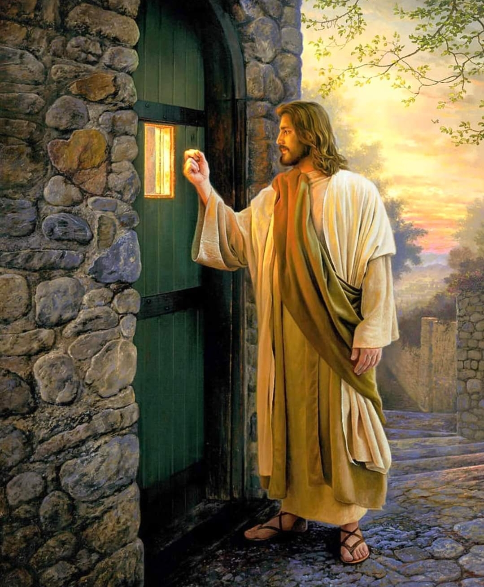
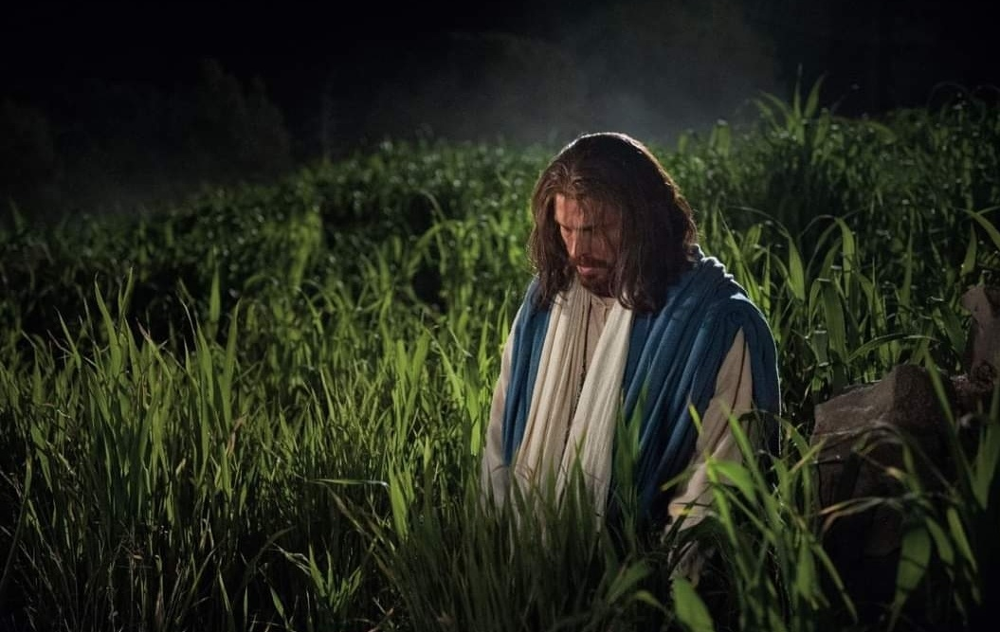

  

     
    

      <b>Luke 눅9:1, JST9:1 그가 열두 제자 를 불러 모으고 그들에게 모든 악마를 제압하고 병을 치유할 능력과 권세를 주어 
      </b>
    

     
    
Then he called his twelve disciples together, and he gave them power and authority over all devils, and to cure diseases. 
    

     
    

      <b>Luke 눅9:2 하나님의 왕국을 전파하 고 병든 사람을 낫게 하도록 그들을 보 내며 
      </b>
    

     
    
And he sent them to preach the kingdom of God, and to heal the sick. 
    
         
  

  

    
  

---

  

     
    

      <b>Luke 눅9:3 그들에게 이르되 너희 여 행을 위해 아무것도 지니지 말지니 지 팡이나 보따리나 양식이나 돈이나 두벌 옷도 지니지 말라 
      </b>
    

     
    
And he said unto them, Take nothing for your journey, neither staves, nor scrip, neither bread, neither money; neither have two coats apiece. 
    

     
    

      <b>Luke 눅9:4 너희가 어느 집에 들어가 든지 그곳을 떠나기까지 그곳에 머물고 
      </b>
    

     
    
And into whatsoever house ye enter , there abide until ye depart thence. 
    
         
  

  

    
  

---

  

     
    

      <b>Luke 눅9:5 누구든지 너희를 받아들 이려 하지 않으면 너희가 그 성읍을 떠 날 때 너희 발의 티끌을 떨어버려서 그 들에 대한 증거로 삼으라 하매 
      </b>
    

     
    
And whosoever will not receive you, when ye go out of that city, shake off the very dust from your feet for a testimony against them. 
    

     
    

      <b>Luke 눅9:6 저들이 떠나 마을을 돌아 다니며 복음을 전파하고 각처에서 병을 낫게 하더라 
      </b>
    

     
    
And they departed, and went through the towns, preaching the gospel, and healing every where. 
    
         
  

  

    
  

---

  

     
    

      <b>Luke 눅9:7, JST9:7 이제 분봉왕 헤 롯이 예수가 행한 모든 일을 듣고 당황 했나니 이는 어떤 이들이 이르기를 요 한이 죽음으로부터 살아났다 했기 때문 이라 
      </b>
    

     
    
Now Herod the tetrarch heard of all that was done by Jesus ; and he was perplexed, because that it was said of some, That John was risen from the dead; 
    

     
    

      <b>
      </b>
    

     
    

    
         
  

  

    
  

---

  

     
    

      <b>Luke눅9:8 어떤 이들은 엘리야 가 나 타났다 하고 다른 이들은 옛 선지자 들 가운데 하나가 다시 살아났다 하므로 
      </b>
    

     
    
And of some, That Elias had appeared; and of others, That one of the old prophets was risen again. 
    

     
    

      <b>Luke 눅9:9 헤롯이 이르되 요한은 내 가 목 베었거늘 그런 일에 관해 듣는 이 사람은 누구냐 하며 그를 보기 원하 더라 
      </b>
    

     
    
And Herod said, John have I beheaded; but who is this, of whom I hear such things? And he desired to see him. 
    
         
  

  

    
  

---

  

     
    

      <b>Luke 눅9:10, JST9:10 사도들이 돌 아와 그들이 행한 모든 것을 예수께 말 하니 그가 그들을 데리고 따로 벳새다 라 하는 성읍에 속한 외진 곳으로 조용 히 들어가매 
      </b>
    

     
    
And the apostles, when they returned , told Jesus all that they had done. And he took them, and went aside priv ately into a solitary place belonging to the city called Bethsaida. 
    

     
    

      <b>
      </b>
    

     
    

    
         
  

  

    
  

---

  

     
    

      <b>Luke 눅9:11, JST9:11 백성이 그것 을 알고 그를 따르더라 이에 그가 그들 을 받아들여 그들에게 하나님의 왕국에 관해 말하고 병 고침이 필요한 자들을 낫게 하더라 
      </b>
    

     
    
And the people, when they knew it, followed him; and he received them, and spake unto them of the kingdom of God, and healed them who had need of healing. 
    

     
    

      <b>
      </b>
    

     
    

    
         
  

  

    
  

---

  

     
    

      <b>Luke 눅9:12, JST9:12 날이 저물어 가매 열두 제자가 그에게 와서 이르되 무리를 보내어 마을과 주변 지역에 들 어가 유숙하고 먹을 것을 얻게 하소서 우리가 있는 여기는 외진 곳이니이다 하는지라 
      </b>
    

     
    
And when the day began to wear away, then came the twelve, and said unto him, Send the multitude away, that they may go into the towns and country round about, and lodge, and get victuals; for we are here in a solitary place. 
    

     
    

      <b>
      </b>
    

     
    

    
         
  

  

    
  

---

  

     
    

      <b>Luke 눅9:13, JST9:13 그가 이르되 너희가 그들에게 먹을 것을 주라 하니 그들이 이르되 우리가 가진 것은 떡 다 섯 개와 물고기 두 마리뿐 이어서 우리 가 가서 양식을 사지 않으면 이 모든 무리를 위한 음식을 더 이상 마련할 수 없나이다 하더라 
      </b>
    

     
    
But he said unto them, Give ye them to eat. And they said, We have but five loaves and two fishes; and except we should go and buy meat, we can provide no more food for all this multitude. 
    

     
    

      <b>
      </b>
    

     
    

    
         
  

  

    
  

---

  

     
    

      <b>Luke 눅9:14, JST9:14 그들의 수효 는 대략 오천 명이더라 예수가 그의 제 자들에게 이르되 그들을 오십 명씩 무 리지어 앉게 하라 하니 
      </b>
    

     
    
For they were in number about five thousand men. And Jesus said unto his disciples, Make them sit down by fifties in a company. 
    

     
    

      <b>Luke 눅9:15 그들이 그렇게 하여 사 람들을 모두 앉게 하고 나서 
      </b>
    

     
    
And they did so, and made them all sit down. 
    
         
  

  

    
  

---

  

     
    

      <b>Luke 눅9:16 그가 떡 다섯 개와 물 고기 두 마리를 가져 하늘을 바라보며 축복하고 떼어 제자들에게 주어 무리 앞에 놓게 하매 
      </b>
    

     
    
Then he took the five loaves, and the two fishes, and looking up to heaven, he blessed them, and brake, and gave to the disciples to set before the multitude. 
    

     
    

      <b>
      </b>
    

     
    

    
         
  

  

    
  

---

  

     
    

      <b>Luke 눅9:17, JST9:17 그들이 모두 배불리 먹고 그 남은 조각을 거두니 열 두 광주리 더라 
      </b>
    

     
    
And they did eat, and were all filled. And there was taken up of the fragments which remained , twelve baskets. 
    

     
    

      <b>Luke 눅9:18, JST9:18 그리고 이렇 게 되었나니 그가 따로 제자들과 함께 기도하러 갈 때 그들에게 물어 이르되 백성은 나를 누구라 하느냐 하매 
      </b>
    

     
    
And it came to pass, as he went alone with his disciples to pray, he asked them, saying, Who say the people that I am? 
    
         
  

  

    
  

---

  

     
    

      <b>Luke 눅9:19, JST9:19 그들이 대답 하여 이르되 어떤 이들은 침례 요한이 라 하고 다른 이들은 엘리야 라 하고 또 다른 이들은 옛 선지자 들 가운데 하나 가 다시 살아났다 하나이다 하는지라 
      </b>
    

     
    
They answering said, Some say, John the Baptist; but others say, Elias; and others, That one of the old prophets is risen again. 
    

     
    

      <b>
      </b>
    

     
    

    
         
  

  

    
  

---

  

     
    

      <b>Luke 눅9:20, JST9:20 그가 이르되 그러나 너희는 나를 누구라 하느냐 하 니 베드로가 대답하여 이르되 하나님의 아들 그리스도 니이다 하매 
      </b>
    

     
    
He said unto them, But who say ye that I am? Peter answering said, The Christ, the Son of God. 
    

     
    

      <b>Luke 눅9:21, JST9:21 그가 그들에 게 엄하게 분부하여 자기에 관해 아무 에게도 말하지 말라 명하고 
      </b>
    

     
    
And he straitly charged them, and commanded them to tell no man of him, 
    
         
  

  

    
  

---

  

     
    

      <b>Luke 눅9:22 이르되 인자가 반드시 많은 고난을 겪고 장로들과 제사장들과 서기관 들에게 배척당하여 죽임당하고 제삼 일에 살아나야 하리라 하더라 
      </b>
    

     
    
Saying, the Son of man must suffer many things, and be rejected of the elders, and chief priests, and scribes; and be slain, and be raised the third day. 
    

     
    

      <b>
      </b>
    

     
    

    
         
  

  

    
  

---

  

     
    

      <b>Luke 눅9:23 또 그가 그들 모두에게 이르되 누구든지 와서 나를 따르기 원 하면 자기를 부인하고 매일 자기 십자 가를 지고 나를 따르라 
      </b>
    

     
    
And he said unto them all, If any man will come after me, let him deny himself, and take up his cross daily, and follow me. 
    

     
    

      <b>
      </b>
    

     
    

    
         
  

  

    
  

---

  

     
    

      <b>Luke 눅9:24, JST9:24 누구든지 자 기 생명을 구원하 기 원하는 자는 반드 시 나를 위해 기꺼이 그것을 버려야 하 나니 누구든지 나를 위해 기꺼이 자기 생명을 버리는 자는 그것을 구원하리라 
      </b>
    

     
    
For whosoever will save his life, must be willing to lose it for my sake; and whosoever will be willing to lose his life for my sake, the same shall save it. 
    

     
    

      <b>
      </b>
    

     
    

    
         
  

  

    
  

---

  

     
    

      <b>Luke 눅9:25, JST9:25 사람이 온 세 상을 얻고도 하나님이 성임한 자를 받 아들이지 않아서 자기 영혼을 잃고 스 스로 버림받 으면 그에게 무슨 유익이 있겠느냐 
      </b>
    

     
    
For what doth it profit a man if he gain the whole world, and yet he receive him not whom God hath ordained, and he lose his own soul, and he himself be a castaway? 
    

     
    

      <b>
      </b>
    

     
    

    
         
  

  

    
  

---

  

     
    

      <b>Luke 눅9:26, JST9:26 이는 누구든 지 나와 나의 말을 부끄러워하면 인자도 자기 아버지 영광으로 옷 입고 거룩 한 천사들과 함께 자기 왕국에 올 때 그를 부끄러워 할 것임이 라 
      </b>
    

     
    
For whosoever shall be ashamed of me, and of my words, of him shall the Son of man be ashamed, when he shall come in his own kingdom, clothed in the glory of his Father, with the holy angels. 
    

     
    

      <b>
      </b>
    

     
    

    
         
  

  

    
  

---

  

     
    

      <b>Luke 눅9:27, JST9:27 참으로 내가 너희에게 한 가지 진실을 말하노니 하 나님의 왕국이 권능으로 오는 것을 볼 때까지 죽음을 맛보지 않을 자들이 이 곳에 서 있느니라 하더라 
      </b>
    

     
    
Verily , I tell you of a truth, there are some standing here who shall not taste of death, until they see the kingdom of God coming in power. 
    

     
    

      <b>
      </b>
    

     
    

    
         
  

  

    
  

---

  

     
    

      <b>Luke 눅9:28, JST9:28 그리고 이렇 게 되었나니 이 말을 하고 팔 일이 지 난 후에 그가 베드로와 요한과 야고보 를 데리고 기도하러 산으로 들어가 
      </b>
    

     
    
And it came to pass, eight days after these sayings, that he took Peter and John and James, and went up into a mountain to pray. 
    

     
    

      <b>
      </b>
    

     
    

    
         
  

  

    
  

---

  

     
    

      <b>Luke 눅9:29, JST9:29 그가 기도할 때 그 용모가 변화되 고 그의 옷이 희어 져 광채가 나더라 
      </b>
    

     
    
And as he prayed, the fashion of his countenance was changed , and his raiment was white and glittering. 
    

     
    

      <b>Luke 눅9:30, JST9:30 또 보라 두 사람 곧 모세와 엘리야 가 와서 그와 대 화하는데 
      </b>
    

     
    
And behold, there came and talked with him two men, even Moses and Elias, 
    
         
  

  

    
  

---

  

     
    

      <b>Luke 눅9:31, JST9:31 그들이 영광 중에 나타나 그가 예루살렘에서 이루어 야 하는 그의 죽음과 부활에 관해 이야 기하되 
      </b>
    

     
    
Who appeared in glory, and spake of his death, and also his resurrection, which he should accomplish at Jerusalem. 
    

     
    

      <b>
      </b>
    

     
    

    
         
  

  

    
  

---

  

     
    

      <b>Luke 눅9:32, JST9:32 베드로 와 그 와 함께한 자들은 깊이 졸다가 깨어 그 의 영광과 그와 함께 서 있는 두 사람 을 보았더라 
      </b>
    

     
    
But Peter and they who were with him were heavy with sleep, and when they were awake they saw his glory, and the two men who stood with him. 
    

     
    

      <b>
      </b>
    

     
    

    
         
  

  

    
  

---

  

     
    

      <b>Luke 눅9:33, JST9:33 그 두 사람이 그로부터 떠나고 나서 베드로가 예수께 이르되 선생님 이여 우리가 여기에 있는 것이 우리에게 유익하므로 우리로 하여 금 장막 셋을 짓되 하나는 당신을 위해 하나는 모세를 위해 하나는 엘리야 를 위해 짓게 하소서 했으나 자기가 무슨 말을 하는지 알지 못하더라 
      </b>
    

     
    
And after the two men departed from him, Peter said unto Jesus, Master, it is good for us to be here; and let us make three tabernacles; one for thee, and one for Moses, and one for Elias; not knowing what he said. 
    

     
    

      <b>
      </b>
    

     
    

    
         
  

  

    
  

---

  

     
    

      <b>Luke 눅9:34, JST9:34 그가 이렇게 말할 때 구름이 와서 그들을 모두 덮으 니 그들이 구름 속으로 들어가면서 두 려워하더라 
      </b>
    

     
    
While he thus spake, there came a cloud, and overshadowed them all; and they feared as they entered into the cloud. 
    

     
    

      <b>Luke 눅9:35 구름에서 한 음성이 나 서 이르되 이는 나의 사랑하는 아들이 니 그의 말을 들으라 했으며 
      </b>
    

     
    
And there came a voice out of the cloud, saying, This is my beloved Son; hear him. 
    
         
  

  

    
  

---

  

     
    

      <b>Luke 눅9:36, JST9:36 음성이 지나 간 후에 예수가 혼자 남았더라 그들은 이 일을 비밀로 하고 그 당시에는 자기 들이 본 어떤 것도 아무에게 말하지 않 았더라 
      </b>
    

     
    
And when the voice was past, Jesus was found alone. And these things they kept close, and they told no man, in those days, any of the things which they had seen. 
    

     
    

      <b>
      </b>
    

     
    

    
         
  

  

    
  

---

  

     
    

      <b>Luke 눅9:37 그리고 이렇게 되었나 니 다음 날 그들이 산에서 내려올 때 많은 백성이 그를 맞이하 더라 
      </b>
    

     
    
And it came to pass that on the next day, when they were come down from the hill, much people met him. 
    

     
    

      <b>Luke 눅9:38 보라 무리 가운데 한 사람이 부르짖어 이르되 선생님 이여 내 가 당신께 간청하오니 나의 아들을 돌 아보소서 그는 나의 외아들 이니이다 
      </b>
    

     
    
And behold, a man of the company cried out, saying, Master, I beseech thee, look upon my son; for he is mine only child. 
    
         
  

  

    
  

---

  

     
    

      <b>Luke 눅9:39, JST9:39 보소서 어떤 영이 그를 사로잡으면 그가 갑자기 소 리 지르는데 그것이 그에게 발작을 일 으켜 거품을 흘리게 하고 몹시 상하게 한 후에야 그로부터 떠나가나이다 
      </b>
    

     
    
And, lo, a spirit taketh him, and he suddenly crieth out; and it teareth him, that he foameth , and bruising him hardly, departeth from him. 
    

     
    

      <b>Luke 눅9:40 내가 당신의 제자들에 게 그를 쫓아달라고 간청했으나 그들이 하지 못하더이다 하는지라 
      </b>
    

     
    
And I besought thy disciples to cast him out, and they could not. 
    
         
  

  

    
  

---

  

     
    

      <b>Luke 눅9:41 예수가 대답하여 이르 되 오 신앙이 없고 비뚤어진 세대여 내 가 언제까지 너희와 함께 있으면서 너 희를 용납하겠느냐 너의 아들을 이리로 데려오라 하매 
      </b>
    

     
    
And Jesus answering, said, O faithless and perverse generation, how long shall I be with you, and suffer you? Bring thy son hither. 
    

     
    

      <b>
      </b>
    

     
    

    
         
  

  

    
  

---

  

     
    

      <b>Luke 눅9:42, JST9:42 그가 오는데 악마가 그를 쓰러뜨리고 다시 발작을 일으키 더라 예수가 부정한 영을 꾸짖어 아이를 낫게 하고 그의 아버지에게 다 시 넘겨주니 
      </b>
    

     
    
And as he was coming , the devil threw him down, and tare him again . And Jesus rebuked the unclean spirit, and healed the child, and delivered him again to his father. 
    

     
    

      <b>
      </b>
    

     
    

    
         
  

  

    
  

---

  

     
    

      <b>Luke 눅9:43, JST9:43 사람들이 모 두 하나님의 강한 능력에 놀라더라 그 러나 그들이 모두 예수가 행한 모든 일 을 놀랍게 여길 때 그가 제자들에게 이 르되 
      </b>
    

     
    
And they were all amazed at the mighty power of God. But while they wondered everyone , at all the things which Jesus did, he said unto his disciples, 
    

     
    

      <b>
      </b>
    

     
    

    
         
  

  

    
  

---

  

     
    

      <b>Luke 눅9:44, JST9:44 이 말을 너희 마음속 깊이 간직하 라 이는 인자가 사 람들의 손에 넘겨질 것임이 라 하더라 
      </b>
    

     
    
Let these sayings sink down into your hearts; for the Son of man shall be delivered into the hands of men. 
    

     
    

      <b>
      </b>
    

     
    

    
         
  

  

    
  

---

  

     
    

      <b>Luke 눅9:45 그러나 그들은 이 말을 깨닫지 못했나니 이는 그것이 그들로부 터 감추어져서 그들이 알지 못함이요 그들은 그 말에 관해 묻기도 두려워하 더라 
      </b>
    

     
    
But they understood not this saying, and it was hid from them that they perceived it not; and they feared to ask him of that saying. 
    

     
    

      <b>Luke 눅9:46, JST9:46 그때 그들 가 운데 누가 가장 크냐 하는 논쟁이 일어 나매 
      </b>
    

     
    
Then there arose a reasoning among them, who of them should be greatest. 
    
         
  

  

    
  

---

  

     
    

      <b>Luke 눅9:47, JST9:47 예수가 그들 의 마음의 생각을 알고 아이 하나를 데 려다 가운데 세우고 
      </b>
    

     
    
And Jesus perceiving the thought of their hearts, took a child, and set him in the midst; 
    

     
    

      <b>
      </b>
    

     
    

    
         
  

  

    
  

---

  

     
    

      <b>Luke 눅9:48, JST9:48 그들에게 이 르되 누구든지 나의 이름으로 이 아이 를 받아들이 는 자는 나를 받아들이 고 누구든지 나를 받아들이 는 자는 나를 보내신 이를 받아들이 나니 이는 너희 모든 사람 가운데 가장 작은 그가 크게 될 것임이 라 
      </b>
    

     
    
And said unto them, Whosoever shall receive this child in my name, rece iveth me; and whosoever shall receive me, receiveth him who sent me; for he who is least among you all, the same shall be great. 
    

     
    

      <b>
      </b>
    

     
    

    
         
  

  

    
  

---

  

     
    

      <b>Luke 눅9:49, JST9:49 이에 요한이 말하여 이르되 선생님 이여 어떤 사람이 당신의 이름으로 악마를 쫓아내는 것을 우리가 보았는데 그가 우리와 함께 따 르지 않으므로 그를 금했나이다 하매 
      </b>
    

     
    
And John spake and said, Master, we saw one casting out devils in thy name; and we forbade him, because he followeth not with us. 
    

     
    

      <b>
      </b>
    

     
    

    
         
  

  

    
  

---

  

     
    

      <b>Luke 눅9:50, JST9:50 예수가 그에 게 이르되 아무도 금하지 말라 우리를 반대하지 않는 자는 우리를 위하는 자 니라 하더라 
      </b>
    

     
    
And Jesus said unto him, Forbid not any; for he who is not against us is for us. 
    

     
    

      <b>Luke 눅9:51 그리고 이렇게 되었나 니 그가 올려져 야 할 때가 이르러 예루 살렘으로 가기로 굳게 결심하고 
      </b>
    

     
    
And it came to pass, when the time was come that he should be received up, he steadfastly set his face to go to Jerusalem; 
    
         
  

  

    
  

---

  

     
    

      <b>Luke 눅9:52 그의 얼굴 앞에 사자들 을 보내매 그들이 그를 위해 준비하려 고 사마리아 인의 마을에 들어갔 는데 
      </b>
    

     
    
And sent messengers before his face; and they went and entered into a village of the Samaritans to make ready for him. 
    

     
    

      <b>Luke 눅9:53, JST9:53 사마리아 인들 이 그를 받아들이려 하지 않았나니 이 는 그가 예루살렘으로 가려는 것처럼 그의 얼굴이 돌아섰 기 때문이라 
      </b>
    

     
    
And the Samaritans would not receive him, because his face was turned as though he would go to Jerusalem. 
    
         
  

  

    
  

---

  

     
    

      <b>Luke 눅9:54, JST9:54 그들이 그를 받아들이 려 하지 않는 것을 그의 제자 들인 야고보와 요한이 보고 이르되 주 여 엘리야 가 했던 것처럼 우리가 명하 여 불이 하늘로부터 내려와 그들을 소 멸하기를 원하나이까 하매 
      </b>
    

     
    
And when his disciples, James and John, saw that they would not receive him, they said, Lord, wilt thou that we command fire to come down from heaven and consume them, even as Elias did? 
    

     
    

      <b>
      </b>
    

     
    

    
         
  

  

    
  

---

  

     
    

      <b>Luke 눅9:55 그가 돌아보 며 그들을 꾸짖어 이르되 너희는 너희가 어떤 영 에 속해 있는지 알지 못하는도다 
      </b>
    

     
    
But he turned and rebuked them, and said, Ye know not what manner of spirit ye are of. 
    

     
    

      <b>Luke 눅9:56 인자가 온 것은 사람의 생명을 멸하려 함이 아니요 구원하려 함이니라 하고 그들이 다른 마을로 가 니라 
      </b>
    

     
    
For the Son of man is not come to destroy men's lives, but to save them. And they went to another village. 
    
         
  

  

    
  

---

  

     
    

      <b>Luke 눅9:57, JST9:57 그리고 이렇 게 되었나니 그들이 길을 갈 때 어떤 사람이 그에게 이르되 주여 당신이 어 디로 가든지 나는 당신을 따르리이다 하매 
      </b>
    

     
    
And it came to pass, as they went in the way, a certain man said unto him, Lord, I will follow thee whithersoever thou goest. 
    

     
    

      <b>
      </b>
    

     
    

    
         
  

  

    
  

---

  

     
    

      <b>Luke 눅9:58, JST9:58 예수가 그에 게 이르되 여우도 굴이 있고 공중의 새 도 둥지가 있으나 인자는 자기 머리 둘 곳이 없느니라 하고 
      </b>
    

     
    
And Jesus said unto him, The foxes have holes, and the birds of the air have nests; but the Son of man hath not where to lay his head. 
    

     
    

      <b>
      </b>
    

     
    

    
         
  

  

    
  

---

  

     
    

      <b>Luke 눅9:59 또 다른 사람에게 이르 되 나를 따르라 하니 그가 이르되 주여 먼저 내가 가서 나의 아버지를 매장하 게 허락하소서 하는지라 
      </b>
    

     
    
And he said unto another, Follow me. But he said, Lord, suffer me first to go and bury my father. 
    

     
    

      <b>Luke 눅9:60 예수가 그에게 이르되 죽은 자들로 하여금 그들의 죽은 자를 매장하게 하고 너는 가서 하나님의 왕 국을 전파하라 하더라 
      </b>
    

     
    
Jesus said unto him, Let the dead bury their dead; but go thou and preach the kingdom of God. 
    
         
  

  

    
  

---

  

     
    

      <b>Luke 눅9:61, JST9:61 또 다른 사람 도 이르되 주여 내가 당신을 따르겠나 이다 그러나 먼저 내가 가서 집에 있는 사람들에게 작별을 고하게 하소서 하니 
      </b>
    

     
    
And another also said, Lord, I will follow thee; but let me first go and bid them farewell who are at my house. 
    

     
    

      <b>
      </b>
    

     
    

    
         
  

  

    
  

---

  

     
    

      <b>Luke 눅9:62 예수가 그에게 이르되 손에 쟁기를 잡고 뒤돌아보는 자는 하 나님의 왕국에 적합하지 않으니라 하더 라 
      </b>
    

     
    
And Jesus said unto him, No man having put his hand to the plough, and looking back, is fit for the kingdom of God.
    

     
    

      <b>
      </b>
    

     
    

    
         
  

  

    
  

