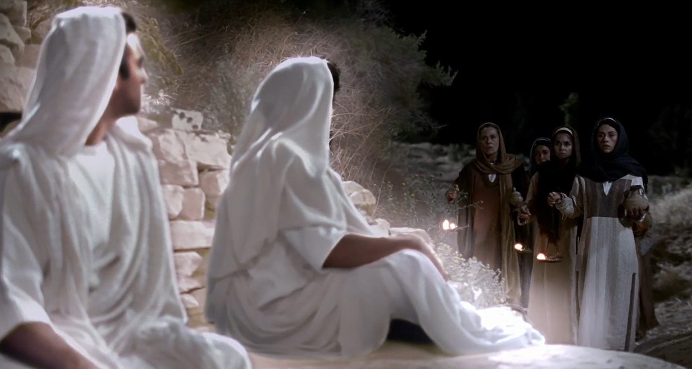
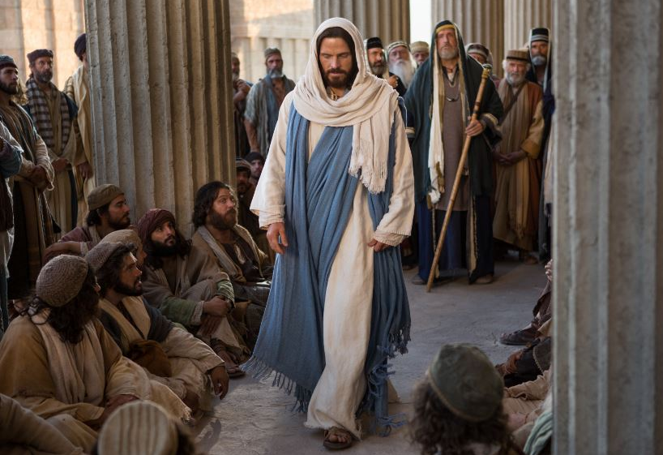
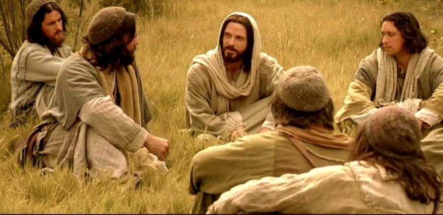
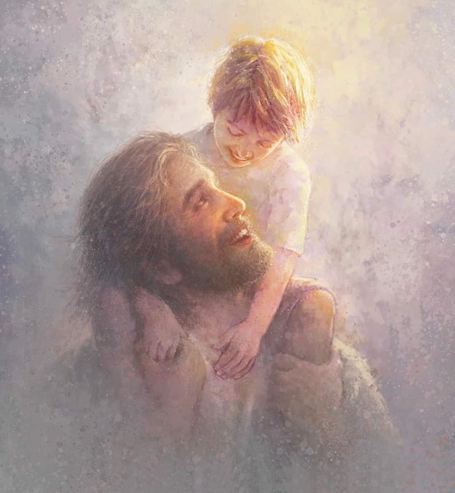
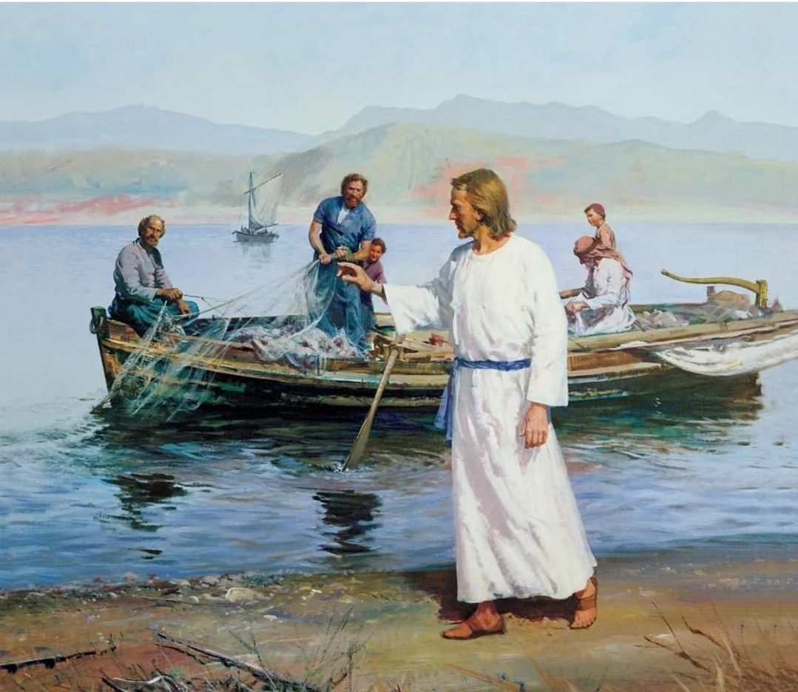

  

     
    

      <b>Mark 막14:1, JST14:1 이틀 후에는 유월절과 무교절의 명절이라 
      </b>
    

     
    
After two days was the passover , and the feast and of unleavened bread. 
    

     
    

      <b>JST14:2 제사장들과 서기관 들이 예수 를 계략으로 붙잡아 사형에 처할 방도 를 모색했으나 
      </b>
    

     
    
And the chief priests, and the scribes, sought how they might take Jesus by craft, and put him to death. 
    
         
  

  

    
  

---

  

     
    

      <b>Mark 막14:2, JST14:3 그들이 서로 이르되 백성 가운데 소동이 나지 않도 록 명절에는 그를 잡지 말자 하더라 
      </b>
    

     
    
But they said among themselves, Let us not take him on the feast day, lest there be an uproar among the people. 
    

     
    

      <b>
      </b>
    

     
    

    
         
  

  

    
  

---

  

     
    

      <b>Mark 막14:3, JST14:4 예수가 베다 니에서 문둥병자 시몬의 집에 앉아 식 사할 때 한 여자가 매우 귀한 감송 향 유가 들어있는 옥합을 가지고 와서 옥 합을 깨뜨려 향유를 그의 머리에 붓는 지라 
      </b>
    

     
    
And Jesus being in Bethany, in the house of Simon the leper, as he sat at meat, there came a woman having an alabaster box of ointment of spikenard, very precious, and she brake the box, and poured the ointment on his head. 
    

     
    

      <b>
      </b>
    

     
    

    
         
  

  

    
  

---

  

     
    

      <b>Mark 막14:4, JST14:5 제자 가운데 어떤 이들이 마음속에 분을 품고 이르 되 어찌하여 이 향유를 허비하는가 
      </b>
    

     
    
And there were some among the disciples who had indignation within themselves, and said, Why was this waste of the ointment made? 
    

     
    

      <b>
      </b>
    

     
    

    
         
  

  

    
  

---

  

     
    

      <b>Mark 막14:5 그것을 삼백 데나리온 이상에 팔아 가난한 자에게 줄 수 있었 겠도다 하며 그녀에게 불평하더라 
      </b>
    

     
    
for it might have been sold for more than three hundred pence, and have been given to the poor. And they murmured against her. 
    

     
    

      <b>Mark 막14:6, JST14:6 이에 예수가 그들에게 이르되 그녀를 가만히 놔두라 어찌하여 너희가 그녀를 괴롭게 하느냐 그녀는 나에게 선한 일을 했나니 
      </b>
    

     
    
And Jesus said unto them , Let her alone; why trouble ye her? For she hath wrought a good work on me. 
    
         
  

  

    
  

---

  

     
    

      <b>Mark 막14:7, JST14:7 가난한 자는 항상 너희와 함께 있어서 너희가 원하 면 언제든지 그들에게 선을 행할 수 있 거니와 나는 너희와 항상 함께 있지 않 으니라 
      </b>
    

     
    
Ye have the poor with you always, and whensoever ye will, ye may do them good; but me ye have not always. 
    

     
    

      <b>
      </b>
    

     
    

    
         
  

  

    
  

---

  

     
    

      <b>Mark 막14:8, JST14:8 그녀는 자기 가 할 수 있는 일을 했으니 다가오는 세대에 어디든지 나의 복음이 전파되는 곳에서는 그녀가 나에게 행한 이 일이 기억 되리라 진실로 그녀는 매장을 위 해 나의 몸에 기름 부으려고 미리 왔느 니라 
      </b>
    

     
    
She has done what she could, and this which she has done unto me, shall be had in remembrance in generations to come, wheresoever my gospel shall be preached; for verily she has come beforehand to anoint my body to the burying. 
    

     
    

      <b>
      </b>
    

     
    

    
         
  

  

    
  

---

  

     
    

      <b>Mark 막14:9, JST14:9 진실로 내가 너희에게 이르노니 이 복음이 전파되는 온 세상 어디든지 그녀가 행한 일도 전 해져서 그녀를 기억하리라 하더라 
      </b>
    

     
    
Verily I say unto you, Wheresoever this gospel shall be preached throug hout the whole world, what she hath done shall be spoken of also for a memorial of her. 
    

     
    

      <b>
      </b>
    

     
    

    
         
  

  

    
  

---

  

     
    

      <b>Mark 막14:12, JST14:10 이제 무교 절 첫날 유월절 양 잡는 날에 제자들이 그에게 이르되 우리가 어디로 가서 당 신이 유월절 먹을 준비하기 를 원하나이 까 하매 
      </b>
    

     
    
And now the first day of unleavened bread, when they killed the passover, his disciples said unto him, Where wilt thou that we go and prepare, that thou mayest eat the passover? 
    

     
    

      <b>
      </b>
    

     
    

    
         
  

  

    
  

---

  

     
    

      <b>Mark 막14:13 그가 두 제자를 보내 며 그들에게 이르되 너희가 성읍에 들 어가면 물 한 동이 들고 가는 사람을 만나리니 그를 따라가서 
      </b>
    

     
    
And he sendeth forth two of his disciples, and said unto them, Go ye into the city, and there shall meet you a man bearing a pitcher of water; follow him; 
    

     
    

      <b>
      </b>
    

     
    

    
         
  

  

    
  

---

  

     
    

      <b>Mark 막14:14 , JST14:12 그 사람이 어디로 들어가 든지 그 집주인에게 이르 기를 선생님이 이르되 내가 제자들과 함께 유월절 먹을 객실이 어디 있느냐 했느니라 하라 
      </b>
    

     
    
And wheresoever he shall go in, say ye to the good man of the house, The Master saith, Where is the guest chamber , where I shall eat the passover with my disciples? 
    

     
    

      <b>
      </b>
    

     
    

    
         
  

  

    
  

---

  

     
    

      <b>Mark 막14:15, JST14:13 그러면 그 가 단장되고 예비된 큰 다락방을 너희 에게 보이리니 그곳에서 우리를 위해 준비하라 하매 
      </b>
    

     
    
And he will show you a large upper room, furnished and prepared; there make ready for us. 
    

     
    

      <b>Mark 막14:16 그의 제자들이 그 성 읍으로 들어가 그가 말한 대로 만나서 유월절을 준비하 니 
      </b>
    

     
    
And his disciples went forth and came into the city, and found as he had said unto them; and they made ready the passover. 
    
         
  

  

    
  

---

  

     
    

      <b>Mark 막14:17 저녁에 그가 열둘과 함께 가니라 
      </b>
    

     
    
And in the evening he cometh with the twelve. 
    

     
    

      <b>Mark 막14:18, JST14:16 그들이 앉 아서 먹을 때에 예수가 이르되 진실로 내가 너희에게 이르노니 나와 함께 먹 는 너희 가운데 하나가 나를 팔리라 하 매 
      </b>
    

     
    
And as they sat and did eat, Jesus said, Verily I say unto you, One of you who eateth with me shall betray me. 
    
         
  

  

    
  

---

  

     
    

      <b>Mark 막14:19 , JST14:17 그들이 모 두 매우 근심하기 시작하여 한 사람씩 그에게 이르되 나니이까 하면 다른 이 가 이르되 나니이까 하는지라 
      </b>
    

     
    
And they all began to be very sorrowful, and began to say unto him one by one, Is it I? and another said, Is it I? 
    

     
    

      <b>Mark 막14:20, JST14:18 이에 그가 대답하여 이르되 나와 함께 그릇에 손 을 넣는 열둘 가운데 하나가 그니라 
      </b>
    

     
    
And he answered and said unto them, It is one of the twelve who dippeth with me in the dish. 
    
         
  

  

    
  

---

  

     
    

      <b>Mark 막14:21 인자는 참으로 자기에 관해 기록된 대로 가거니와 인자를 파 는 그 사람에게 화 있도다 그 사람은 차라리 태어나지 않았다면 좋았으리라 하더라 
      </b>
    

     
    
The Son of man indeed goeth as it is written of him; but woe to that man by whom the Son of man is betrayed! Good were it for that man if he had never been born. 
    

     
    

      <b>
      </b>
    

     
    

    
         
  

  

    
  

---

  

     
    

      <b>Mark 막14:22 , JST14:20 그들이 먹 을 때 예수가 떡을 가져 축복하고 떼어 그들에게 주며 이르되 받아 먹으라 
      </b>
    

     
    
And as they did eat, Jesus took bread and blessed it, and brake , and gave to them, and said, Take it, and eat. 
    

     
    

      <b>
      </b>
    

     
    

    
         
  

  

    
  

---

  

     
    

      <b>JST14:21 보라 이것은 너희가 나의 몸 을 기억하여 행하기 위한 것이니 너희 가 이를 행할 때마다 내가 너희와 함께 있던 이 시간을 너희가 기억하리 라 하 고 
      </b>
    

     
    
Behold, this is for you to do in remembrance of my body; for as oft as ye do this ye will remember this hour that I was with you. 
    

     
    

      <b>Mark 막14:23 또 그가 잔을 가져 감 사드리고 그들에게 주니 그들이 모두 마시매 
      </b>
    

     
    
And he took the cup, and when he had given thanks, he gave it to them; and they all drank of it. 
    
         
  

  

    
  

---

  

     
    

      <b>Mark 막14:24 , JST14:23 그가 이르 되 이것은 많은 사람을 위해 흘리는 나 의 피를 기억하는 것이요 내가 너희에 게 주는 새 언약이니 너희는 온 세상에 나를 증거하라 
      </b>
    

     
    
And he said unto them, This is in remembrance of my blood which is shed for many, and the new testament which I give unto you; for of me ye shall bear record unto all the world. 
    

     
    

      <b>
      </b>
    

     
    

    
         
  

  

    
  

---

  

     
    

      <b>JST14:24 너희가 이 의식을 행할 때마 다 내가 너희와 함께 있으면서 이 잔을 함께 마신 이 시간 곧 나의 성역의 마 지막 시간의 나를 너희가 기억하 리라 
      </b>
    

     
    
And as oft as ye do this ordinance, ye will remember me in this hour that I was with you and drank with you of this cup, even the last time in my ministry. 
    

     
    

      <b>
      </b>
    

     
    

    
         
  

  

    
  

---

  

     
    

      <b>Mark 막14:25 , JST14:25 진실로 내 가 너희에게 이르노니 너희는 이 일에 관해 증언하라 이는 내가 하나님의 왕 국에서 새것으로 마시는 그날까지 다시 는 너희와 함께 포도나무의 열매를 마 시지 않을 것임이 라 하더라 
      </b>
    

     
    
Verily I say unto you, Of this ye shall bear record; for I will no more drink of the fruit of the vine with you, until that day that I drink it new in the kingdom of God. 
    

     
    

      <b>JST14:26 이에 그들이 슬퍼하며 그를 위해 울었더라 
      </b>
    

     
    
And now they were grieved, and wept over him. 
    
         
  

  

    
  

---

  

     
    

      <b>Mark 막14:26, JST14:27 그들이 찬 송을 부르고 밖으로 나가서 감람산으로 들어가니라 
      </b>
    

     
    
And when they had sung a hymn, they went out into the mount of Olives. 
    

     
    

      <b>Mark 막14:27 예수가 그들에게 이르 되 이 밤에 너희가 모두 나로 인해 실 족하리라 이는 기록되었으 되 내가 목자 를 치리니 양들이 흩어지리라 했음이라 
      </b>
    

     
    
And Jesus said unto them, All ye shall be offended because of me this night; for it is written, I will smite the shepherd and the sheep shall be scattered. 
    
         
  

  

    
  

---

  

     
    

      <b>Mark 막14:28 그러나 내가 살아난 후에는 너희보다 먼저 갈릴리에 들어가 리라 하고 
      </b>
    

     
    
But after that I am risen, I will go before you into Galilee. 
    

     
    

      <b>Mark 막14:10, JST14:30 가룟 유다 에게 이르되 너가 하는 일을 속히 행하 되 무죄한 피를 조심하라 했으나 
      </b>
    

     
    
And he said unto Judas Iscariot, What thou doest, do quickly; but beware of innocent blood. 
    
         
  

  

    
  

---

  

     
    

      <b>JST14:31 가룟 유다는 열둘 가운데 하 나이면서 예수를 팔려고 제사장들에게 갔나니 이는 유다가 그의 말로 인해 분 을 품고 그로부터 돌아섰 기 때문이라 
      </b>
    

     
    
Nevertheless, Judas Iscariot, even one of the twelve, went unto the chief priests to betray Jesus unto them; for he turned away from him, and was offended because of his words. 
    

     
    

      <b>
      </b>
    

     
    

    
         
  

  

    
  

---

  

     
    

      <b>Mark 막14:11, JST14:32 이에 제사 장들이 그의 말을 듣고 기뻐하며 그에 게 돈을 주기로 약속하 니 그가 예수를 쉽게 팔 기회를 찾더라 
      </b>
    

     
    
And when the chief priests heard of him they were glad, and promised to give him money; and he sought how he might conveniently betray Jesus. 
    

     
    

      <b>
      </b>
    

     
    

    
         
  

  

    
  

---

  

     
    

      <b>Mark 막14:29 , JST14:33 그러나 베 드로는 예수께 이르되 비록 모든 사람 이 당신에게 실족할 지라도 나는 결코 실족하 지 않겠나이다 하매 
      </b>
    

     
    
But Peter said unto Jesus , Although all men shall be offended with thee, yet I will never be offended. 
    

     
    

      <b>
      </b>
    

     
    

    
         
  

  

    
  

---

  

     
    

      <b>Mark 막14:30, JST14:34 예수가 그 에게 이르되 진실로 내가 너에게 이르 노니 오늘 밤 닭이 두 번 울기 전에 너 가 나를 세 번 부인하리라 하는지라 
      </b>
    

     
    
And Jesus said unto him, Verily I say unto thee, That this day, even in this night, before the cock crow twice, thou shalt deny me thrice. 
    

     
    

      <b>
      </b>
    

     
    

    
         
  

  

    
  

---

  

     
    

      <b>Mark 막14:31, JST14:35 그가 더욱 단호하게 말하되 설령 내가 당신과 함 께 죽을지언정 어떤 일이 있어도 나는 당신을 부인하지 않겠나이다 하니 그들 도 모두 그렇게 말하더 라 
      </b>
    

     
    
But he spake the more vehemently. If I should die with thee, yet will I not deny thee in any wise. Likewise also said they all. 
    

     
    

      <b>
      </b>
    

     
    

    
         
  

  

    
  

---

  

     
    

      <b>Mark 막14:32 , JST14:36 그들이 겟 세마네라 하는 장소에 이르매 그곳은 정원이라 제자들이 심히 놀라고 매우 낙담하여 이 사람이 메시아 인가 의아해 하며 마음속으로 불평하더라 
      </b>
    

     
    
And they came to a place which was named Gethsemane, which was a garden; and the disciples began to be sore amazed, and to be very heavy, and to complain in their hearts, wond ering if this be the Messiah. 
    

     
    

      <b>
      </b>
    

     
    

    
         
  

  

    
  

---

  

     
    

      <b>JST14:37 예수가 그들의 마음을 알고 제자들에게 이르되 내가 기도하는 동안 너희는 여기에 앉아 있으라 하고 
      </b>
    

     
    
And Jesus knowing their hearts, said to his disciples, Sit ye here, while I shall pray. 
    

     
    

      <b>Mark 막14:33 , JST14:38 베드로와 야고보와 요한을 데리고 가서 그들을 꾸짖으 며 
      </b>
    

     
    
And he taketh with him, Peter, and James, and John, and rebuked them, 
    
         
  

  

    
  

---

  

     
    

      <b>Mark 막14:34 , JST14:38 이르되 나 의 영혼이 심히 근심하여 죽을 지경이 니 너희는 여기 머물러 깨어있 으라 하 더라 
      </b>
    

     
    
and said unto them, My soul is exceeding sorrowful, even unto death; tarry ye here and watch. 
    

     
    

      <b>Mark 막14:35 그가 조금 앞으로 나 아가 땅에 엎드려 기도하기를 가능하면 그 시간이 자기로부터 지나가 기를 구하 여 
      </b>
    

     
    
And he went forward a little, and fell on the ground, and prayed, that if it were possible the hour might pass from him. 
    
         
  

  

    
  

---

  

     
    

      <b>Mark 막14:36, JST14:40 이르되 아 바 아버지여 당신에게는 모든 것이 가 능하니 이 잔을 나로부터 거두어 주소 서 그러나 나의 뜻이 아닌 당신의 뜻이 이루어지 기를 원하나이다 하더라 
      </b>
    

     
    
And he said, Abba, Father, all things are possible unto thee; take away this cup from me; nevertheless, not my will, but thine be done. 
    

     
    

      <b>
      </b>
    

     
    

    
         
  

  

    
  

---

  

     
    

      <b>Mark 막14:37 그가 와서 그들이 자 는 것을 보고 베드로에게 이르되 시몬 아 자느냐 너는 한 시간도 깨어있을 수 없더냐 
      </b>
    

     
    
And he cometh and findeth them sleeping, and said unto Pe ter, Simon, sleepest thou? Couldest not thou watch one hour? 
    

     
    

      <b>Mark 막14:38 시험에 들지 않도록 깨어 기도하라 하니 
      </b>
    

     
    
Watch ye and pray, lest ye enter into temptation. 
    
         
  

  

    
  

---

  

     
    

      <b>JST14:43 그들이 그에게 이르되 영은 진실로 준비되었으나 육신이 약하나이 다 하더라 
      </b>
    

     
    
And they said unto him, The spirit truly is ready, but the flesh is weak. 
    

     
    

      <b>Mark 막14:39 그가 다시 가서 똑같 은 말로 기도하고 
      </b>
    

     
    
And again he went away and prayed, and spake the same words. 
    
         
  

  

    
  

---

  

     
    

      <b>Mark 막14:40, JST14:45 돌아와 그 들이 또 자는 것을 보았나니 이는 그들 의 눈이 무거웠 음이요 그들은 그에게 뭐라고 대답해야 할지도 모르더라 
      </b>
    

     
    
And when he returned, he found them asleep again, for their eyes were heavy; neither knew they what to answer him. 
    

     
    

      <b>
      </b>
    

     
    

    
         
  

  

    
  

---

  

     
    

      <b>Mark 막14:41, JST14:46 그가 세 번 째로 그들에게 와서 이르되 이제는 자 고 쉬라 그것으로 충분하니 때가 왔도 다 보라 인자가 팔려 죄인들 의 손에 넘 겨지느니라 하더라 
      </b>
    

     
    
And he cometh to them the third time, and said unto them, Sleep on now and take rest; it is enough, the hour is come; behold, the Son of man is betrayed into the hands of sinners. 
    

     
    

      <b>
      </b>
    

     
    

    
         
  

  

    
  

---

  

     
    

      <b>Mark 막14:42, JST14:47 그들이 잠 을 다 자고 나서 그가 이르되 일어나라 가자 보라 나를 파는 자가 가까이 왔느 니라 하니 
      </b>
    

     
    
And after they had finished their sleep, he said, Rise up, let us go; lo, he who betrayeth me is at hand. 
    

     
    

      <b>
      </b>
    

     
    

    
         
  

  

    
  

---

  

     
    

      <b>Mark 막14:43 아직 그의 말이 끝나 기 전에 열둘 가운데 하나인 유다가 오 는데 제사장들과 서기관 들과 장로들이 보낸 큰 무리가 칼과 몽둥이를 들고 그 와 함께하더라 
      </b>
    

     
    
And immediately while he yet spake, cometh Judas, one of the twelve, and with him a great multitude, with swords and staves, from the chief priests, and the scribes and the elders. 
    

     
    

      <b>
      </b>
    

     
    

    
         
  

  

    
  

---

  

     
    

      <b>Mark 막14:44, JST14:49 그를 판 자 가 그들에게 표시를 주어 이르되 누구 든지 내가 입 맞추는 자가 그이니 그를 붙들어 단단히 끌어가라 하고 
      </b>
    

     
    
And he who betrayed him had given them a token, saying, Whomsoever I shall kiss, that same is he; take him, and lead him away safely. 
    

     
    

      <b>Mark 막14:45 와서 곧바로 그에게 가서 이르되 선생님 이여 선생님 이여 하 며 입 맞추니 
      </b>
    

     
    
And as soon as he was come, he goeth straightway to him, and said, Master, Master, and kissed him. 
    
         
  

  

    
  

---

  

     
    

      <b>Mark 막14:46 그들이 그에게 손대어 그를 붙들더라 
      </b>
    

     
    
And they laid their hands on him, and took him. 
    

     
    

      <b>Mark 막14:47, JST14:52 이에 곁에 섰던 자 가운데 하나가 칼을 빼어 대제 사장의 종을 쳐서 그의 귀를 잘라버렸 으나 
      </b>
    

     
    
And one of them, who stood by, drew his sword, and smote a servant of the high priest, and cut off his ear. 
    
         
  

  

    
  

---

  

     
    

      <b>Mark 막14:48, JST14:53 예수가 그 에게 명하여 칼을 도로 넣으라 하고 이 르되 칼을 잡는 자는 칼로 망하느니라 하며 손가락을 내밀어 대제사장의 종을 낫게 하더라 
      </b>
    

     
    
But Jesus commanded him to return his sword, saying, He who taketh the sword shall perish with the sword. And he put forth his finger and healed the servant of the high priest. 
    

     
    

      <b>
      </b>
    

     
    

    
         
  

  

    
  

---

  

     
    

      <b>JST14:54 예수가 그들에게 대답하여 이르되 너희가 도둑을 대하는 것처럼 나를 붙들려고 칼과 몽둥이를 들고 나 왔느냐 
      </b>
    

     
    
And Jesus answered and said unto them, Are ye come out as against a thief, with swords and staves to take me? 
    

     
    

      <b>Mark 막14:49 내가 매일 너희와 함 께하며 성전에서 가르쳤으되 너희가 나 를 붙들지 않았거니와 경전이 반드시 성취되어 야 하느니라 하니 
      </b>
    

     
    
I was daily with you in the temple teaching, and ye took me not; but the scriptures must be fulfilled. 
    
         
  

  

    
  

---

  

     
    

      <b>Mark 막14:50, JST14:56 제자들이 이 말을 듣고 모두 그를 버리고 도망하 더라 
      </b>
    

     
    
And the disciples, when they heard this saying, all forsook him, and fled. 
    

     
    

      <b>Mark 막14:51, JST14:57 어떤 젊은 제자 하나가 벌거벗 은 몸에 세마포 를 두르고 그를 따라가다 가 청년들이 그를 붙잡으매 
      </b>
    

     
    
And there followed him a certain young man, a disciple, having a linen cloth cast about his naked body; and the young men laid hold on him, 
    
         
  

  

    
  

---

  

     
    

      <b>Mark 막14:52, JST14:57 그가 세마 포를 버리고 벌거벗 은 몸으로 그들로부 터 도망하여 그들의 손에서 벗어나 자 신을 구원하더라 
      </b>
    

     
    
and he left the linen cloth and fled from them naked, and saved himself out of their hands. 
    

     
    

      <b>Mark 막14:53 그들이 예수를 대제사 장에게 끌고 가니 모든 제사장과 장로 들과 서기관 들이 그에게 모였더라 
      </b>
    

     
    
And they led Jesus away to the high priest, and with him were assembled all the chief priests, and the elders and the scribes. 
    
         
  

  

    
  

---

  

     
    

      <b>Mark 막14:54 베드로는 멀리서 그를 따라가 더니 대제사장 의 관저에까지 들 어가 종들과 함께 앉아 불을 쬐더라 
      </b>
    

     
    
And Peter followed him afar off, even unto the palace of the high priest; and he sat with the servants, and warmed himself at the fire. 
    

     
    

      <b>
      </b>
    

     
    

    
         
  

  

    
  

---

  

     
    

      <b>Mark 막14:55 제사장들과 모든 공회 가 예수를 사형에 처하기 위해 그를 대 적할 증인을 찾았으나 찾지 못했나니 
      </b>
    

     
    
And the chief priests and all the council sought for witness against Jesus, to put him to death, but found none; 
    

     
    

      <b>Mark 막14:56, JST14:61 많은 사람 이 그를 대적하여 거짓 증언 했으되 그 들의 증언이 서로 일치하지 않더라 
      </b>
    

     
    
Though many bare false witness against him, yet their witness agreed not together. 
    
         
  

  

    
  

---

  

     
    

      <b>Mark 막14:57, JST14:62 이에 어떤 사람들이 일어나 그를 대적하여 거짓 증언하 며 이르되 
      </b>
    

     
    
And there arose certain men and bare false witness against him, saying, 
    

     
    

      <b>Mark 막14:58 그가 이르기를 내가 손으로 만든 이 성전을 허물고 삼 일 만에 손으로 만들지 않은 다른 것을 짓 겠다 하는 것을 우리가 들었노라 했으 나 
      </b>
    

     
    
We heard him say, I will destroy this temple that is made with hands, and within three days I will build another made without hands; 
    
         
  

  

    
  

---

  

     
    

      <b>Mark 막14:59, JST14:63 그들의 증 언도 서로 일치하지 않더라 
      </b>
    

     
    
But neither did their witness agree together. 
    

     
    

      <b>Mark 막14:60 이에 대제사장이 가운 데 서서 예수께 물어 이르되 
      </b>
    

     
    
And the high priest stood up in the midst, and asked Jesus, saying, JST14:65 너는 아무런 대답이 없느냐 너를 대적하는 이 증언들이 무엇인지 너는 알지 못하느냐 했으나 Answerest thou nothing? Knowest thou not what these witness against thee? 
    
         
  

  

    
  

---

  

     
    

      <b>Mark 막14:61 그가 잠잠하고 아무것 도 대답하지 않으니 대제사장이 그에게 다시 물어 이르되 너가 복되신 이의 아 들 그리스도냐 하매 
      </b>
    

     
    
But he held his peace, and answered nothing. Again the high priest asked him and said unto him, Art thou the Christ, the Son of the Blessed? 
    

     
    

      <b>
      </b>
    

     
    

    
         
  

  

    
  

---

  

     
    

      <b>Mark 막14:62 예수가 이르되 내가 그니라 또 너희는 인자가 권능의 오른 편에 앉아 하늘 구름 가운데 오는 것을 보리라 하더라 
      </b>
    

     
    
And Jesus said, I am; and ye shall see the Son of man sitting on the right hand of power, and coming in the clouds of heaven. 
    

     
    

      <b>Mark 막14:63 이에 대제사장이 자기 옷을 찢으며 이르되 우리에게 무슨 증 인들이 더 필요하겠느냐 
      </b>
    

     
    
Then the high priest rent his clothes and said, What need we any further witnesses? 
    
         
  

  

    
  

---

  

     
    

      <b>Mark 막14:64 신성모독 하는 말을 너희가 들었으니 너희는 어떻게 생각하 느냐 하매 그들이 모두 그에게 사형에 해당하는 죄가 있는 것으로 정죄하더라 
      </b>
    

     
    
Ye have heard the blasphemy; what think ye? And they all condemned him to be guilty of death. 
    

     
    

      <b>
      </b>
    

     
    

    
         
  

  

    
  

---

  

     
    

      <b>Mark 막14:65 어떤 이들은 그에게 침 뱉고 그의 얼굴을 가리고 주먹으로 치며 이르되 예언하라 하고 종들은 손 바닥으로 그를 때리더라 
      </b>
    

     
    
And some began to spit on him, and to cover his face, and to buffet him, and to say unto him, Prophesy; And the servants did strike him with the palms of their hands. 
    

     
    

      <b>
      </b>
    

     
    

    
         
  

  

    
  

---

  

     
    

      <b>Mark 막14:66 베드로가 관저 아래쪽 에 있을 때 대제사장의 여종 하나가 와 서 
      </b>
    

     
    
And as Peter was beneath in the palace, there cometh one of the maids of the high priest, 
    

     
    

      <b>Mark 막14:67, JST14:74 불 쬐고 있 는 베드로 를 바라보며 이르되 당신도 나사렛 예수와 함께 있었도다 했으나 
      </b>
    

     
    
And when she saw Peter warming himself, she looked upon him and said, Thou also wast with Jesus of Nazareth. 
    
         
  

  

    
  

---

  

     
    

      <b>Mark 막14:68 그가 부인하여 이르되 나는 너가 말하는 것을 알지 못하고 이 해하지도 못하겠 노라 하고 출입문으로 나가니 닭이 울더라 
      </b>
    

     
    
But he denied, saying, I know not, neither understand I what thou sayest. And he went out into the porch; and the cock crew. 
    

     
    

      <b>Mark 막14:69 다시 한 여종이 그를 보고 옆에 서 있는 사람들에게 이르되 이 사람은 그들 가운데 하나라 하매 
      </b>
    

     
    
And a maid saw him again, and began to say to them who stood by, This is one of them. 
    
         
  

  

    
  

---

  

     
    

      <b>Mark 막14:70, JST14:78 그가 또 부 인하더라 잠시 후에 옆에 서 있는 사람 들이 베드로에게 다시 이르되 분명히 너는 그들 가운데 하나이니 너가 갈릴 리 사람이라는 것을 너의 말투가 증명 하느니 라 했으나 
      </b>
    

     
    
And he denied it again. And a little after, they who stood by, said again to Peter, Surely thou art one of them; for thou art a Galilean, thy speech agreeth thereto. 
    

     
    

      <b>
      </b>
    

     
    

    
         
  

  

    
  

---

  

     
    

      <b>Mark 막14:71 그가 저주하고 맹세하 며 이르되 나는 너희가 말하는 이 사람 을 알지 못하노라 하니 
      </b>
    

     
    
But he began to curse and to swear, saying, I know not this man of whom ye speak. 
    

     
    

      <b>
      </b>
    

     
    

    
         
  

  

    
  

---

  

     
    

      <b>Mark 막14:72, JST14:80 두 번째로 닭이 울더라 이에 베드로의 마음에 예 수가 그에게 일러 닭이 두 번 울기 전 에 너가 나를 세 번 부인하리라 한 말 이 생각나서 밖으로 나가 엎드려 비통 하게 울었더라 
      </b>
    

     
    
And the second time the cock crew; And Peter called to mind the words that Jesus said unto him, Before the cock crow twice, thou shalt deny me thrice. And he went out, and fell upon his face, and wept bitterly.
    

     
    

      <b>
      </b>
    

     
    

    
         
  

  

    
  

