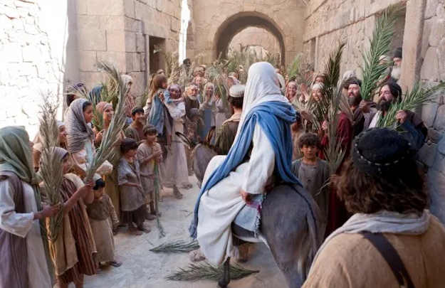

  

     
    

      <b>Mark 막2:1, JST2:1 또 여러 날 후에 그가 가버나움에 들어가매 그가 집에 있다는 소문이 널리 퍼지고 
      </b>
    

     
    
And again, he entered into Capernaum after many days; and it was noised abroad that he was in the house. 
    

     
    

      <b>
      </b>
    

     
    

    
         
  

  

    
  

---

  

     
    

      <b>Mark 막2:2, JST 2:2 곧바로 많은 사 람이 몰려들어 문 주변까지도 무리를 받을 자리가 없었으 되 그가 그들에게 말씀을 전파하더라 
      </b>
    

     
    
And straightway many were gathered together, insomuch that there was no room to receive the multitude; no, not so much as about the door; and he preached the word unto them. 
    

     
    

      <b>
      </b>
    

     
    

    
         
  

  

    
  

---

  

     
    

      <b>Mark 막2:3, JST 2:3 사람들이 한 중 풍병자 를 네 사람이 메고 그에게 데려 오더니 
      </b>
    

     
    
And they came unto him, bringing one sick of the palsy, which was borne of four persons . 
    

     
    

      <b>
      </b>
    

     
    

    
         
  

  

    
  

---

  

     
    

      <b>Mark 막2:4 무리가 몰려있어 가까이 갈 수 없게 되자 그가 있는 곳의 지붕 을 걷어내어 구멍을 내고 중풍병자 가 누워있는 침상을 달아내리 매 
      </b>
    

     
    
And when they could not come nigh unto him, for the press, they uncovered the roof where he was; and when they had broken it up, they let down the bed wherein the sick of the palsy lay. 
    

     
    

      <b>
      </b>
    

     
    

    
         
  

  

    
  

---

  

     
    

      <b>Mark 막2:5 예수가 그들의 신앙을 보고 중풍병자 에게 이르되 아들아 너의 죄가 용서받았느니라 하더라 
      </b>
    

     
    
When Jesus saw their faith, he said unto the sick of the palsy, Son, thy sins be forgiven thee. 
    

     
    

      <b>Mark 막2:6 그러나 그곳에 앉아 있 는 어떤 서기관 들이 마음속으로 생각하 기를 
      </b>
    

     
    
But there were certain of the scribes sitting there, and reasoning in their hearts, 
    
         
  

  

    
  

---

  

     
    

      <b>Mark 막2:7 어찌하여 이 사람이 이 렇게 신성모독 하는 말을 하는가 하나 님 외에는 누가 죄를 용서할 수 있는가 하니 
      </b>
    

     
    
why doth this man thus speak blasphemies? Who can forgive sins but God only? 
    

     
    

      <b>
      </b>
    

     
    

    
         
  

  

    
  

---

  

     
    

      <b>Mark 막2:8 그들이 속으로 그렇게 생각하는 것을 예수가 즉시 자기 영으 로 알고 그들에게 이르되 어찌하여 너 희가 이것들을 마음속에 생각하느냐 
      </b>
    

     
    
And immediately, when Jesus perceived in his spirit, that they so reasoned within themselves, he said unto them, Why reason ye these things in your hearts? 
    

     
    

      <b>
      </b>
    

     
    

    
         
  

  

    
  

---

  

     
    

      <b>Mark 막2:9, JST2:7 중풍병자 에게 너 의 죄가 용서받았 느니라 말는 말이 일 어나 너의 침상을 들고 걸어가라 하는 말보다 쉽지 않으냐 
      </b>
    

     
    
Is it not easier to say to the sick of the palsy, Thy sins be forgiven thee; than to say, Arise, and take up thy bed and walk? 
    

     
    

      <b>
      </b>
    

     
    

    
         
  

  

    
  

---

  

     
    

      <b>Mark 막2:10 그러나 너희로 하여금 인자가 땅에서 죄를 용서하는 권능을 가진 것을 알게 하려 하노라 하고 (중 풍병자 에게 이르되 ) 
      </b>
    

     
    
But that ye may know that the Son of man hath power on earth to forgive sins, (he said to the sick of the palsy,) 
    

     
    

      <b>Mark 막2:11, JST 2:8 너에게 이르노 니 일어나 침상을 들고 집으로 가라 하 매 
      </b>
    

     
    
I say unto thee, Arise, and take up thy bed, go thy way into thy house. 
    
         
  

  

    
  

---

  

     
    

      <b>Mark 막2:12, JST 2:9 그가 즉시 일 어나 침상을 들고 모든 사람 앞에서 나 가는지라 그들이 모두 놀라고 많은 사 람이 하나님께 영광을 돌리며 이르되 우리가 이런 방식으로 행해지는 하나님 의 능력을 결코 보지 못했다 하더라 
      </b>
    

     
    
And immediately he arose, took up the bed, and went forth before them all; insomuch that they were all amazed, and many glorified God, saying, We never saw the power of God after this manner. 
    

     
    

      <b>
      </b>
    

     
    

    
         
  

  

    
  

---

  

     
    

      <b>Mark 막2:13, JST 2:10 예수가 다시 바닷가에 나가매 모든 무리가 그에게 모여드니 그가 그들을 가르치 더라 
      </b>
    

     
    
And Jesus went forth again by the seaside ; and all the multitude resorted unto him, and he taught them. 
    

     
    

      <b>
      </b>
    

     
    

    
         
  

  

    
  

---

  

     
    

      <b>Mark 막2:14, JST 2:11 그가 지나가 면서 알패오의 아들 레위가 당시의 관 례에 따라 공세 받는 곳에 앉아 있는 것을 보고 그에게 이르되 나를 따르라 하니 일어나 따르더 라 
      </b>
    

     
    
And as he passed by, he saw Levi the son of Alpheus, sitting at the place where they receive tribute, as was customary in those days, and he said unto him, Follow me; and he arose and followed him. 
    

     
    

      <b>
      </b>
    

     
    

    
         
  

  

    
  

---

  

     
    

      <b>Mark 막2:15, JST 2:12 그리고 이렇 게 되었나니 예수가 그의 집에 앉아 식 사할 때 많은 세리와 죄인도 그와 그의 제자들과 함께 앉았는데 그 수효가 많 았으며 그들이 그를 따르더라 
      </b>
    

     
    
And it came to pass, that, as Jesus sat at meat in his house, many publicans and sinners sat also together with him and his disciples; for there were many, and they followed him. 
    

     
    

      <b>
      </b>
    

     
    

    
         
  

  

    
  

---

  

     
    

      <b>Mark 막2:16 서기관 들과 바리새인 들 이 그가 세리와 죄인들과 함께 먹는 것 을 보고 그의 제자들에게 이르되 어찌 하여 그는 세리와 죄인들과 함께 먹고 마시느냐 하매 
      </b>
    

     
    
And when the scribes and Pharisees saw him eat with publicans and sinners, they said unto his disciples, How is it that he eateth and drinketh with publicans and sinners? 
    

     
    

      <b>
      </b>
    

     
    

    
         
  

  

    
  

---

  

     
    

      <b>Mark 막2:17, JST 2:14,15 예수가 이 말을 듣고 그들에게 이르되 온전한 자 에게는 의사가 필요 없고 병든 자에게 필요하 나니 나는 의인을 부르러 온 것 이 아니요 죄인을 불러 회개하게 하려 고 왔느니라 하더라 
      </b>
    

     
    
When Jesus heard this, he said unto them, They that are whole have no need of the physician, but they that are sick. I came not to call the righteous, but sinners to repentance. 
    

     
    

      <b>
      </b>
    

     
    

    
         
  

  

    
  

---

  

     
    

      <b>Mark 막2:18, JST 2:16 이에 그들이 와서 그에게 이르되 요한과 바리새인의 제자들은 자주 금식하느니라 어찌하여 요한과 바리새인의 제자들은 금식하 고 너의 제자들은 금식하지 않느냐 하니 
      </b>
    

     
    
And they came and said unto him, The disciples of John and of the Pharisees used to fast; and why do the disciples of John and of the Pharisees fast, but thy disciples fast not? 
    

     
    

      <b>
      </b>
    

     
    

    
         
  

  

    
  

---

  

     
    

      <b>Mark 막2:19 예수가 그들에게 이르 되 혼인집 아이들이 신랑과 함께 있는 동안에 금식할 수 있느냐 그들이 신랑 과 함께 있는 동안에는 금식할 수 없느 니라 
      </b>
    

     
    
And Jesus said unto them, Can the children of the bridechamber fast, while the bridegroom is with them? As long as they have the bridegroom with them, they cannot fast. 
    

     
    

      <b>
      </b>
    

     
    

    
         
  

  

    
  

---

  

     
    

      <b>Mark 막2:20 그러나 그들로부터 신 랑을 빼앗아 가는 날이 오리니 그날에 는 그들이 금식하리라 
      </b>
    

     
    
But the days will come, when the bridegroom shall be taken away from them, and then shall they fast in those days. 
    

     
    

      <b>
      </b>
    

     
    

    
         
  

  

    
  

---

  

     
    

      <b>Mark 막2:21 새 옷 조각을 낡은 옷 에 깁는 자가 없나니 그렇게 하면 기워 진 새 조각이 낡은 것을 당겨서 더 심 하게 찢어지 느니라 
      </b>
    

     
    
No man also seweth a piece of new cloth on an old garment; else the new piece that filled it up taketh away from the old, and the rent is made worse. 
    

     
    

      <b>
      </b>
    

     
    

    
         
  

  

    
  

---

  

     
    

      <b>Mark 막2:22 새 포도주를 낡은 부대 에 넣는 자가 없나니 그렇게 하면 새 포도주가 부대를 터뜨려 포도주가 쏟아지고 부대는 못쓰게 되리라 그러므로 새 포도주는 반드시 새 부대에 넣어야 하느니라 하더라 
      </b>
    

     
    
And no man putteth new wine into old bottles; else the new wine doth burst the bottles, and the wine is spilled, and the bottles will be marred; but new wine must be put into new bottles. 
    

     
    

      <b>
      </b>
    

     
    

    
         
  

  

    
  

---

  

     
    

      <b>Mark 막2:23, JST 2:21 그리고 이렇 게 되었나니 그가 안식일에 밀밭을 지 나는데 그의 제자들이 가면서 밀 이삭 을 따는지라 
      </b>
    

     
    
And it came to pass, that he went through the cornfields on the Sabbath day; and his disciples began, as they went, to pluck the ears of corn. 
    

     
    

      <b>
      </b>
    

     
    

    
         
  

  

    
  

---

  

     
    

      <b>Mark 막2:24, JST2:22 바리새인 들이 그에게 이르되 보라 어찌하여 너의 제 자들이 안식일에 적법하지 않은 일을 하느냐 하매 
      </b>
    

     
    
And the Pharisees said unto him, Behold, why do thy disciples on the Sabbath day that which is not lawful? 
    

     
    

      <b>
      </b>
    

     
    

    
         
  

  

    
  

---

  

     
    

      <b>Mark 막2:25, JST 2:23 그가 이르되 너희는 다윗이 자기와 또 그와 함께한 자들이 궁핍하고 굶주렸을 때 행한 일 을 읽어본 적이 없느냐 
      </b>
    

     
    
And he said unto them, Have ye never read what David did, when he had need, and was an hungered, he, and they who were with him? 
    

     
    

      <b>
      </b>
    

     
    

    
         
  

  

    
  

---

  

     
    

      <b>Mark 막2:26 대제사장 아비아달의 시대에 그가 어찌하여 하나님의 집에 들어가 제사장 들 외에는 먹는 것이 적 법하지 않은 진설병을 먹고 자기와 함 께한 자들에게도 주었느냐 하고 
      </b>
    

     
    
How he went into the house of God, in the days of Abiathar the high priest, and did eat the shew bread, which is not lawful to eat but for the priests, and gave also to them which were with him? 
    

     
    

      <b>
      </b>
    

     
    

    
         
  

  

    
  

---

  

     
    

      <b>Mark 막2:27 그들에게 이르되 안식 일은 사람을 위해 만들어진 것이요 사 람이 안식일을 위해 있는 것이 아니니 라 
      </b>
    

     
    
And he said unto them, The Sabbath was made for man, and not man for the Sabbath. 
    

     
    

      <b>JST2:26 그러므로 안식일은 휴식하는 날로 사람에게 주어졌 고 사람이 하나님 을 영화롭게 하는 날로 주어졌 으되 먹 는 것을 금하는 날이 아니니 
      </b>
    

     
    
Wherefore the Sabbath was given unto man for a day of rest; and also that man should glorify God, and not that man should not eat; 
    
         
  

  

    
  

---

  

     
    

      <b>Mark 막2:28, JST 2:27 이는 인자가 안식일을 만들었 음이라 그러므로 인자 는 안식일에 관해서 도 주인이니라 하더 라 
      </b>
    

     
    
For the Son of man made the Sabbath day, therefore the Son of man is Lord also of the Sabbath.
    

     
    

      <b>
      </b>
    

     
    

    
         
  

  

    
  

