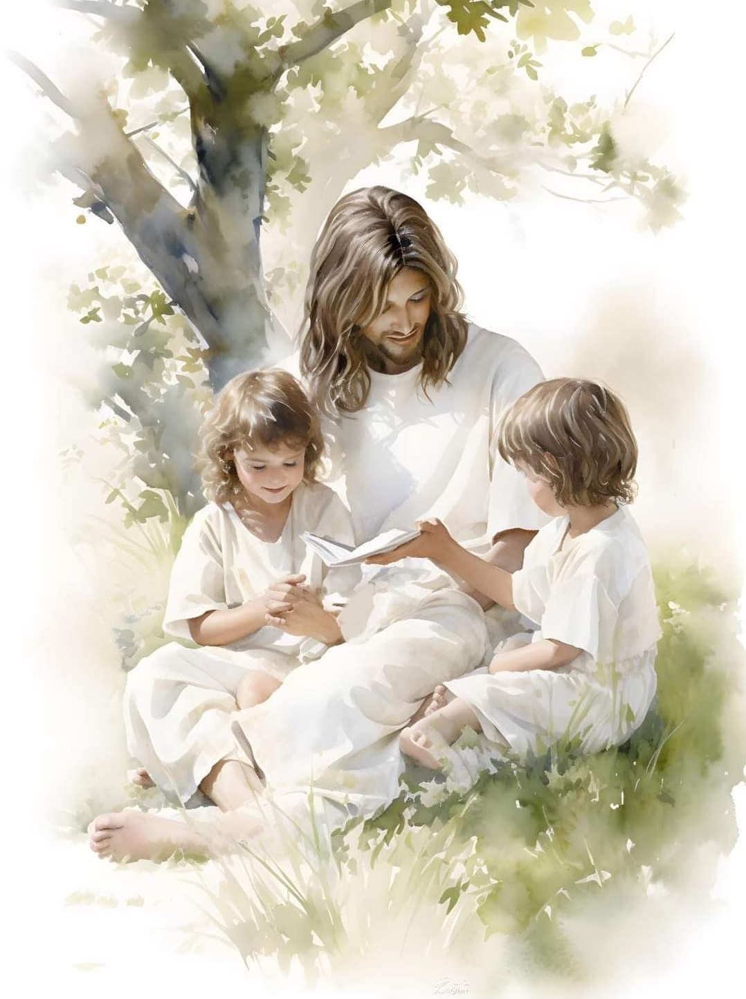

  

     
    

      <b>Mark 막3:1 그가 회당에 다시 들어 가니 손 마른 사람이 있는데 
      </b>
    

     
    
And he entered again into the synagogue; and there was a man there which had a withered hand. 
    

     
    

      <b>Mark 막3:2, JST 3:2 그들은 그가 안 식일에 그를 낫게 하는지 보려고 그를 주목했나니 이는 그들이 그를 고소하려 함이더라 
      </b>
    

     
    
And they watched him to see whether he would heal him on the Sabbath day; that they might accuse him. 
    
         
  

  

    
  

---

  

     
    

      <b>Mark 막3:3, JST3:3 그가 손 마른 사 람에게 이르되 앞에 서라 하고 
      </b>
    

     
    
And he said unto the man which had the withered hand, Stand forth. 
    

     
    

      <b>Mark 막3:4, JST3:4 그들에게 이르되 안식일에 선을 행하는 것이 적법하냐 아니면 악을 행하는 것이 적법하냐 생 명을 구원하는 것이냐 아니면 죽이는 것이냐 하니 그들이 잠잠하더라 
      </b>
    

     
    
And he said unto them, Is it lawful to do good on the Sabbath days, or to do evil? To save life, or to kill? But they held their peace. 
    
         
  

  

    
  

---

  

     
    

      <b>Mark 막3:5 그들의 마음이 완악함으 로 인해 슬퍼하며 노여움으로 그들을 둘러보고 그 사람에게 이르되 너의 손 을 내밀라 하니 
      </b>
    

     
    
And when he had looked round about on them with anger, being grieved for the hardness of their hearts, he said unto the man, Stretch forth thine hand. 
    

     
    

      <b>JST3:6 그가 손을 내밀매 그 손이 다 른 손처럼 온전히 회복되더라 
      </b>
    

     
    
And he stretched out his hand ; and his hand was restored whole as the other. 
    
         
  

  

    
  

---

  

     
    

      <b>Mark 막3:6 이에 바리새인 들이 나가 서 곧바로 헤롯당과 함께 그를 대적하 여 의논하고 어떻게 그를 죽일까 하더 라 
      </b>
    

     
    
And the Pharisees went forth, and straightway took counsel with the Herodians against him, how they might destroy him. 
    

     
    

      <b>Mark 막3:7 예수가 제자들과 함께 바다로 물러가니 그를 따라 갈릴리와 유대와 
      </b>
    

     
    
But Jesus withdrew himself, with his disciples, to the sea; and a great multitude from Galilee followed him, and from Judea, 
    
         
  

  

    
  

---

  

     
    

      <b>Mark 막3:8 예루살렘과 에돔과 요단 강 건너편 으로부터 온 큰 무리와 두로 와 시돈 주변 사람의 큰 무리가 그가 행한 큰 일을 듣고 그에게 나아오 는지 라 
      </b>
    

     
    
and from Jerusalem, and from Idumea and from beyond Jordan; and they about Tyre and Sidon, a great multitude, when they heard what great things he did, came unto him. 
    

     
    

      <b>
      </b>
    

     
    

    
         
  

  

    
  

---

  

     
    

      <b>Mark 막3:9, JST3:9 그가 제자들에게 말하여 작은 배를 준비하게 했나니 이 는 무리로 인해 사람들이 그에게 몰려 들지 않게 하려 함이라 
      </b>
    

     
    
And he spake unto his disciples, that a small ship should wait on him, because of the multitude, lest they should throng him. 
    

     
    

      <b>Mark 막3:10 그가 많은 사람을 낫게 하매 사람들이 그에게 손대려고 몰려들 었더라 역병에 걸리거나 
      </b>
    

     
    
For he had healed many; insomuch that they pressed upon him for to touch him. As many as had plagues 
    
         
  

  

    
  

---

  

     
    

      <b>Mark 막3:11 부정한 영에 들린 자마 다 그를 보고 그 앞에 넘어지며 소리 질러 이르되 당신은 하나님의 아들이니 이다 하는지라 
      </b>
    

     
    
and unclean spirits, when they saw him, fell down before him, and cried, saying, Thou art the Son of God. 
    

     
    

      <b>Mark 막3:12 그가 그들에게 엄하게 명하여 자기를 알리지 말라 하고 
      </b>
    

     
    
And he straitly charged them that they should not make him known. 
    
         
  

  

    
  

---

  

     
    

      <b>Mark 막3:13, JST 3:12 산으로 올라 가 그가 원하는 자를 부르니 그들이 그 에게 오더라 
      </b>
    

     
    
And he goeth up into a mountain, and calleth whom he would; and they came unto him. 
    

     
    

      <b>Mark 막3:14 그가 열둘을 성임하여 자기와 동행하게 하고 그들을 보내어 전도하게 하며 
      </b>
    

     
    
And he ordained twelve, that they should be with him, and that he might send them forth to preach, 
    
         
  

  

    
  

---

  

     
    

      <b>Mark 막3:15 병을 낫게 하고 악마를 쫓아낼 능력을 주었더라 
      </b>
    

     
    
and to have power to heal sickness, and to cast out devils. 
    

     
    

      <b>Mark 막3:16 시몬에게 는 베드로라는 이름을 붙여주고 
      </b>
    

     
    
And Simon he surnamed Peter; 
    
         
  

  

    
  

---

  

     
    

      <b>Mark 막3:17 세베대의 아들 야고보 와 야고보의 형제 요한에게는 보아너게 곧 우레의 아들들이라는 이름을 붙여주 었으며 
      </b>
    

     
    
and James the son of Zebedee, and John the brother of James; and he surnamed them Boanerges, which is, The sons of thunder; 
    

     
    

      <b>
      </b>
    

     
    

    
         
  

  

    
  

---

  

     
    

      <b>Mark 막3:18 안드레와 빌립과 바돌 로매와 마태와 도마와 알패오의 아들 야고보와 다대오와 가나안 사람 시몬과 
      </b>
    

     
    
and Andrew, and Philip, and Barth olomew, and Matthew, and Thomas, and James the son of Alpheus, and Thaddeus, and Simon the Canaanite, 
    

     
    

      <b>Mark 막3:19, JST 3:14 가룟 유다니 그는 그를 판 자이기도 하더라 그들이 한 집으로 들어가매 
      </b>
    

     
    
and Judas Iscariot, which also betra yed him; and they went into a house. 
    
         
  

  

    
  

---

  

     
    

      <b>Mark 막3:20 무리가 다시 와서 모이 므로 식사할 겨를도 없더라 
      </b>
    

     
    
And the multitude cometh together again, so that they could not so much as eat bread. 
    

     
    

      <b>Mark 막3:21, JST 3:16 그의 친구들 이 그가 말하는 것을 듣고 와서 그를 붙들려 했나니 이는 그들이 이르되 그 가 미쳤다 함이더라 
      </b>
    

     
    
And when his friends heard him speak , they went out to lay hold on him; for they said, He is beside himself. 
    
         
  

  

    
  

---

  

     
    

      <b>Mark 막3:22, JST3:17 예루살렘 으로 부터 내려온 서기관 들이 이르되 그는 바알세붑 에 들렸으며 악마의 왕을 통해 악마를 쫓아내는 것이라 하니 
      </b>
    

     
    
And the scribes which came down from Jerusalem, said, He hath Beelzebub, and by the prince of the devils, he casteth out devils. 
    

     
    

      <b>
      </b>
    

     
    

    
         
  

  

    
  

---

  

     
    

      <b>Mark 막3:23, JST 3:18 예수가 이를 알고 그들을 불러 비유로 그들에게 이 르되 사탄이 어떻게 사탄을 쫓아낼 수 있느냐 
      </b>
    

     
    
Now Jesus knew this, and he called them, and said unto them in parables, How can Satan cast out Satan? 
    

     
    

      <b>Mark 막3:24, JST3:18 한 왕국이 스 스로 대적하여 나누어지 면 어떻게 그 왕국이 서겠느냐 
      </b>
    

     
    
And if a kingdom be divided against itself, how can that kingdom stand? 
    
         
  

  

    
  

---

  

     
    

      <b>Mark 막3:25 한 집이 스스로 대적하 여 나누어지 면 그 집은 설 수 없나니 
      </b>
    

     
    
And if a house be divided against itself, that house cannot stand. 
    

     
    

      <b>Mark 막3:26, JST 3:19 사탄이 자신 을 대적하여 일어나서 나누어지 면 그는 설 수 없고 속히 종말을 맞느니라 
      </b>
    

     
    
And if Satan rise up against himself and be divided, he cannot stand; but speedily hath an end. 
    
         
  

  

    
  

---

  

     
    

      <b>Mark 막3:27 먼저 강한 자를 결박하 지 않고는 강한 자의 집에 들어가 그의 재물을 약탈할 수 있는 자가 없나니 그 후에야 그의 집을 약탈하리라 하더라 
      </b>
    

     
    
No man can enter into a strong man's house, and spoil his goods, except he will first bind the strong man, and then he will spoil his house. 
    

     
    

      <b>
      </b>
    

     
    

    
         
  

  

    
  

---

  

     
    

      <b>JST3:21 그때 어떤 사람들이 와서 그 를 비난하여 이르되 너는 하나님의 아 들임을 자처하면서 어찌하여 죄인들을 받아들이 느냐 하매 
      </b>
    

     
    
And then came certain men unto him, accusing him, saying, Why do ye receive sinners, seeing thou makest thyself the Son of God. 
    

     
    

      <b>
      </b>
    

     
    

    
         
  

  

    
  

---

  

     
    

      <b>Mark 막3:28, JST3:22 그가 대답하 여 이르되 진실로 내가 너희에게 이르 거니와 사람이 범하는 모든 죄는 그들 이 회개하면 용서받으리니 이는 내가 사람의 아들들에게 회개를 전파하러 왔 음이라 
      </b>
    

     
    
But he answered them and said, Verily I say unto you, All sins which men have committed, when they repent, shall be forgiven them; for I came to preach repentance unto the sons of men. 
    

     
    

      <b>
      </b>
    

     
    

    
         
  

  

    
  

---

  

     
    

      <b>JST3:23 신성모독 은 사람이 어떤 것으 로 신성모독 하든지 그들이 나에게 와 서 그들이 보는 바 내가 하는 그 일을 하면 용서받 을 것이나 
      </b>
    

     
    
And blasphemies, wherewith soever they shall blaspheme, shall be forgi ven them that come unto me, and do the works they see me do. 
    

     
    

      <b>
      </b>
    

     
    

    
         
  

  

    
  

---

  

     
    

      <b>Mark 막3:29, JST 3:24 용서받지 못 하는 죄가 있나니 성령을 대적하여 모 독하는 자는 결코 용서받지 못하고 세 상 밖으로 찍혀 던져질 위험에 처할 것 이요 영원한 정죄를 유업으로 받으리라 하더라 
      </b>
    

     
    
But there is a sin which shall not be forgiven. He that shall blaspheme against the Holy Ghost, hath never forgiveness; but is in danger of being cut down out of the world. And they shall inherit eternal damnation. 
    

     
    

      <b>
      </b>
    

     
    

    
         
  

  

    
  

---

  

     
    

      <b>Mark 막3:30, JST 3:25 그가 이렇게 말한 것은 그들이 이르기를 그는 부정 한 영에 들렸다 했기 때문이라 
      </b>
    

     
    
And this he said unto them because they said, He hath an unclean spirit. 
    

     
    

      <b>
      </b>
    

     
    

    
         
  

  

    
  

---

  

     
    

      <b>Mark 막3:31, JST3:26 그가 아직 그 들과 함께하 며 말하고 있을 때 그의 형 제 몇 명과 그의 어머니가 오더니 밖에 서서 사람을 보내어 그를 부르는지라 
      </b>
    

     
    
While he was yet with them, and while he was yet speaking, there came then some of his brethren, and his mother; and standing without, sent unto him, calling unto him. 
    

     
    

      <b>
      </b>
    

     
    

    
         
  

  

    
  

---

  

     
    

      <b>Mark 막3:32 그의 주변에 앉았던 무 리가 그에게 이르되 보소서 당신의 어 머니와 형제들이 밖에서 당신을 찾나이 다 하매 
      </b>
    

     
    
And the multitude sat about him, and they said unto him, Behold thy mother and thy brethren without seek for thee. 
    

     
    

      <b>Mark 막3:33, JST 3:28 그가 대답하 여 이르되 누가 나의 어머니요 누가 나 의 형제들이냐 하고 
      </b>
    

     
    
And he answered them, saying, Who is my mother, or who are my brethren? 
    
         
  

  

    
  

---

  

     
    

      <b>Mark 막3:34 그의 주변에 앉아 있는 사람들을 둘러보며 이르되 나의 어머니 와 나의 형제들 을 보라 
      </b>
    

     
    
And he looked round about on them which sat about him, and said, Behold my mother and my brethren! 
    

     
    

      <b>Mark 막3:35 누구든지 하나님 의 뜻 을 행하는 자가 나의 형제요 자매요 어 머니라 하더라 
      </b>
    

     
    
For whosoever shall do the will of God, the same is my brother, and my sister, and mother.
    
         
  

  

    
  

