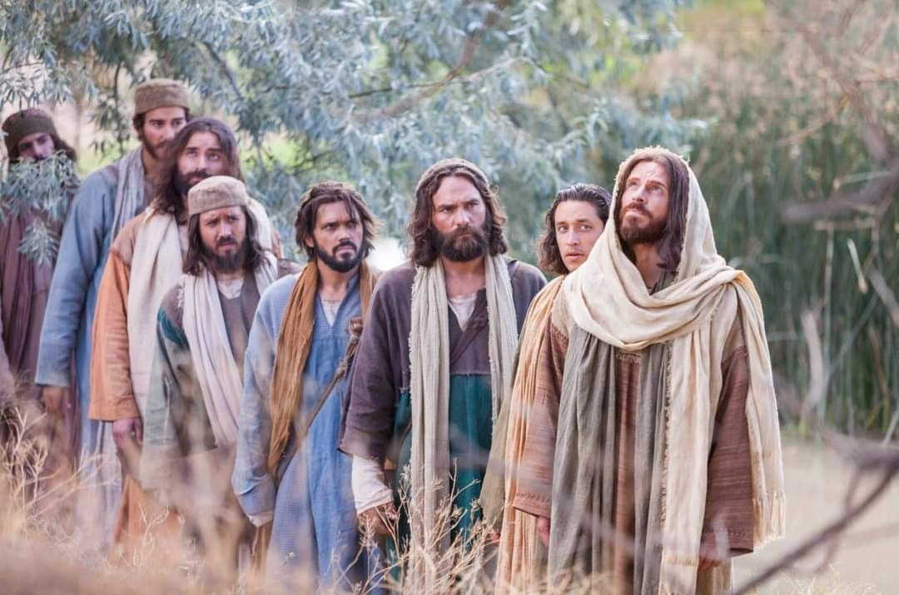
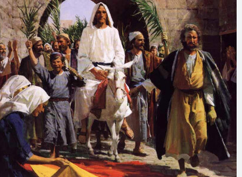

  

     
    

      <b>Matt.마15:1 그때 예루살렘 에서 서 기관들과 바리새인 들이 예수께 와서 이 르되 
      </b>
    

     
    
Then came to Jesus, scribes and Pharisees, which were of Jerusalem, saying, 
    

     
    

      <b>Matt.마15:2 어찌하여 너의 제자들 은 장로들의 전통을 범하느냐 했나니 이는 그들이 음식을 먹을 때 손을 씻지 않음이라 
      </b>
    

     
    
Why do thy disciples transgress the tradition of the elders? For they wash not their hands when they eat bread. 
    
         
  

  

    
  

---

  

     
    

      <b>Matt.마15:3 이에 그가 대답하여 이 르되 너희는 어찌하여 너희 전통으로 하나님의 계명을 범하느냐 
      </b>
    

     
    
But he answered and said unto them, Why do ye also transgress the comm andment of God by your tradition? 
    

     
    

      <b>
      </b>
    

     
    

    
         
  

  

    
  

---

  

     
    

      <b>Matt.마15:4, JST15:4 하나님이 명하 여 이르되 너의 아버지와 어머니를 공 경하라 하고 아버지나 어머니를 저주하 는 자는 모세가 정한 사형에 처하라 했 거니와 
      </b>
    

     
    
For God commanded, saying, Honor thy father and mother; and, He that curseth father or mother, let him die the death which Moses shall appoint. 
    

     
    

      <b>
      </b>
    

     
    

    
         
  

  

    
  

---

  

     
    

      <b>Matt.마15:5, JST15:5 너희는 이르되 누구든지 아버지나 어머니에게 이르기 를 무엇이든 나를 통해 당신에게 유익 이 될 만한 것은 나로부터 받은 예물이 니이다 하면 
      </b>
    

     
    
But ye say, Whosoever shall say to father or mother, By whatsoever thou mightest be profited by me, it is a gift from me 
    

     
    

      <b>
      </b>
    

     
    

    
         
  

  

    
  

---

  

     
    

      <b>Matt.마15:6, JST15:5 자기 아버지나 어머니를 공경하지 않아도 좋다 하니 너희는 이렇게 너희 전통으로 하나님의 계명을 무효화 하는도다 
      </b>
    

     
    
and honor not his father or mother, it is well. Thus have ye made the commandment of God of none effect by your tradition. 
    

     
    

      <b>Matt.마15:7, JST15:7 오 위선자들아 이사야가 너희에 관해 잘 예언했느니라 일렀으되 
      </b>
    

     
    
O ye hypocrites! Well did Esaias prophesy of you, saying, 
    
         
  

  

    
  

---

  

     
    

      <b>Matt.마15:8, JST15:7 이 백성이 입 으로 나를 가까이하며 입술로 는 나를 공경하나 그 마음은 나로부터 멀리 떠 났나니 
      </b>
    

     
    
This people draw nigh unto me with their mouth , and honoreth me with their lips; but their heart is far from me. 
    

     
    

      <b>Matt.마15:9, JST15:8 그들은 사람의 교리와 계명을 가르치 며 나를 헛되이 예배하는 도다 했느니라 하고 
      </b>
    

     
    
But in vain do they worship me, teaching the doctrines and the comm andments of men. 
    
         
  

  

    
  

---

  

     
    

      <b>Matt.마15:10 무리를 불러 그들에게 이르되 듣고 깨달으 라 
      </b>
    

     
    
And he called the multitude , and said unto them, Hear , and understand. 
    

     
    

      <b>Matt.마15:11 , JST 15:10 입으로 들 어가는 것이 사람을 더럽게 하는 것이 아니라 입에서 나오는 그것이 사람을 더럽게 하느니라 하더라 
      </b>
    

     
    
Not that which goeth into the mouth defileth a man; but that which cometh out of the mouth, this defileth the man. 
    
         
  

  

    
  

---

  

     
    

      <b>Matt.마15:12 이에 그의 제자들이 와서 그에게 이르되 당신은 바리새인 들 이 이 말을 듣고 분을 품은 것을 아나 이까 하는지라 
      </b>
    

     
    
Then came his disciples and said unto him, Knowest thou that the Pharisees were offended , after they heard this saying? 
    

     
    

      <b>Matt.마15:13 그가 대답하여 이르되 나의 하늘 아버지가 심지 않은 나무마 다 뽑히리 니 
      </b>
    

     
    
But he answered and said, Every plant which my heavenly Father hath not planted , shall be rooted up. 
    
         
  

  

    
  

---

  

     
    

      <b>Matt.마15:14 그들을 내버려 두라 그들은 눈먼 자를 인도하 는 눈먼 지도 자들이라 눈먼 자가 눈먼 자를 인도하 면 둘 다 구덩이 에 빠지느니라 하더라 
      </b>
    

     
    
Let them alone; they be blind leaders of the blind; and if the blind lead the blind, both shall fall into the ditch. 
    

     
    

      <b>Matt.마15:15 그때 베드로가 그에게 대답하여 이르되 이 비유를 우리에게 밝혀주소서 하매 
      </b>
    

     
    
Then answered Peter and said unto him, Declare unto us this parable. 
    
         
  

  

    
  

---

  

     
    

      <b>Matt.마15:16 예수가 이르되 너희도 아직까지 깨달음이 없느냐 
      </b>
    

     
    
And Jesus said, Are ye also yet without understanding? 
    

     
    

      <b>Matt.마15:17 무엇이든 입으로 들어 가는 것은 배 속으로 들어가 뒤로 버려 지는 것을 너희가 아직도 깨닫지 못하 느냐 
      </b>
    

     
    
Do ye not yet understand , that what soever entereth in at the mouth goeth into the belly , and is cast into the draught? 
    
         
  

  

    
  

---

  

     
    

      <b>Matt.마15:18 그러나 입에서 나오는 것은 마음으로부터 우러나는 것이요 그 것이 사람을 더럽게 하나니 
      </b>
    

     
    
But those things which proceed out of the mouth , come forth from the heart; and they defile the man. 
    

     
    

      <b>Matt.마15:19 이는 악한 생각과 살 인과 음행과 간음과 도둑질과 거짓 증 언과 신성모독이 마음에서 나오기 때문 이라 
      </b>
    

     
    
For out of the heart proceed evil thoughts, murders, adulteries, fornic ations, thefts, false witness, blasphe mies; 
    
         
  

  

    
  

---

  

     
    

      <b>Matt.마15:20, JST 15:19 이것들이 사람을 더럽게 하거니와 씻지 않은 손 으로 먹는 것은 사람을 더럽게 하지 못 하느니라 하더라 
      </b>
    

     
    
These are things which defile a man. But to eat with unwashen hands defil eth not a man. 
    

     
    

      <b>Matt.마15:21 예수가 그곳을 떠나 두로와 시돈 지방으로 들어가니 
      </b>
    

     
    
Then Jesus went thence , and departed into the coasts of Tyre and Sidon. 
    
         
  

  

    
  

---

  

     
    

      <b>Matt.마15:22 보라 그 지방에서 가 나안 여자 하나가 나와서 소리 질러 이 르되 오 주 다윗의 자손이여 나에게 자 비를 베푸소서 나의 딸이 악마에게 몹 시 괴롭힘을 당하나이다 했으나 
      </b>
    

     
    
And, behold, a woman of Canaan came out of the same coasts , and cried unto him, saying, Have mercy on me, O Lord, thou Son of David; my daughter is grievously vexed with a devil. 
    

     
    

      <b>
      </b>
    

     
    

    
         
  

  

    
  

---

  

     
    

      <b>Matt.마15:23 그는 그녀에게 한 마 디도 대답하지 않더라 이에 제자들이 와서 그에게 간청하여 이르되 그녀를 보내소서 그녀가 우리 뒤에서 소리 지 르나이다 하매 
      </b>
    

     
    
But he answered her not a word. And his disciples came and besought him, saying, Send her away; for she crieth after us. 
    

     
    

      <b>Matt.마15:24, JST 15:23 그가 대답 하되 나는 이스라엘 집의 잃어버린 양 외에는 다른 데로 보내지지 않았느니라 하더라 
      </b>
    

     
    
He answered , I am not sent but unto the lost sheep of the house of Israel. 
    
         
  

  

    
  

---

  

     
    

      <b>Matt.마15:25, JST15:24 이에 그녀 가 와서 그에게 경배하며 이르되 주여 나를 도우소서 했으나 
      </b>
    

     
    
Then came she and worshiped him, saying, Lord, help me. 
    

     
    

      <b>Matt.마15:26 그가 대답하여 이르되 자녀의 떡을 가지고 개에게 던지는 것 은 적절하지 않으니라 하니 
      </b>
    

     
    
But he answered and said, It is not meet to take the children's bread , and to cast it to dogs. 
    
         
  

  

    
  

---

  

     
    

      <b>Matt.마15:27, JST 15:26 그녀가 이 르되 주여 옳소이다 마는 개들도 주인의 상에서 떨어지는 부스러기를 먹나이다 하는지라 
      </b>
    

     
    
And she said, Truth, Lord; yet the dogs eat the crumbs that fall from the master's table. 
    

     
    

      <b>
      </b>
    

     
    

    
         
  

  

    
  

---

  

     
    

      <b>Matt.마15:28 이에 예수가 그녀에게 대답하여 이르되 오 여자여 너의 신앙 이 크니 너가 원하는 대로 될지어다 하 매 그녀의 딸이 그 시각부터 온전하게 되었더라 
      </b>
    

     
    
Then Jesus answered and said unto her, O woman, great is thy faith; be it unto thee even as thou wilt. And her daughter was made whole from that very hour. 
    

     
    

      <b>
      </b>
    

     
    

    
         
  

  

    
  

---

  

     
    

      <b>Matt.마15:29 예수가 그곳으로부터 떠나 갈릴리 바다 가까이 이르러 산에 올라 그곳에 앉으니라 
      </b>
    

     
    
And Jesus departed from thence, and came nigh unto the sea of Galilee; and went up into a mountain, and sat down there. 
    

     
    

      <b>
      </b>
    

     
    

    
         
  

  

    
  

---

  

     
    

      <b>Matt.마15:30, JST 15:29 큰 무리가 몇몇 다리 저는 자와 눈먼 자와 말 못 하는 자와 불구자와 다른 많은 자를 데 리고 와서 예수의 발 앞에 내려놓 으니 그가 그들을 낫게 하매 
      </b>
    

     
    
And great multitudes came unto him, having with them some lame, blind, dumb, maimed, and many others, and cast them down at Jesus' feet; and he healed them; 
    

     
    

      <b>
      </b>
    

     
    

    
         
  

  

    
  

---

  

     
    

      <b>Matt.마15:31 말 못하는 자가 말하 고 불구자가 온전해지고 다리 저는 자 가 걸으며 눈먼 자가 보는 것을 무리가 보고 놀라며 이스라엘 의 하나님 께 영광 을 돌리더라 
      </b>
    

     
    
insomuch that the multitude wondered , when they saw the dumb to speak, the maimed to be whole, the lame to walk, and the blind to see. And they glorified the God of Israel. 
    

     
    

      <b>
      </b>
    

     
    

    
         
  

  

    
  

---

  

     
    

      <b>Matt.마15:32, JST 15:30 그때 예수 가 제자들을 불러 이르되 내가 무리를 불쌍히 여기노 라 그들이 지금까지 계속 하여 삼 일을 나와 함께하며 먹지 못했 으니 그들이 길에서 기진하지 않도록 나는 그들을 굶겨 보내지 않으리 라 하 매 
      </b>
    

     
    
Then Jesus called his disciples and said, I have compassion on the multitude , because they continue with me now three days , and have nothing to eat; and I will not send them away fasting, lest they faint in the way. 
    

     
    

      <b>
      </b>
    

     
    

    
         
  

  

    
  

---

  

     
    

      <b>Matt.마15:33 그의 제자들이 그에게 이르되 이렇게 큰 무리를 배부르게 할 만큼 많은 떡을 광야 어디에서 구하리 이까 하는지라 
      </b>
    

     
    
And his disciples say unto him, Whence should we have so much bread in the wilderness, as to fill so great a multitude? 
    

     
    

      <b>Matt.마15:34 예수가 그들에게 이르 되 너희에게 떡이 몇 개나 있느냐 하니 그들이 이르되 일곱 개와 작은 물고기 몇 마리가 있나이다 하더라 
      </b>
    

     
    
And Jesus said unto them, How many loaves have ye? And they said, Seven, and a few little fishes. 
    
         
  

  

    
  

---

  

     
    

      <b>Matt.마15:35 그가 무리를 명하여 땅에 앉게 하고 
      </b>
    

     
    
And he commanded the multitude to sit down on the ground. 
    

     
    

      <b>Matt.마15:36, JST 15:34 떡 일곱 개 와 물고기를 가져 감사드린 후에 떡을 떼어 제자들에게 주니 제자들이 무리에 게 주더라 
      </b>
    

     
    
And he took the seven loaves and the fishes, and gave thanks, and brake the bread , and gave to his disciples, and the disciples, to the multitude. 
    
         
  

  

    
  

---

  

     
    

      <b>Matt.마15:37 , JST 15:35 그들이 모 두 배부르게 먹고 양식 조각을 거두니 일곱 광주리 에 가득 찼으며 
      </b>
    

     
    
And they did all eat , and were filled. And they took up of the broken meat seven baskets full. 
    

     
    

      <b>Matt.마15:38 먹은 사람들은 여자와 아이들 외에 사천 명이더라 
      </b>
    

     
    
And they that did eat were four thousand men, besides women and children. 
    
         
  

  

    
  

---

  

     
    

      <b>Matt.마15:39 그가 무리를 보내고 배에 올라 막달라 지방으로 들어가니라 
      </b>
    

     
    
And he sent away the multitude, and took ship, and came into the coasts of Magdala.
    

     
    

      <b>
      </b>
    

     
    

    
         
  

  

    
  

