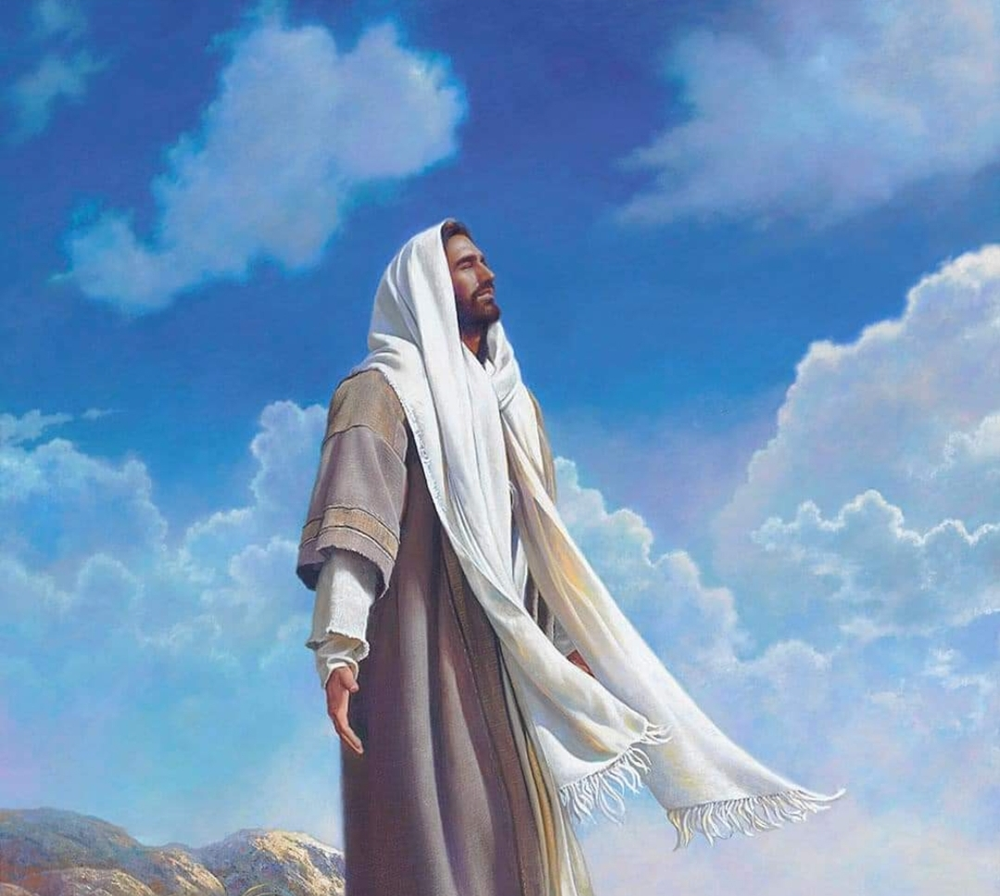

  

     
    

      <b>Matt.마16:1, JST 16:1 바리새인 들이 사두개인 들과 함께 와서 예수를 시험하 여 하늘로부터 오는 표적을 보여달라 하는지라 
      </b>
    

     
    
The Pharisees also , with the Sadd ucees, came, and tempting Jesus, desired him that he would show them a sign from heaven. 
    

     
    

      <b>
      </b>
    

     
    

    
         
  

  

    
  

---

  

     
    

      <b>Matt.마16:2, JST 16:2 이에 그가 그 들에게 대답하여 이르되 저녁이 되면 너희가 이르기를 하늘이 붉으니 날씨가 좋겠다 하고 
      </b>
    

     
    
And he answered and sai d unto them, When it is evening ye say, The weather is fair, for the sky is red; 
    

     
    

      <b>Matt.마16:3, JST16:2 아침에는 너희 가 이르기를 하늘이 붉고 흐리니 오늘 날씨는 나쁘겠다 하거니와 
      </b>
    

     
    
and in the morning ye say, The weather is foul today ; for the sky is red and lowering. 
    
         
  

  

    
  

---

  

     
    

      <b>JST16:3 오 위선자들아 너희가 기상은 분별할 줄 알면서 시대의 표적은 알지 못하는 도다 
      </b>
    

     
    
O hypocrites! Ye can discern the face of the sky; but ye cannot tell the signs of the times. 
    

     
    

      <b>
      </b>
    

     
    

    
         
  

  

    
  

---

  

     
    

      <b>Matt.마16:4 악하고 음란한 세대가 표적을 구하나 선지자 요나의 표적 외 에는 아무런 표적이 주어지지 않으리라 하고 그들을 떠나가니라 
      </b>
    

     
    
A wicked and adulterous generation seeketh after a sign; and there shall no sign be given unto it , but the sign of the prophet Jonas. And he left them and departed. 
    

     
    

      <b>Matt.마16:5 그의 제자들이 건너편 에 이르렀을 때 떡 가져오기를 잊었더 니 
      </b>
    

     
    
And when his disciples were come to the other side, they had forgotten to take bread. 
    
         
  

  

    
  

---

  

     
    

      <b>Matt.마16:6 예수가 그들에게 이르 되 바리새인 과 사두개인 의 누룩을 주의 하고 조심하 라 하매 
      </b>
    

     
    
Then Jesus said unto them, Take heed and beware of the leaven of the Pharisees and of the Sadducees. 
    

     
    

      <b>Matt.마16:7, JST 16:8 그들이 서로 논의하여 이르되 그가 이렇게 말하는 것은 우리가 떡을 가져오지 않았기 때 문이라 하더라 
      </b>
    

     
    
And they reasoned among themselves, saying, He said this because we have taken no bread. 
    
         
  

  

    
  

---

  

     
    

      <b>Matt.마16:8, JST16:9 제자들이 서로 논의할 때 예수가 그것을 알고 그들에 게 이르되 오 신앙이 작은 자들아 어찌 하여 너희가 떡 가져오지 않은 것으로 인해 서로 논의하느냐 
      </b>
    

     
    
And when they reasoned among themselves, Jesus per ceived it; and he said unto them, O ye of little faith! Why reason ye among yourselves , because ye have brought no bread? 
    

     
    

      <b>
      </b>
    

     
    

    
         
  

  

    
  

---

  

     
    

      <b>Matt.마16:9 떡 다섯 개로 오천 명 을 먹이고 몇 광주리 를 거두었는지 너 희가 아직도 깨닫지 못하고 기억하 지 못하느냐 
      </b>
    

     
    
Do ye not yet understand, neither remember the five loaves of the five thousand, and how many baskets ye took up? 
    

     
    

      <b>Matt.마16:10 또한 떡 일곱 개로 사 천 명을 먹이고 몇 광주리 를 거두었느 냐 
      </b>
    

     
    
Neither the seven loaves of the four thousand, and how many baskets ye took up? 
    
         
  

  

    
  

---

  

     
    

      <b>Matt.마16:11 , JST 16:12 바리새인 과 사두개인 의 누룩을 조심하라고 말한 것 이 너희에게 떡에 관해 말하는 것이 아 님을 어찌하여 깨닫지 못하느냐 하매 
      </b>
    

     
    
How is it that ye do not understand , that I spake not unto you concerning bread, that ye should beware of the leaven of the Pharisees and of the Sadducees? 
    

     
    

      <b>
      </b>
    

     
    

    
         
  

  

    
  

---

  

     
    

      <b>Matt.마16:12 , JST 16:13 그제서야 그들은 그가 명한 것이 떡의 누룩을 조 심하라는 것이 아니요 바리새인과 사두 개인의 교리를 조심하라는 것임을 깨닫 더라 
      </b>
    

     
    
Then understand they, how that he bade them not beware of the leaven of bread, but of the doctrine of the Pharisees and of the Sadducees. 
    

     
    

      <b>
      </b>
    

     
    

    
         
  

  

    
  

---

  

     
    

      <b>Matt.마16:13 , JST 16:14 또 예수가 가이사랴 빌립보 지방으로 들어갈 때 그가 제자들에게 물어 이르되 사람들은 나 곧 인자를 누구라 하느냐 하니 
      </b>
    

     
    
And when Jesus came into the coasts of Caesarea Philippi, he asked his disciples, saying, Whom do men say that I, the Son of man, am? 
    

     
    

      <b>
      </b>
    

     
    

    
         
  

  

    
  

---

  

     
    

      <b>Matt.마16:14 , JST 16:15 그들이 이 르되 어떤 이들은 침례 요한이라 하고 어떤 이들은 엘리야 라 하고 다른 이들은 예레미야 또는 선지자 들 가운데 하 나라 하나이다 하매 
      </b>
    

     
    
And they said, Some say John the Baptist; some Elias; and others Jeremias; or one of the prophets. 
    

     
    

      <b>Matt.마16:15 , JST 16:16 그가 이르 되 그러나 너희는 나를 누구라 하느냐 하니 
      </b>
    

     
    
He said unto them, But whom say ye that I am? 
    
         
  

  

    
  

---

  

     
    

      <b>Matt.마16:16 시몬 베드로가 대답하 여 이르되 당신은 그리스도 요 살아계신 하나님의 아들이니이다 하는지라 
      </b>
    

     
    
And Simon Peter answered and said, Thou art the Christ, the Son of the living God. 
    

     
    

      <b>
      </b>
    

     
    

    
         
  

  

    
  

---

  

     
    

      <b>Matt.마16:17 , JST 16:18 예수가 그 에게 대답하여 이르되 시몬 바요나야 너에게 복이 있도다 이것을 너에게 계 시한 것은 살과 피가 아니라 하늘에 계 신 나의 아버지 니라 
      </b>
    

     
    
And Jesus answered and said unto him, Blessed art thou, Simon Bar -jona; for flesh and blood hath not revealed this unto thee, but my Father who is in heaven. 
    

     
    

      <b>
      </b>
    

     
    

    
         
  

  

    
  

---

  

     
    

      <b>Matt.마16:18 내가 또 너에게 이르 노니 너는 베드로라 내가 이 반석 위에 나의 교회를 세우리니 지옥문이 그것을 대적하여 이기지 못하리라 
      </b>
    

     
    
And I say also unto thee, That thou art Peter; and upon this rock I will build my church, and the gates of hell shall not prevail against it. 
    

     
    

      <b>
      </b>
    

     
    

    
         
  

  

    
  

---

  

     
    

      <b>Matt.마16:19 내가 하늘 왕국의 열 쇠를 너에게 주리니 무엇이든 너가 땅 에서 매는 것은 하늘에서 도 매일 것이 요 무엇이든 너가 땅에서 푸는 것은 하 늘에서 도 풀리리라 하고 
      </b>
    

     
    
And I will give unto thee the keys of the kingdom of heaven; and what soever thou shalt bind on earth, shall be bound in heaven; and whatsoever thou shalt loose on earth, shall be loosed in heaven. 
    

     
    

      <b>
      </b>
    

     
    

    
         
  

  

    
  

---

  

     
    

      <b>Matt.마16:20 제자들에게 명하여 자 기가 예수 그리스도 임을 아무에게도 알 리지 말라 하더라 
      </b>
    

     
    
Then charged he his disciples that they should tell no man that he was Jesus, the Christ. 
    

     
    

      <b>
      </b>
    

     
    

    
         
  

  

    
  

---

  

     
    

      <b>Matt.마16:21 , JST 16:22 그때부터 예수가 제자들에게 자기가 반드시 예루 살렘에 가서 장로들과 제사장들과 서기 관들에게 많은 고난을 받고 죽임당하여 제삼 일에 다시 살아나야 하는 것을 보 여주기 시작하니 
      </b>
    

     
    
From that time forth began Jesus to show unto his disciples, how that he must go to Jerusalem, and suffer many things of the elders, and chief priests, and scribes, and be killed, and be raised again the third day. 
    

     
    

      <b>
      </b>
    

     
    

    
         
  

  

    
  

---

  

     
    

      <b>Matt.마16:22 , JST 16:23 베드로가 그를 붙들고 항변하여 이르되 주여 그 것은 당신과 상관 없기를 원하고 이 일 이 당신께 이루어 지지 않기를 원하나이 다 하는지라 
      </b>
    

     
    
Then Peter took him, and began to rebuke him, saying, Be it far from thee, Lord; this shall not be done unto thee. 
    

     
    

      <b>
      </b>
    

     
    

    
         
  

  

    
  

---

  

     
    

      <b>Matt.마16:23 , JST16:24 그가 베드 로에게 돌아서서 이르되 사탄아 나의 뒤로 물러가라 너는 나를 실족하 게 하 는 자로다 이는 너가 하나님 께 속한 일 을 생각하지 않고 사람에게 속한 일을 생각함이라 하더라 
      </b>
    

     
    
But he turned and said unto Peter, Get thee behind me, Satan; thou art an offense unto me; for thou savorest not the things that be of God, but those that be of men. 
    

     
    

      <b>
      </b>
    

     
    

    
         
  

  

    
  

---

  

     
    

      <b>Matt.마16:24 예수가 제자들에게 이 르되 누구든지 와서 나를 따르기 원하 면 자기를 부인하고 자기 십자가를 지 고 나를 따르라 
      </b>
    

     
    
Then said Jesus unto his disciples, If any man will come after me, let him deny himse lf, and take up his cross, and follow me. 
    

     
    

      <b>
      </b>
    

     
    

    
         
  

  

    
  

---

  

     
    

      <b>JST16:26 사람이 자기 십자가를 진다 는 것은 경건하지 않은 모든 것과 온갖 세상적인 탐욕에 대해 자기를 부인하고 나의 계명을 지키는 것이라 
      </b>
    

     
    
And now for a man to take up his cross, is to deny himself all ungodliness, and every worldly lust, and keep my com mandments. 
    

     
    

      <b>
      </b>
    

     
    

    
         
  

  

    
  

---

  

     
    

      <b>Matt.마16:25 , JST 16:27 너의 생명 을 구하기 위해 나의 계명을 깨뜨리지 말라 누구든지 이 세상에서 자기 생명 을 구하려 하는 자는 오는 세상에서 그 것을 잃을 것이요 
      </b>
    

     
    
Break not my commandments for to save your lives; for whosoever will save his life in this world , shall lose it in the world to come. 
    

     
    

      <b>
      </b>
    

     
    

    
         
  

  

    
  

---

  

     
    

      <b>JST16:28 누구든지 이 세상에서 나를 위해 자기 생명을 버리려 하는 자는 오 는 세상에서 그것을 찾으리라 
      </b>
    

     
    
And whosoever will lose his life in this world , for my sake, shall find it in the world to come . 
    

     
    

      <b>
      </b>
    

     
    

    
         
  

  

    
  

---

  

     
    

      <b>Matt.마16:26, JST 16:29 그러므로 세상을 버리고 너의 영혼을 구원하라 사람이 온 세상을 얻고도 자기 영혼을 잃으면 무슨 유익이 있겠느냐 무엇을 주고 자기 영혼과 바꾸겠느냐 
      </b>
    

     
    
Therefore, forsake the world, and save your souls ; for what is a man profited, if he shall gain the whole world, and lose his own soul? Or what shall a man give in exchange for his soul? 
    

     
    

      <b>
      </b>
    

     
    

    
         
  

  

    
  

---

  

     
    

      <b>Matt.마16:27 이는 인자가 자기 아 버지의 영광으로 천사들과 함께 오는 그때에 그가 각 사람의 행위대로 보상 할 것임이 라 
      </b>
    

     
    
For the Son of man shall come in the glory of his Father, with his angels; and then he shall reward every man according to his works. 
    

     
    

      <b>
      </b>
    

     
    

    
         
  

  

    
  

---

  

     
    

      <b>Matt.마16:28 진실로 내가 너희에게 이르노니 인자가 자기 왕국에 오는 것 을 볼 때까지 죽음을 맛보지 않을 자들 이 이곳에 서 있느니라 
      </b>
    

     
    
Verily, I say unto you, There be some standing here, which shall not taste of death, till they see the Son of man coming in his kingdom.
    

     
    

      <b>
      </b>
    

     
    

    
         
  

  

    
  

