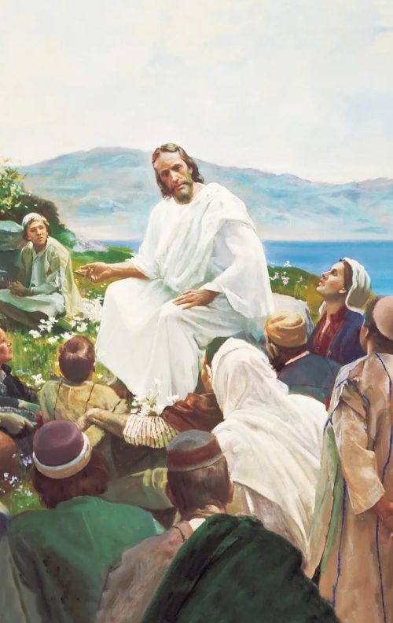
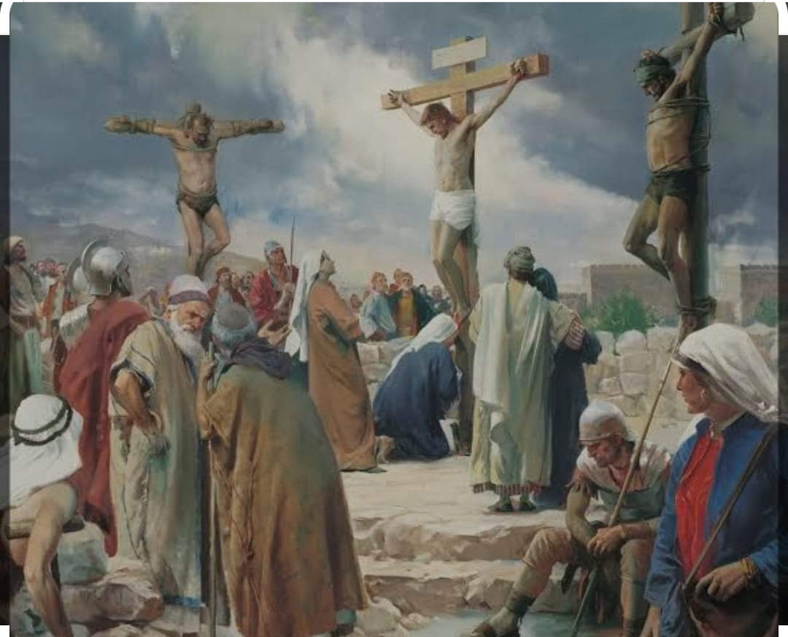

  

     
    

      <b>Matt.마19:1 그리고 이렇게 되었나 니 예수가 이 말을 마치고 갈릴리 로부 터 떠나 요단 강 건너편 유대 지방으로 들어가매 
      </b>
    

     
    
And it came to pass, when Jesus had finished these sayings, he departed from Galilee, and came into the coasts of Judea beyond Jordan. 
    

     
    

      <b>Matt.마19:2, JST 19:2 큰 무리가 그 를 따르고 많은 사람이 그를 믿었으며 그곳에서 그가 그들을 낫게 하더라 
      </b>
    

     
    
And great multitudes followed him; and many believed on him, and he healed them there. 
    
         
  

  

    
  

---

  

     
    

      <b>Matt.마19:3, JST19:3 또 바리새인 들 이 그에게 와서 시험하여 이르되 사람 이 어떤 이유로든 아내를 버리는 것이 적법하나 이까 하니 
      </b>
    

     
    
The Pharisees came also unto him, tempting him, and saying unto him, Is it lawful for a man to put away his wife for every cause? 
    

     
    

      <b>
      </b>
    

     
    

    
         
  

  

    
  

---

  

     
    

      <b>Matt.마19:4, JST19:4 그가 대답하여 이르되 태초에 사람을 지으신 이가 그 를 남자와 여자로 만들고 
      </b>
    

     
    
And he answered and said unto them, Have ye not read, that he who made man at the beginning, made him, male and female, 
    

     
    

      <b>
      </b>
    

     
    

    
         
  

  

    
  

---

  

     
    

      <b>Matt.마19:5 이르되 이런 이유로 남 자는 아버지와 어머니를 떠나 아내와 결합하여 그 둘이 하나의 육신이 되어 야 하리라 한 것을 너희는 읽어보지 못 했느냐 
      </b>
    

     
    
And said, For this cause shall a man leave father and mother, and shall cleave to his wife; and they twain shall be one flesh? 
    

     
    

      <b>
      </b>
    

     
    

    
         
  

  

    
  

---

  

     
    

      <b>Matt.마19:6, JST19:6 그러므로 그들 이 더 이상 둘이 아니요 하나의 육신이 니 하나님이 합친 것을 사람이 갈라놓 지 말라 하매 
      </b>
    

     
    
Wherefore they are no more twain, but one flesh. What, therefore, God hath joined together, let no man put asunder. 
    

     
    

      <b>Matt.마19:7 그들이 이르되 그러면 모세는 어찌하여 이혼 증서를 주어 그 녀를 버리라 명했나이까 하는지라 
      </b>
    

     
    
They say unto him, Why did Moses then command to give a writing of divorcement, and to put her away? 
    
         
  

  

    
  

---

  

     
    

      <b>Matt.마19:8 그가 이르되 모세는 너 희 마음의 완악함 때문에 너희가 아내 버리는 것을 용납했거니와 처음부터 그 런 것은 아니었느니라 
      </b>
    

     
    
He said unto them, Moses, because of the hardness of your hearts, suffered you to put away your wives; but from the beginning it was not so. 
    

     
    

      <b>
      </b>
    

     
    

    
         
  

  

    
  

---

  

     
    

      <b>Matt.마19:9, JST19:9 내가 너희에게 이르노니 누구든지 간음한 이유 없이 아내를 버리고 다른 이와 결혼하는 자 는 간음을 범하는 것이요 누구든지 버 림받은 여자와 결혼하는 자도 간음을 범하는 것이니라 하매 
      </b>
    

     
    
And I say unto you, Whosoever shall put away his wife, except for fornication, and shall marry another, committeth adultery; and whoso marrieth her that is put away, doth commit adultery. 
    

     
    

      <b>
      </b>
    

     
    

    
         
  

  

    
  

---

  

     
    

      <b>Matt.마19:10 , JST 19:10 그의 제자 들이 그에게 이르되 아내와 관련하여 그 사람의 경우가 그렇다 면 결혼하는 것이 좋지 않나이다 하더라 
      </b>
    

     
    
His disciples say unto him, If the case of the man be so with a wife, it is not good to marry. 
    

     
    

      <b>Matt.마19:11 , JST 19:11 그러나 그 가 이르되 모든 사람이 이 말을 받을 수는 없나니 그것은 이 말이 주어진 자 이외의 사람들을 위한 것이 아니니 라 
      </b>
    

     
    
But he said unto them, All cannot receive this saying; it is not for them save to whom it is given. 
    
         
  

  

    
  

---

  

     
    

      <b>Matt.마19:12 , JST 19:12 어떤 고자 는 어머니의 태로부터 그렇게 태어난 고자가 있고 어떤 고자는 사람이 만든 고자도 있으며 하늘 왕국을 위해 스스 로 된 고자도 있느니라 받을 수 있는 자는 나의 말을 받으라 하더라 
      </b>
    

     
    
For there are some eunuchs, which were so born from their mother's womb; and there are some eunuchs which were made eunuchs of men; and there be eunuchs, which have made themselves eunuchs for the kingdom of heaven's sake. He that is able to receive , let him receive my sayings . 
    

     
    

      <b>
      </b>
    

     
    

    
         
  

  

    
  

---

  

     
    

      <b>Matt.마19:13 , JST 19:13 그때 사람 들이 그가 안수하 고 기도해 주기를 바 라며 어린아이들을 그에게 데려오매 제 자들이 그들을 꾸짖으며 이르되 그럴 필요가 없나니 예수가 이르기를 그런 아이들은 구원받으리라 했느니라 하는 지라 
      </b>
    

     
    
Then were there brought unto him little children, that he should put his hands on them and pray. And the disciples rebuked them, saying, There is no need, for Jesus hath said, Such shall be saved. 
    

     
    

      <b>
      </b>
    

     
    

    
         
  

  

    
  

---

  

     
    

      <b>Matt.마19:14 , JST 19:14 예수가 이 르되 어린아이 가 나에게 오는 것을 용 납하고 그들을 금하지 말라 이는 하늘 왕국이 이런 자의 것임이라 하고 
      </b>
    

     
    
But Jesus said, Suffer little children to come unto me , and forbid them not, for of such is the kingdom of heaven. 
    

     
    

      <b>Matt.마19:15 , JST 19:15 그들에게 안수하고 그곳을 떠나니라 
      </b>
    

     
    
And he laid hands on them, and departed thence. 
    
         
  

  

    
  

---

  

     
    

      <b>Matt.마19:16 , JST 19:16 또 보라 한 사람이 와서 이르되 선한 선생님이여 내가 영생을 얻으려면 무슨 선한 일을 해야 하나이까 하더라 
      </b>
    

     
    
And, behold, one came and said, Good master, what good thing shall I do, that I may have eternal life? 
    

     
    

      <b>
      </b>
    

     
    

    
         
  

  

    
  

---

  

     
    

      <b>Matt.마19:17 이에 그가 이르되 어 찌하여 너가 나를 불러 선하다 하느냐 선하신 이는 오직 하나님 한 분밖에 없 거니와 너가 생명에 들어가 기를 원하면 계명을 지키라 하매 
      </b>
    

     
    
And he said unto him, Why callest thou me good? There is none good but one, that is, God; but if thou wilt enter into life, keep the commandments. 
    

     
    

      <b>
      </b>
    

     
    

    
         
  

  

    
  

---

  

     
    

      <b>Matt.마19:18 , JST 19:18 그가 이르 되 어느 계명이니이까 하니 예수가 이 르되 살인하지 말라 간음을 범하지 말 라 도둑질하지 말라 거짓 증언하지 말 라 
      </b>
    

     
    
He saith unto him, Which? Jesus said, Thou shalt not kill . Thou shalt not commit adultery. Thou shalt not steal. Thou shalt not bear false witness. 
    

     
    

      <b>
      </b>
    

     
    

    
         
  

  

    
  

---

  

     
    

      <b>Matt.마19:19 , JST 19:19 너의 아버 지와 어머니를 공경하라 너의 이웃을 너 자신처럼 사랑하라 한 것이라 하매 
      </b>
    

     
    
Honor thy father and mother . And, Thou shalt love thy neighbor as thyself. 
    

     
    

      <b>Matt.마19:20 그 청년이 그에게 이 르되 이 모든 것은 내가 어려서부터 지 켜 왔으니 내가 아직도 부족한 것이 무 엇이니이 까 하는지라 
      </b>
    

     
    
The young man saith unto him, All these things have I kept from my youth up; what lack I yet? 
    
         
  

  

    
  

---

  

     
    

      <b>Matt.마19:21 , JST 19:21 예수가 그 에게 이르되 너가 완전하게 되기를 원 하면 가서 가진 것을 팔아 가난한 자에 게 주라 그리하면 너는 하늘에 보물이 있으리니 그 후에 와서 나를 따르라 하 매 
      </b>
    

     
    
Jesus said unto him, If thou wilt be perfect, go, sell that thou hast, and give to the poor, and thou shalt have treasure in heaven, and come and follow me. 
    

     
    

      <b>
      </b>
    

     
    

    
         
  

  

    
  

---

  

     
    

      <b>Matt.마19:22 청년이 그 말을 듣고 근심하며 갔나니 이는 그가 가진 소유 가 많았음이 라 
      </b>
    

     
    
But when the young man heard that saying, he went away sorrowful; for he had great possessions. 
    

     
    

      <b>Matt.마19:23 이에 예수가 제자들에 게 이르되 진실로 내가 너희에게 이르 노니 부자는 하늘 왕국에 들어가기가 어려우니라 
      </b>
    

     
    
Then said Jesus unto his disciples, Verily, I say unto you, that a rich man shall hardly enter into the kingdom of heaven. 
    
         
  

  

    
  

---

  

     
    

      <b>Matt.마19:24 거듭 내가 너희에게 이르노니 부자가 하나님의 왕국에 들어 가는 것보다 낙타가 바늘 눈으로 들어 가는 것이 쉬우니라 하매 
      </b>
    

     
    
And again I say unto you, It is easier for a camel to go through the eye of a needle, than for a rich man to enter the kingdom of God. 
    

     
    

      <b>Matt.마19:25 , JST 19:25 그의 제자 들이 이 말을 듣고 심히 놀라 이르되 그러면 누가 구원받을 수 있는가 하더 라 
      </b>
    

     
    
When his disciples heard this, they were exceedingly amazed, saying, Who then can be saved? 
    
         
  

  

    
  

---

  

     
    

      <b>Matt.마19:26 , JST 19:26 그러나 예 수가 그들의 생각을 알고 그들에게 이 르되 사람들에게는 이것이 불가능하나 그들이 나를 위해 모든 것을 기꺼이 버 리려 하면 하나님이 함께하여 내가 말 한 것은 무엇이든 가능하니라 하더라 
      </b>
    

     
    
But Jesus beheld their thoughts , and said unto them, With men this is impossible; but if they will forsake all things for my sake , with God whatsoever things I speak are possible. 
    

     
    

      <b>
      </b>
    

     
    

    
         
  

  

    
  

---

  

     
    

      <b>Matt.마19:27 이에 베드로가 그에게 대답하여 이르되 보소서 우리는 모든 것을 버리고 당신을 따랐나이다 그러므 로 우리가 무엇을 얻으리 이까 하매 
      </b>
    

     
    
Then answered Peter and said unto him, Behold, we have forsaken all, and followed thee; what shall we have therefore? 
    

     
    

      <b>
      </b>
    

     
    

    
         
  

  

    
  

---

  

     
    

      <b>Matt.마19:28 , JST 19:28 예수가 그 들에게 이르되 진실로 내가 너희에게 이르노니 나를 따르는 너희는 부활하는 날 인자가 와서 자기 영광의 보좌에 앉 을 때 너희도 열두 보좌에 앉아 이스라 엘 열두 지파를 심판하리라 
      </b>
    

     
    
And Jesus said unto them, Verily I say unto you, t hat ye who have followed me, shall, in the resurrection , when the Son of man shall come sitting o n the throne of his glory , ye also shall sit upon twelve thrones, judging the twelve tribes of Israel. 
    

     
    

      <b>
      </b>
    

     
    

    
         
  

  

    
  

---

  

     
    

      <b>Matt.마19:29 , JST 19:29 그리고 나 의 이름을 위해 집이나 형제나 자매나 아버지나 어머니나 아내나 자녀나 땅을 버린 자마다 백배를 받고 영생을 유업 으로 받으리라 
      </b>
    

     
    
And everyone that has forsaken houses, or brethren, or sisters, or father, or mother, or wife, or children, or lands, for my name's sake, shall receive a hundredfold, and shall inh erit everlasting life. 
    

     
    

      <b>
      </b>
    

     
    

    
         
  

  

    
  

---

  

     
    

      <b>Matt.마19:30 , JST 19:30 그러나 처 음 된 자가 마지막 되고 마지막 된 자 가 처음 될 자가 많으니 라 
      </b>
    

     
    
But many of the first shall be last, and the last first .
    

     
    

      <b>
      </b>
    

     
    

    
         
  

  

    
  

