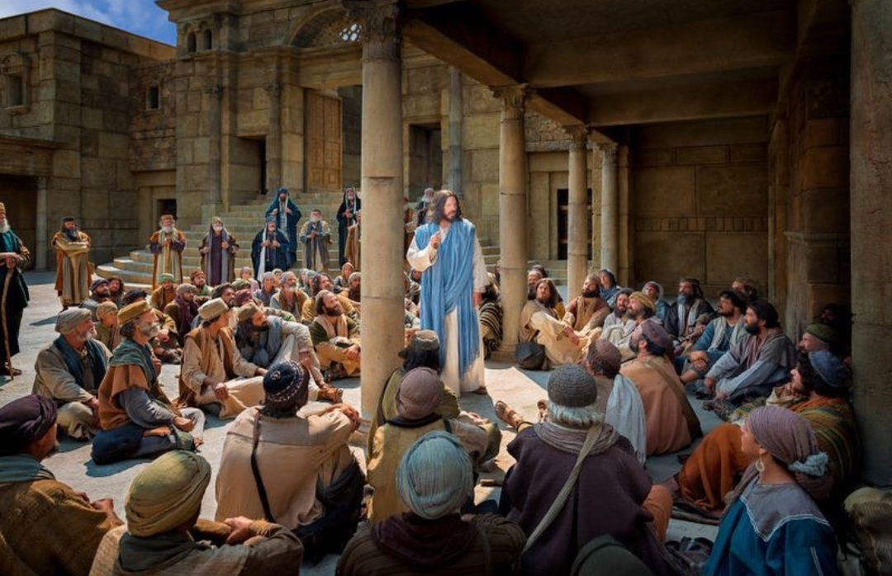

  

     
    

      <b>Matt.마21:1, JST21:1 예수가 예루살 렘에 가까이 와서 감람산 근처 벳바게 에 이르렀을 때 예수가 두 제자를 보내 며 
      </b>
    

     
    
And when Jesus drew nigh unto Jerusalem, and they were come to Bethphage, unto the mount of Olives, then sent Jesus two disciples, 
    

     
    

      <b>
      </b>
    

     
    

    
         
  

  

    
  

---

  

     
    

      <b>Matt.마21:2, JST21:2 그들에게 이르 되 맞은편 마을에 들어가면 곧바로 어 린 나귀 한 마리가 매인 것을 발견하리 니 그것을 풀어서 나에게 끌어오라 
      </b>
    

     
    
Saying unto them, Go into the village over against you, and straightway ye shall find a colt tied; loose it, and bring it unto me; 
    

     
    

      <b>
      </b>
    

     
    

    
         
  

  

    
  

---

  

     
    

      <b>Matt.마21:3, JST21:2 누가 너희에게 무슨 말을 하면 너희는 주께 필요하다 하라 그리하면 그가 즉시 보내리라 하 더라 
      </b>
    

     
    
and if any shall say aught unto you, ye shall say, The Lord hath need of it; and straightway he will send it. 
    

     
    

      <b>Matt.마21:4 이 모든 일이 행해진 것은 선지자가 말한 것이 성취되게 하 려 함이라 일렀으되 
      </b>
    

     
    
All this was done, that it might be fulfilled which was spoken by the prophet, saying, 
    
         
  

  

    
  

---

  

     
    

      <b>Matt.마21:5, JST21:4 너희는 시온의 딸에게 말하기를 보라 너의 왕이 너에 게 임하나니 그는 온유하여 나귀 곧 나 귀 새끼인 어린 나귀를 탔도다 하라 했 더라 
      </b>
    

     
    
Tell ye the daughter of Zion, Behold, thy king cometh unto thee, and he is meek, and he is sitting upon an ass, and a colt, the foal of an ass. 
    

     
    

      <b>Matt.마21:6 이에 제자들이 가서 예 수가 그들에게 명한 대로 하여 
      </b>
    

     
    
And the disciples went, and did as Jesus commanded them; 
    
         
  

  

    
  

---

  

     
    

      <b>Matt.마21:7, JST 20:5 어린 나귀를 끌고 와서 자기들의 옷을 그 위에 얹으 매 예수가 어린 나귀를 취하여 그 위에 타니 사람들이 그를 따르는데 
      </b>
    

     
    
and brought the colt, and put on it their colthes; and Jesus took the colt and sat thereon; and they followed him. 
    

     
    

      <b>
      </b>
    

     
    

    
         
  

  

    
  

---

  

     
    

      <b>Matt.마21:8, JST 21:6 매우 큰 무리 가 자기들의 옷을 길에 펴고 다른 이들 은 나무에서 가지를 꺾어 길에 뿌리며 
      </b>
    

     
    
And a very great multitude spread their garments in the way; others cut down branches from the trees, and strewed in the way. 
    

     
    

      <b>
      </b>
    

     
    

    
         
  

  

    
  

---

  

     
    

      <b>Matt.마21:9, JST 21:7 앞서 가는 무 리와 그 뒤를 따르는 무리가 외쳐 이르 되 호산나 다윗의 자손이여 복되도 다 주의 이름으로 오시는 이여 지극히 높 은 곳에서 호산나 하더라 
      </b>
    

     
    
And the multitudes that went before, and also that followed after, cried, saying, Hosanna to the Son of David; blessed is he who cometh in the name of the Lord! Hosanna in the highest! 
    

     
    

      <b>
      </b>
    

     
    

    
         
  

  

    
  

---

  

     
    

      <b>Matt.마21:10 그가 예루살렘에 들어 올 때 온 성이 소동하 여 이르되 이 사 람은 누구냐 하니 
      </b>
    

     
    
And when he was come into Jerusalem, all the city was moved, saying, Who is this? 
    

     
    

      <b>Matt.마21:11 , JST 21:9 무리가 이르 되 이 사람은 갈릴리 의 선지자 나사렛 예수라 하더라 
      </b>
    

     
    
And the multitude said, This is Jesus of Nazareth, the prophet of Galilee. 
    
         
  

  

    
  

---

  

     
    

      <b>Matt.마21:12 예수가 하나님의 성전 에 들어가 성전 안에서 팔고 사는 모든 사람을 쫓아내고 돈 바꾸는 자들의 상 과 비둘기 파는 사람들의 자리를 둘러 엎으며 
      </b>
    

     
    
And Jesus went into the temple of God, and cast out all them that sold and bought in the temple, and overthrew the tables of the money changers, and the seats of them that sold doves; 
    

     
    

      <b>
      </b>
    

     
    

    
         
  

  

    
  

---

  

     
    

      <b>Matt.마21:13 그들에게 이르되 나의 집은 기도의 집이라 불리리라 기록되었 거늘 너희가 도둑의 소굴로 만드는도다 하고 
      </b>
    

     
    
and said unto them, It is written, My house shall be called the house of prayer; but ye have made it a den of thieves. 
    

     
    

      <b>Matt.마21:14 눈먼 자와 다리 저는 자가 성전에 있는 그에게 나아오매 그 가 그들을 낫게 하더라 
      </b>
    

     
    
And the blind and the lame came to him in the temple; and he healed them. 
    
         
  

  

    
  

---

  

     
    

      <b>Matt.마21:15 , JST 21:13 제사장들과 서기관 들이 그가 행한 놀라운 일과 왕 국의 자녀가 성전에서 외쳐 이르기를 호산나 다윗의 자손이여 하는 것을 보 고 심히 불쾌하여 
      </b>
    

     
    
And when the chief priests and scr ibes saw the wonderful things that he did, and the children of the kingdom crying in the temple, and saying, Hosanna to the Son of David! they were sore displeased, 
    

     
    

      <b>
      </b>
    

     
    

    
         
  

  

    
  

---

  

     
    

      <b>Matt.마21:16 그에게 이르되 이들이 말하는 것을 너가 듣느냐 하니 
      </b>
    

     
    
and said unto him, Hearest thou what these say? 
    

     
    

      <b>JST21:14 예수가 그들에게 이르되 그 러하도다 너희는 경전에 이르기를 오 주여 당신은 아기들과 젖먹이 들의 입에 서 나오는 찬양을 완전하게 했나이다 한 것을 읽어보지 못했느냐 하고 
      </b>
    

     
    
And Jesus saith unto them, Yea; have ye never read the scriptures which saith, Out of the mouth of babes and sucklings, O Lord, thou hast perfected praise? 
    
         
  

  

    
  

---

  

     
    

      <b>Matt.마21:17 , JST 21:15 그들을 떠 나 성 밖으로 나가서 베다니에 이르러 그곳에 유숙하니라 
      </b>
    

     
    
And he left them, and went out of the city unto Bethany, and he lodged there. 
    

     
    

      <b>Matt.마21:18 이제 아침이 되어 그 가 성으로 돌아올 때에 시장한지라 
      </b>
    

     
    
Now in the morning, as he returned into the city, he hungered. 
    
         
  

  

    
  

---

  

     
    

      <b>Matt.마21:19 , JST 21:17 길에서 한 무화과나무를 보고 그리로 가보니 아무 열매 없이 잎사귀만 있더라 그가 이르 되 이제부터 영원히 너에게 서 아무 열 매도 자라지 못하리라 하매 무화과나무 가 당장 말라 죽더라 
      </b>
    

     
    
And when he saw a fig tree in the way, he came to it, and there was not any fruit on it , but leaves only. And he said unto it, Let no fruit grow on thee henceforward, forever. And presently the fig tree withered away. 
    

     
    

      <b>
      </b>
    

     
    

    
         
  

  

    
  

---

  

     
    

      <b>Matt.마21:20 , JST 21:18 제자들이 이를 보고 놀라 이르되 무화과나무가 얼마나 속히 말라 죽었는 가 하는지라 
      </b>
    

     
    
And when the disciples saw this, they marveled, and said , How soon is the fig tree withered away! 
    

     
    

      <b>
      </b>
    

     
    

    
         
  

  

    
  

---

  

     
    

      <b>Matt.마21:21 , JST 21:19 예수가 그 들에게 대답하여 이르되 진실로 내가 너희에게 이르노니 너희에게 신앙이 있 고 의심하지 않으면 무화과나무 에게 이 것을 할 뿐만 아니라 이 산을 향해 이 르기를 옮겨져 서 바다에 던져지 라 해도 그것이 이루어 질 것이요 
      </b>
    

     
    
Jesus answered and said unto them, Verily I say unto you, if ye have faith, and doubt not, ye shall not only d o this to the fig tree, but also, if ye shall say unto this mountain, Be thou removed, and be thou cast into the sea, it shall be done. 
    

     
    

      <b>
      </b>
    

     
    

    
         
  

  

    
  

---

  

     
    

      <b>Matt.마21:22 신앙 안에서 믿으며 기도 가운데 구하는 것은 무엇이든 모 두 너희가 받으리라 하더라 
      </b>
    

     
    
And all things, whatsoever ye shall ask in prayer, in faith believing, ye shall receive. 
    

     
    

      <b>
      </b>
    

     
    

    
         
  

  

    
  

---

  

     
    

      <b>Matt.마21:23 그가 성전에 들어가 가르치고 있을 때 제사장들과 백성의 장로들이 그에게 와서 이르되 너는 무 슨 권세로 이런 일을 하느냐 그리고 이 권세를 누가 너에게 주었느냐 하매 
      </b>
    

     
    
And when he was come into the temple, the chief priests and the elders of the people came unto him as he was teaching, and said, By what authority doest thou these things? And who gave thee this authority? 
    

     
    

      <b>
      </b>
    

     
    

    
         
  

  

    
  

---

  

     
    

      <b>Matt.마21:24 , JST 21:22 예수가 그 들에게 대답하여 이르되 나도 너희에게 한 가지 물어보리니 너희가 나에게 그 것을 말하면 나도 내가 무슨 권세로 이 런 일을 하는지 너희에게 말하리라 
      </b>
    

     
    
And Jesus answered and said unto them, I also will ask you one thing, which if ye tell me, I, likewise , will tell you by what authority I do these things. 
    

     
    

      <b>
      </b>
    

     
    

    
         
  

  

    
  

---

  

     
    

      <b>Matt.마21:25 요한의 침례가 어디서 왔느냐 하늘로부터 냐 아니면 사람에게 서냐 하니 그들이 서로 논의하여 이르 되 우리가 이르기를 하늘로부터 라 하면 그가 이르되 그러면 너희는 어찌하여 그를 믿지 않았느냐 할 것이요 
      </b>
    

     
    
The baptism of John, whence was it? From heaven, or of men? And they reasoned with themselves, saying, If we shall say, From heaven; he will say unto us, Why did ye not then believe him? 
    

     
    

      <b>
      </b>
    

     
    

    
         
  

  

    
  

---

  

     
    

      <b>Matt.마21:26 , JST 21:24 우리가 이 르기를 사람에게서 라 하면 모든 백성이 요한을 선지자로 여기니 백성이 두렵도 다 하고 
      </b>
    

     
    
But if we shall say, Of men; we fear the people. For all people held John as a prophet. 
    

     
    

      <b>Matt.마21:27 그들이 예수께 대답하 여 이르되 우리는 말할 수 없노라 하매 
      </b>
    

     
    
And they answered Jesus, and said, We cannot tell. 
    
         
  

  

    
  

---

  

     
    

      <b>JST21:25 그가 이르되 나도 내가 무슨 권세로 이런 일을 하는지 너희에게 말 하지 않으리라 
      </b>
    

     
    
And he said, Neither tell I you by what authority I do these things. 
    

     
    

      <b>Matt.마21:28 , JST 21:26 그러나 너 희 생각에는 어떠하냐 어떤 사람에게 두 아들이 있는데 그가 첫째에게 가서 이르되 아들아 오늘 나의 포도원에 가 서 일하라 하니 
      </b>
    

     
    
But what think ye? A man had two sons; and he came to the first, saying, Son, go work today in my vineyard. 
    
         
  

  

    
  

---

  

     
    

      <b>Matt.마21:29 그가 대답하여 이르되 일하지 않겠나이다 했으나 그 후에 뉘 우치고 갔으며 
      </b>
    

     
    
He answered and said, I will not; but afterward he repented, and went. 
    

     
    

      <b>Matt.마21:30 , JST 21:28 그가 둘째 에게도 가서 그렇게 이르매 그가 대답 하여 이르기를 일하겠나이다 했으나 가 지 않았느니라 
      </b>
    

     
    
And he came to the second, and said likewise. And he answered and said, I will serve ; and went not. 
    
         
  

  

    
  

---

  

     
    

      <b>Matt.마21:31 , JST 21:29 이 둘 가운 데 어느 편이 자기 아버지의 뜻을 행했 느냐 하니 그들이 이르되 첫째니이다 하더라 
      </b>
    

     
    
Whether of these twain did the will of their father? They say unto him, The first. 
    

     
    

      <b>JST21:31 예수가 그들에게 이르되 진 실로 내가 너희에게 이르노니 세리와 창녀가 너희보다 먼저 하나님의 왕국에 들어가리라 
      </b>
    

     
    
Jesus said unto them, Verily I say unto you, That the publicans and the harlots shall go into the kingdom of God before you. 
    
         
  

  

    
  

---

  

     
    

      <b>Matt.마21:32 , JST 21:32 요한이 의 로움의 길로 너희에게 와서 나에 관해 증언했으되 너희는 그를 믿지 않았으 나 세리들과 창녀들은 그를 믿었으 며 너희 는 그 후에 나를 보고도 회개하지 않고 그를 믿지 않았느니라 
      </b>
    

     
    
For John came unto you in the way of righteousness, and bore record of me, and ye believed him not; but the publica ns and the harlots believed him; and ye, afterward , when ye had seen me, repented not, that ye might believe him. 
    

     
    

      <b>
      </b>
    

     
    

    
         
  

  

    
  

---

  

     
    

      <b>JST21:33 나에 관한 요한의 증언을 믿 지 않는 자는 먼저 회개하지 않고는 나 를 믿을 수 없나니 
      </b>
    

     
    
For he that believed not John conc erning me, cannot believe me, except he first repent. 
    

     
    

      <b>JST21:34 너희가 회개하지 않으면 요 한이 전한 말은 심판 날에 너희를 정죄 하리라 
      </b>
    

     
    
And except ye repent, the preaching of John shall condemn you in the day of judgment. 
    
         
  

  

    
  

---

  

     
    

      <b>Matt.마21:33 , JST 21:34 또 다른 비 유를 들으라 믿지 않는 너희를 위해 내 가 비유로 말하리니 너희 불의함이 너 희에게 보응 되리라 
      </b>
    

     
    
And again , hear another parable; for unto you that believe not, I speak in parables; that your unrighteousness may be rewarded unto you. 
    

     
    

      <b>
      </b>
    

     
    

    
         
  

  

    
  

---

  

     
    

      <b>JST21:35 보라 어떤 집주인이 포도원 을 조성하여 울타리를 두르고 그 안에 포도주 틀을 파고 망대를 짓고 농부들 에게 맡긴 후에 먼 나라로 갔느니라 
      </b>
    

     
    
Behold, there was a certain house holder, who planted a vineyard, and hedged it round abou t, and digged a winepress in it; and built a tower, and let it out to husbandm en, and went into a far country. 
    

     
    

      <b>
      </b>
    

     
    

    
         
  

  

    
  

---

  

     
    

      <b>Matt.마21:34 열매를 거둘 때가 가 까우매 그가 자기 종들을 농부들에게 보내어 열매를 받아오게 했더니 
      </b>
    

     
    
And when the time of the fruit drew near, he sent his servants to the husbandmen, that they might receive the fruits of it. 
    

     
    

      <b>Matt.마21:35 농부들이 그의 종들을 붙들어 한 사람은 때리고 다른 사람은 죽이고 다른 사람은 돌로 쳤느니라 
      </b>
    

     
    
And the husbandmen took his servants, and beat one, and killed another, and stoned another. 
    
         
  

  

    
  

---

  

     
    

      <b>Matt.마21:36 또다시 그가 다른 종 들을 처음보다 많이 보냈으되 그들은 저들에게도 마찬가지로 행했느니라 
      </b>
    

     
    
Again, he sent other servants, more than the first; and they did unto them likewise. 
    

     
    

      <b>Matt.마21:37 마지막으로 그가 자기 아들을 그들에게 보내며 이르기를 그들 이 나의 아들은 공경하 리라 했으나 
      </b>
    

     
    
But last of all, he sent unto them his son, saying, They will reverence my son. 
    
         
  

  

    
  

---

  

     
    

      <b>Matt.마21:38 농부들이 그 아들을 보고 서로 이르되 이는 상속자니 우리 가 그를 죽여 그의 유업을 차지하자 하 고 
      </b>
    

     
    
But when the husbandmen saw the son, they said among themselves, This is the heir; come, let us kill him, and let us seize on his inheritance. 
    

     
    

      <b>Matt.마21:39 그들이 그를 붙들어 포도원 밖으로 던져 죽였느니라 하더라 
      </b>
    

     
    
And they caught him, and cast him out of the vineyard, and slew him. 
    
         
  

  

    
  

---

  

     
    

      <b>Matt.마21:40 , JST 21:42 또 예수가 저들에게 이르되 그러므로 그 포도원 주인이 오면 그 농부들에게 어떻게 하 겠느냐 하니 
      </b>
    

     
    
And Jesus said unto them, When the Lord therefore of the vineyard cometh, what will he do unto those husband men? 
    

     
    

      <b>
      </b>
    

     
    

    
         
  

  

    
  

---

  

     
    

      <b>Matt.마21:41 , JST 21:43 저들이 이 르되 비열하고 악한 그 사람들을 멸하 고 절기에 따라 열매를 바칠 다른 농부 들에게 포도원을 맡길 것이니이다 하더 라 
      </b>
    

     
    
They say unto him, He will destroy those miserable , wicked men, and will let out the vineyard unto other husba ndmen, who shall render him the fruits in their seasons. 
    

     
    

      <b>
      </b>
    

     
    

    
         
  

  

    
  

---

  

     
    

      <b>Matt.마21:42 , JST 21:44 예수가 저 들에게 이르되 너희는 경전에서 건축자 가 버린 돌이 모퉁이 의 머릿돌이 되었 나니 이것은 주가 행하는 일이요 우리 눈에 기이하 도다 한 것을 읽어본 적이 없느냐 
      </b>
    

     
    
Jesus said unto them, Did ye never read in the scriptures, The stone which the builders rejected, the same is become the head of the corner; this is the Lord's doings, and it is marvelous in our eyes. 
    

     
    

      <b>
      </b>
    

     
    

    
         
  

  

    
  

---

  

     
    

      <b>Matt.마21:43 그러므로 내가 너희에 게 이르거니와 하나님의 왕국이 너희로 부터 거두어져 서 그 열매를 맺는 민족 에게 주어지 리니 
      </b>
    

     
    
Therefore say I unto you, The kingdom of God shall be taken from you, and given to a nation bringing forth the fruits thereof. 
    

     
    

      <b>
      </b>
    

     
    

    
         
  

  

    
  

---

  

     
    

      <b>Matt.마21:44 이는 누구든지 이 돌 위에 떨어지는 자는 부서지겠고 누구 위에든지 이 돌이 떨어지면 그것이 그 를 가루로 만들 것임이 라 하더라 
      </b>
    

     
    
For whosoever shall fall on this stone, shall be broken; but on whomsoever it shall fall, it will grind him to powder. 
    

     
    

      <b>Matt.마21:45 제사장들과 바리새인 들이 그의 비유를 듣더니 자기들 에 관 해 말하는 것임을 알고 
      </b>
    

     
    
And when the chief priests and Pharisees had heard his parables, they perceived that he spake of them. 
    
         
  

  

    
  

---

  

     
    

      <b>JST21:48 서로 이르되 이 사람이 홀로 이 큰 왕국을 빼앗을 수 있으리라고 생 각하는가 하며 그에게 분노하 더라 
      </b>
    

     
    
And they said among themselves, Shall this man think that he alone can spoil this great kingdom? And they were angry with him. 
    

     
    

      <b>
      </b>
    

     
    

    
         
  

  

    
  

---

  

     
    

      <b>Matt.마21:46 그들이 그를 붙잡으려 했으나 무리를 두려워 했나니 이는 무리 가 그를 선지자로 여기는 것을 그들이 알았음이라 
      </b>
    

     
    
But when they sought to lay hands on him, they feared the multitude, beca use they learned that the multitude took him for a prophet. 
    

     
    

      <b>
      </b>
    

     
    

    
         
  

  

    
  

---

  

     
    

      <b>JST21:50 그의 제자들이 그에게 나아 오매 예수가 저들에게 이르되 너희는 내가 그들에게 이야기 한 비유의 말에 놀랐느냐 
      </b>
    

     
    
And now his disciples came to him, and Jesus said unto them, Marvel ye at the words of the parable which I spake unto them? 
    

     
    

      <b>JST21:51 진실로 내가 너희에게 이르 노니 나는 그 돌이요 저 악한 자들은 나를 배척하느니라 
      </b>
    

     
    
Verily, I say unto you, I am the stone, and those wicked ones reject me. 
    
         
  

  

    
  

---

  

     
    

      <b>JST21:52 나는 모퉁이 의 머릿돌이 라 이들 유대인 은 나의 위에 떨어져 부서 질 것이요 
      </b>
    

     
    
I am the head of the corner. These Jews shall fall upon me, and shall be broken. 
    

     
    

      <b>JST21:53 하나님의 왕국은 그들로부터 거두어 져서 그 열매를 맺는 민족에게 주어지 리니 (이방인을 의미함 ) 
      </b>
    

     
    
And the kingdom of God shall be taken from them, and shall be given to a nation bringing forth the fruits thereof; (meaning the Gentiles. ) 
    
         
  

  

    
  

---

  

     
    

      <b>JST21:54 그러므로 누구 위에든지 이 돌이 떨어지면 그것이 그를 가루로 만 들리라 
      </b>
    

     
    
Wherefore, on whomsoever this stone shall fall, it shall grind him to powder. 
    

     
    

      <b>
      </b>
    

     
    

    
         
  

  

    
  

---

  

     
    

      <b>JST21:55 그러므로 포도원 주인이 오 면 비열하고 악한 그 사람들을 멸하고 자기 포도원을 다른 농부들에게 다시 맡기리니 그들은 마지막 날이 이르기까 지 절기에 따라 그에게 열매를 바치리 라 하매 
      </b>
    

     
    
And when the Lord therefore of the vineyard cometh, he will destroy those miserable, wicked men, and will let again his vineyard unto other husbandmen, even in the last days, who shall render him the fruits in their seasons. 
    

     
    

      <b>
      </b>
    

     
    

    
         
  

  

    
  

---

  

     
    

      <b>JST21:56 그제서야 저들이 그가 말한 비유를 깨달았나니 주가 자기 포도원 인 땅에서 그 주민을 다스리 려고 하늘에서 내려올 때에는 이방인 또한 멸망하 리라 는 것이더라 
      </b>
    

     
    
And then understood they the parable which he spake unto them, that the Gentiles should be destroyed also, when the Lord should descend out of heaven to reign in his vineyard, which is the earth and the inhabitants thereof.
    

     
    

      <b>
      </b>
    

     
    

    
         
  

  

    
  

