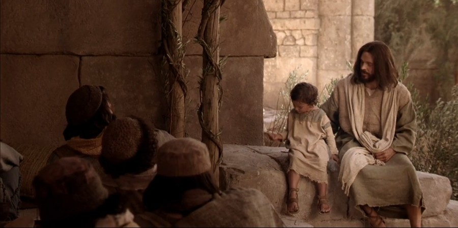

  

     
    

      <b>Matt.마25:1, JST 25:1 그리고 그때 인자가 오기 전 그날에 하늘 왕국은 자 기 등잔을 들고 신랑을 맞으러 나아간 열 처녀와 같으리니 
      </b>
    

     
    
And then, at that day, before the Son of man comes, the kingdom of heaven shall be likened unto ten virgins, who took their lamps, and went forth to meet the bridegroom. 
    

     
    

      <b>Matt.마25:2, JST 25:2 그들 가운데 다섯은 지혜롭고 그들 가운데 다섯은 어리석 었느니 라 
      </b>
    

     
    
And five of them were wise, and five of them were foolish. 
    
         
  

  

    
  

---

  

     
    

      <b>Matt.마25:3 어리석은 자들은 등잔 을 가지되 기름은 지니지 않았으나 
      </b>
    

     
    
They that were foolish took their lamps and took no oil with them; 
    

     
    

      <b>Matt.마25:4 지혜로운 자들은 그릇 에 기름을 담아 등잔과 함께 가져갔느 니라 
      </b>
    

     
    
but the wise took oil in their vessels with their lamps. 
    
         
  

  

    
  

---

  

     
    

      <b>Matt.마25:5 신랑이 지체하는 동안 그들이 모두 졸며 잠들었더니 
      </b>
    

     
    
While the bridegroom tarried, they all slumbered and slept. 
    

     
    

      <b>Matt.마25:6 한밤중에 한 외침이 있 어 보라 신랑이 오느니라 너희는 나가 서 그를 맞으라 하매 
      </b>
    

     
    
And at midnight there was a cry made, Behold, the bridegroom cometh; go ye out to meet him. 
    
         
  

  

    
  

---

  

     
    

      <b>Matt.마25:7 그 모든 처녀가 일어나 자기 등잔을 손질하는데 
      </b>
    

     
    
Then all those virgins arose, and trimmed their lamps. 
    

     
    

      <b>Matt.마25:8 어리석은 자들이 지혜 로운 자들에게 이르되 우리 등잔이 꺼 졌으니 너희 기름을 달라 했으나 
      </b>
    

     
    
And the foolish said unto the wise, Give us of your oil; for our lamps are gone out. 
    
         
  

  

    
  

---

  

     
    

      <b>Matt.마25:9, JST25:8 지혜로운 자들 이 대답하여 이르되 우리와 너희가 쓰 기에 충분하지 않으니 차라리 파는 자 들에게 가서 너희 자신을 위해 사라 하 매 
      </b>
    

     
    
But the wise answered, saying, Lest there be not enough for us and you, go ye rather to them that sell, and buy for yourselves. 
    

     
    

      <b>
      </b>
    

     
    

    
         
  

  

    
  

---

  

     
    

      <b>Matt.마25:10 그들이 사러 간 동안 신랑이 와서 준비된 자들은 그와 함께 결혼식에 들어가고 문이 닫혔느 니라 
      </b>
    

     
    
And while they went to buy, the bridegroom came; and they that were ready went in with him to the marriage; and the door was shut. 
    

     
    

      <b>Matt.마25:11 , JST 25:10 그 후에 다 른 처녀들도 와서 이르되 주여 주여 우 리에게 열어주소서 했으나 
      </b>
    

     
    
Afterward came also the other virgins, saying, Lord, Lord, open unto us. 
    
         
  

  

    
  

---

  

     
    

      <b>Matt.마25:12 , JST 25:11 그가 대답 하여 이르되 진실로 내가 너희에게 이 르노니 너희는 나를 알지 못하느니라 했느니라 
      </b>
    

     
    
But he answered and said, Verily I say unto you, Ye know me not. 
    

     
    

      <b>Matt.마25:13 그러므로 깨어있 으라 너희는 인자가 오는 그날이나 그 시를 알지 못하느니 라 
      </b>
    

     
    
Watch therefore; for ye know neither the day nor the hour wherein the Son of man cometh. 
    
         
  

  

    
  

---

  

     
    

      <b>Matt.마25:14 , JST 25:13 이제 내가 이것들을 비유로 말하리니 
      </b>
    

     
    
Now I will liken these things unto a parable. 
    

     
    

      <b>JST25:14 그것은 자기 종들을 불러 그 들에게 재산을 맡기고 먼 나라로 여행 을 떠나는 어떤 사람과 같으니 라 
      </b>
    

     
    
For it is like as a man traveling into a far country, who called his own servants, and delivered unto them his goods. 
    
         
  

  

    
  

---

  

     
    

      <b>Matt.마25:15 그가 한 사람에게는 다섯 달란트를 다른 사람에게는 두 달 란트를 또 다른 사람에게는 한 달란트 를 주되 각 사람에게 제각기 능력대로 주고 곧바로 길을 떠났느니 라 
      </b>
    

     
    
And unto one he gave five talents, to another two, and to another one; to every man according to his several ability; and straightway went on his journey. 
    

     
    

      <b>
      </b>
    

     
    

    
         
  

  

    
  

---

  

     
    

      <b>Matt.마25:16 , JST 25:16 이에 다섯 달란트를 받은 자는 가서 그것으로 장 사하여 다른 다섯 달란트를 벌었고 
      </b>
    

     
    
Then he that had received the five talents, went and traded with the same; and gained other five talents. 
    

     
    

      <b>Matt.마25:17 , JST 25:17 두 달란트 를 받은 자도 다른 두 달란트를 벌었으 나 
      </b>
    

     
    
And likewise he who received two talents , he also gained other two. 
    
         
  

  

    
  

---

  

     
    

      <b>Matt.마25:18 , JST 25:18 한 달란트 를 받은 자는 가서 땅을 파고 그 주인 의 돈을 감추었 더니 
      </b>
    

     
    
But he who had received one, went and digged in the earth and hid his lord's money. 
    

     
    

      <b>Matt.마25:19 오랜 후에 그 종들의 주인이 와서 그들과 함께 결산하게 되 었느니라 
      </b>
    

     
    
After a long time the lord of those servants cometh, and reckoneth with them. 
    
         
  

  

    
  

---

  

     
    

      <b>Matt.마25:20 이에 다섯 달란트를 받은 자가 다른 다섯 달란트를 가지고 와서 이르되 주여 당신이 나에게 다섯 달란트를 맡겼는데 보소서 내가 그것들 외에도 다섯 달란트를 더 벌었나이다 하매 
      </b>
    

     
    
And so he that had received the five talents came, and brought other five talents, saying, Lord, thou deliveredst unto me five talents; behold, I have gained besides them, five talents more. 
    

     
    

      <b>
      </b>
    

     
    

    
         
  

  

    
  

---

  

     
    

      <b>Matt.마25:21 , JST 25:21 그의 주인 이 그에게 이르되 잘했도다 선하고 신 실한 종아 너가 적은 것에 신실했으니 내가 너를 많은 것을 다스리는 자로 삼 으리라 너는 너의 주인의 기쁨에 참여 하라 했느니라 
      </b>
    

     
    
His lord said unto him, Well done, good and faithful servant; thou hast been faithful over a few things, I will make thee ruler over many things; enter thou into the joy of thy lord. 
    

     
    

      <b>
      </b>
    

     
    

    
         
  

  

    
  

---

  

     
    

      <b>Matt.마25:22 , JST 25:22 두 달란트 를 받은 자도 와서 이르되 주여 당신이 나에게 두 달란트를 맡겼는데 보소서 내가 그것들 외에 두 달란트를 벌었나 이다 하매 
      </b>
    

     
    
He also that had received two talents came and said, Lord, thou deliveredst unto me two talents; behold, I have gained two talents besides them. 
    

     
    

      <b>
      </b>
    

     
    

    
         
  

  

    
  

---

  

     
    

      <b>Matt.마25:23 그의 주인이 그에게 이르되 잘했도다 선하고 신실한 종아 너가 적은 것에 신실했으니 내가 너를 많은 것을 다스리는 자로 삼으리라 너 는 너의 주인의 기쁨에 참여하 라 했느 니라 
      </b>
    

     
    
His lord said unto him, Well done, good and faithful servant; thou hast been faithful over a few things, I will make thee ruler over many things; enter thou into the joy of thy lord. 
    

     
    

      <b>
      </b>
    

     
    

    
         
  

  

    
  

---

  

     
    

      <b>Matt.마25:24 , JST 25:24 이에 한 달 란트를 받은 자가 와서 이르되 주여 당 신은 엄한 사람이라 뿌리지 않은 데서 거두며 흩지 않은 데서 모으는 것을 내 가 알고 
      </b>
    

     
    
Then he who had received the one talent came, and said, Lord, I knew thee that thou art a hard man, reaping where thou hast not sown, and gath ering where thou hast not scattered. 
    

     
    

      <b>
      </b>
    

     
    

    
         
  

  

    
  

---

  

     
    

      <b>Matt.마25:25 , JST 25:25 두려워하여 가서 당신의 달란트를 땅속에 감추었나 이다 보소서 여기 당신의 달란트가 있 으니 당신이 다른 종들로부터 그렇게 한 것처럼 그것을 나로부터 가져가소서 그것은 당신 것이니이다 하매 
      </b>
    

     
    
And I was afraid, and went and hid thy talent in the earth; and lo, here is thy talent; take it from me as thou hast from thine other servants, for it is thine. 
    

     
    

      <b>
      </b>
    

     
    

    
         
  

  

    
  

---

  

     
    

      <b>Matt.마25:26 , JST 25:26 그의 주인 이 그에게 대답하여 이르되 오 악하고 게으른 종아 너는 내가 뿌리지 않은 데 서 거두며 흩지 않은 데서 모으는 것으 로 알았도다 
      </b>
    

     
    
His lord answered and said unto him, O wicked and slothful servant, thou knewest that I reap where I sowed not, and gather where I have not scattered. 
    

     
    

      <b>
      </b>
    

     
    

    
         
  

  

    
  

---

  

     
    

      <b>Matt.마25:27 , JST 25:27 그러므로 너가 이것을 알았을진대 너는 마땅히 나의 돈을 돈 바꾸는 자에게 맡겨두어 내가 올 때 나의 것을 이자와 함께 받 게 해야 했느니 라 
      </b>
    

     
    
Having known this, therefore, thou oughtest to have put my money to the exchangers, and at my coming I should have received mine own with usury. 
    

     
    

      <b>
      </b>
    

     
    

    
         
  

  

    
  

---

  

     
    

      <b>Matt.마25:28 , JST 25:28 그러므로 내가 너로부터 그 달란트를 빼앗아 열 달란트 가진 자에게 주리니 
      </b>
    

     
    
I will take, therefore, the talent from you, and give it unto him who hath ten talents. 
    

     
    

      <b>Matt.마25:29 , JST 25:29 다른 달란 트를 얻은 사람마다 더 받아서 풍족하 게 가질 것이나 
      </b>
    

     
    
For unto everyone who hath other talents, shall be given, and he shall have in abundance. 
    
         
  

  

    
  

---

  

     
    

      <b>JST25:30 다른 달란트를 얻지 못한 자 는 그가 이미 받은 것마저 빼앗기 리라 하고 
      </b>
    

     
    
But from him that hath not obtained other talents, shall be taken away even that which he hath received. 
    

     
    

      <b>
      </b>
    

     
    

    
         
  

  

    
  

---

  

     
    

      <b>Matt.마25:30 , JST 25:31 그의 주인 이 자기 종들에게 이르되 저 무익한 종 을 바깥 어둠 속으로 던져버리라 그곳 에서 울며 이를 갊이 있으리라 하리라 
      </b>
    

     
    
And his lord shall say unto his servants, Cast ye the unprofitable servant into outer darkness; there shall be weeping and gnashing of teeth. 
    

     
    

      <b>
      </b>
    

     
    

    
         
  

  

    
  

---

  

     
    

      <b>Matt.마25:31 , JST 25:32 인자가 그 의 영광 가운데 모든 거룩한 천사와 함 께 오면 그가 자기 영광의 보좌에 앉으 리니 
      </b>
    

     
    
When the Son of man shall come in his glory, and all the holy angels with him, then he shall sit upon the throne of his glory; 
    

     
    

      <b>
      </b>
    

     
    

    
         
  

  

    
  

---

  

     
    

      <b>Matt.마25:32 , JST 25:33 그 앞에 모 든 민족이 모일 것이요 목자가 양을 염 소로부터 나누는 것처럼 그가 그들의 한쪽을 다른 쪽으로부터 분리하되 
      </b>
    

     
    
And before him shall be gathered all nations; and he shall separate them one from another, as a shepherd divideth sheep from the goats; 
    

     
    

      <b>Matt.마25:33 , JST 25:33 양은 자기 오른편에 염소는 왼편에 두고 
      </b>
    

     
    
the sheep on his right hand, but the goats on the left. 
    
         
  

  

    
  

---

  

     
    

      <b>JST25:34 그는 자기 보좌에 앉으리니 열두 사도가 그와 함께하리라 
      </b>
    

     
    
And he shall sit upon his throne, and the twelve apostles with him. 
    

     
    

      <b>Matt.마25:34 그때 왕이 자기 오른 편에 있는 자들에게 이르되 오라 아버 지로부터 축복받은 자들아 세상의 기초 가 놓이던 때부터 너희를 위해 예비된 왕국을 유업으로 받으라 
      </b>
    

     
    
Then shall the King say unto them on his right hand, Come, ye blessed of my Father, inherit the kingdom prepared for you from the foundation of the world. 
    
         
  

  

    
  

---

  

     
    

      <b>Matt.마25:35 너희는 내가 굶주렸을 때 나에게 양식을 주었고 목마를 때 나 에게 마실 것을 주었고 나그네 되었을 때 나를 받아들였 으며 
      </b>
    

     
    
For I was an hungered, and ye gave me meat; I was thirsty, and ye gave me drink; I was a stranger, and ye took me in; 
    

     
    

      <b>Matt.마25:36 내가 헐벗었을 때 나 를 입혔고 병들었을 때 나를 방문했으 며 옥에 갇혔을 때 나에게 왔느니라 하 매 
      </b>
    

     
    
naked, and ye clothed me; I was sick, and ye visited me; I was in prison, and ye came unto me. 
    
         
  

  

    
  

---

  

     
    

      <b>Matt.마25:37 이에 의인들이 그에게 대답하여 이르되 주여 언제 우리가 당 신이 굶주린 것을 보고 당신을 먹였으 며 목마른 것을 보고 당신께 마실 것을 드렸나 이까 
      </b>
    

     
    
Then shall the righteous answer him, saying, Lord, when saw we thee an hungered, and fed thee; or thirsty, and gave thee drink? 
    

     
    

      <b>Matt.마25:38 언제 우리가 당신이 나그네 된 것을 보고 당신을 받아들였 으며 헐벗은 것을 보고 당신을 입혔나 이까 
      </b>
    

     
    
When saw we thee a stranger, and took thee in; or naked, and clothed thee? 
    
         
  

  

    
  

---

  

     
    

      <b>Matt.마25:39 또 언제 우리가 당신 이 병든 것이나 옥에 갇힌 것을 보고 당신께 갔나이까 하려니와 
      </b>
    

     
    
Or when saw we thee sick, or in prison, and came unto thee? 
    

     
    

      <b>
      </b>
    

     
    

    
         
  

  

    
  

---

  

     
    

      <b>Matt.마25:40 왕이 그들에게 대답하 여 이르되 진실로 내가 너희에게 이르 노니 너희가 이들 나의 형제들 가운데 지극히 작은 자 하나에게 한 것이 곧 나에게 한 것이라 할 것이요 
      </b>
    

     
    
And the King shall answer and say unto them, Verily I say unto you, inasmuch as ye have done it unto one of the least of these my brethren, ye have done it unto me. 
    

     
    

      <b>
      </b>
    

     
    

    
         
  

  

    
  

---

  

     
    

      <b>Matt.마25:41 그가 왼편에 있는 자 들에게도 이르되 너희 저주받은 자들아 나로부터 떠나 악마와 그의 천사들을 위해 준비된 영원한 불 속으로 들어가 라 
      </b>
    

     
    
Then shall he say also unto them on the left hand, Depart from me, ye cursed, into everlasting fire, prepared for the devil and his angels. 
    

     
    

      <b>
      </b>
    

     
    

    
         
  

  

    
  

---

  

     
    

      <b>Matt.마25:42 너희는 내가 굶주렸을 때 나에게 양식을 주지 않았고 내가 목 마를 때 나에게 마실 것을 주지 않았고 
      </b>
    

     
    
For I was an hungered, and ye gave me no meat; I was thirsty, and ye gave me no drink; 
    

     
    

      <b>Matt.마25:43 내가 나그네 되었을 때 나를 받아들이 지 않았고 내가 헐벗 었을 때 나를 입히지 않았으며 내가 병 들고 옥에 갇혔을 때 나를 방문하지 않 았느니라 하매 
      </b>
    

     
    
I was a stranger, and ye took me not in; naked, and ye clothed me not; sick, and in prison, and ye visited me not. 
    
         
  

  

    
  

---

  

     
    

      <b>Matt.마25:44 그들이 대답하여 이르 되 주여 언제 우리가 당신이 굶주리거 나 목마르거나 나그네 되거나 헐벗거나 병들거나 옥에 갇힌 것을 보고 당신을 보살피 지 않았나이까 하려니와 
      </b>
    

     
    
Then shall they also answer him, saying, Lord, when saw we thee an hungered, or athirst, or a stranger, or naked, or sick, or in prison, and did not minister unto thee? 
    

     
    

      <b>
      </b>
    

     
    

    
         
  

  

    
  

---

  

     
    

      <b>Matt.마25:45 , JST 25:46 그가 대답 하여 이르되 진실로 내가 너희에게 이 르노니 너희가 이들 나의 형제들 가운 데 지극히 작은 자 하나에게 하지 않은 것이 곧 나에게 하지 않은 것이라 할 것이요 
      </b>
    

     
    
Then shall he answer them, saying, Verily I say unto you, Inasmuch as ye did it not to one of the least of these my brethren , ye did it not unto me. 
    

     
    

      <b>
      </b>
    

     
    

    
         
  

  

    
  

---

  

     
    

      <b>Matt.마25:46 이들은 영원한 형벌에 들어가되 의인들은 영생에 들어가리라 하더라 
      </b>
    

     
    
And these shall go away into everlasting punishment; but the righteous into life eternal.
    

     
    

      <b>
      </b>
    

     
    

    
         
  

  

    
  

