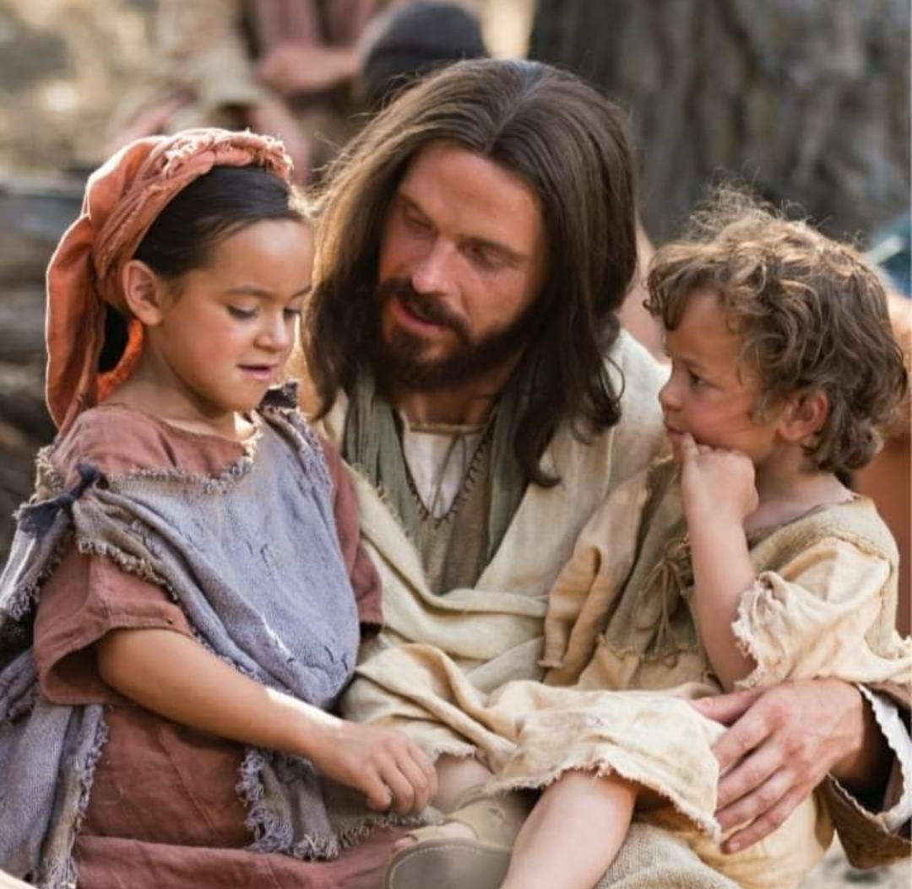

  

     
    

      <b>Matt.마27:1 아침이 되어 모든 제사 장과 백성의 장로들이 예수를 사형에 처하려 고 그에 대해 의논하더니 
      </b>
    

     
    
When the morning was come, all the chief priests and elders of the people took counsel against Jesus, to put him to death. 
    

     
    

      <b>Matt.마27:2 그를 결박하여 끌고 가 서 총독 본디오 빌라도에게 넘기니라 
      </b>
    

     
    
And when they had bound him, they led him away, and delivered him to Pontius Pilate, the governor. 
    
         
  

  

    
  

---

  

     
    

      <b>Matt.마27:3, JST 27:3 그때 그를 판 유다는 그가 정죄 받음을 보고 스스로 뉘우쳐 은화 삼십 개를 제사장들과 장 로들에게 다시 갖다 주며 
      </b>
    

     
    
Then Judas, who had betrayed him, when he saw that he was condemned, repented himself, and brought again the thirty pieces of silver to the chief priests and elders, 
    

     
    

      <b>Matt.마27:4 이르되 내가 무죄한 피 를 팔아 죄지었도다 했으나 
      </b>
    

     
    
Saying, I have sinned in that I have betrayed the innocent blood. 
    
         
  

  

    
  

---

  

     
    

      <b>JST27:5 그들이 이르되 그것이 우리에 게 무슨 상관이냐 명심하라 너의 죄는 너에게 돌아가리라 하매 
      </b>
    

     
    
And they said unto him , What is that to us? See thou to it; thy sins be upon thee. 
    

     
    

      <b>
      </b>
    

     
    

    
         
  

  

    
  

---

  

     
    

      <b>Matt.마27:5, JST 27:6 그가 은화를 성전 안에 던져 넣고 가서 스스로 나무에 목을 매니 곧바로 떨어지고 창자가 쏟아져 나와 죽었더라 
      </b>
    

     
    
And he cast down the pieces of silver in the temple, and departed, and went, and hanged himself on a tree. And straightway he fell down, and his bowels gushed out, and he died. 
    

     
    

      <b>
      </b>
    

     
    

    
         
  

  

    
  

---

  

     
    

      <b>Matt.마27:6 제사장 들이 그 은화를 거두어 이르되 이것은 피 값이므로 성 전고에 넣어 두는 것이 적법하지 않다 하고 
      </b>
    

     
    
And the chief priests took the silver pieces, and said, It is not lawful for to put them in the treasury, because it is the price of blood. 
    

     
    

      <b>Matt.마27:7 그들이 논의하여 그것 으로 토기장이 의 밭을 사서 나그네 들을 매장하게 했으므로 
      </b>
    

     
    
And they took counsel, and bought with them the potter's field, to bury strangers in. 
    
         
  

  

    
  

---

  

     
    

      <b>Matt.마27:8 그 밭은 오늘날까지 피 밭이라 불리더라 
      </b>
    

     
    
Wherefore that field was called, The field of blood, unto this day. 
    

     
    

      <b>
      </b>
    

     
    

    
         
  

  

    
  

---

  

     
    

      <b>Matt.마27:9 이에 선지자 예레미야 가 말한 것이 성취되 었나니 이르기를 이스라엘 자손이 그의 값으로 헤아린 은화 삼십 개를 저들이 거두었나이다 했느니라 
      </b>
    

     
    
Then was fulfilled that which was spoken by Jeremy, the prophet, saying, And they took the thirty pieces of silver, the price of him that was valued, whom they of the children of Israel did value. 
    

     
    

      <b>
      </b>
    

     
    

    
         
  

  

    
  

---

  

     
    

      <b>Matt.마27:10 , JST 27:10 그러므로 그들이 은화를 거두어 토기장이 의 밭 값으로 주었으니 주가 예레미야의 입으 로 정한 바와 같더라 
      </b>
    

     
    
And therefore they took the pieces of silver, and gave them for the potter's field, as the Lord appointed by the mouth of Jeremy. 
    

     
    

      <b>Matt.마27:11 예수가 총독 앞에 서 니라 총독이 그에게 물어 이르되 너가 유대인의 왕이냐 하매 
      </b>
    

     
    
And Jesus stood before the governor; and the governor asked him, saying, Art thou the king of the Jews? 
    
         
  

  

    
  

---

  

     
    

      <b>JST27:12 예수가 그에게 이르되 너가 참되게 말했나니 이는 나에 관해 그렇 게 기록되었음이라 하고 
      </b>
    

     
    
And Jesus said unto him, Thou sayest truly; for thus it is written of me. 
    

     
    

      <b>Matt.마27:12 제사장들과 장로들에 게서 고소당할 때는 아무 대답도 하지 않더라 
      </b>
    

     
    
And when he was accused of the chief priests and elders, he answered nothing. 
    
         
  

  

    
  

---

  

     
    

      <b>Matt.마27:13 이에 빌라도가 그에게 이르되 그들이 너를 대적하여 얼마나 많은 것을 증언하는지 너가 듣지 못하 느냐 했으나 
      </b>
    

     
    
Then saith Pilate unto him, Hearest thou not how many things they witness against thee? 
    

     
    

      <b>Matt.마27:14 , JST 27:15 그의 질문 에 대답하지 않더라 참으로 한 마디도 대답하지 않으니 총독이 매우 놀라더라 
      </b>
    

     
    
And he answered him not to his questions; yea, never a word, insomuch that the governor marveled greatly. 
    
         
  

  

    
  

---

  

     
    

      <b>Matt.마27:15 , JST 27:16 명절에 는 백성이 원하는 죄수 한 사람을 총독이 놓아주 곤 했는데 
      </b>
    

     
    
Now at the feast the governor was wont to release unto the people a prisoner, whom they would. 
    

     
    

      <b>Matt.마27:16 그때 그들에게는 바라 바라 하는 유명한 죄수가 있더라 
      </b>
    

     
    
And they had then a notable prisoner, called Barabbas. 
    
         
  

  

    
  

---

  

     
    

      <b>Matt.마27:17 그러므로 그들이 모였 을 때 빌라도가 그들에게 이르되 너희 는 내가 누구를 놓아주기 원하느냐 바 라바냐 그리스도라 하는 예수냐 했나니 
      </b>
    

     
    
Therefore when they were gathered together, Pilate said unto them, Whom will ye that I release unto you? Barabbas, or Jesus which is called Christ? 
    

     
    

      <b>Matt.마27:18 이는 그들이 시기하여 그를 넘겨준 것을 빌라도 가 알았음이라 
      </b>
    

     
    
For he knew that for envy they had delivered him. 
    
         
  

  

    
  

---

  

     
    

      <b>Matt.마27:19 , JST 27:20 그가 재판 석에 앉았을 때 그의 아내가 사람을 보 내어 이르되 당신은 저 의로운 사람에 게 아무것도 관여하지 마소서 내가 오 늘 시현 가운데 그로 인해 많은 일을 겪었나이다 했으나 
      </b>
    

     
    
When he was set down on the judgment seat, his wife sent unto him, saying, Have thou nothing to do with that just man, for I have suffered many things this day in a vision because of him. 
    

     
    

      <b>
      </b>
    

     
    

    
         
  

  

    
  

---

  

     
    

      <b>Matt.마27:20 제사장들과 장로들이 무리를 설득하여 바라바를 요구하게 하 고 예수를 죽이게 하더라 
      </b>
    

     
    
But the chief priests and elders persuaded the multitude that they should ask Barabbas, and destroy Jesus. 
    

     
    

      <b>Matt.마27:21 , JST 27:22 총독이 그 들에게 이르되 둘 가운데 어느 쪽을 내 가 너희에게 놓아 주기를 원하느냐 하 니 그들이 이르되 바라바 를 놓아 주소 서 하는지라 
      </b>
    

     
    
And the governor said unto them, Whether of the twain will ye that I release unto you? They said, Barabbas. 
    
         
  

  

    
  

---

  

     
    

      <b>Matt.마27:22 , JST 27:23 빌라도가 그들에게 이르되 그리스도라 하는 예수 는 내가 어떻게 하랴 하니 
      </b>
    

     
    
Pilate said unto them, What shall I do with Jesus, which is called Christ? 
    

     
    

      <b>JST27:24 모두가 그에게 이르되 그를 십자가에 못 박으소서 하므로 
      </b>
    

     
    
And all said unto him, Let him be crucified. 
    
         
  

  

    
  

---

  

     
    

      <b>Matt.마27:23 총독이 이르기를 왜 그러느 냐 그가 무슨 악한 일을 했느냐 했으나 그들이 더욱 소리 질러 이르되 그를 십자가에 못 박으소서 하더라 
      </b>
    

     
    
And the governor said, Why, what evil hath he done? But they cried out the more, saying, Let him be crucified. 
    

     
    

      <b>
      </b>
    

     
    

    
         
  

  

    
  

---

  

     
    

      <b>Matt.마27:24 , JST 27:26 빌라도 는 자신이 전혀 이기지 못하고 오히려 소 동이 일어나는 것을 보고 물을 가져다 무리 앞에서 손을 씻으며 이르되 이 의 로운 사람의 피에 관해 나는 무죄하니 너희는 조심하여 그에게 아무것도 하지 말라 하매 
      </b>
    

     
    
When Pilate saw that he could prevail nothing, but rather that a tumult was made, he took water, and washed his hands before the multitude, saying, I am innocent of the blood of this just person; see that ye do nothing unto him. 
    

     
    

      <b>
      </b>
    

     
    

    
         
  

  

    
  

---

  

     
    

      <b>Matt.마27:25 , JST 27:27 모든 백성 이 대답하여 이르되 그의 피가 우리와 우리 자손 위에 임하게 하소서 하더라 
      </b>
    

     
    
Then answered all the people, and said, His blood come upon us and our children. 
    

     
    

      <b>Matt.마27:26 이에 그가 바라바 를 그들에게 놓아주고 예수는 채찍질 하여 십자가에 못 박히게 넘겨주 니라 
      </b>
    

     
    
Then released he Barabbas unto them; and when he had scourged Jesus, he delivered him to be crucified. 
    
         
  

  

    
  

---

  

     
    

      <b>Matt.마27:27 , JST 27:29 총독의 병 사들이 예수를 데리고 공관 안으로 들 어가니 온 부대가 모여 
      </b>
    

     
    
Then the soldiers of the governor took Jesus into the common hall, and gathered unto him the whole band. 
    

     
    

      <b>Matt.마27:28 , JST 27:30 그의 옷을 벗기고 자주색 예복을 입히고 
      </b>
    

     
    
And they stripped him, and put on him a purple robe. 
    
         
  

  

    
  

---

  

     
    

      <b>Matt.마27:29 , JST 27:31 가시관을 엮어 그의 머리 위에 씌우고 갈대를 그 의 오른손에 들리고 그 앞에서 무릎을 꿇어 절하고 조롱하며 이르되 유대인의 왕이여 평안하소서 하고 
      </b>
    

     
    
And when they had platted a crown of thorns, they put it upon his head, and a reed in his right hand; and they bowed the knee before him, and they mocked him, saying, Hail, King of the Jews! 
    

     
    

      <b>
      </b>
    

     
    

    
         
  

  

    
  

---

  

     
    

      <b>Matt.마27:30 그에게 침 뱉고 갈대 를 빼앗아 그의 머리를 때리더라 
      </b>
    

     
    
And they spit upon him, and took the reed, and smote him on the head. 
    

     
    

      <b>Matt.마27:31 그들이 그를 조롱한 후에 그로부터 예복을 벗기고 그의 옷 을 입혀 십자가에 못 박으려고 끌고 가 는데 
      </b>
    

     
    
And after that they had mocked him, they took the robe off from him, and put his own raiment on him, and led him away to crucify him. 
    
         
  

  

    
  

---

  

     
    

      <b>Matt.마27:32 나갈 때 시몬이라 하 는 구레네 사람을 만나 그에게 강제로 예수의 십자가를 지게 하더라 
      </b>
    

     
    
And as they came out, they found a man of Cyrene, Simon by name; him they compelled to bear his cross. 
    

     
    

      <b>Matt.마27:33 , JST 27:35 그들이 골 고다라 하는 장소에 이르러 (다시 말하 면 매장지라) 
      </b>
    

     
    
And when they were come unto a place called Golgotha, (that is to say, a place of burial, ) 
    
         
  

  

    
  

---

  

     
    

      <b>Matt.마27:34 , JST 27:36 쓸개 탄 신 포도주 를 그에게 주었더니 그가 신 포 도주를 맛보고는 마시려 하지 않더라 
      </b>
    

     
    
They gave him vinegar to drink mingled with gall; and when he had tasted the vinegar , he would not drink. 
    

     
    

      <b>
      </b>
    

     
    

    
         
  

  

    
  

---

  

     
    

      <b>Matt.마27:35 , JST 27:37 그들이 그 를 십자가에 못 박고 나서 제비 뽑아 그의 옷을 나누었나니 이는 선지자가 말한 바 저들이 나의 옷을 자기들 가운 데 나누고 나의 속옷을 위해 제비 뽑았 나이다 한 것이 성취되게 하려 함이더 라 
      </b>
    

     
    
And they crucified him, and parted his garments, casting lots; that it might be fulfilled which was spoken by the prophet, They parted my garments among them, and for my vesture they did cast lots. 
    

     
    

      <b>
      </b>
    

     
    

    
         
  

  

    
  

---

  

     
    

      <b>Matt.마27:36 그들이 그곳에 앉아 그를 지켰으며 
      </b>
    

     
    
And sitting down they watched him there. 
    

     
    

      <b>Matt.마27:37 , JST 27:39 빌라도가 명패를 써서 십자가 위에 붙였는데 그 쓴 것은 
      </b>
    

     
    
And Pilate wrote a title, and put it on the cross, and the writing was, JST27:40 그리스 어와 라틴어와 히브리 어로 유대인의 왕 나사렛 예수라 했더 라 JESUS OF NAZARETH, THE KING OF THE JEWS, in letters of Greek, and Latin, and Hebrew. 
    
         
  

  

    
  

---

  

     
    

      <b>JST27:41 제사장 들이 빌라도에게 이르 되 그의 죄목을 적어서 그의 머리 위에 세우되 이 사람은 자칭 유대인의 왕 예 수라고 써야 하나이다 했으나 
      </b>
    

     
    
And the chief priests said unto Pilate, It should be written and set up over his head, his accusation, This is he that said he was Jesus, the King of the Jews. 
    

     
    

      <b>JST27:42 빌라도가 대답하여 이르되 나는 쓸 것을 썼으니 그대로 두라 하더 라 
      </b>
    

     
    
But Pilate answered and said, What I have written, I have written; let it alone. 
    
         
  

  

    
  

---

  

     
    

      <b>Matt.마27:38 그때 강도 두 사람이 그와 함께 십자가에 못 박혔나니 하나 는 오른편에 하나는 왼편에 있더라 
      </b>
    

     
    
Then were there two thieves crucified with him; one on the right hand, and another on the left. 
    

     
    

      <b>Matt.마27:39 지나가는 자들이 머리 를 흔들며 그를 모욕하여 
      </b>
    

     
    
And they that passed by reviled him, wagging their heads, 
    
         
  

  

    
  

---

  

     
    

      <b>Matt.마27:40 , JST 27:44 이르되 성 전을 허물고 삼 일 만에 다시 짓는 자 여 너 자신을 구원하라 너가 하나님의 아들이면 십자가에서 내려오라 하고 
      </b>
    

     
    
and saying, Thou that destroyest the temple, and buildest it again in three days, save thyself. If thou be the Son of God come down from the cross. 
    

     
    

      <b>Matt.마27:41 , JST 27:45 제사장들도 서기관 들과 장로들과 함께 조롱하여 이 르되 
      </b>
    

     
    
Likewise also the chief priests mocking with the scribes and elders, said, 
    
         
  

  

    
  

---

  

     
    

      <b>Matt.마27:42 그가 다른 사람은 구 원했으나 자기는 구원할 수 없도다 그 가 이스라엘 의 왕이면 지금 십자가에서 내려오게 하라 그리하면 우리가 믿겠노 라 
      </b>
    

     
    
He saved others, himself he cannot save. If he be the King of Israel, let him now come down from the cross, and we will believe him. 
    

     
    

      <b>
      </b>
    

     
    

    
         
  

  

    
  

---

  

     
    

      <b>Matt.마27:43 그가 하나님을 신뢰하 니 하나님으로 하여금 지금 그를 건져 내게 하고 구원하 려면 구원하게 하라 이는 그가 이르기를 나는 하나님의 아 들이라 했음이라 하더라 
      </b>
    

     
    
He trusted in God; let him deliver him now; if he will save him, let him save him; for he said, I am the Son of God. 
    

     
    

      <b>
      </b>
    

     
    

    
         
  

  

    
  

---

  

     
    

      <b>Matt.마27:44 , JST 27:47 그와 함께 십자가에 못 박힌 강도 가운데 하나도 자기 입으로 똑같은 말을 내뱉었으나 다른 사람은 그를 꾸짖어 이르되 
      </b>
    

     
    
One of the thieves also, which were crucified with him, cast the same in his teeth. But the other rebuked him, saying, JST27:47 너는 같은 정죄 아래 놓여 있는 것을 알면서 하나님을 두려워 하지 않느냐 이 사람은 의로우며 죄가 없느 니라 하고 주께 부르짖기를 주여 나를 구원하소서 하니 Dost thou not fear God, seeing thou art under the same condemnation; and this man is just, and hath not sinned; and he cried unto the Lord that he would save him. 
    

     
    

      <b>
      </b>
    

     
    

    
         
  

  

    
  

---

  

     
    

      <b>JST27:48 주가 그에게 이르되 오늘 너 는 나와 함께 낙원에 있으리라 하더라 
      </b>
    

     
    
And the Lord said unto him, This day thou shalt be with me in Paradise. 
    

     
    

      <b>Matt.마27:45 제육 시부터 온 땅에 어둠이 임하여 제구 시까지 계속되더니 
      </b>
    

     
    
Now from the sixth hour there was darkness over all the land unto the ninth hour. 
    
         
  

  

    
  

---

  

     
    

      <b>Matt.마27:46 , JST 27:50 제구 시쯤 에 예수가 큰 음성으로 외쳐 이르되 엘 리 엘리 라마 사박다니 하매 (그것은 나의 하나님 나의 하나님 어찌하여 나 를 버렸나이까 함이라 ) 
      </b>
    

     
    
And about the ninth hour, Jesus cried with a loud voice, saying, Eli, Eli, lama sabacthani? (That is to say, My God, my God, why hast thou forsaken me?) 
    

     
    

      <b>
      </b>
    

     
    

    
         
  

  

    
  

---

  

     
    

      <b>Matt.마27:47 , JST 27:51 그곳에 섰 던 자들 가운데 어떤 이들이 그의 말을 듣고 이르되 이 사람이 엘리야 를 부른 다 하더라 
      </b>
    

     
    
Some of them that stood there, when they heard him, said, This man calleth for Elias. 
    

     
    

      <b>Matt.마27:48 그들 가운데 한 사람 이 곧바로 달려가서 해면을 가져다 신 포도주 를 적시고 갈대에 매달아 그에게 주니 
      </b>
    

     
    
And straightway one of them ran, and took a sponge, and filled it with vinegar, and put it on a reed, and gave him to drink. 
    
         
  

  

    
  

---

  

     
    

      <b>Matt.마27:49 , JST 27:53 나머지 사 람들이 이르되 그를 놔두라 엘리야 가 구원하 러 오나 보자 하더라 
      </b>
    

     
    
The rest said, Let him be, let us see whether Elias will come to save him. 
    

     
    

      <b>Matt.마27:50 , JST 27:54 예수가 다 시 큰 음성으 로 외쳐 이르되 아버지여 마쳤나이다 당신의 뜻이 이루어졌나이 다 하고 영이 떠나매 
      </b>
    

     
    
Jesus when he had cried again with a loud voice, saying, Father, it is finished, thy will is done, yielded up the ghost. 
    
         
  

  

    
  

---

  

     
    

      <b>Matt.마27:51 보라 성전 휘장이 위 로부터 아래까지 둘로 찢어졌으며 땅이 흔들리 고 바위가 갈라지더니 
      </b>
    

     
    
And behold, the veil of the temple was rent in twain from the top to the bottom; and the earth did quake, and the rocks rent; 
    

     
    

      <b>Matt.마27:52 , JST 27:56 무덤이 열 려 잠자던 성도들의 몸이 일어나되 그 수효가 많았으며 
      </b>
    

     
    
And the graves were opened; and the bodies of the saints which slept, arose, who were many , 
    
         
  

  

    
  

---

  

     
    

      <b>Matt.마27:53 , JST 27:57 그의 부활 후에는 무덤에서 나와 거룩한 성에 들 어가 많은 사람에게 보이더라 
      </b>
    

     
    
And came out of the graves after his resurrection, went into the holy city, and appeared unto many. 
    

     
    

      <b>
      </b>
    

     
    

    
         
  

  

    
  

---

  

     
    

      <b>Matt.마27:54 , JST 27:58 백부장과 그와 함께 예수를 지키던 자들이 땅이 흔들리 는 소리를 듣고 일어난 일을 보 더니 크게 두려워하 여 이르되 참으로 이 사람은 하나님의 아들이었도다 하더 라 
      </b>
    

     
    
Now when the centurion, and they that were with him, watching Jesus, heard the earth quake , and saw those things which were done, they feared greatly, saying, Truly this was the Son of God. 
    

     
    

      <b>
      </b>
    

     
    

    
         
  

  

    
  

---

  

     
    

      <b>Matt.마27:55 , JST 27:59 그의 매장 을 시중하 기 위해 갈릴리로부터 예수를 따라온 많은 여자가 멀리서 바라보고 있었나니 
      </b>
    

     
    
And many women were there beholding afar off, which followed Jesus from Galilee, ministering unto him for his burial; 
    

     
    

      <b>
      </b>
    

     
    

    
         
  

  

    
  

---

  

     
    

      <b>Matt.마27:56 , JST 27:59 그들 가운 데는 막달라 마리아 와 야고보와 요세의 어머니 마리아와 세베대 자녀의 어머니 도 있더라 
      </b>
    

     
    
Among whom was Mary Magdalene, and Mary the mother of James and Joses, and the mother of Zebedee's children. 
    

     
    

      <b>Matt.마27:57 저녁이 되매 요셉이라 하는 아리마대의 부자 한 사람이 왔는 데 그도 예수의 제자라 
      </b>
    

     
    
When the evening was come, there came a rich man of Arimathea, named Joseph, who also himself was Jesus' disciple; 
    
         
  

  

    
  

---

  

     
    

      <b>Matt.마27:58 그가 빌라도에게 가서 예수의 몸을 요구하니 빌라도가 명하여 그 몸을 내어 주라 하더라 
      </b>
    

     
    
he went to Pilate and begged the body of Jesus. Then Pilate commanded the body to be delivered. 
    

     
    

      <b>Matt.마27:59 요셉이 그 몸을 가져 다 정결한 세마포로 싸서 
      </b>
    

     
    
And when Joseph had taken the body, he wrapped it in a clean linen cloth, 
    
         
  

  

    
  

---

  

     
    

      <b>Matt.마27:60 , JST27:62 바위 속에 판 자기의 새 무덤에 넣어두고 큰 돌을 묘실 문에 굴려 놓고 떠나니 
      </b>
    

     
    
and laid it in his own new tomb, which he had hewn out in the rock; and he rolled a great stone to the door of the sepulcher , and departed. 
    

     
    

      <b>Matt.마27:61 , JST27:63 막달라 마 리아와 다른 마리아가 묘실을 마주 보 고 앉았더라 
      </b>
    

     
    
And there was Mary Magdalene, and the other Mary, sitting over against the sepulcher . 
    
         
  

  

    
  

---

  

     
    

      <b>Matt.마27:62 이튿날 곧 예비일 다 음 날에 제사장들과 바리새인 들이 함께 빌라도에게 와서 
      </b>
    

     
    
Now the next day that followed the day of the preparation, the chief priests and Pharisees came together unto Pilate, 
    

     
    

      <b>Matt.마27:63 이르되 주여 저 속이 는 자가 아직 살아있을 때 이르기를 내 가 삼 일 후에 다시 살아나리라 한 것 을 우리가 기억하나이다 
      </b>
    

     
    
saying, Sir, we remember that that deceiver said, while he was yet alive, After three days I will rise again. 
    
         
  

  

    
  

---

  

     
    

      <b>Matt.마27:64 , JST 27:65 그러므로 그 묘실을 삼 일까지 굳게 지키라 고 명 하여 그의 제자들이 밤에 와서 그를 훔 쳐가 백성에게 이르되 그가 죽음으로부 터 살아났다고 말하지 않게 하소서 그 렇게 되면 이 마지막 속임이 처음보다 더 나빠지리이 다 하는지라 
      </b>
    

     
    
Command therefore, that the sepul cher be made sure until the third day, lest his disciples come by night, and steal him away, and say unto the people, He is risen from the dead; so this last imposture will be worse than the first. 
    

     
    

      <b>
      </b>
    

     
    

    
         
  

  

    
  

---

  

     
    

      <b>Matt.마27:65 빌라도가 그들에게 이 르되 너희에게 파수꾼 이 있으니 가서 너희가 할 수 있는 대로 굳게 지키라 하매 
      </b>
    

     
    
Pilate said unto them, Ye have a watch; go your way, make it as sure as ye can. 
    

     
    

      <b>Matt.마27:66 , JST27:67 그들이 가 서 돌을 봉인하고 파수꾼 을 세워 묘실 을 굳게 지키더 라 
      </b>
    

     
    
So they went and made the sepulcher sure, sealing the stone and setting a watch.
    
         
  

  

    
  

