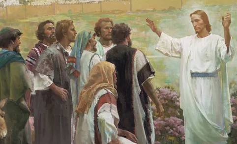

  

     
    

      <b>Matt.마6:1, JST 6:1 그리고 이렇게 되었나니 예수가 그의 제자들을 가르칠 때 그들에게 이르되 사람에게 보이려고 그들 앞에서 너희 구제를 베풀지 않도 록 조심하라 그렇지 않으면 하늘에 계 신 너희 아버지 에게서 상을 얻지 못하 느니라 
      </b>
    

     
    
And it came to pass that , as Jesus taught his disciples, he said unto them, Take heed that ye do not your alms before men , to be seen of them; otherwise ye hav e no reward of your Father who is in heaven. 
    

     
    

      <b>
      </b>
    

     
    

    
         
  

  

    
  

---

  

     
    

      <b>Matt.마6:2, JST6:2 그러므로 너희가 구제를 베풀 때에는 위선자들이 사람에 게 영광을 얻으려고 회당과 거리에서 하는 것처럼 너희 앞에 나팔을 불지 말 라 진실로 내가 너희에게 이르노니 그 들은 자기 상을 받았느니라 
      </b>
    

     
    
Therefore, when thou doest alms, do not s ound a trumpet before thee , as the hypocrites do , in the synagogues and in the streets, that they may have glory of men. Verily I say unto you, They have their reward. 
    

     
    

      <b>
      </b>
    

     
    

    
         
  

  

    
  

---

  

     
    

      <b>Matt.마6:3, JST 6:3 그러나 너희는 구제를 베풀 때 그것이 너희에게 오른 손이 하는 것을 모르는 왼손처럼 되게 하여 
      </b>
    

     
    
But when thou doest alms, let it be unto thee as thy left hand not knowing what thy right hand doeth ; 
    

     
    

      <b>Matt.마6:4, JST 6:4 너희 구제가 은 밀한 중에 이루어지 게 하라 그리하면 은밀한 가운데 보시는 너희 아버지가 친히 드러내어 너희에게 보상하리라 
      </b>
    

     
    
That thine alms may be in secret; and thy Father who seeth in secret, himself shall reward thee openly. 
    
         
  

  

    
  

---

  

     
    

      <b>Matt.마6:5, JST 6:5 또 너희가 기도 할 때에는 위선자 처럼 되지 말라 이는 그들이 사람에게 보이려고 회당과 거리 모퉁이에 서서 기도하기를 좋아함이라 진실로 내가 너희에게 이르노니 그들은 자기 상을 받았느 니라 
      </b>
    

     
    
And when thou prayest, thou shalt not be as the hypocrites ; for they love to pray standing in the synagogues and in the corners of the streets, that they may be seen of men; for, verily, I say unto you, T hey have their reward. 
    

     
    

      <b>
      </b>
    

     
    

    
         
  

  

    
  

---

  

     
    

      <b>Matt.마6:6, JST 6:6 그러나 너희는 기도할 때 너희 골방에 들어가 문을 닫 고 은밀한 중에 계시는 너희 아버지 께 기도하라 그리하 면 은밀한 가운데 보시 는 너희 아버지가 드러내어 너희에게 보상하 리라 
      </b>
    

     
    
But thou, when thou prayest, enter into thy closet , and when thou hast shut the door, pray to thy Father who is in secret; and thy Father who seeth in secret shall reward thee openly. 
    

     
    

      <b>
      </b>
    

     
    

    
         
  

  

    
  

---

  

     
    

      <b>Matt.마6:7, JST 6:7 너희가 기도할 때에는 위선자들이 하는 것처럼 헛되이 중언부언하지 말라 그들은 자기의 많은 말로 인해 들은 바 될 것으로 생각하느 니라 
      </b>
    

     
    
But when ye pray, use not vain repetitions , as the hypocrites do; for they think that they shall be heard for their much speaking. 
    

     
    

      <b>
      </b>
    

     
    

    
         
  

  

    
  

---

  

     
    

      <b>Matt.마6:8, JST6:8 그러므로 너희는 그들처럼 되지 말라 너희 아버지 는 너 희가 구하기 전에 너희에게 무엇이 필 요한지 아느니 라 
      </b>
    

     
    
Therefore be ye not like unto them; for your Father know eth what things ye have need of , before ye ask him. 
    

     
    

      <b>
      </b>
    

     
    

    
         
  

  

    
  

---

  

     
    

      <b>Matt.마6:9, JST6:9 그러므로 너희는 이런 방식으로 기도하라 이르되 
      </b>
    

     
    
Therefore after this manner shall ye pray, saying , JST6:10 하늘에 계신 우리 아버지여 당신의 이름이 거룩히 여김을 받으소서 Our Father who art in heaven, Hallowed be thy name. 
    

     
    

      <b>Matt.마6:10, JST6:11 당신의 왕국이 임하기를 원하며 당신의 뜻이 하늘에서 이루어진 것처럼 땅에서 도 이루어 지기 를 원하나이다 
      </b>
    

     
    
Thy kingdom come. Thy will be done on earth, as it is done in heaven. 
    
         
  

  

    
  

---

  

     
    

      <b>Matt.마6:11, JST6:12 오늘 우리에게 일용할 양식을 주시고 
      </b>
    

     
    
Give us this day , our daily bread. 
    

     
    

      <b>Matt.마6:12, JST6:13 우리가 우리에 게 잘못한 자를 용서한 것처럼 우리의 잘못을 용서해 주소서 
      </b>
    

     
    
And forgive us our trespasses , as we forgive those who trespass against us . 
    
         
  

  

    
  

---

  

     
    

      <b>Matt.마6:13, JST 6:14 또 우리를 유 혹에 이끌리 게 버려두 지 마시고 악으로 부터 우리를 건져 주소서 
      </b>
    

     
    
And suffer us not to be led into temptation , but deliver us from evil; 
    

     
    

      <b>JST6:15 왕국과 권능과 영광은 영원히 당신 것이니이 다 아멘 하라 
      </b>
    

     
    
For thine is the kingdom, and the power, and the glory, forever and ever, Amen. 
    
         
  

  

    
  

---

  

     
    

      <b>Matt.마6:14, JST 6:16 이는 너희가 너희에게 잘못한 사람의 잘못을 용서하 면 너희 하늘 아버지 도 너희를 용서하 려니와 
      </b>
    

     
    
For if ye forgive men their trespasses, who trespass against you , your heavenly Father will also forgive you; 
    

     
    

      <b>Matt.마6:15, JST6:16 너희가 사람의 잘못을 용서하지 않으면 너희 하늘 아 버지도 너희 잘못을 용서하지 않을 것 임이라 
      </b>
    

     
    
but if ye forgive not men their tres passes, neither will your heavenly Father forgive you your trespasses. 
    
         
  

  

    
  

---

  

     
    

      <b>Matt.마6:16 또 너희가 금식할 때에 는 슬픈 안색을 하는 위선자 들처럼 되 지 말라 그들은 금식하는 것을 사람에 게 보이려고 자기 얼굴을 흉하게 하느 니라 진실로 내가 너희에게 이르노니 그들은 자기 상을 받았느니라 
      </b>
    

     
    
Moreover, when ye fast, be not as the hypocrites, of a sad countenance; for they disfigure their faces, that they may appear unto men to fast. Verily, I say unto you, they have their reward. 
    

     
    

      <b>
      </b>
    

     
    

    
         
  

  

    
  

---

  

     
    

      <b>Matt.마6:17, JST6:18 그러나 너희는 금식할 때 너희 머리에 기름을 바르고 얼굴을 씻어 
      </b>
    

     
    
But thou, when thou fastest, anoint thy head and wash thy face, 
    

     
    

      <b>Matt.마6:18, JST6:18 너희가 금식하 는 것을 사람에게 보이지 말고 은밀한 중에 계시는 너희 아버지 께 보이라 그 리하면 은밀한 가운데 보시는 너희 아 버지가 드러내어 너희에게 보상하 리라 
      </b>
    

     
    
that thou appear not unto men to fast, but unto thy Father who is in secret; and thy Father who seeth in secret, shall reward thee openly. 
    
         
  

  

    
  

---

  

     
    

      <b>Matt.마6:19 너희 자신을 위해 보물 을 땅 위에 쌓아두지 말라 그곳에는 좀 과 녹이 부패하게 하며 도둑이 뚫고 들 어와 훔치느니라 
      </b>
    

     
    
Lay not up for yourselves treasure s upon earth, where moth and rust doth corrupt, and where thieves break through and steal. 
    

     
    

      <b>
      </b>
    

     
    

    
         
  

  

    
  

---

  

     
    

      <b>Matt.마6:20 너희 자신을 위해 보물 을 하늘에 쌓아두라 그곳에는 좀이나 녹이 부패하게 하지 못하며 도둑이 뚫 고 들어오 거나 훔치지도 못하나니 
      </b>
    

     
    
But lay up for yourselves treasures in heaven, where neither moth nor rust doth corrupt , and where thieves do not break through nor steel. 
    

     
    

      <b>Matt.마6:21 너희 보물이 있는 곳에 너희 마음도 있으리라 
      </b>
    

     
    
For where your treasure is, there will your heart be also. 
    
         
  

  

    
  

---

  

     
    

      <b>Matt.마6:22, JST 6:22 몸의 빛은 눈 이라 그러므로 너희 눈이 순전하여 하 나님의 영광만을 전념하여 구하면 너희 온몸이 빛으로 충만하리라 
      </b>
    

     
    
The light of the body is the eye; if therefore thine eye be single to the glory of God, thy whole body shall be full of light. 
    

     
    

      <b>
      </b>
    

     
    

    
         
  

  

    
  

---

  

     
    

      <b>Matt.마6:23, JST 6:23 그러나 너희 눈이 악하면 너희 온몸이 어둠으로 가 득하리니 그러므로 너희 안에 있는 빛 이 어두워지면 그 어둠이 얼마나 심하 겠느냐 
      </b>
    

     
    
But if thine eye be evil, thy whole body shall be full of darkn ess. If therefore the light which is in thee be darkness, how great shall that dark ness be. 
    

     
    

      <b>
      </b>
    

     
    

    
         
  

  

    
  

---

  

     
    

      <b>Matt.마6:24 아무도 두 주인을 섬길 수 없나니 이는 그가 한쪽을 미워하고 다른 쪽을 사랑하거나 그렇지 않으면 한쪽을 중히 여기고 다른 쪽을 멸시할 것임이라 너희는 하나님과 재물을 겸하 여 섬길 수 없느니라 
      </b>
    

     
    
No man can serve two masters, for either he will hate the one , and love the other ; or else he will hold to the one and despise the other. Ye cannot serve God and mammon. 
    

     
    

      <b>
      </b>
    

     
    

    
         
  

  

    
  

---

  

     
    

      <b>JST6:25 또 내가 너희에게 이르노니 너희는 세상에 들어가되 세상을 염려하지 말라 이는 세상이 너희를 미워하고 박해하며 자기들의 회당에서 너희를 쫓 아낼 것임이 라 
      </b>
    

     
    
And, again, I say unto you, Go ye into the world , and care not for the world; for the world will hate you, and will persecute you, and will turn you out of their synagogues. 
    

     
    

      <b>
      </b>
    

     
    

    
         
  

  

    
  

---

  

     
    

      <b>JST6:26 그러할지라도 너희는 사람들 을 가르치며 집에서 집으로 나아가라 내가 너희 앞에 가리니 
      </b>
    

     
    
Nevertheless, ye shall go forth from house to house, teaching the people; and I will go before you. 
    

     
    

      <b>JST6:27 너희 하늘 아버지 는 무엇이든 너희가 먹을 음식과 입거나 걸칠 옷을 너희를 위해 마련하리라 
      </b>
    

     
    
And your heave nly Father will provide for you , whatsoever things ye n eed for food, what ye shall eat ; and for raiment, what ye shall wear or put on. 
    
         
  

  

    
  

---

  

     
    

      <b>Matt.마6:25, JST6:28 그러므로 내가 너희에게 이르노니 너희 생명을 위해 무엇을 먹을까 무엇을 마실까 염려하지 말고 너희 몸을 위해 무엇을 입을까 염 려하지도 말라 생명이 음식보다 중요하 고 몸이 옷보다 중요하지 않으냐 
      </b>
    

     
    
Therefore I say unto you, T ake no thought f or your life, what ye shall eat , or what ye shall drink ; nor yet for your bodies , what ye shall put on. Is not the life more than meat, and the body than raiment? 
    

     
    

      <b>
      </b>
    

     
    

    
         
  

  

    
  

---

  

     
    

      <b>Matt.마6:26, JST 6:29 공중의 새를 보라 그것은 심지 않고 거두지도 않으 며 곳간에 모아들이지도 않으나 너희 하늘 아버지가 그것들을 먹이나니 너희 는 그것들보다 훨씬 낫지 않으냐 그가 너희에게 훨씬 더 많이 먹이지 않겠느 냐 
      </b>
    

     
    
Behold the fow ls of the air, for they sow not , neither do they reap, nor gather into barns; yet your heavenly Father feedeth them. Are ye not much better than they? How much more will he not feed you? 
    

     
    

      <b>
      </b>
    

     
    

    
         
  

  

    
  

---

  

     
    

      <b>JST6:30 그러므로 이런 것들을 염려하 지 말고 내가 너희에게 명한 나의 계명 을 지키라 
      </b>
    

     
    
Wherefore take no thought for these things, but keep my commandments wherewith I have commanded you. 
    

     
    

      <b>Matt.마6:27, JST 6:31 너희 가운데 누가 염려함으로 자기 키에 한 자를 더 할 수 있느냐 
      </b>
    

     
    
For which of you by taking thought can add one cubit unto his stature? 
    
         
  

  

    
  

---

  

     
    

      <b>Matt.마6:28 너희는 어찌하여 옷을 위해 염려하느냐 들의 백합화가 어떻게 자라는 가 생각해 보라 그것들은 수고하 지 않고 물레질도 하지 않느니라 
      </b>
    

     
    
And why take ye tho ught for raiment? Consider the l ilies of the field, how they grow; they toil not, neither do they spin. 
    

     
    

      <b>Matt.마6:29 그러나 내가 너희에게 이르노니 솔로몬 이 그의 모든 영광으로 입은 것도 이 꽃 하나와 견주지 못했느 니라 
      </b>
    

     
    
And yet I say unto you that even Solomon , in all his glory , was not arrayed like one of these. 
    
         
  

  

    
  

---

  

     
    

      <b>Matt.마6:30, JST6:34 그러므로 오늘 있다가 내일 아궁이에 던져지 는 들풀도 하나님이 그렇게 입힌다면 너희 신앙이 작지 않을진대 그가 너희를 위해 훨씬 더 많은 것을 마련하지 않겠느냐 
      </b>
    

     
    
Therefore , if God so clothe t he grass of the field, which today is, and tomorrow is cast into the oven, how much m ore will he not provide for you , if ye are not of little faith. 
    

     
    

      <b>
      </b>
    

     
    

    
         
  

  

    
  

---

  

     
    

      <b>Matt.마6:31 그러므로 염려하여 이 르기를 우리가 무엇을 먹을까 무엇을 마실까 무엇으로 입을까 하지 말라 
      </b>
    

     
    
Therefore take no thoug ht, saying, What shall we eat? or, What shall we drink? o r, Wherewithal shall we be clothed? 
    

     
    

      <b>
      </b>
    

     
    

    
         
  

  

    
  

---

  

     
    

      <b>Matt.마6:32, JST6:36 어찌하여 너희 는 이 모든 것을 갖지 못함으로 인해 너희 가운데 불평하 여 이르기를 우리는 당신의 말에 순종할 수 없나이다 하며 너희 스스로 변명거리를 찾아 이르되 결국 이방인 은 이 모든 것을 구하는 도 다 하느냐 
      </b>
    

     
    
Why is it that ye murmur among yourselves, saying, We cannot obey thy word because ye have not all these things, and seek to excuse yourselves, saying that , After all these things do the Gentiles seek . 
    

     
    

      <b>
      </b>
    

     
    

    
         
  

  

    
  

---

  

     
    

      <b>JST6:37 보라 내가 너희에게 이르노니 너희 하늘 아버지 는 너희에게 이 모든 것이 필요함을 아느니라 
      </b>
    

     
    
Behold, I say unto you that your heavenly Father knoweth that ye have need of all these things. 
    

     
    

      <b>
      </b>
    

     
    

    
         
  

  

    
  

---

  

     
    

      <b>Matt.마6:33, JST 6:38 그러므로 이 세상에 속한 것들을 구하지 말고 하나 님의 왕국을 세우는 것과 그의 의로움 을 확립하 기를 먼저 구하라 그리하면 이 모든 것이 너희에게 더해지리라 
      </b>
    

     
    
Wherefore, seek not the things of this world but seek ye first to build up the kingdom of God , and to establish his righteousness, and all these things shall be added unto you. 
    

     
    

      <b>
      </b>
    

     
    

    
         
  

  

    
  

---

  

     
    

      <b>Matt.마6:34, JST6:39 그러므로 내일 을 위해 염려하지 말라 내일 일은 내일 이 염려할 것이요 그날의 괴로움은 그 날로 충분하리라 하더라 
      </b>
    

     
    
Take, therefore, no thought for the morrow; for the morrow shall take thought for the things of itself. Sufficient unto the day shall be the evil thereof.
    

     
    

      <b>
      </b>
    

     
    

    
         
  

  

    
  

