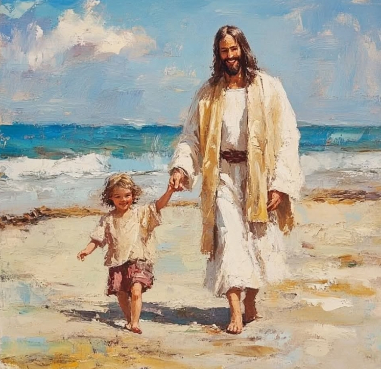

  

     
    

      <b>Matt.마9:1, JST 9:1 예수가 배를 타 고 건너가 자기 성읍에 이르니 
      </b>
    

     
    
And Jesus entered into a ship, and passed over, and came into his own city. 
    

     
    

      <b>
      </b>
    

     
    

    
         
  

  

    
  

---

  

     
    

      <b>Matt.마9:2, JST 9:2 보라 사람들이 중풍병 걸린 사람을 침상에 누인 채로 그에게 데려오 는지라 예수가 그들의 신 앙을 알고 중풍병자 에게 이르되 아들아 안심하 라 너의 죄가 용서받 았으니 너의 길을 가서 다시는 죄짓지 말라 하매 
      </b>
    

     
    
And, behold, they brought to him a man sick of the palsy, lying on a bed; and Jesus, knowing their faith, said unto the sick of the palsy, Son, be of good cheer; thy sins be forgiven thee; go thy way and sin no more. 
    

     
    

      <b>
      </b>
    

     
    

    
         
  

  

    
  

---

  

     
    

      <b>Matt.마9:3 보라 어떤 서기관 들이 속 으로 이르되 이 사람이 신성모독 하는 도다 하더라 
      </b>
    

     
    
And, behold, certain of the scribes said within themselves, This man blasphemeth. 
    

     
    

      <b>Matt.마9:4, JST 9:4 예수가 그들의 생각을 알고 이르되 너희는 어찌하여 마음속 으로 악한 생각을 하느냐 
      </b>
    

     
    
And Jesus, knowing their thoughts, said, Wherefore is it that ye think evil in your hearts? 
    
         
  

  

    
  

---

  

     
    

      <b>Matt.마9:5, JST 9:5 너의 죄가 용서 받았느니라 하는 말이 일어나 걸어가라 하는 말보다 쉽지 않으냐 
      </b>
    

     
    
For is it not easier to say , Thy sins be forgiven thee, than to say , Arise and walk? 
    

     
    

      <b>Matt.마9:6, JST 9:6 그러나 내가 이 렇게 말한 것은 너희로 하여금 인자가 땅에서 죄를 용서하는 권능을 가진 것 을 알게 하려 함이니라 하더라 
      </b>
    

     
    
But I said this that ye may know that the Son of man hath power on earth to forgive sins. 
    
         
  

  

    
  

---

  

     
    

      <b>JST9:7 예수가 그 중풍병자에게 이르 되 일어나 너의 침상을 가지고 집으로 가라 하니 
      </b>
    

     
    
Then Jesus said unto the sick of the palsy, Arise, take up thy bed, and go unto thy house. 
    

     
    

      <b>Matt.마9:7, JST 9:8 그가 즉시 일어 나 자기 집으로 가매 
      </b>
    

     
    
And he immediately arose , and depa rted to his house. 
    
         
  

  

    
  

---

  

     
    

      <b>Matt.마9:8, JST 9:9 무리가 그것을 보고 놀라며 그런 능력을 사람에게 주 신 하나님 께 영광을 돌리더라 
      </b>
    

     
    
But when the multitude saw it, they marveled and glorified God, who had given such power unto men. 
    

     
    

      <b>
      </b>
    

     
    

    
         
  

  

    
  

---

  

     
    

      <b>Matt.마9:9, JST 9:10 예수가 그곳으 로부터 지나갈 때 마태라 하는 사람이 그 당시 관례대로 공세 받는 곳에 앉아 있는 것을 보고 그에게 이르되 나를 따 르라 하니 그가 일어나 따르더 라 
      </b>
    

     
    
And as Jesus passed forth from thence, he saw a man named Matthew, sitting at the place where they received tribute, as was customary in those days, and he said unto him, Follow me. And he arose and followed him. 
    

     
    

      <b>
      </b>
    

     
    

    
         
  

  

    
  

---

  

     
    

      <b>Matt.마9:10, JST9:11 그리고 이렇게 되었나니 예수가 그 집에 앉아 식사하 는데 보라 많은 세리와 죄인이 와서 그 와 함께하고 그의 제자들이 함께 앉았 더라 
      </b>
    

     
    
And it came to pass, as Jesus sat at meat in the house, behold, many publicans and sinners came and sat down with him, and with his disciples. 
    

     
    

      <b>
      </b>
    

     
    

    
         
  

  

    
  

---

  

     
    

      <b>Matt.마9:11, JST 9:12 바리새인 들이 그들을 보고 그의 제자들에게 이르되 어찌하여 너희 선생은 세리와 죄인들과 함께 먹느냐 하는지라 
      </b>
    

     
    
And when the Pharisees saw them, they said unto his disciples, Why eateth your M aster with publicans and sinners? 
    

     
    

      <b>
      </b>
    

     
    

    
         
  

  

    
  

---

  

     
    

      <b>Matt.마9:12, JST9:13 예수가 저들의 말을 듣고 저들에게 이르되 온전한 자 에게는 의사가 필요 없고 병든 자에게 필요 하느니라 
      </b>
    

     
    
But when Jesus heard them, he said unto them, They that be whole need not a physician, but they that are sick. 
    

     
    

      <b>
      </b>
    

     
    

    
         
  

  

    
  

---

  

     
    

      <b>Matt.마9:13, JST 9:14 너희는 가서 나는 자비를 원하고 희생물을 원하지 않노라 하는 이 말의 의미를 배우라 나 는 의인을 부르러 온 것이 아니요 죄인 을 불러 회개하게 하려고 왔느니라 하 더라 
      </b>
    

     
    
But go ye and learn what this meaneth; I will have mercy and not sacrifice; for I am not come to call the righteous, but sinners to repentance. 
    

     
    

      <b>
      </b>
    

     
    

    
         
  

  

    
  

---

  

     
    

      <b>Matt.마9:14, JST 9:15 그가 이렇게 가르칠 때 요한의 제자들이 그에게 와 서 이르되 어찌하여 우리와 바리새인은 자주 금식하 는데 당신의 제자는 금식하 지 않나이까 하매 
      </b>
    

     
    
And while he was thus teaching, there came to him the disciples of John, saying, Why do we and the Pharisees fast oft, but thy disciples fast not? 
    

     
    

      <b>
      </b>
    

     
    

    
         
  

  

    
  

---

  

     
    

      <b>Matt.마9:15 예수가 그들에게 이르 되 혼인집 아이들이 신랑과 함께 있는 동안에 애통할 수 있느냐 그러나 그들 로부터 신랑을 빼앗아 가는 날이 이르 리니 그때는 그들이 금식하리 라 하더라 
      </b>
    

     
    
And Jesus said unto them, Can the children of the bridechamber mourn, as long as the bridegroom is wi th them? But the days will come , when the bridegroom shall be taken from them, and then shall they fast. 
    

     
    

      <b>
      </b>
    

     
    

    
         
  

  

    
  

---

  

     
    

      <b>JST9:18 그러자 바리새인 들이 그에게 이르되 너는 우리가 온 율법을 지키는 것을 보면서 어찌하여 우리의 침례를 받아들이 려 하지 않느냐 하는지라 
      </b>
    

     
    
Then said the Pharisees unto him, Why will ye not receive us with our baptism, seeing we keep the whole law? 
    

     
    

      <b>
      </b>
    

     
    

    
         
  

  

    
  

---

  

     
    

      <b>JST9:19 예수가 그들에게 이르되 너희 는 율법을 지키지 않느니라 너희가 율 법을 지켰다면 나를 받아들였으리니 이 는 내가 율법을 준 자임이라 
      </b>
    

     
    
But Jesus said unto them, Ye keep not the law. If ye had kept the law, ye would have received me, for I am he who gave the law. 
    

     
    

      <b>JST9:20 내가 너희 침례를 받아들이 지 않는 것은 그것이 너희에게 아무런 유 익이 없기 때문이니 
      </b>
    

     
    
I receive not you with your baptism , because it profiteth you nothing. 
    
         
  

  

    
  

---

  

     
    

      <b>JST9:21 이는 새로운 것이 오면 낡은 것은 버려지게 됨이라 
      </b>
    

     
    
For when that which is new is come, the old is ready to be put away. 
    

     
    

      <b>Matt.마9:16, JST 9:22 새로운 천 조 각을 낡은 옷에 붙이는 사람이 없나니 이는 붙여서 기운 것이 그 옷을 당겨 더 심하게 찢어지기 때문이요 
      </b>
    

     
    
For no man putteth a piece of new cloth on an old garment; for that which is put in to fill it up , taketh from the garment, and the rent is made worse. 
    
         
  

  

    
  

---

  

     
    

      <b>Matt.마9:17 새 포도주를 낡은 부대 에 넣는 사람도 없나니 그렇게 하면 부 대가 터져 포도주가 쏟아지고 부대도 못쓰게 되거니와 새 포도주를 새 부대 에 넣으면 둘 다 보존되느니라 하더라 
      </b>
    

     
    
Neither do me n put new wine into old bottles; else the bottles break, and the wine runneth out, and the bottles perish; but they put new wine into new bottles, and both are preserved. 
    

     
    

      <b>
      </b>
    

     
    

    
         
  

  

    
  

---

  

     
    

      <b>Matt.마9:18, JST9:24 그가 이것들을 그들에게 말할 때 보라 어떤 관리가 와 서 그에게 경배하며 이르되 나의 딸이 지금 죽어가나이다 그러나 당신이 와서 안수하 면 살아나리이 다 하매 
      </b>
    

     
    
While he spake these things unto them, behold, there came a certain ruler and worshiped him, saying, My daughter is even now dying ; but come and lay thy hand upon her and she shall live. 
    

     
    

      <b>
      </b>
    

     
    

    
         
  

  

    
  

---

  

     
    

      <b>Matt.마9:19, JST9:25 예수가 일어나 그를 따라가고 그의 제자들 도 가는데 많은 백성이 그에게 몰리더라 
      </b>
    

     
    
And Jesus arose and followed him, and also his disciples, and much people thronged him. 
    

     
    

      <b>Matt.마9:20 보라 열두 해 동안 혈 루증을 앓던 여자가 뒤로 와서 그의 옷 자락에 손을 댔나니 
      </b>
    

     
    
And, behold, a woman which was diseased with an issue of blood twelve years, came behind him , and touched the hem of his garment. 
    
         
  

  

    
  

---

  

     
    

      <b>Matt.마9:21 이는 그녀가 속으로 이 르되 내가 그의 옷에 손을 댈 수만 있 어도 나는 온전하게 되리라 함이더라 
      </b>
    

     
    
For she said within herself, If I may but touch his garment, I shall be whole. 
    

     
    

      <b>
      </b>
    

     
    

    
         
  

  

    
  

---

  

     
    

      <b>Matt.마9:22 예수가 돌이켜 그녀를 보고 이르되 딸아 안심하라 너의 신앙 이 너를 온전하게 했느니라 하매 그 여 자가 그 시각부터 온전하게 되었더라 
      </b>
    

     
    
But Jesus turned him about, and when he saw her, he said, Daughter, be of good comfort; thy faith hath made thee whole. And the woman was made whole from that hour. 
    

     
    

      <b>
      </b>
    

     
    

    
         
  

  

    
  

---

  

     
    

      <b>Matt.마9:23 예수가 그 관리의 집에 들어가 피리 부는 자들과 소란한 사람 들을 보고 
      </b>
    

     
    
And when Jesus came into the ruler's house , and saw the minstrels , and the people making a noise, 
    

     
    

      <b>Matt.마9:24 그들에게 이르되 자리 를 비켜라 이 소녀는 죽은 것이 아니라 잠자느니라 하니 그들이 비웃더라 
      </b>
    

     
    
He said unto them, Give place; for the maid is not dead; but sleepeth. And they laughed him to scorn. 
    
         
  

  

    
  

---

  

     
    

      <b>Matt.마9:25 사람들 을 내보낸 후에 그가 들어가 그녀의 손을 잡으매 그 소 녀가 일어나 니 
      </b>
    

     
    
But when the people were put forth, he went in , and took her by the hand, and the maid arose. 
    

     
    

      <b>Matt.마9:26, JST9:32 예수의 명성이 그 온 땅에 퍼지니라 
      </b>
    

     
    
And the fame of Jesus went abroad into all that land. 
    
         
  

  

    
  

---

  

     
    

      <b>Matt.마9:27, JST9:33 예수가 그곳에 서 떠날 때 눈이 먼 두 사람이 그를 따 르며 소리 질러 이르되 다윗의 자손 예 수여 우리에게 자비를 베푸소서 하더니 
      </b>
    

     
    
And when Jesus departed thence, two blind men followed him, crying , and saying, Jesus , thou Son of David, have mercy on us. 
    

     
    

      <b>
      </b>
    

     
    

    
         
  

  

    
  

---

  

     
    

      <b>Matt.마9:28, JST 9:34 그가 집에 들 어갈 때 눈먼 사람들이 그에게 나아오 더라 예수가 그들에게 이르되 너희는 내가 이 일을 할 수 있다고 믿느냐 하 니 그들이 이르되 주여 그러하나 이다 하는지라 
      </b>
    

     
    
And when he was come into the house, the blind men came to him; and Jesus said unto them, Believe ye that I am able to do this? They said unto him, Yea, Lord. 
    

     
    

      <b>
      </b>
    

     
    

    
         
  

  

    
  

---

  

     
    

      <b>Matt.마9:29 그가 그들의 눈을 만지 며 이르되 너희 신앙대로 너희에게 될 지어다 하매 
      </b>
    

     
    
Then touched he their eyes, saying, According to your faith, be it unto you. 
    

     
    

      <b>Matt.마9:30, JST 9:36 그들의 눈이 열렸더라 그가 엄히 명하여 이르되 나 의 명령을 지켜 아무도 알지 못하도록 이곳에 있는 누구에게도 말하지 말라 했으나 
      </b>
    

     
    
And their eyes were opened; and straitly he charged them, saying, Keep my commandments, and see ye tell no man in this place, that no man know it. 
    
         
  

  

    
  

---

  

     
    

      <b>Matt.마9:31 저들이 떠나서 그의 명 성을 그 모든 지방에 퍼뜨리더 라 
      </b>
    

     
    
But they, when they were departed, spread abroad his fame in all that country. 
    

     
    

      <b>Matt.마9:32, JST 9:38 또 그들이 밖 으로 나가니 보라 사람들이 악마에 사 로잡혀 말 못하는 사람을 그에게 데려 왔으되 
      </b>
    

     
    
And as they went out, behold, they brought to him a dumb man possessed with a devil. 
    
         
  

  

    
  

---

  

     
    

      <b>Matt.마9:33, JST9:39 악마가 쫓겨나 고 말 못하는 사람이 말하매 무리가 놀 라며 이르기를 이스라엘 에서 이런 일을 본 적이 없도다 했으나 
      </b>
    

     
    
And when the devil was cast out, the dumb man spake. And the multitudes marveled, saying, It was never so seen in Israel. 
    

     
    

      <b>Matt.마9:34, JST 9:40 바리새인 들은 그가 악마의 왕을 통해 악마를 쫓아내 는 것이라 하더라 
      </b>
    

     
    
But the Pharisees said, He casteth out the devils , through the prince of the devils. 
    
         
  

  

    
  

---

  

     
    

      <b>Matt.마9:35, JST 9:41 예수가 모든 성읍과 마을을 다니며 그들의 회당에서 가르치고 왕국의 복음을 전파하며 백성 가운데 모든 병과 질병을 낫게 하되 
      </b>
    

     
    
And Jesus went about all the cities and villages, teaching in their synagogues, and preaching the gospel of the kingdom, and healing every sickness and disease among the people. 
    

     
    

      <b>
      </b>
    

     
    

    
         
  

  

    
  

---

  

     
    

      <b>Matt.마9:36 그가 무리를 보고 그들 을 불쌍히 여겼나니 이는 그들이 목자 없는 양처럼 기진하여 널리 흩어졌기 때문이라 
      </b>
    

     
    
But when he saw the multitudes, he was moved with compassion on them because they fainted , and were scatt ered abroad, as sheep having no shepherd. 
    

     
    

      <b>Matt.마9:37, JST 9:43 이에 그가 제 자들에게 이르되 추수할 것은 참으로 많으나 일꾼이 적도다 
      </b>
    

     
    
Then said he unto his disciples, The harvest truly is plenteous, but the laborers are few. 
    
         
  

  

    
  

---

  

     
    

      <b>Matt.마9:38, JST9:44 그러므로 추수 의 주인에게 기도하여 그의 추수 밭에 일꾼들을 보내 주소서 하라 하더라 
      </b>
    

     
    
Pray ye therefore the Lord of the harvest, that he will send forth laborers into his harvest.
    

     
    

      <b>
      </b>
    

     
    

    
         
  

  

    
  

