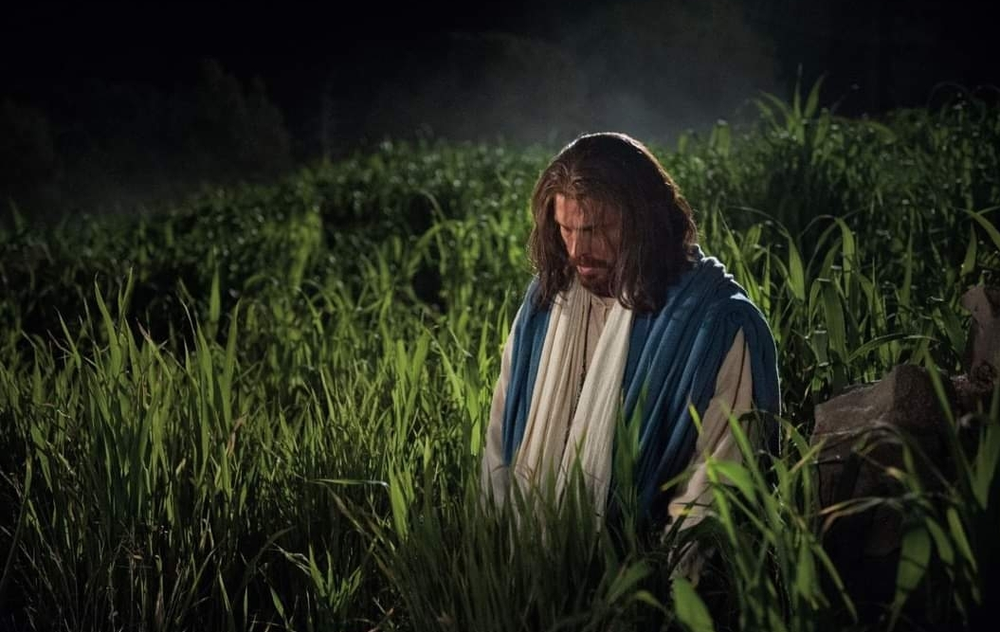

  

     
    

      <b>Rev.계16:1 또 내가 성전에서 나는 큰 음성을 들으니 일곱 천사에게 이르 되 너희 길을 가서 하나님 진노의 병을 땅 위에 쏟으라 하더라 
      </b>
    

     
    
And I heard a great voice out of the temple saying to the seven angels, Go your ways, and pour out the vials of the wrath of God upon the earth. 
    

     
    

      <b>
      </b>
    

     
    

    
         
  

  

    
  

---

  

     
    

      <b>Rev.계16:2, JST16:2 이에 첫째가 가서 작은 병을 땅 위에 쏟으매 짐승의 표를 받은 사람들과 그의 우상을 숭배 한 자들에게 고약하고 지독한 헌데가 생기더라 
      </b>
    

     
    
And the first went, and poured out his vial upon the earth; and there fell a noisome and grievous sore upon the men which had the mark of the beast, and upon them which worshiped his image. 
    

     
    

      <b>
      </b>
    

     
    

    
         
  

  

    
  

---

  

     
    

      <b>Rev.계16:3 둘째 천사가 작은 병을 바다에 쏟으매 그것이 죽은 사람의 피 처럼 되고 바다 가운데 모든 살아있는 영혼이 죽더라 
      </b>
    

     
    
And the second angel poured out his vial upon the sea; and it became as the blood of a dead man; and every living soul died in the sea. 
    

     
    

      <b>Rev.계16:4 셋째 천사가 작은 병을 강과 물의 근원 위에 쏟으매 그것들이 피가 되더라 
      </b>
    

     
    
And the third angel poured out his vial upon the rivers and fountains of waters; and they became blood. 
    
         
  

  

    
  

---

  

     
    

      <b>Rev.계16:5 또 내가 들으니 물의 천 사가 이르되 지금 있고 전에도 있었고 앞으로도 계실 오 주여 당신이 이렇게 심판하 니 당신은 의롭나이다 
      </b>
    

     
    
And I heard the angel of the waters say, Thou art righteous, O Lord, which art, and wast, and shalt be, because thou hast judged thus. 
    

     
    

      <b>
      </b>
    

     
    

    
         
  

  

    
  

---

  

     
    

      <b>Rev.계16:6 그들이 성도들과 선지자 들의 피를 흘렸으니 그들이 마시도록 피를 주는 것이 그들에게 마땅하나이다 하더라 
      </b>
    

     
    
For they have shed the blood of saints and prophets, and thou hast given them blood to drink; for they are worthy. 
    

     
    

      <b>
      </b>
    

     
    

    
         
  

  

    
  

---

  

     
    

      <b>Rev.계16:7, JST16:7 또 내가 들으 니 제단으로부터 나온 다른 천사가 이 르되 그러하나이다 주 전능하신 하나님 이여 당신의 심판은 참되고 의롭나이다 하고 
      </b>
    

     
    
And I heard another angel who came out from the altar saying, Even so, Lord God Almighty, true and righteous are thy judgments. 
    

     
    

      <b>
      </b>
    

     
    

    
         
  

  

    
  

---

  

     
    

      <b>Rev.계16:8 그 넷째 천사가 작은 병 을 해 위에 부으니 사람들을 불사를 능 력을 그가 받으매 
      </b>
    

     
    
And the fourth angel poured out his vial upon the sun; and power was given unto him to scorch men with fire. 
    

     
    

      <b>
      </b>
    

     
    

    
         
  

  

    
  

---

  

     
    

      <b>Rev.계16:9 사람들 이 심한 열에 타 면서 이런 재앙을 다스리는 권능을 가 지신 하나님 의 이름을 모독하 되 그들은 회개하 지 않고 그에게 영광을 돌리지 않더라 
      </b>
    

     
    
And men were scorched with great heat, and blasphemed the name of God, which hath power over these plagues; and they repented not to give him glory. 
    

     
    

      <b>
      </b>
    

     
    

    
         
  

  

    
  

---

  

     
    

      <b>Rev.계16:10 다섯째 천사가 작은 병 을 짐승의 보좌에 부으니 그의 왕국이 어둠으로 가득 차고 사람들은 고통으로 혀를 깨물며 
      </b>
    

     
    
And the fifth angel poured out his vial upon the seat of the beast; and his kingdom was full of darkness; and they gnawed their tongues for pain, 
    

     
    

      <b>
      </b>
    

     
    

    
         
  

  

    
  

---

  

     
    

      <b>Rev.계16:11 그들의 고통과 종기로 인해 하늘의 하나님을 모독하 되 자기들 의 행위를 회개하지 않더라 
      </b>
    

     
    
And blasphemed the God of heaven because of their pains and their sores, and repented not of their deeds. 
    

     
    

      <b>
      </b>
    

     
    

    
         
  

  

    
  

---

  

     
    

      <b>Rev.계16:12 여섯째 천사가 작은 병 을 큰 강 유브라데에 부으니 그 물이 말라서 동쪽의 왕들을 위한 길이 예비 되더라 
      </b>
    

     
    
And the sixth angel poured out his vial upon the great river Euphrates; and the water thereof was dried up, that the way of the kings of the east might be prepared. 
    

     
    

      <b>
      </b>
    

     
    

    
         
  

  

    
  

---

  

     
    

      <b>Rev.계16:13 또 내가 보니 개구리처 럼 부정한 세 영이 용의 입과 그 짐승 의 입과 거짓 선지자의 입에서 나오더 라 
      </b>
    

     
    
And I saw three unclean spirits like frogs come out of the mouth of the dragon, and out of the mouth of the beast, and out of the mouth of the false prophet. 
    

     
    

      <b>
      </b>
    

     
    

    
         
  

  

    
  

---

  

     
    

      <b>Rev.계16:14 그들은 기적을 행하는 악마의 영들이라 전능하신 하나님의 큰 날에 있을 싸움을 위해 땅과 온 세상의 왕들에게 나아가 저들을 모으더라 
      </b>
    

     
    
For they are the spirits of devils, working miracles, which go forth unto the kings of the earth and of the whole world, to gather them to the battle of that great day of God Almighty. 
    

     
    

      <b>
      </b>
    

     
    

    
         
  

  

    
  

---

  

     
    

      <b>Rev.계16:15 보라 나는 도둑처럼 오 리니 깨어있 으며 자기 옷을 지켜 벌거 벗은 채로 다니지 않고 자기 수치를 보 이지 않는 자에게 복이 있도다 
      </b>
    

     
    
Behold, I come as a thief. Blessed is he that watcheth, and keepeth his garments, lest he walk naked and they see his shame. 
    

     
    

      <b>Rev.계16:16 그가 히브리말로 아마 겟돈이라 하는 곳으로 저들을 모으매 
      </b>
    

     
    
And he gathered them t ogether into a place called in the Hebrew tongue Armageddon. 
    
         
  

  

    
  

---

  

     
    

      <b>Rev.계16:17 일곱째 천사가 작은 병 을 공중에 부으니 하늘의 성전 보좌로 부터 큰 음성이 나와 이르되 다 이루었 다 하고 
      </b>
    

     
    
And the seventh angel poured out his vial into the air; and there came a great voice out of the temple of heaven, from the throne, saying, It is done. 
    

     
    

      <b>
      </b>
    

     
    

    
         
  

  

    
  

---

  

     
    

      <b>Rev.계16:18 음성과 우레와 번개가 있고 큰 지진이 있는데 사람이 땅 위에 있고 나서 그런 것이 없었나니 지진이 심히 강하고 심히 컸더라 
      </b>
    

     
    
And there were voices, and thunders, and lightnings; and there was a great earthquake, such as was not since men were upon the earth, so mighty an earthquake, and so great. 
    

     
    

      <b>
      </b>
    

     
    

    
         
  

  

    
  

---

  

     
    

      <b>Rev.계16:19 큰 성이 세 부분으로 나누어지 고 여러 민족의 성읍들이 무너 졌으며 큰 바벨론 이 하나님 앞에 기억 되어 그의 맹렬한 진노의 잔이 그녀에 게 주어졌으며 
      </b>
    

     
    
And the great city was divided into three parts, and the cities of the nations fell; and great Babylon came in remembrance before God, to give unto her the cup of the wine of the fierceness of his wrath. 
    

     
    

      <b>
      </b>
    

     
    

    
         
  

  

    
  

---

  

     
    

      <b>Rev.계16:20 모든 섬이 도망하고 산 들이 보이지 않더라 
      </b>
    

     
    
And every island fled away, and the mountains were not found. 
    

     
    

      <b>
      </b>
    

     
    

    
         
  

  

    
  

---

  

     
    

      <b>Rev.계16:21 하늘에서 각각의 무게 가 대략 한 달란트 되는 큰 우박이 사 람들 위에 떨어지매 사람들이 우박의 재앙으로 인해 하나님을 모독했나니 이 는 그 재앙이 심히 컸음이라 
      </b>
    

     
    
And there fell upon men a great hail out of heaven, every stone about the weight of a talent; and men blasphe med God because of the plague of the hail; for the plague thereof was exceeding great.
    

     
    

      <b>
      </b>
    

     
    

    
         
  

  

    
  

