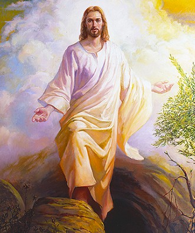

  

     
    

      <b>Rev.계19:1, JST19:1 이런 일이 있 고 나서 하늘에서 많은 백성의 큰소리 를 내가 들으니 이르되 할렐루야 구원 과 영광과 존귀와 권능이 주 우리 하나 님께 있도다 
      </b>
    

     
    
And after these things I heard a great voice of much people in heaven, saying, Alleluia; Salvation, and glory, and honor , and power, unto the Lord our God; 
    

     
    

      <b>
      </b>
    

     
    

    
         
  

  

    
  

---

  

     
    

      <b>Rev.계19:2 이는 그의 심판이 참되 고 의로움이라 간음으로 땅을 부패하게 한 큰 창녀를 그가 심판하고 그의 성도 들의 피를 그녀의 손에 갚았도다 하더 라 
      </b>
    

     
    
For true and righteous are his judgments; for he hath judged the great whore, which did corrupt the earth with her fornication, and hath avenged the blood of his saints at her hand. 
    

     
    

      <b>
      </b>
    

     
    

    
         
  

  

    
  

---

  

     
    

      <b>Rev.계19:3, JST19:3 그들이 다시 이르되 할렐루야 하니 그녀의 연기가 영원히 올라가더라 
      </b>
    

     
    
And again they said, Alleluia. And her smoke rose up forever and ever. 
    

     
    

      <b>Rev.계19:4, JST19:4 이십사 장로와 네 짐승이 보좌에 앉으신 하나님께 엎 드려 경배하며 이르되 아멘 할렐루야 하니 
      </b>
    

     
    
And the four and twenty elders and the four beasts fell down and worshiped God that sat on the throne, saying, Amen; Alleluia. 
    
         
  

  

    
  

---

  

     
    

      <b>Rev.계19:5 보좌에서 한 음성이 나 서 이르되 그의 모든 성도와 큰 자나 작은 자나 그를 두려워하는 모든 자여 우리 하나님을 찬양하라 하더라 
      </b>
    

     
    
And a voice came out of the throne, saying, Praise our God, all ye his saints, and ye that fear him, both small and great. 
    

     
    

      <b>
      </b>
    

     
    

    
         
  

  

    
  

---

  

     
    

      <b>Rev.계19:6 또 내가 큰 무리의 음성 같은 것을 들으니 많은 물 같은 소리요 강한 우레 같은 음성이 라 이르되 할렐 루야 전능하신 주 하나님이 다스리 는도 다 
      </b>
    

     
    
And I heard as it were the voice of a great multitude, and as the voice of many waters, and as the voice of mighty thunderings, saying, Alleluia; for the Lord God omnipotent reigneth. 
    

     
    

      <b>
      </b>
    

     
    

    
         
  

  

    
  

---

  

     
    

      <b>Rev.계19:7, JST19:7 기뻐하고 즐거 워하며 그에게 영광을 돌리자 이는 어 린양의 결혼이 임박했으며 그의 아내가 자신을 준비했음이라 
      </b>
    

     
    
Let us be glad and rejoice, and give honor to him; for the marriage of the Lamb is come, and his wife hath made herself ready. 
    

     
    

      <b>
      </b>
    

     
    

    
         
  

  

    
  

---

  

     
    

      <b>Rev.계19:8 그녀에게 정결하고 흰 세마포 를 입는 것이 허락되 었나니 그 세마포 는 성도들의 의로움이라 하더라 
      </b>
    

     
    
And to her was granted that she should be arrayed in fine linen, clean and white; for the fine linen is the righteousness of saints. 
    

     
    

      <b>
      </b>
    

     
    

    
         
  

  

    
  

---

  

     
    

      <b>Rev.계19:9 또 그가 나에게 이르되 기록하라 어린양의 결혼 만찬에 청함 받은 자에게 복이 있도다 하고 그가 이 르되 이것은 하나님의 참된 말씀이 니라 하더라 
      </b>
    

     
    
And he saith unto me, Write, Blessed are they which are called unto the marriage supper of the Lamb. And he saith unto me, These are the true sayings of God. 
    

     
    

      <b>
      </b>
    

     
    

    
         
  

  

    
  

---

  

     
    

      <b>Rev.계19:10 , JST19:10 이에 내가 그의 발 앞에 엎드려 경배하려 하니 그 가 이르되 삼가 그리하지 말라 나는 너 의 동료 종이요 예수에 대한 간증을 지 닌 너의 형제이니 하나님을 예배하라 예수에 대한 간증은 예언의 영이니라 하더라 
      </b>
    

     
    
And I fell at his feet to worship him. And he said unto me, See that thou do it not; I am thy fellow servant , and of thy brethren that have the testimony of Jesus; worship God; for the testimony of Jesus is the spirit of prophecy. 
    

     
    

      <b>
      </b>
    

     
    

    
         
  

  

    
  

---

  

     
    

      <b>Rev.계19:11, JST19:11 또 내가 보 니 하늘이 열리고 흰 말을 보았는데 신 실하고 참되신 이라 하는 자가 그 위에 탔고 그가 의로움 가운데 심판하며 전 쟁을 벌이더라 
      </b>
    

     
    
And I saw heaven opened, and behold a white horse; and he that sat upon him is called Faithful and True, and in righteousness he doth judge and make war; 
    

     
    

      <b>
      </b>
    

     
    

    
         
  

  

    
  

---

  

     
    

      <b>Rev.계19:12, JST19:12 그의 눈은 불꽃 같고 그의 머리에는 많은 관이 있 으며 아무도 모르고 자기만 아는 이름 이 쓰여있더라 
      </b>
    

     
    
His eyes as a flame of fire; and he had on his head many crowns; and a name written, that no man knew, but himself. 
    

     
    

      <b>Rev.계19:13, JST19:13 그는 피로 적신 옷을 입었으며 그의 이름은 하나 님의 말씀이라 불리더라 
      </b>
    

     
    
And he is clothed with a vesture dipped in blood; and his name is called The Word of God. 
    
         
  

  

    
  

---

  

     
    

      <b>Rev.계19:14 또 하늘에 있는 군대가 흰말을 타고 그를 따르는데 희고 정결 한 세마포 옷을 입었더라 
      </b>
    

     
    
And the armies which were in heaven followed him upon white horses, clothed in fine linen, white and clean. 
    

     
    

      <b>
      </b>
    

     
    

    
         
  

  

    
  

---

  

     
    

      <b>Rev.계19:15, JST19:15 그의 입에서 하나님의 말씀이 나아와 그것으로 민족 을 치리니 그는 그의 입의 말씀으로 그 들을 다스릴 것이요 전능하신 하나님의 진노와 맹렬함 가운데 포도주 틀을 밟 으리라 
      </b>
    

     
    
And out of his mouth proceedeth the word of God, and with it he will smite the nations; and he will rule them with the word of his mouth ; and he treadeth the winepress in the fierceness and wrath of Almighty God. 
    

     
    

      <b>
      </b>
    

     
    

    
         
  

  

    
  

---

  

     
    

      <b>Rev.계19:16, JST19:16 또 그의 옷 과 넓적다리 에 이름이 쓰여있는데 만왕 의 왕이요 만주의 주라 했더라 
      </b>
    

     
    
And he hath on a vesture, and on his thigh a name written, KING OF KINGS, AND LORD OF LORDS. 
    

     
    

      <b>
      </b>
    

     
    

    
         
  

  

    
  

---

  

     
    

      <b>Rev.계19:17 또 내가 보니 해 안에 서 있는 한 천사가 큰 음성으로 하늘 가운데를 나는 모든 새에게 외쳐 이르 되 와서 크신 하나님의 만찬에 모여 
      </b>
    

     
    
And I saw an angel standing in the sun; and he cried with a loud voice, saying to all the fowls that fly in the midst of heaven, Come and gather yourselves together unto the supper of the great God; 
    

     
    

      <b>
      </b>
    

     
    

    
         
  

  

    
  

---

  

     
    

      <b>Rev.계19:18, JST19:18 왕의 살과 장군의 살과 용사의 살과 말의 살과 그 위에 탄 자의 살과 종이거나 자유인이 거나 작은 자나 큰 자나 어린양을 대적 하여 싸우는 모든 자의 살을 먹으라 하 더라 
      </b>
    

     
    
That ye may eat the flesh of kings, and the flesh of captains, and the flesh of mighty men, and the flesh of horses, and of them that sit on them, and the flesh of all who fight against the Lamb, both bond and free , both small and great. 
    

     
    

      <b>
      </b>
    

     
    

    
         
  

  

    
  

---

  

     
    

      <b>Rev.계19:19 또 내가 보니 그 짐승 과 땅의 왕들과 그들의 군대가 말을 탄 자와 그의 군대를 대적하여 전쟁을 일 으키려고 모이더라 
      </b>
    

     
    
And I saw the beast, and the kings of the earth, and their armies, gathered together to make war against him that sat on the horse, and against his army. 
    

     
    

      <b>
      </b>
    

     
    

    
         
  

  

    
  

---

  

     
    

      <b>Rev.계19:20, JST19:20 그 짐승이 붙잡혔으며 그 앞에서 기적을 행하여 그것으로 짐승의 표를 받은 자들과 그 의 우상을 숭배하는 자들을 속이던 거 짓 선지자가 함께 붙잡혔 나니 이들이 모두 산 채로 유황이 타는 불 못 속으 로 던져지고 
      </b>
    

     
    
And the beast was taken, and with him the false prophet that wrought miracles before him, with which he deceived them that had received the mark of the beast, and them that worshiped his image. These both were cast alive into a lake of fire burning with brimstone. 
    

     
    

      <b>
      </b>
    

     
    

    
         
  

  

    
  

---

  

     
    

      <b>Rev.계19:21 그 남은 자들은 말에 탄 자의 말씀 곧 그의 입에서 나오는 말씀으로 죽으매 모든 새가 그들의 살 로 배를 채우더라 
      </b>
    

     
    
And the remnant were slain with the word of him that sat upon the horse, which word proceeded out of his mouth; and all the fowls were filled with their flesh.
    

     
    

      <b>
      </b>
    

     
    

    
         
  

  

    
  

