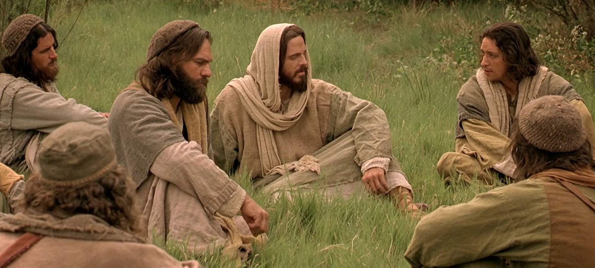

  

     
    

      <b>Rev.계20:1, JST20:1 또 내가 보니 무저갱의 열쇠와 큰 사슬을 손에 든 천 사가 하늘에서 내려와 
      </b>
    

     
    
And I saw an angel come down out of heaven, having the key of the botto mless pit and a great chain in his hand. 
    

     
    

      <b>Rev.계20:2 옛 뱀 곧 악마요 사탄인 용을 잡아 천 년 동안 결박하 여 
      </b>
    

     
    
And he laid hold on the dragon, that old serpent, which is the Devil, and Satan, and bound him a thousand years, 
    
         
  

  

    
  

---

  

     
    

      <b>Rev.계20:3 그를 무저갱에 던져 가 두고 그의 위에 인을 쳐서 천 년이 차 기까지 다시는 민족들을 속이지 못하게 하더라 그러나 그 후에 그는 반드시 잠 시 풀려나리라 
      </b>
    

     
    
And cast him into the bottomless pit, and shut him up, and set a seal upon him, that he should deceive the nations no more, till the thousand years should be fulfilled; and after that he must be loosed a little season. 
    

     
    

      <b>
      </b>
    

     
    

    
         
  

  

    
  

---

  

     
    

      <b>Rev.계20:4, JST20:4 또 내가 보좌 와 그곳에 앉은 자들을 보니 심판하는 권세가 그들에게 주어졌 더라 또 나는 예수에 대한 간증과 하나님의 말씀으로 인해 목베임 당한 자들의 영혼을 보았 는데 그들은 짐승이나 그의 우상을 숭 배하지 않고 그의 표를 그들의 이마나 손에 받지도 않은 자들이라 그들이 천 년 동안 그리스도와 함께 살며 통치하 더라 
      </b>
    

     
    
And I saw thrones, and they sat upon them, and judgment was given unto them; and I saw the souls of them that were beheaded for the witness of Jesus, and for the word of God, and which had not worshiped the beast, neither his image, neither had received his mark upon their fore heads, or in their hands: and they lived and reigned with Christ a thousand years. 
    

     
    

      <b>
      </b>
    

     
    

    
         
  

  

    
  

---

  

     
    

      <b>Rev.계20:5 그러나 죽은 자의 나머 지는 천 년이 마치기까지 다시 살지 못 했나니 이것이 첫째 부활이라 
      </b>
    

     
    
But the rest of the dead lived not again until the thousand years were finished. This is the first resurrection. 
    

     
    

      <b>
      </b>
    

     
    

    
         
  

  

    
  

---

  

     
    

      <b>Rev.계20:6, JST20:6 첫째 부활에 참여하는 자들은 복 되고 거룩하도다 두 번째 죽음이 그들 위에 힘을 쓰지 못하리니 그들은 하나님과 그리스도의 제사장이 되어 그와 함께 천 년 동안 통치하리라 
      </b>
    

     
    
Blessed and holy are they who have part in the first resurrection; on such the second death hath no power, but they shall be priests of God and of Christ, and shall reign with him a thousand years. 
    

     
    

      <b>
      </b>
    

     
    

    
         
  

  

    
  

---

  

     
    

      <b>Rev.계20:7 천 년이 다하면 사탄이 자기 옥에서 풀려나 
      </b>
    

     
    
And when the thousand years are expired, Satan shall be loosed out of his prison, 
    

     
    

      <b>Rev.계20:8 땅의 사방에 있는 민족 들을 속이려고 나아가리니 곡과 마곡을 모아 서로 싸우게 할 것이요 그 수효가 바다의 모래와 같으리 라 
      </b>
    

     
    
And shall go out to deceive the nations which are in the four quarters of the earth, Gog and Magog, to gather them together to battle; the number of whom is as the sand of the sea. 
    
         
  

  

    
  

---

  

     
    

      <b>Rev.계20:9 그들이 땅의 넓은 곳으 로 올라가 성도들의 진영 곧 사랑받는 성읍을 둘러싸매 하늘에서 하나님으로 부터 불이 내려와 그들을 삼키더 라 
      </b>
    

     
    
And they went up on the breadth of the earth, and compassed the camp of the saints about, and the beloved city; and fire came down from God out of heaven, and devoured them. 
    

     
    

      <b>
      </b>
    

     
    

    
         
  

  

    
  

---

  

     
    

      <b>Rev.계20:10, JST20:10 그들을 속였 던 악마는 짐승과 거짓 선지자가 있는 불과 유황 못에 던져져서 밤낮으로 영 원히 고통받으리라 
      </b>
    

     
    
And the devil that deceived them was cast into the lake of fire and brimstone, where the beast and the false prophet are, and shall be tormented day and night forever and ever. 
    

     
    

      <b>
      </b>
    

     
    

    
         
  

  

    
  

---

  

     
    

      <b>Rev.계20:11 또 크고 흰 보좌와 그 위에 앉으신 이를 내가 보았는데 그의 얼굴로부터 땅과 하늘이 도망하 매 사람 들을 위한 장소를 찾을 수 없더라 
      </b>
    

     
    
And I saw a great white throne, and him that sat on it, from whose face the earth and the heaven fled away; and there was found no place for them. 
    

     
    

      <b>
      </b>
    

     
    

    
         
  

  

    
  

---

  

     
    

      <b>Rev.계20:12 또 내가 죽은 자를 보 니 작은 자와 큰 자가 하나님 앞에 섰 고 책들이 펴져 있는데 또 다른 책 곧 생명책 이 펴져 있으며 죽은 자들은 그 책들에 기록된 그들의 행위에 따라 심 판받더라 
      </b>
    

     
    
And I saw the dead, small and great, stand before God; and the books were opened; and another book was opened, which is the book of life; and the dead were judged out of those things which were written in the books, according to their works. 
    

     
    

      <b>
      </b>
    

     
    

    
         
  

  

    
  

---

  

     
    

      <b>Rev.계20:13 바다가 그 안에 있던 죽은 자를 내어 주고 죽음과 지옥도 그 안에 있던 죽은 자를 내어놓으매 그들 각 사람이 그들의 행위에 따라 심판받 았으며 
      </b>
    

     
    
And the sea gave up the dead which were in it; and death and hell delivered up the dead which were in them; and they were judged every man according to their works. 
    

     
    

      <b>
      </b>
    

     
    

    
         
  

  

    
  

---

  

     
    

      <b>Rev.계20:14 죽음과 지옥은 불 못 속으로 던져졌나니 이것이 두 번째 죽 음이라 
      </b>
    

     
    
And death and hell were cast into the lake of fire. This is the second death. 
    

     
    

      <b>Rev.계20:15 생명책 에 기록된 것으 로 발견되지 않은 자는 누구든지 불 못 속으로 던져지더라 
      </b>
    

     
    
And whosoever was not found written in the book of life was cast into the lake of fire.
    
         
  

  

    
  

