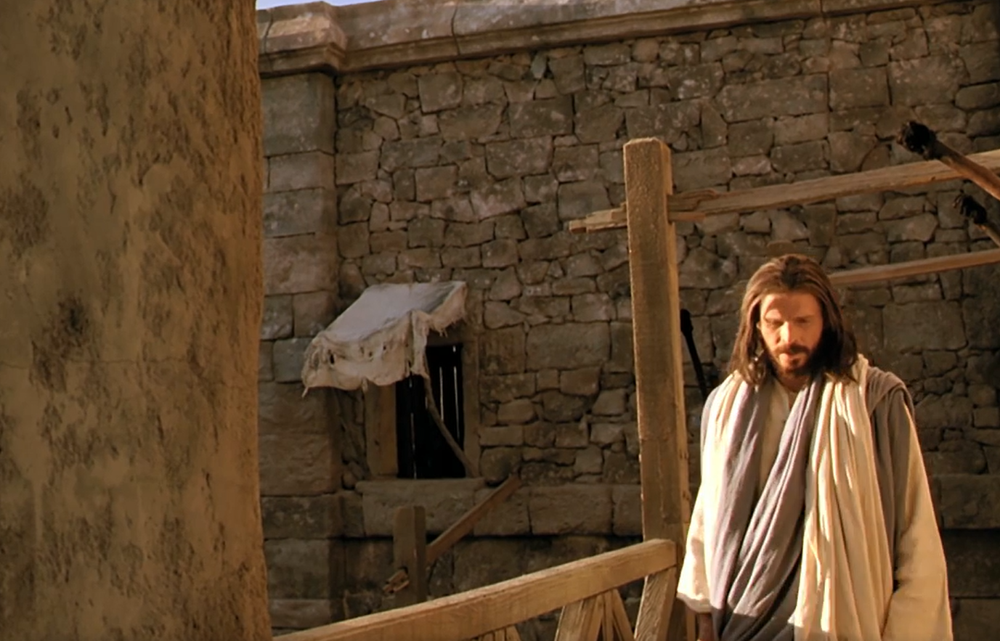

  

     
    

      <b>Rom.롬6:1 그러면 우리가 무슨 말을 하겠느냐 은혜가 넘치게 하려고 계속해서 죄 가운데 거하겠느냐 
      </b>
    

     
    
What shall we say then? Shall we continue in sin that grace may abound? 
    

     
    

      <b>Rom.롬6:2 결코 그럴 수 없느니라 죄에 대해 죽은 우리가 어찌 그 가운데 더 살겠느냐 
      </b>
    

     
    
God forbid. How shall we, that are dead to sin, live any longer therein? 
    
         
  

  

    
  

---

  

     
    

      <b>Rom.롬6:3 우리 가운데 그렇게 많은 사람이 예수 그리스도 안으로 침례 받은 것은 그의 죽음 안으로 침례 받은 것임을 너희는 알지 못하느냐 
      </b>
    

     
    
Know ye not, that so many of us as were baptized into Jesus Christ were baptized into his death? 
    

     
    

      <b>
      </b>
    

     
    

    
         
  

  

    
  

---

  

     
    

      <b>Rom.롬6:4 그러므로 우리가 죽음 안으로 침례 받음으로써 그와 함께 매장 된 것은 그리스도가 아버지의 영광을 통해 죽음으로부터 살아난 것처럼 우리도 생명의 새로움 안에서 행하게 하려 함이니 
      </b>
    

     
    
Therefore we are buried with him by baptism into death; that like as Christ was raised up from the dead by the glory of the Father, even so we also should walk in newness of life. 
    

     
    

      <b>
      </b>
    

     
    

    
         
  

  

    
  

---

  

     
    

      <b>Rom.롬6:5 이는 우리가 그의 죽음과 닮은 모습으로 함께 심겼으면 우리도 그의 부활과 닮은 모습으로 될 것임이라 
      </b>
    

     
    
For if we have been planted together in the likeness of his death, we shall be also in the likeness of his resur rection; 
    

     
    

      <b>
      </b>
    

     
    

    
         
  

  

    
  

---

  

     
    

      <b>Rom.롬6:6 우리가 이것을 알거니와 우리 옛사람이 그와 함께 십자가에 못 박힌 것은 죄의 몸을 멸하여 이후로는 우리가 죄를 섬기지 않게 하려 함이니 
      </b>
    

     
    
Knowing this, that our old man is crucified with him, that the body of sin might be destroyed, that henceforth we should not serve sin. 
    

     
    

      <b>Rom.롬6:7, JST6:7 죄에 대해 죽은 자는 죄로부터 자유롭게 되느니라 
      </b>
    

     
    
For he that is dead to sin is freed from sin. 
    
         
  

  

    
  

---

  

     
    

      <b>Rom.롬6:8 이제 우리가 그리스도와 함께 죽으면 우리도 그와 함께 살 것을 믿노니 
      </b>
    

     
    
Now if we be dead with Christ, we believe that we shall also live with him; 
    

     
    

      <b>Rom.롬6:9 죽음으로부터 살아난 그리스도가 다시는 죽지 않으며 죽음이 더 이상 그를 지배하지 못하는 것을 우리가 아노라 
      </b>
    

     
    
Knowing that Christ being raised from the dead dieth no more; death hath no more dominion over him. 
    
         
  

  

    
  

---

  

     
    

      <b>Rom.롬6:10 그가 죽은 것은 죄를 향해 한 번 죽었으나 그가 살아난 것은 하나님을 향해 살아난 것이니 
      </b>
    

     
    
For in that he died, he died unto sin once; but in that he liveth, he liveth unto God. 
    

     
    

      <b>Rom.롬6:11 이렇게 너희도 너희 자신을 죄에게는 정말로 죽은 자이나 예수 그리스도 우리 주를 통해 하나님께 살아난 자로 여기라 
      </b>
    

     
    
Likewise reckon ye also yourselves to be dead indeed unto sin, but alive unto God through Jesus Christ our Lord. 
    
         
  

  

    
  

---

  

     
    

      <b>Rom.롬6:12 그러므로 너희는 죄가 너희 필멸의 몸 안에서 지배하지 못하게 하여 그 탐욕 안에서 죄에 순종하지 말라 
      </b>
    

     
    
Let not sin therefore reign in your mortal body, that ye should obey it in the lusts thereof. 
    

     
    

      <b>
      </b>
    

     
    

    
         
  

  

    
  

---

  

     
    

      <b>Rom.롬6:13 너희 지체를 불의의 도구로 죄에게 내어 주지 말고 오직 죽음으로부터 살아난 자처럼 너희 자신을 하나님께 드리며 너희 지체를 의로움의 도구로 하나님께 드리라 
      </b>
    

     
    
Neither yield ye your members as instruments of unrighteousness unto sin; but yield yourselves unto God, as those that are alive from the dead, and your members as instruments of righteousness unto God. 
    

     
    

      <b>
      </b>
    

     
    

    
         
  

  

    
  

---

  

     
    

      <b>Rom.롬6:14, JST6:14 그렇게 함으로써 죄가 너희를 지배하지 못하리니 이는 너희가 율법 아래 있지 않고 은혜 아래 있기 때문이라 
      </b>
    

     
    
For in so doing sin shall not have dominion over you; for ye are not under the law, but under grace. 
    

     
    

      <b>Rom.롬6:15 그러면 무엇이냐 우리가 율법 아래 있지 않고 은혜 아래 있으므로 우리가 죄지으랴 결코 그럴 수 없느니라 
      </b>
    

     
    
What then? shall we sin, because we are not under the law, but under grace? God forbid. 
    
         
  

  

    
  

---

  

     
    

      <b>Rom.롬6:16 너희 자신을 누구에게 종으로 내주어 순종하면 너희는 너희가 순종하는 그 사람의 종이 되나니 죄의 종은 죽음에 이르고 순종의 종은 의로움에 이르는 것을 너희가 알지 못하느냐 
      </b>
    

     
    
Know ye not, that to whom ye yield yourselves servants to obey, his servants ye are to whom ye obey; whether of sin unto death, or of obedience unto righteousness? 
    

     
    

      <b>
      </b>
    

     
    

    
         
  

  

    
  

---

  

     
    

      <b>Rom.롬6:17, JST6:17 그러나 너희가 죄의 종이 아닌 것을 하나님께 감사하노니 이는 너희에게 전해진 교리의 근본을 너희가 마음으로부터 순종하고 
      </b>
    

     
    
But God be thanked, that ye are not the servants of sin, for ye have obeyed from the heart that form of doctrine which was delivered you. 
    

     
    

      <b>Rom.롬6:18 죄로부터 자유롭게 되어 의로움의 종이 되었음이라 
      </b>
    

     
    
Being then made free from sin, ye became the servants of righteousness. 
    
         
  

  

    
  

---

  

     
    

      <b>Rom.롬6:19, JST6:19 너희 육신의 연약함으로 인해 내가 사람의 방식을 좇아 말하노니 너희가 과거에 너희 지체를 부정함과 간악함에게 종으로 내주어 간악함에 이른 것처럼 이제는 너희 지체를 의로움에게 종으로 내주어 거룩함에 이르라 
      </b>
    

     
    
I speak after the manner of men because of the infirmity of your flesh; for as ye have in times past yielded your members servants to unclean ness and to iniquity unto iniquity; even so now yield your members servants to righteousness unto holiness. 
    

     
    

      <b>
      </b>
    

     
    

    
         
  

  

    
  

---

  

     
    

      <b>Rom.롬6:20 너희가 죄의 종이었을 때는 의로움으로부터 자유로웠으나 
      </b>
    

     
    
For when ye were the servants of sin, ye were free from righteousness. 
    

     
    

      <b>Rom.롬6:21 너희가 지금 부끄러워하는 그런 일에 관해 그때는 어떤 열매를 얻었느냐 그런 일의 마지막은 죽음이니라 
      </b>
    

     
    
What fruit had ye then in those things whereof ye are now ashamed? for the end of those things is death. 
    
         
  

  

    
  

---

  

     
    

      <b>Rom.롬6:22 그러나 이제는 죄로부터 자유롭게 되어 하나님께 종이 되었으니 너희는 거룩함에 이르는 열매를 얻었으며 그 마지막은 영생이니라 
      </b>
    

     
    
But now being made free from sin, and become servants to God, ye have your fruit unto holiness, and the end everlasting life. 
    

     
    

      <b>Rom.롬6:23 죄의 삯은 죽음이요 우리 주 예수 그리스도를 통한 하나님의 은사는 영생이니라 
      </b>
    

     
    
For the wages of sin is death; but the gift of God is eternal life through Jesus Christ our Lord. 
    
         
  

  

    
  

